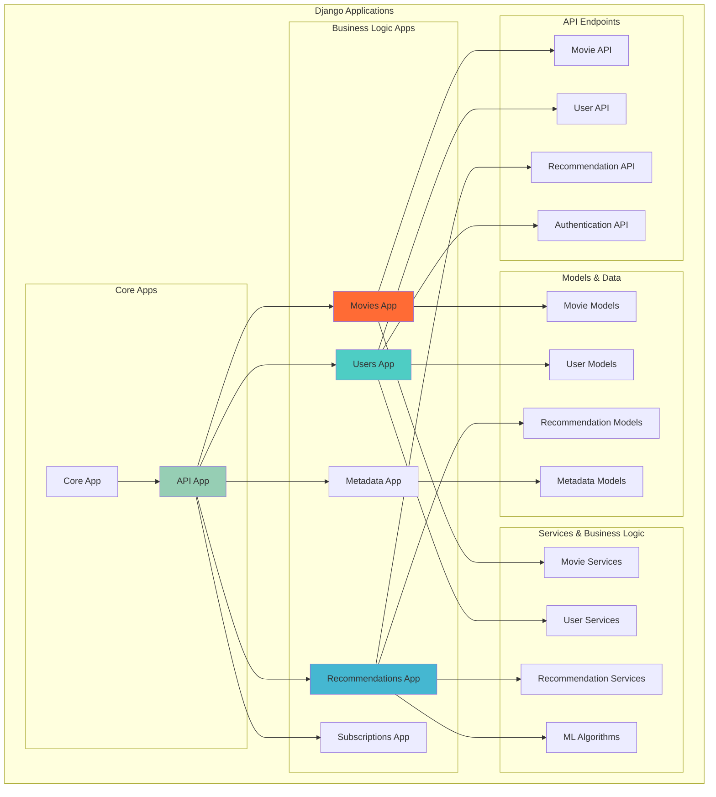
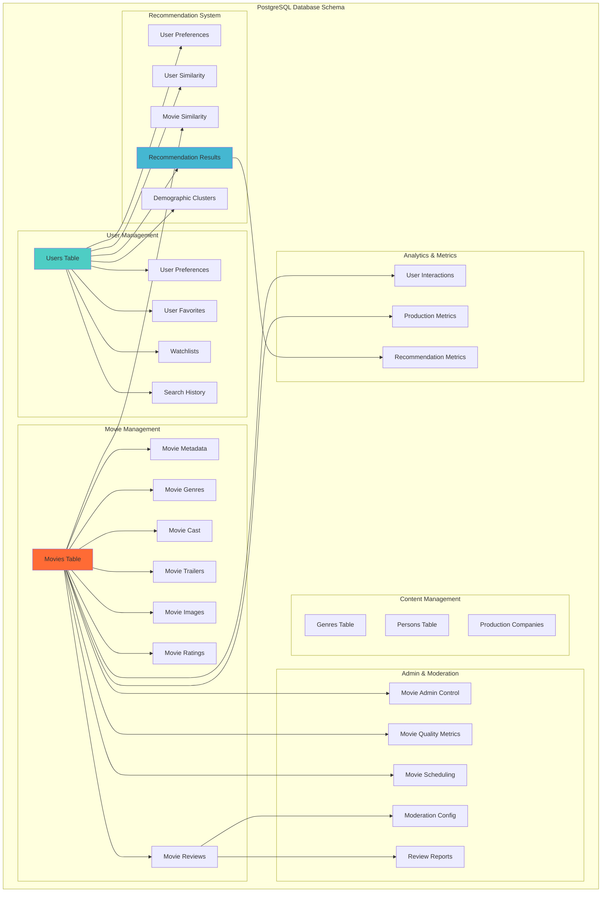
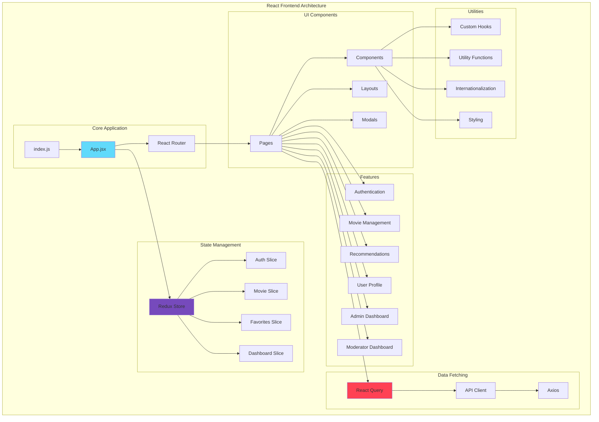
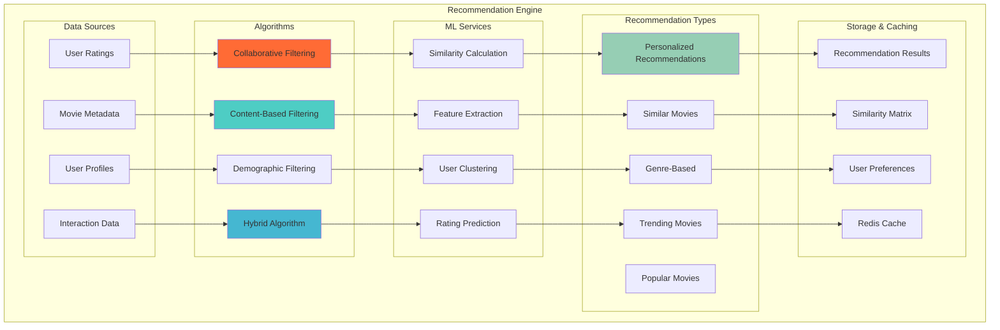
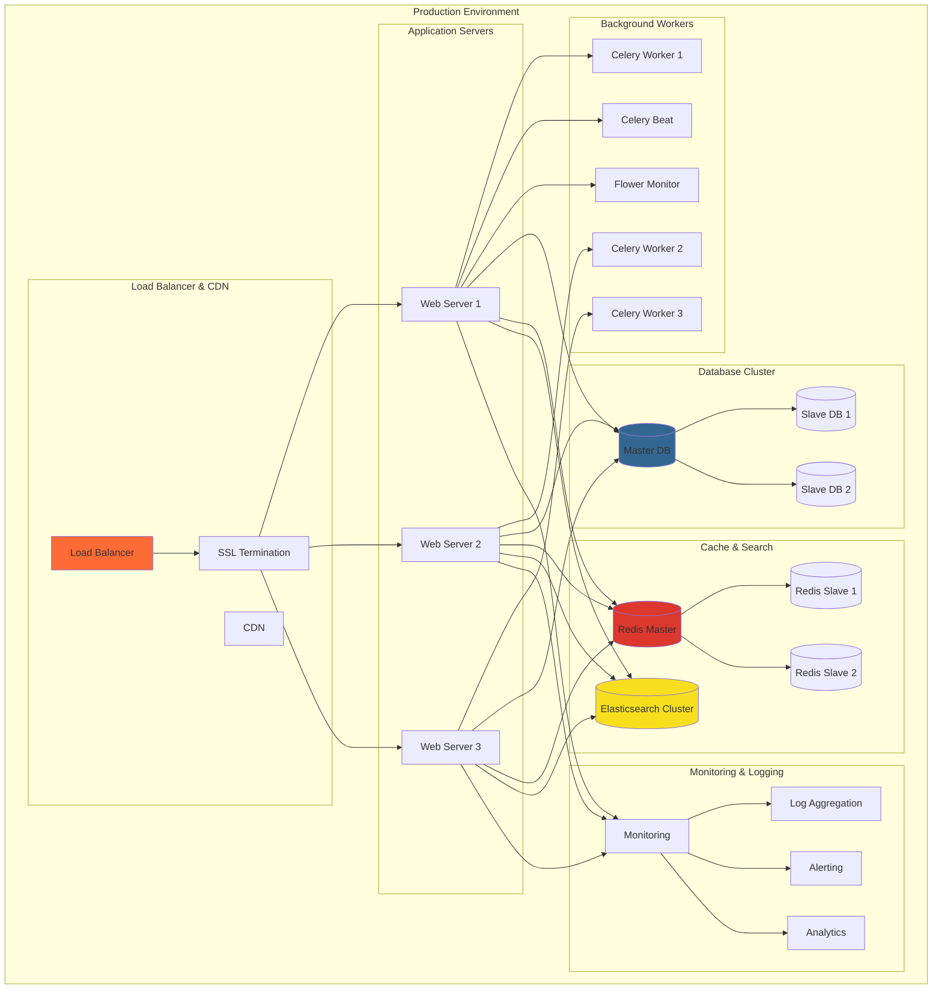

# Sơ Đồ Kiến Trúc Website Movie Recommendation System

## 1. Tổng Quan Kiến Trúc Hệ Thống

```mermaid
graph TB
    subgraph "Client Layer"
        WEB[Web Browser]
        MOB[Mobile Browser]
        TAB[Tablet Browser]
    end

    subgraph "Frontend Layer (React.js)"
        REACT[React.js 18.x]
        REDUX[Redux Toolkit]
        RQ[React Query]
        ROUTER[React Router]
        UI[UI Components]
        I18N[Internationalization]
    end

    subgraph "API Gateway & Load Balancer"
        NGINX[Nginx Load Balancer]
        CDN[CDN/Static Assets]
    end

    subgraph "Backend Services (Django)"
        DJANGO[Django 4.x REST API]
        CELERY[Celery Workers]
        WSGI[Gunicorn WSGI]
        ADMIN[Django Admin]
    end

    subgraph "Data Layer"
        POSTGRES[(PostgreSQL 15)]
        REDIS[(Redis 7.0 Cache)]
        ELASTIC[(Elasticsearch)]
    end

    subgraph "External Services"
        TMDB[TMDB API]
        IMDB[IMDB Dataset]
        PAYPAL[PayPal API]
        GOOGLE[Google OAuth]
        EMAIL[Email Service]
    end

    subgraph "Monitoring & Analytics"
        LOGS[Logging System]
        METRICS[Performance Monitoring]
        ANALYTICS[User Analytics]
    end

    %% Client to Frontend
    WEB --> REACT
    MOB --> REACT
    TAB --> REACT

    %% Frontend Internal
    REACT --> REDUX
    REACT --> RQ
    REACT --> ROUTER
    REACT --> UI
    REACT --> I18N

    %% Frontend to API Gateway
    REACT --> NGINX
    NGINX --> CDN

    %% API Gateway to Backend
    NGINX --> DJANGO
    DJANGO --> WSGI

    %% Backend to Data Layer
    DJANGO --> POSTGRES
    DJANGO --> REDIS
    DJANGO --> ELASTIC

    %% Backend to External Services
    DJANGO --> TMDB
    DJANGO --> IMDB
    DJANGO --> PAYPAL
    DJANGO --> GOOGLE
    DJANGO --> EMAIL

    %% Background Processing
    DJANGO --> CELERY
    CELERY --> POSTGRES
    CELERY --> REDIS

    %% Monitoring
    DJANGO --> LOGS
    DJANGO --> METRICS
    DJANGO --> ANALYTICS

    style REACT fill:#61dafb
    style DJANGO fill:#092e20
    style POSTGRES fill:#336791
    style REDIS fill:#dc382d
    style ELASTIC fill:#f7df1e
```

## 2. Kiến Trúc Backend (Django Apps)

## 3. Kiến Trúc Database (PostgreSQL)

## 4. Kiến Trúc Frontend (React.js)

## 5. Kiến Trúc Recommendation System

## 6. Kiến Trúc Deployment & Infrastructure

## 7. Technology Stack Summary

### 7.1. Frontend Stack

- **React.js 18.x** - Main frontend framework
- **Redux Toolkit** - State management
- **React Query** - Data fetching and caching
- **React Router** - Client-side routing
- **Tailwind CSS** - Utility-first CSS framework
- **Axios** - HTTP client
- **React Hook Form** - Form management
- **Framer Motion** - Animation library
- **i18next** - Internationalization
- **Chart.js** - Data visualization

### 7.2. Backend Stack

- **Django 4.x** - Web framework
- **Django REST Framework** - API framework
- **PostgreSQL 15** - Primary database
- **Redis 7.0** - Caching and message broker
- **Elasticsearch** - Search engine
- **Celery** - Background task processing
- **JWT** - Authentication
- **Django CORS Headers** - Cross-origin resource sharing

### 7.3. DevOps & Infrastructure

- **Docker & Docker Compose** - Containerization
- **Nginx** - Reverse proxy and load balancer
- **Gunicorn** - WSGI server
- **PostgreSQL** - Database
- **Redis** - Cache and message broker
- **Elasticsearch** - Search engine
- **Celery Workers** - Background tasks

### 7.4. External Services

- **TMDB API** - Movie data source
- **IMDB Dataset** - Movie ratings and metadata
- **PayPal API** - Payment processing
- **Google OAuth** - Authentication
- **Email Service** - SMTP/SendGrid

## 8. Key Features & Capabilities

### 8.1. Movie Management

- Comprehensive movie database with metadata
- Multi-language support (English/Vietnamese)
- Movie ratings and reviews system
- Cast and crew information
- Trailer and image management
- Quality metrics and content moderation

### 8.2. User Management

- User authentication and authorization
- Profile management with demographics
- Watchlist and favorites
- Search history tracking
- Email verification system
- Subscription management

### 8.3. Recommendation System

- Collaborative filtering
- Content-based filtering
- Demographic filtering
- Hybrid recommendation algorithms
- Real-time recommendation generation
- User similarity calculations

### 8.4. Admin & Moderation

- Admin dashboard for content management
- Moderator dashboard for review moderation
- Content quality assessment
- Automated spoiler detection
- User interaction analytics
- Performance metrics tracking

### 8.5. Performance & Scalability

- Redis caching for improved performance
- Elasticsearch for fast search
- Database optimization with indexing
- Background task processing with Celery
- CDN for static assets
- Load balancing for horizontal scaling

## 9. Security & Compliance

### 9.1. Authentication & Authorization

- JWT-based authentication
- Role-based access control
- Secure password hashing
- Session management
- CSRF protection

### 9.2. Data Protection

- Encrypted data transmission (HTTPS)
- Secure database connections
- Input validation and sanitization
- SQL injection prevention
- XSS protection

### 9.3. API Security

- Rate limiting
- API key management
- Request validation
- Error handling
- Audit logging

## 10. Monitoring & Analytics

### 10.1. Application Monitoring

- Performance metrics tracking
- Error monitoring and alerting
- User behavior analytics
- Recommendation system metrics
- Database performance monitoring

### 10.2. Infrastructure Monitoring

- Server resource monitoring
- Database performance tracking
- Cache hit/miss ratios
- Network latency monitoring
- Automated alerting

### 10.3. Business Analytics

- User engagement metrics
- Content popularity tracking
- Recommendation effectiveness
- Revenue analytics
- User retention analysis

---

_Sơ đồ kiến trúc này thể hiện cấu trúc toàn diện của hệ thống Movie Recommendation System với các thành phần chính, luồng dữ liệu và mối quan hệ giữa các module._
