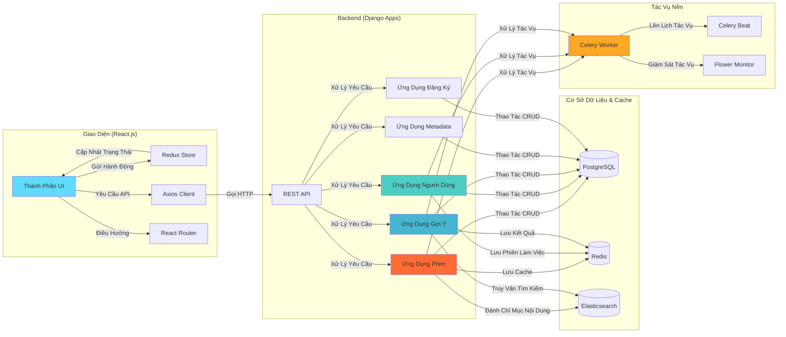
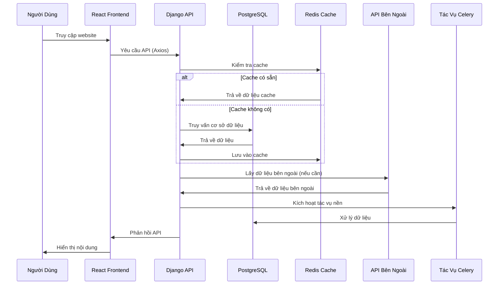
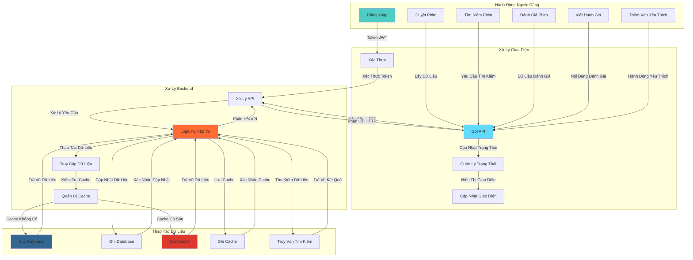

# Kiến Trúc Tổng Quan Website Movie Recommendation System

## 1. Sơ Đồ Kiến Trúc Tổng Quan (Đã Sắp Xếp Lại)

```mermaid
graph TB
    subgraph "Tầng Người Dùng"
        WEB[🌐 Trình Duyệt Web]
        MOB[📱 Trình Duyệt Mobile]
    end

    subgraph "Tầng Giao Diện (React.js)"
        REACT[⚛️ React.js 18.x]
        REDUX[🔄 Redux Toolkit]
        RQ[📡 React Query]
        ROUTER[🛣️ React Router]
        TAILWIND[🎨 Tailwind CSS]
    end

    subgraph "Tầng Dịch Vụ Backend (Django)"
        DJANGO[🐍 Django 4.x REST API]
        CELERY[⚙️ Celery Workers]
        GUNICORN[🦄 Gunicorn WSGI]
    end

    subgraph "Tầng Dữ Liệu"
        POSTGRES[(🗄️ PostgreSQL 15)]
        REDIS[(⚡ Redis 7.0)]
        ELASTIC[(🔍 Elasticsearch)]
    end

    subgraph "Dịch Vụ Bên Ngoài"
        TMDB[🎬 TMDB API]
        IMDB[📊 IMDB Dataset]
        PAYPAL[💳 PayPal API]
        GOOGLE[🔐 Google OAuth]
        EMAIL[📧 Email Service]
    end

    subgraph "Triển Khai (Render.com)"
        RENDER[☁️ Render Cloud]
        STATIC[📁 Static Files]
    end

    %% Tầng Người Dùng đến Giao Diện
    WEB -->|"Gửi Yêu Cầu HTTP"| REACT
    MOB -->|"Gửi Yêu Cầu HTTP"| REACT

    %% Tầng Giao Diện Nội Bộ
    REACT -->|"Quản Lý Trạng Thái"| REDUX
    REACT -->|"Lấy Dữ Liệu"| RQ
    REACT -->|"Điều Hướng"| ROUTER
    REACT -->|"Tạo Kiểu"| TAILWIND

    %% Giao Diện đến Backend
    REACT -->|"Gọi API (Axios)"| DJANGO

    %% Backend Nội Bộ
    DJANGO -->|"Máy Chủ WSGI"| GUNICORN
    DJANGO -->|"Xử Lý Tác Vụ Nền"| CELERY

    %% Backend đến Dữ Liệu
    DJANGO -->|"Thao Tác CRUD"| POSTGRES
    DJANGO -->|"Đọc/Ghi Cache"| REDIS
    DJANGO -->|"Truy Vấn Tìm Kiếm"| ELASTIC

    %% Backend đến Dịch Vụ Bên Ngoài
    DJANGO -->|"Lấy Dữ Liệu Phim"| TMDB
    DJANGO -->|"Import Dataset"| IMDB
    DJANGO -->|"Xử Lý Thanh Toán"| PAYPAL
    DJANGO -->|"Xác Thực OAuth"| GOOGLE
    DJANGO -->|"Gửi Email"| EMAIL

    %% Triển Khai
    DJANGO -->|"Triển Khai"| RENDER
    RENDER -->|"Phục Vụ"| STATIC

    style REACT fill:#61dafb
    style DJANGO fill:#092e20
    style POSTGRES fill:#336791
    style REDIS fill:#dc382d
    style ELASTIC fill:#f7df1e
    style RENDER fill:#00d4aa
```

## 2. Cấu Trúc Ứng Dụng Chi Tiết

## 3. Luồng Dữ Liệu Thực Tế

## 4. Technology Stack (Đã Kiểm Tra Lại)

### Frontend

- **React.js 18.x** - UI Framework
- **Redux Toolkit** - State Management
- **React Query** - Data Fetching & Caching
- **React Router** - Client-side Routing
- **Tailwind CSS** - Utility-first CSS
- **Axios** - HTTP Client
- **Framer Motion** - Animations
- **i18next** - Internationalization

### Backend

- **Django 4.x** - Web Framework
- **Django REST Framework** - API Framework
- **PostgreSQL 15** - Primary Database
- **Redis 7.0** - Cache & Message Broker
- **Elasticsearch** - Search Engine
- **Celery** - Background Task Processing
- **Gunicorn** - WSGI Server

### Infrastructure & Deployment

- **Render.com** - Cloud Platform
- **Docker & Docker Compose** - Containerization
- **Gunicorn** - Production WSGI Server

### External Services

- **TMDB API** - Movie Data Source
- **IMDB Dataset** - Movie Ratings & Metadata
- **PayPal API** - Payment Processing
- **Google OAuth** - Authentication
- **Email Service** - SMTP/SendGrid

## 5. Cấu Trúc Database (PostgreSQL)

```mermaid
graph TB
    subgraph "Bảng Cốt Lõi"
        MOVIES[Bảng Phim]
        USERS[Bảng Người Dùng]
        GENRES[Bảng Thể Loại]
    end

    subgraph "Liên Quan Đến Phim"
        MOVIE_METADATA[Metadata Phim]
        MOVIE_CAST[Diễn Viên Phim]
        MOVIE_REVIEWS[Đánh Giá Phim]
        MOVIE_RATINGS[Điểm Số Phim]
        MOVIE_TRAILERS[Trailer Phim]
    end

    subgraph "Liên Quan Đến Người Dùng"
        USER_PREFERENCES[Sở Thích Người Dùng]
        USER_FAVORITES[Phim Yêu Thích]
        WATCHLISTS[Danh Sách Xem]
        SEARCH_HISTORY[Lịch Sử Tìm Kiếm]
    end

    subgraph "Hệ Thống Gợi Ý"
        USER_SIMILARITY[Độ Tương Đồng Người Dùng]
        MOVIE_SIMILARITY[Độ Tương Đồng Phim]
        RECOMMENDATION_RESULTS[Kết Quả Gợi Ý]
        DEMOGRAPHIC_CLUSTERS[Cụm Nhân Khẩu Học]
    end

    subgraph "Quản Trị & Phân Tích"
        MOVIE_ADMIN_CONTROL[Kiểm Soát Admin Phim]
        MOVIE_QUALITY_METRICS[Chỉ Số Chất Lượng Phim]
        USER_INTERACTIONS[Tương Tác Người Dùng]
        PRODUCTION_METRICS[Chỉ Số Sản Xuất]
    end

    MOVIES -->|"Có Metadata"| MOVIE_METADATA
    MOVIES -->|"Có Diễn Viên"| MOVIE_CAST
    MOVIES -->|"Có Đánh Giá"| MOVIE_REVIEWS
    MOVIES -->|"Có Điểm Số"| MOVIE_RATINGS
    MOVIES -->|"Có Trailer"| MOVIE_TRAILERS

    USERS -->|"Có Sở Thích"| USER_PREFERENCES
    USERS -->|"Có Phim Yêu Thích"| USER_FAVORITES
    USERS -->|"Có Danh Sách Xem"| WATCHLISTS
    USERS -->|"Có Lịch Sử Tìm Kiếm"| SEARCH_HISTORY

    USERS -->|"Tương Đồng Với"| USER_SIMILARITY
    MOVIES -->|"Tương Đồng Với"| MOVIE_SIMILARITY
    USERS -->|"Nhận Gợi Ý"| RECOMMENDATION_RESULTS
    USERS -->|"Thuộc Cụm"| DEMOGRAPHIC_CLUSTERS

    MOVIES -->|"Có Kiểm Soát Admin"| MOVIE_ADMIN_CONTROL
    MOVIES -->|"Có Chỉ Số Chất Lượng"| MOVIE_QUALITY_METRICS
    MOVIES -->|"Theo Dõi Tương Tác"| USER_INTERACTIONS
    MOVIES -->|"Có Chỉ Số Sản Xuất"| PRODUCTION_METRICS

    style MOVIES fill:#ff6b35
    style USERS fill:#4ecdc4
    style RECOMMENDATION_RESULTS fill:#45b7d1
```

## 6. Tính Năng Chính

### 🎬 Movie Management

- Database phim toàn diện (2,400+ dòng code models)
- Hỗ trợ đa ngôn ngữ (Anh/Việt)
- Hệ thống đánh giá & review phức tạp
- Quản lý cast, crew, trailer, images
- Quality metrics & content moderation

### 👥 User Management

- JWT Authentication & Authorization
- Profile management với demographics
- Watchlist & favorites system
- Email verification system
- Subscription management

### 🧠 Recommendation System

- Collaborative filtering algorithms
- Content-based filtering
- Demographic filtering
- Hybrid recommendation algorithms
- Real-time recommendation generation

### 🛠️ Admin & Moderation

- Admin dashboard cho content management
- Moderator dashboard cho review moderation
- Content quality assessment
- Automated spoiler detection
- User interaction analytics

### ⚡ Performance & Scalability

- Redis caching cho improved performance
- Elasticsearch cho fast search
- Database optimization với indexing
- Background task processing với Celery
- Cloud deployment trên Render.com

## 7. Deployment Architecture

```mermaid
graph TB
    subgraph "Nền Tảng Cloud Render.com"
        subgraph "Dịch Vụ Web"
            DJANGO_APP[Ứng Dụng Django]
            GUNICORN[Máy Chủ Gunicorn]
        end

        subgraph "Cơ Sở Dữ Liệu"
            POSTGRES_CLOUD[(PostgreSQL)]
        end

        subgraph "Cache & Tìm Kiếm"
            REDIS_CLOUD[(Redis)]
            ELASTIC_CLOUD[(Elasticsearch)]
        end

        subgraph "Tác Vụ Nền"
            CELERY_CLOUD[Celery Workers]
            FLOWER_CLOUD[Flower Monitor]
        end
    end

    subgraph "Dịch Vụ Bên Ngoài"
        TMDB_API[TMDB API]
        PAYPAL_API[PayPal API]
        GOOGLE_OAUTH[Google OAuth]
    end

    DJANGO_APP -->|"Máy Chủ WSGI"| GUNICORN
    DJANGO_APP -->|"Thao Tác CRUD"| POSTGRES_CLOUD
    DJANGO_APP -->|"Thao Tác Cache"| REDIS_CLOUD
    DJANGO_APP -->|"Thao Tác Tìm Kiếm"| ELASTIC_CLOUD
    DJANGO_APP -->|"Xử Lý Tác Vụ Nền"| CELERY_CLOUD
    CELERY_CLOUD -->|"Giám Sát Tác Vụ"| FLOWER_CLOUD

    DJANGO_APP -->|"Lấy Dữ Liệu Phim"| TMDB_API
    DJANGO_APP -->|"Xử Lý Thanh Toán"| PAYPAL_API
    DJANGO_APP -->|"Xác Thực OAuth"| GOOGLE_OAUTH

    style DJANGO_APP fill:#092e20
    style POSTGRES_CLOUD fill:#336791
    style REDIS_CLOUD fill:#dc382d
    style ELASTIC_CLOUD fill:#f7df1e
```

## 8. Luồng Tương Tác Chi Tiết

---

_Kiến trúc tổng quan đã được sắp xếp lại và chuyển đổi các action sang tiếng Việt để dễ hiểu hơn._
