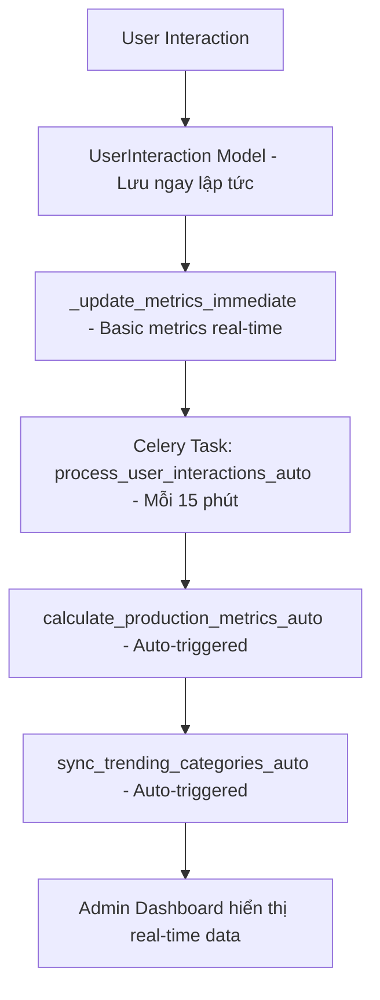

# 🔄 Real-Time Automation Pipeline Setup Guide

## 📋 Tổng quan

Hệ thống tự động hóa xử lý user interactions và cập nhật metrics real-time cho admin dashboard.

## 🎯 Workflow tự động



## 🔧 Cài đặt

### 1. Cài đặt Redis (Message Broker)

**Windows với Docker:**

```bash
docker run -d -p 6379:6379 --name redis redis:alpine
```

**Ubuntu/Linux:**

```bash
sudo apt-get install redis-server
sudo systemctl start redis
sudo systemctl enable redis
```

**macOS:**

```bash
brew install redis
brew services start redis
```

### 2. Kiểm tra Redis hoạt động

```bash
# Test Redis connection
redis-cli ping
# Should return: PONG
```

## 🚀 Chạy Automation Pipeline

### 1. Activate Virtual Environment

```bash
# Windows
venv\Scripts\activate

# Linux/macOS
source venv/bin/activate
```

### 2. Start Celery Worker

```bash
cd backend
celery -A config worker --loglevel=info --concurrency=2
```

### 3. Start Celery Beat Scheduler (Terminal thứ 2)

```bash
cd backend
celery -A config beat --loglevel=info
```

### 4. Start Django Development Server (Terminal thứ 3)

```bash
cd backend
python manage.py runserver
```

## 📊 Lịch tự động (Schedule)

| Task                                 | Frequency | Description                      |
| ------------------------------------ | --------- | -------------------------------- |
| `process_user_interactions_frequent` | 15 phút   | Xử lý user interactions gần đây  |
| `process_user_interactions_hourly`   | 1 giờ     | Xử lý user interactions trong 1h |
| `sync_trending_categories`           | 6 giờ     | Đồng bộ trending categories      |

## 🔍 Monitoring

### 1. Task Status trong Admin Dashboard

- Truy cập `/admin/dashboard`
- Click tab **"Auto-Processing"**
- Xem real-time status của các tasks

### 2. Manual Trigger

Trong Admin Dashboard, bạn có thể trigger tasks thủ công:

- **Process Interactions**: Xử lý ngay user interactions
- **Calculate Metrics**: Tính toán production metrics
- **Sync Trending**: Đồng bộ trending categories

### 3. Command Line Testing

```bash
cd backend
python manage.py shell
```

```python
# Test process user interactions
from apps.movies.tasks import process_user_interactions_auto
result = process_user_interactions_auto.delay(1)
print(f"Task ID: {result.id}")

# Test production metrics
from apps.movies.tasks import calculate_production_metrics_auto
result = calculate_production_metrics_auto.delay()
print(f"Task ID: {result.id}")

# Test trending sync
from apps.movies.tasks import sync_trending_categories_auto
result = sync_trending_categories_auto.delay()
print(f"Task ID: {result.id}")
```

## 🛠️ Troubleshooting

### Redis Connection Issues

```bash
# Check Redis status
redis-cli ping

# Restart Redis (Docker)
docker restart redis

# Check Redis logs
docker logs redis
```

### Celery Worker Issues

```bash
# Restart Celery worker
celery -A config worker --loglevel=info --concurrency=2

# Check task history
celery -A config events
```

### Task Status Debugging

```python
from django.core.cache import cache

# Check task status in cache
print("Process interactions:", cache.get('task_status_process_interactions'))
print("Calculate metrics:", cache.get('task_status_calculate_metrics'))
print("Sync trending:", cache.get('task_status_sync_trending'))

# Check last results
print("Last processing:", cache.get('last_auto_processing_result'))
print("Last metrics:", cache.get('last_metrics_calculation_result'))
print("Last trending:", cache.get('last_trending_sync_result'))
```

## 📈 Production Deployment

### 1. Redis Production Setup

```bash
# Install Redis on production server
sudo apt-get update
sudo apt-get install redis-server

# Configure Redis for production
sudo nano /etc/redis/redis.conf
# Set: maxmemory 256mb
# Set: maxmemory-policy allkeys-lru

sudo systemctl restart redis
```

### 2. Celery Production Setup

**Systemd Service for Celery Worker:**

```ini
# /etc/systemd/system/celery-worker.service
[Unit]
Description=Celery Worker Service
After=network.target

[Service]
Type=forking
User=your_user
Group=your_group
EnvironmentFile=/path/to/your/.env
WorkingDirectory=/path/to/movie-mate-v2/backend
ExecStart=/path/to/venv/bin/celery -A config worker --detach --loglevel=info --concurrency=4
ExecStop=/path/to/venv/bin/celery -A config control shutdown
ExecReload=/path/to/venv/bin/celery -A config control pool restart

[Install]
WantedBy=multi-user.target
```

**Systemd Service for Celery Beat:**

```ini
# /etc/systemd/system/celery-beat.service
[Unit]
Description=Celery Beat Service
After=network.target

[Service]
Type=simple
User=your_user
Group=your_group
EnvironmentFile=/path/to/your/.env
WorkingDirectory=/path/to/movie-mate-v2/backend
ExecStart=/path/to/venv/bin/celery -A config beat --loglevel=info

[Install]
WantedBy=multi-user.target
```

**Enable services:**

```bash
sudo systemctl daemon-reload
sudo systemctl enable celery-worker
sudo systemctl enable celery-beat
sudo systemctl start celery-worker
sudo systemctl start celery-beat
```

### 3. Monitoring với Flower (Optional)

```bash
# Install Flower
pip install flower

# Start Flower
celery -A config flower --port=5555

# Access monitoring at http://localhost:5555
```

## ✅ Verification

### 1. Automation Working

- [ ] Redis đang chạy (`redis-cli ping`)
- [ ] Celery worker đang chạy
- [ ] Celery beat đang chạy
- [ ] Django server đang chạy
- [ ] Admin Dashboard hiển thị Auto-Processing tab
- [ ] Task status hiển thị đúng
- [ ] Manual trigger hoạt động

### 2. Data Flow

- [ ] User interactions được lưu vào database
- [ ] Basic metrics cập nhật real-time
- [ ] Tasks chạy theo schedule
- [ ] Admin dashboard hiển thị dữ liệu mới

## 📞 Support

Nếu gặp vấn đề:

1. Kiểm tra logs của Celery worker
2. Kiểm tra Redis connection
3. Kiểm tra Django logs
4. Xem task status trong Admin Dashboard
5. Test manual trigger

## 🎉 Kết quả

Sau khi setup thành công:

- ✅ **Real-time responsiveness**: Basic metrics cập nhật ngay lập tức
- ✅ **Automated processing**: Detailed analytics tự động mỗi 15 phút
- ✅ **Admin visibility**: Dashboard hiển thị status và manual controls
- ✅ **Scalable architecture**: Celery distributed processing

Không cần chạy manual commands nữa! 🚀
