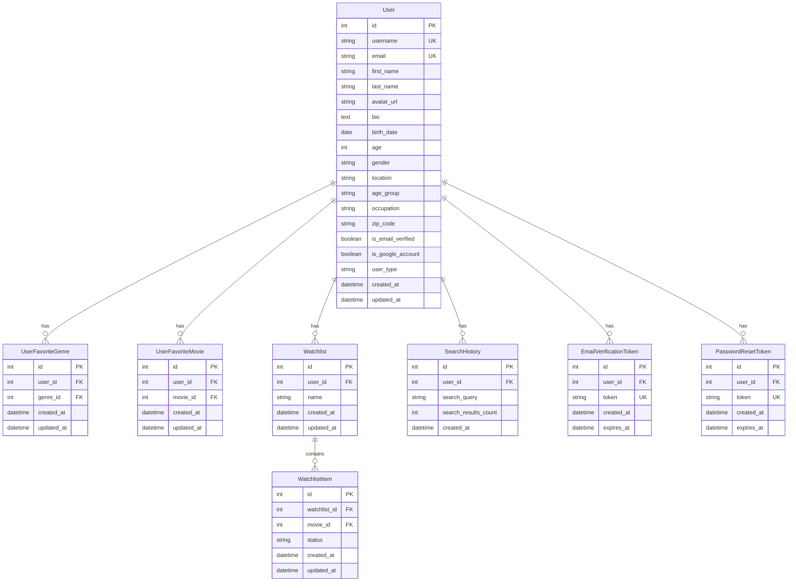
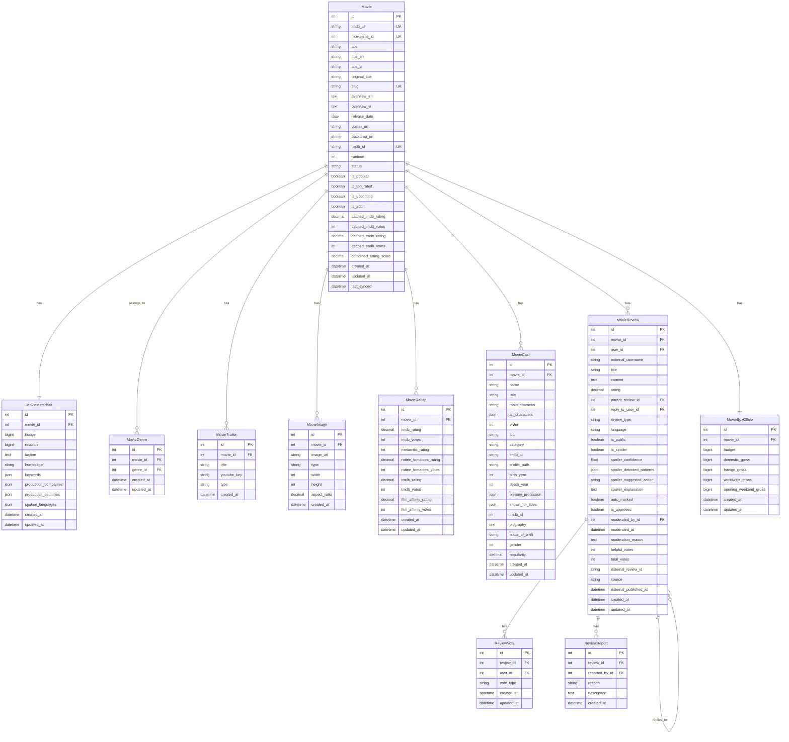
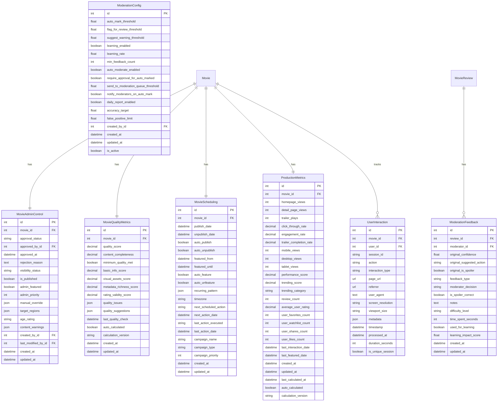
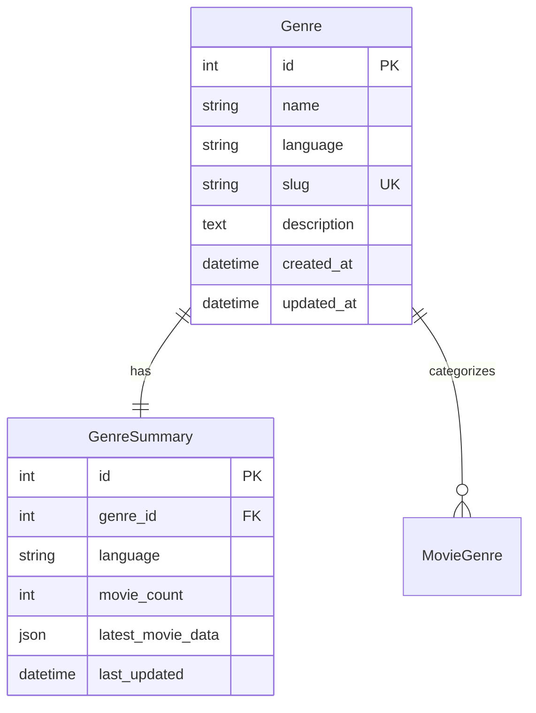
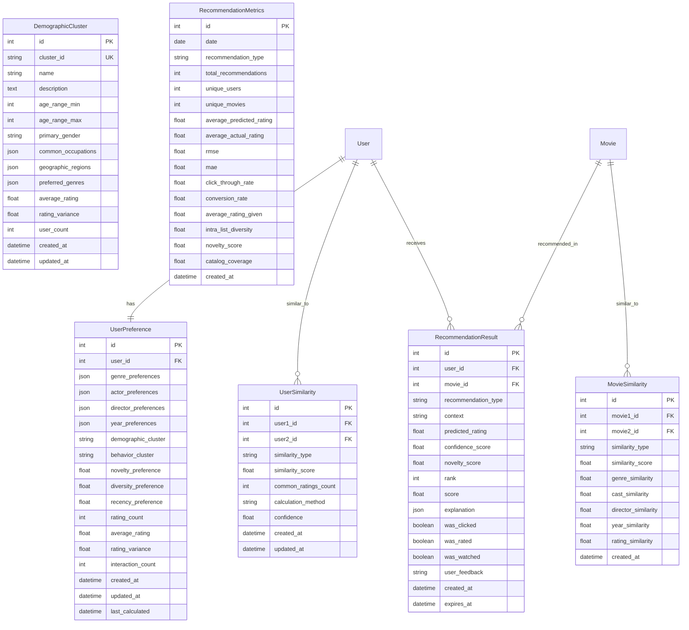
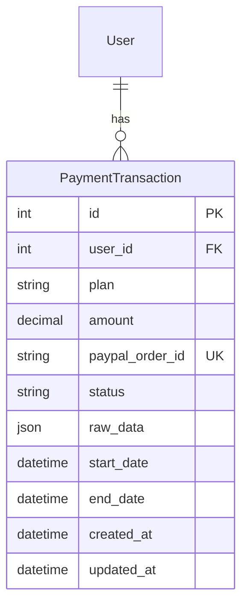

# 🗄️ ERD Diagram - Movie Recommendation System

## 📊 Tổng quan hệ thống

Hệ thống Movie Recommendation được thiết kế với kiến trúc microservices, bao gồm các module chính:

- **Users**: Quản lý người dùng và authentication
- **Movies**: Quản lý phim và metadata
- **Metadata**: Quản lý genres và categories
- **Recommendations**: Hệ thống gợi ý phim
- **Subscriptions**: Quản lý thanh toán và gói dịch vụ

---

## 🎯 Core Entities & Relationships

### 1. **USERS MODULE** 👥

### 2. **MOVIES MODULE** 🎬

### 3. **ADMIN CONTROL MODULE** 👨‍💼

### 4. **METADATA MODULE** 📚

### 5. **RECOMMENDATIONS MODULE** 🎯

### 6. **SUBSCRIPTIONS MODULE** 💳

---

## 🔗 Cross-Module Relationships

### **Core Relationships:**

1. **User ↔ Movie** (Many-to-Many)

   - `UserFavoriteMovie` (Favorites)
   - `WatchlistItem` (Watchlist)
   - `MovieReview` (Reviews)
   - `UserInteraction` (Tracking)

2. **Movie ↔ Genre** (Many-to-Many)

   - `MovieGenre` (Categorization)

3. **User ↔ Genre** (Many-to-Many)

   - `UserFavoriteGenre` (Preferences)

4. **Movie ↔ Cast** (One-to-Many)

   - `MovieCast` (Cast information)

5. **Movie ↔ Review** (One-to-Many)
   - `MovieReview` (User reviews)
   - `ReviewVote` (Voting system)
   - `ReviewReport` (Moderation)

### **Admin & Analytics Relationships:**

1. **Movie ↔ Admin Control** (One-to-One)

   - `MovieAdminControl` (Workflow management)
   - `MovieQualityMetrics` (Quality assessment)
   - `MovieScheduling` (Publication scheduling)
   - `ProductionMetrics` (Performance analytics)

2. **Review ↔ Moderation** (One-to-Many)
   - `ModerationFeedback` (Quality control)
   - `ModerationConfig` (System configuration)

### **Recommendation Relationships:**

1. **User ↔ User** (Many-to-Many)

   - `UserSimilarity` (Collaborative filtering)

2. **Movie ↔ Movie** (Many-to-Many)

   - `MovieSimilarity` (Content-based filtering)

3. **User ↔ Movie** (Many-to-Many)
   - `RecommendationResult` (Generated recommendations)

---

## 📈 Database Indexes & Performance

### **Primary Indexes:**

- All `id` fields (Primary Keys)
- All `user_id`, `movie_id`, `genre_id` (Foreign Keys)
- Unique constraints on `email`, `username`, `imdb_id`, `tmdb_id`

### **Performance Indexes:**

- Composite indexes for common queries
- Partial indexes for filtered data
- Temporal indexes for date-based queries
- Full-text search indexes for content

### **Caching Strategy:**

- Redis for session management
- Elasticsearch for movie search
- Application-level caching for popular queries

---

## 🎯 Key Features Supported

### **User Management:**

- Authentication & Authorization
- Profile management with demographics
- Email verification & password reset
- Google OAuth integration

### **Movie Management:**

- Multi-language support (EN/VI)
- Rich metadata (cast, crew, ratings)
- Media assets (posters, trailers, images)
- Quality assessment & moderation

### **Recommendation System:**

- Collaborative filtering
- Content-based filtering
- Demographic filtering
- Hybrid algorithms
- Performance tracking

### **Admin Features:**

- Content moderation workflow
- Quality metrics calculation
- Publication scheduling
- Analytics dashboard

### **Subscription Management:**

- Multiple plan tiers
- PayPal integration
- Usage tracking

---

## 🔧 Technical Specifications

### **Database:**

- **Primary**: PostgreSQL
- **Cache**: Redis
- **Search**: Elasticsearch
- **File Storage**: Local/Cloud (configurable)

### **Architecture:**

- Django REST Framework backend
- React frontend
- Celery for background tasks
- Docker containerization

### **Security:**

- JWT authentication
- CSRF protection
- Rate limiting
- Data encryption

### **Performance:**

- Database optimization
- Caching strategies
- CDN for static assets
- Load balancing ready

---

_ERD Diagram này thể hiện cấu trúc database hoàn chỉnh của hệ thống Movie Recommendation, hỗ trợ đầy đủ các tính năng từ user management đến advanced recommendation algorithms._
