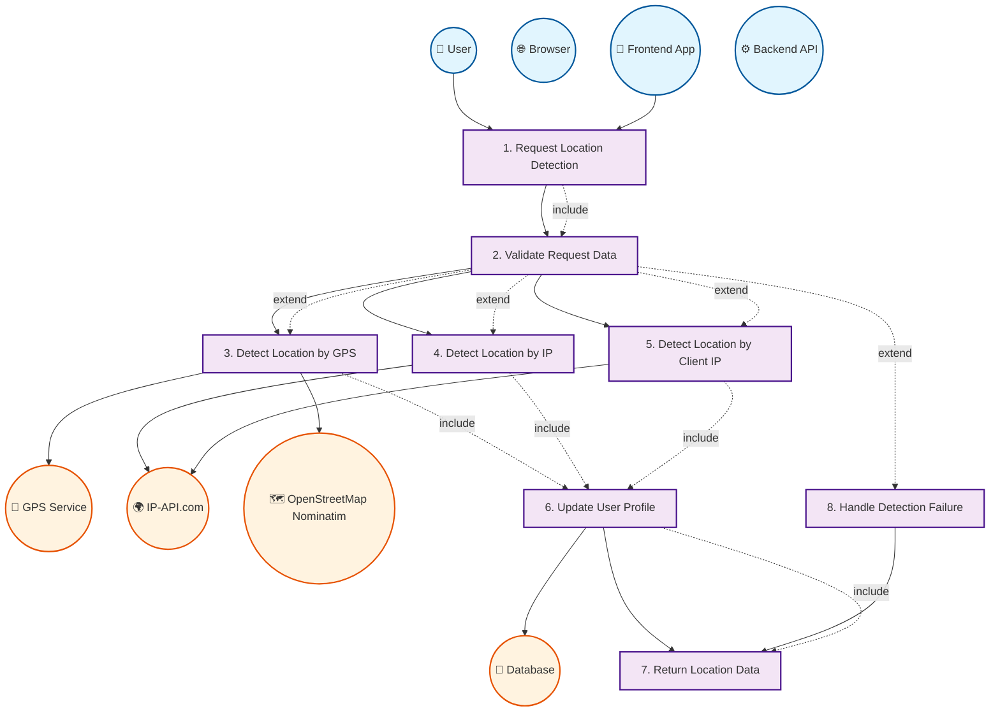

# Location Detection Service - Use Case Diagram

## Tổng quan hệ thống

Location Detection Service là một phần của hệ thống MovieMate, cho phép tự động phát hiện và cập nhật vị trí địa lý của user để cải thiện trải nghiệm cá nhân hóa.

## Use Case Diagram



## Chi tiết các Use Cases

### **Primary Actor: User**

- **Mô tả:** Người dùng muốn cập nhật vị trí của mình
- **Preconditions:** User đã đăng nhập và có quyền truy cập

### **Secondary Actors:**

- **Browser:** Cung cấp GPS coordinates thông qua Geolocation API
- **Frontend App:** Gửi request và xử lý response
- **Backend API:** Xử lý logic detection và cập nhật database
- **External Services:** Cung cấp thông tin địa lý

## Use Case Details

### **UC1: Request Location Detection**

- **Actor:** User, Frontend
- **Description:** User yêu cầu hệ thống phát hiện vị trí của mình
- **Preconditions:** User đã đăng nhập
- **Main Flow:**
  1. User click "Detect Location" button
  2. Frontend gửi POST request đến `/api/auth/profile/detect-location/`
  3. Request có thể chứa GPS coordinates hoặc IP address

### **UC2: Validate Request Data**

- **Actor:** Backend
- **Description:** Validate dữ liệu đầu vào từ request
- **Main Flow:**
  1. Kiểm tra LocationDetectionSerializer
  2. Validate các fields: latitude, longitude, ip_address
  3. Tất cả fields đều optional

### **UC3: Detect Location by GPS**

- **Actor:** Backend, GPS, Nominatim
- **Description:** Phát hiện vị trí từ GPS coordinates
- **Preconditions:** Request có latitude và longitude
- **Main Flow:**
  1. Gọi OpenStreetMap Nominatim API
  2. Reverse geocoding từ coordinates
  3. Trả về thông tin địa lý chi tiết

### **UC4: Detect Location by IP**

- **Actor:** Backend, IP-API.com
- **Description:** Phát hiện vị trí từ IP address được cung cấp
- **Preconditions:** Request có ip_address field
- **Main Flow:**
  1. Gọi ip-api.com service
  2. Lấy thông tin địa lý từ IP
  3. Trả về country, city, region, coordinates

### **UC5: Detect Location by Client IP**

- **Actor:** Backend, IP-API.com
- **Description:** Phát hiện vị trí từ IP address của client
- **Preconditions:** Không có GPS hoặc custom IP
- **Main Flow:**
  1. Lấy client IP từ request headers
  2. Gọi ip-api.com service
  3. Trả về thông tin địa lý

### **UC6: Update User Profile**

- **Actor:** Backend, Database
- **Description:** Cập nhật thông tin vị trí vào user profile
- **Main Flow:**
  1. Tạo location string: "City, Country"
  2. Cập nhật user.location và user.zip_code
  3. Lưu vào database

### **UC7: Return Location Data**

- **Actor:** Backend, Frontend
- **Description:** Trả về kết quả detection cho frontend
- **Main Flow:**
  1. Trả về success response với location data
  2. Hoặc trả về error response nếu detection thất bại

### **UC8: Handle Detection Failure**

- **Actor:** Backend
- **Description:** Xử lý khi không thể phát hiện vị trí
- **Main Flow:**
  1. Log error message
  2. Trả về error response
  3. Không cập nhật user profile

## Alternative Flows

### **A1: GPS Permission Denied**

- User từ chối cho phép GPS access
- System fallback sang IP-based detection

### **A2: External Service Unavailable**

- ip-api.com hoặc Nominatim không khả dụng
- System trả về error response

### **A3: Invalid IP Address**

- IP address là local/private IP
- System bỏ qua và thử phương thức khác

### **A4: Network Timeout**

- Request đến external service timeout
- System trả về error sau 5 giây

## Post Conditions

### **Success Scenario:**

- User profile được cập nhật với location mới
- Frontend nhận được location data
- User có thể thấy vị trí mới trong profile

### **Failure Scenario:**

- User profile không thay đổi
- Frontend nhận được error message
- User có thể thử lại hoặc nhập location thủ công

## Technical Implementation

### **API Endpoint:**

```
POST /api/auth/profile/detect-location/
```

### **Request Format:**

```json
{
  "latitude": 10.8231, // Optional
  "longitude": 106.6297, // Optional
  "ip_address": "8.8.8.8" // Optional
}
```

### **Response Format:**

```json
{
  "status": "success",
  "message": "Location detected and updated successfully",
  "data": {
    "location": "Ho Chi Minh City, Vietnam",
    "zip_code": "70000",
    "detected_data": {
      "country": "Vietnam",
      "region": "Ho Chi Minh City",
      "city": "Ho Chi Minh City",
      "zip_code": "70000",
      "latitude": 10.8231,
      "longitude": 106.6297
    }
  }
}
```

## Security Considerations

### **Current Vulnerabilities:**

- ❌ Không validate IP address từ frontend
- ❌ Có thể bị fake bằng VPN/proxy
- ❌ Không có rate limiting
- ❌ Phụ thuộc external services

### **Recommendations:**

- ✅ Implement IP validation
- ✅ Add rate limiting
- ✅ Use multiple geolocation services
- ✅ Cache location data
- ✅ Add location verification

## Performance Considerations

### **Optimizations:**

- ✅ Timeout 5 giây cho external calls
- ✅ Skip local/private IPs
- ✅ Fallback mechanisms
- ✅ Error handling và logging

### **Monitoring:**

- Track success/failure rates
- Monitor external service availability
- Log detection accuracy
- Monitor response times
