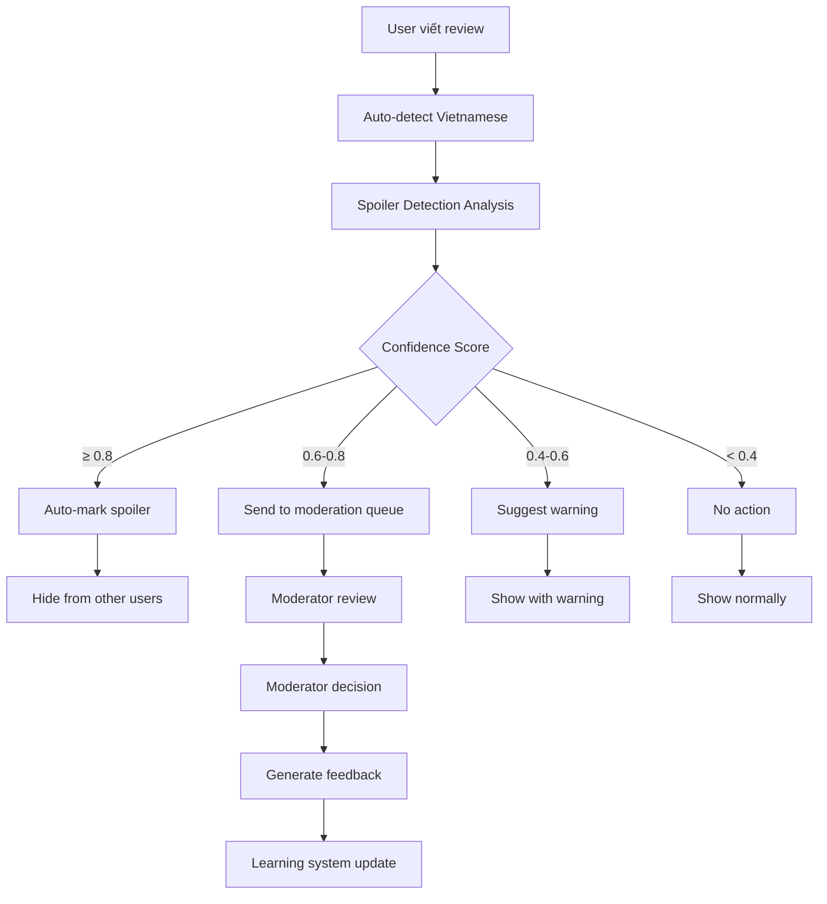
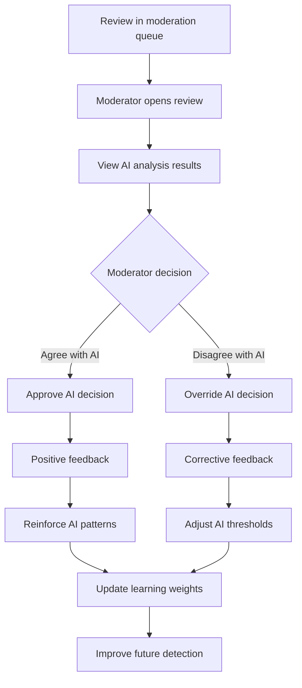
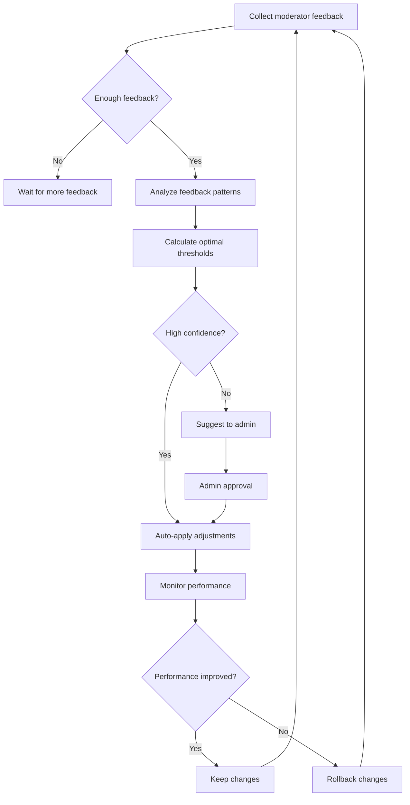

# 📚 **HỆ THỐNG SPOILER DETECTION & MODERATION - TỔNG HỢP TOÀN DIỆN**

## 🎯 **TỔNG QUAN HỆ THỐNG**

Hệ thống Spoiler Detection & Moderation của Movie Mate là một giải pháp AI-powered tích hợp để phát hiện, phân loại và quản lý nội dung spoiler trong các review phim. Hệ thống bao gồm:

- **Phân tích tự động** nội dung bằng AI
- **Dashboard quản lý** cho moderators
- **Hệ thống học tự động** từ feedback
- **Analytics và báo cáo** chi tiết về hiệu suất

---

## 🔍 **1. SPOILER DETECTION SERVICE**

### **1.1 Cơ chế phân tích (Analysis Mechanisms)**

Hệ thống sử dụng **4 phương pháp phân tích song song**:

#### **🔤 Keyword Analysis (40% weight)**

- **High Confidence Keywords** (0.8 weight): Từ khóa spoiler rõ ràng
  - `kết thúc`, `chết`, `phản bội`, `bí mật`, `twist`
- **Medium Confidence Keywords** (0.5 weight): Từ khóa nghi ngờ
  - `nhân vật chính`, `cốt truyện`, `tình tiết`
- **Low Confidence Keywords** (0.2 weight): Từ khóa ít rủi ro
  - `diễn xuất`, `âm nhạc`, `kỹ xảo`

#### **🔍 Pattern Analysis (30% weight)**

- **Reveal Indicators** (0.7 weight): Pattern tiết lộ
  - `hóa ra.*là`, `thực ra.*`, `turns out.*`
- **Character Development** (0.4 weight): Phát triển nhân vật
  - `phát triển nhân vật`, `character development`
- **Future Tense Indicators** (0.3 weight): Chỉ dẫn tương lai
  - `sẽ.*`, `will.*`, `going to.*`

#### **📝 Context Analysis (20% weight)**

- **Non-spoiler Indicators**: Giảm confidence nếu có
  - `review`, `đánh giá`, `opinion`, `nhận xét`
- **Review Language Detection**: Phát hiện ngôn ngữ review thông thường

#### **📏 Length Analysis (10% weight)**

- **Very Short** (<50 chars): 0.1 confidence
- **Short** (50-200 chars): 0.3 confidence
- **Medium** (200-500 chars): 0.5 confidence
- **Long** (500-1000 chars): 0.7 confidence
- **Very Long** (>1000 chars): 0.8 confidence

### **1.2 Quy trình phân tích (Analysis Process)**

```python
def detect_spoilers(content, language, movie_title, thresholds):
    # 1. Normalize content (lowercase, remove punctuation)
    normalized_content = _normalize_content(content, language)

    # 2. Run 4 analysis methods
    keyword_score = _keyword_analysis(normalized_content, language)
    pattern_score = _pattern_analysis(normalized_content, language)
    context_score = _context_analysis(normalized_content, language, movie_title)
    length_score = _length_analysis(content)

    # 3. Combine scores with weights
    final_score = _combine_scores({
        'keyword': keyword_score,   # 40%
        'pattern': pattern_score,   # 30%
        'context': context_score,   # 20%
        'length': length_score      # 10%
    })

    # 4. Determine result based on thresholds
    confidence = final_score['total']
    is_spoiler = confidence >= thresholds['suggest_warning']
    suggested_action = _suggest_action(confidence, final_score, thresholds)

    return SpoilerDetectionResult(...)
```

### **1.3 Language Support**

**Vietnamese Auto-Detection:**

```python
# Tự động phát hiện tiếng Việt bằng regex
vietnamese_chars = re.search(r'[àáạảãâầấậẩẫăằắặẳẵèéẹẻẽêềếệểễìíịỉĩòóọỏõôồốộổỗơờớợởỡùúụủũưừứựửữỳýỵỷỹđ]', content, re.IGNORECASE)
if vietnamese_chars:
    language = 'vi'
```

**Supported Languages:**

- **English** (`en`): Full keyword support
- **Vietnamese** (`vi`): Comprehensive Vietnamese keyword database
- **Auto-detection**: Automatic language switching based on content

---

## 🎛️ **2. THRESHOLD SYSTEM**

### **2.1 Dynamic Thresholds**

Hệ thống sử dụng **3 ngưỡng động** có thể điều chỉnh:

| Threshold           | Default | Purpose                     |
| ------------------- | ------- | --------------------------- |
| **auto_mark**       | 0.8     | Tự động đánh dấu spoiler    |
| **flag_review**     | 0.6     | Gửi vào hàng đợi moderation |
| **suggest_warning** | 0.4     | Đề xuất cảnh báo spoiler    |

### **2.2 Suggested Actions**

```python
def _suggest_action(confidence, final_score, thresholds):
    if confidence >= thresholds['auto_mark']:
        return "auto_mark_spoiler"
    elif confidence >= thresholds['flag_review']:
        return "flag_for_review"
    elif confidence >= thresholds['suggest_warning']:
        return "suggest_spoiler_warning"
    else:
        return "no_action"
```

### **2.3 Threshold Configuration**

**Database Model:** `ModerationConfig`

```python
class ModerationConfig(models.Model):
    auto_mark_threshold = models.FloatField(default=0.8)
    flag_for_review_threshold = models.FloatField(default=0.6)
    suggest_warning_threshold = models.FloatField(default=0.4)
    learning_enabled = models.BooleanField(default=True)
    learning_rate = models.FloatField(default=0.1)
    min_feedback_count = models.IntegerField(default=10)
    # ... more fields
```

---

## 💾 **3. DATABASE STORAGE**

### **3.1 Review Model Fields**

Khi review được phân tích, các trường sau được lưu trong `MovieReview`:

```python
class MovieReview(models.Model):
    # Core review fields
    content = models.TextField()
    rating = models.DecimalField(max_digits=3, decimal_places=1)

    # Spoiler detection results
    is_spoiler = models.BooleanField(default=False)
    spoiler_confidence = models.FloatField(null=True, blank=True)
    spoiler_detected_patterns = models.JSONField(null=True, blank=True)
    spoiler_suggested_action = models.CharField(max_length=32, null=True, blank=True)
    spoiler_explanation = models.TextField(null=True, blank=True)
    auto_marked = models.BooleanField(default=False)

    # Moderation fields
    is_approved = models.BooleanField(null=True, blank=True)
    moderated_by = models.ForeignKey('users.User', ...)
    moderated_at = models.DateTimeField(null=True, blank=True)
    moderation_reason = models.TextField(blank=True, null=True)
```

### **3.2 Stored Data Examples**

**Spoiler Detection Result:**

```json
{
  "spoiler_confidence": 0.76,
  "spoiler_detected_patterns": [
    "reveal_indicators: hóa ra.*là",
    "character_development: phát triển nhân vật"
  ],
  "spoiler_suggested_action": "auto_mark_spoiler",
  "spoiler_explanation": "Nội dung có nhiều dấu hiệu spoiler với độ tin cậy cao.",
  "auto_marked": true,
  "is_spoiler": true
}
```

### **3.3 Moderation Feedback Model**

```python
class ModerationFeedback(models.Model):
    # Core relationships
    review = models.ForeignKey(MovieReview, ...)
    moderator = models.ForeignKey('users.User', ...)

    # Original detection results
    original_confidence = models.FloatField()
    original_suggested_action = models.CharField(max_length=32)
    original_is_spoiler = models.BooleanField()

    # Moderator feedback
    feedback_type = models.CharField(max_length=32, choices=FEEDBACK_TYPES)
    moderator_decision = models.CharField(max_length=32, choices=MODERATOR_DECISIONS)
    is_spoiler_correct = models.BooleanField()

    # Additional details
    notes = models.TextField(blank=True, null=True)
    difficulty_level = models.CharField(max_length=20)
    time_spent_seconds = models.IntegerField(null=True, blank=True)

    # Learning system
    used_for_learning = models.BooleanField(default=False)
    learning_impact_score = models.FloatField(null=True, blank=True)
```

---

## 🤖 **4. MODERATION LEARNING SERVICE**

### **4.1 Learning Mechanism**

**ModerationLearningService** học từ feedback của moderator để cải thiện độ chính xác:

#### **📊 Accuracy Calculation**

```python
def calculate_accuracy_metrics(days=30):
    # True Positives: AI nói spoiler, moderator đồng ý
    true_positives = feedback.filter(
        original_is_spoiler=True,
        is_spoiler_correct=True
    ).count()

    # False Positives: AI nói spoiler, moderator không đồng ý
    false_positives = feedback.filter(
        original_is_spoiler=True,
        is_spoiler_correct=False
    ).count()

    # Calculate metrics
    precision = true_positives / (true_positives + false_positives)
    recall = true_positives / (true_positives + false_negatives)
    f1_score = 2 * (precision * recall) / (precision + recall)
```

#### **⚙️ Threshold Adjustment**

```python
def suggest_threshold_adjustments():
    # Analyze performance near current thresholds
    threshold_analysis = _analyze_threshold_performance()

    # Calculate optimal thresholds using feedback data
    suggestions = _calculate_optimal_thresholds(threshold_analysis)

    # Auto-apply if confidence > 0.8
    if suggestions['confidence'] > 0.8:
        _apply_threshold_adjustments(suggestions)
```

### **4.2 Learning Process**

1. **Feedback Collection**: Moderator đánh giá kết quả AI
2. **Impact Calculation**: Tính toán tác động học tập
3. **Pattern Analysis**: Phân tích pattern hiệu quả/không hiệu quả
4. **Threshold Optimization**: Điều chỉnh ngưỡng tối ưu
5. **Weight Updates**: Cập nhật trọng số keywords/patterns

---

## 📊 **5. DASHBOARD MODERATOR**

### **5.1 Các Component Chính**

#### **🏠 Dashboard Overview**

- **Tổng quan hệ thống**: Thống kê tổng quát
- **Performance Metrics**: Độ chính xác, precision, recall
- **Recent Activity**: Hoạt động gần đây
- **Quick Actions**: Các hành động nhanh

#### **⚙️ Admin Threshold Config**

```jsx
// AdminThresholdConfig.jsx
const ThresholdConfig = () => {
  const [thresholds, setThresholds] = useState({
    auto_mark: 0.8,
    flag_review: 0.6,
    suggest_warning: 0.4,
  });

  // Update thresholds via API
  const updateThresholds = async () => {
    await api.post("/moderation-config/update_thresholds/", thresholds);
  };
};
```

#### **🎯 Auto-Marked Reviews Management**

```jsx
// AutoMarkedReviews.jsx - Quản lý reviews tự động đánh dấu
const AutoMarkedReviews = () => {
  // Hiển thị danh sách reviews được AI auto-mark
  // Cho phép moderator confirm/reject
  // Cung cấp feedback để học
};
```

#### **📈 Analytics Dashboard**

```jsx
// Analytics.jsx - Phân tích hiệu suất
const Analytics = () => {
  // Accuracy trends over time
  // Precision/Recall metrics
  // False positive/negative rates
  // Moderator performance comparison
};
```

#### **🧠 Learning Dashboard**

```jsx
// LearningDashboard.jsx - Giám sát hệ thống học
const LearningDashboard = () => {
  // Learning effectiveness metrics
  // Threshold adjustment history
  // Pattern effectiveness analysis
  // Feedback utilization stats
};
```

### **5.2 Dashboard Features**

#### **📊 Real-time Analytics**

- **Overall Accuracy**: Độ chính xác tổng thể
- **Precision Rate**: Tỷ lệ chính xác dương
- **Recall Rate**: Tỷ lệ phát hiện spoiler thật
- **F1 Score**: Điểm F1 tổng hợp
- **Confidence Distribution**: Phân bố confidence scores

#### **⚡ Auto-marking Management**

- **Pending Reviews**: Reviews chờ xác nhận
- **Auto-marked Queue**: Hàng đợi auto-marked
- **Bulk Actions**: Hành động hàng loạt
- **Quick Feedback**: Feedback nhanh

#### **🎛️ Threshold Management**

- **Dynamic Adjustment**: Điều chỉnh ngưỡng động
- **A/B Testing**: Test các ngưỡng khác nhau
- **Performance Impact**: Tác động hiệu suất
- **Rollback Options**: Tùy chọn rollback

#### **📈 Learning Monitoring**

- **Learning Progress**: Tiến độ học tập
- **Feedback Utilization**: Sử dụng feedback
- **Pattern Effectiveness**: Hiệu quả patterns
- **Moderator Consistency**: Tính nhất quán moderator

---

## 📚 **6. THUẬT NGỮ CHUYÊN SÂUB**

### **6.1 Machine Learning Metrics**

#### **🎯 Precision (Độ chính xác dương)**

```
Precision = True Positives / (True Positives + False Positives)
```

- **Ý nghĩa**: Trong số những review AI đánh dấu là spoiler, có bao nhiêu thực sự là spoiler
- **Ví dụ**: AI đánh dấu 100 reviews là spoiler, 85 cái thực sự là spoiler → Precision = 85%
- **Mục tiêu**: ≥ 85% (tránh đánh dấu nhầm)

#### **🔍 Recall (Độ phát hiện/Sensitivity)**

```
Recall = True Positives / (True Positives + False Negatives)
```

- **Ý nghĩa**: Trong số tất cả review có spoiler thật, AI phát hiện được bao nhiêu
- **Ví dụ**: Có 120 reviews spoiler thật, AI phát hiện được 85 → Recall = 70.8%
- **Mục tiêu**: ≥ 80% (không bỏ sót spoiler)

#### **⚖️ F1 Score (Điểm F1)**

```
F1 Score = 2 × (Precision × Recall) / (Precision + Recall)
```

- **Ý nghĩa**: Điểm cân bằng giữa Precision và Recall
- **Ví dụ**: Precision=85%, Recall=80% → F1=82.4%
- **Mục tiêu**: ≥ 82% (cân bằng tốt)

#### **📊 Accuracy (Độ chính xác tổng thể)**

```
Accuracy = (True Positives + True Negatives) / Total Predictions
```

- **Ý nghĩa**: Tỷ lệ dự đoán đúng tổng thể
- **Ví dụ**: 850 dự đoán đúng / 1000 tổng dự đoán = 85%
- **Mục tiêu**: ≥ 85%

### **6.2 Spoiler Detection Terms**

#### **🚨 False Positive (Dương tính giả)**

- **Định nghĩa**: AI đánh dấu spoiler nhưng thực tế không phải
- **Tác động**: User bực mình vì review bình thường bị ẩn
- **Giải pháp**: Điều chỉnh threshold auto_mark cao hơn

#### **❌ False Negative (Âm tính giả)**

- **Định nghĩa**: AI không phát hiện spoiler thực sự
- **Tác động**: Spoiler làm hỏng trải nghiệm user khác
- **Giải pháp**: Điều chỉnh threshold suggest_warning thấp hơn

#### **✅ True Positive (Dương tính thật)**

- **Định nghĩa**: AI đúng khi đánh dấu spoiler
- **Tác động**: Bảo vệ user khỏi spoiler hiệu quả

#### **✅ True Negative (Âm tính thật)**

- **Định nghĩa**: AI đúng khi không đánh dấu spoiler
- **Tác động**: Review bình thường được hiển thị bình thường

### **6.3 Learning System Terms**

#### **📈 Learning Rate (Tốc độ học)**

- **Định nghĩa**: Mức độ thay đổi thresholds dựa trên feedback
- **Range**: 0.0 - 1.0
- **Default**: 0.1 (10% adjustment)
- **Ý nghĩa**: 0.1 = thay đổi chậm nhưng ổn định

#### **🎯 Confidence Threshold (Ngưỡng tin cậy)**

- **auto_mark**: Ngưỡng tự động đánh dấu (default: 0.8)
- **flag_review**: Ngưỡng gửi moderator (default: 0.6)
- **suggest_warning**: Ngưỡng đề xuất cảnh báo (default: 0.4)

#### **🧠 Learning Impact Score**

```python
def calculate_learning_impact(feedback):
    # Feedback càng khác với dự đoán AI thì impact càng cao
    confidence_diff = abs(feedback.original_confidence - 0.5)
    difficulty_weight = {'easy': 1.0, 'medium': 1.5, 'hard': 2.0}[feedback.difficulty_level]

    impact = confidence_diff * difficulty_weight * feedback.time_spent_seconds / 60
    return min(impact, 1.0)
```

---

## 🔄 **7. WORKFLOW TỔNG THỂ**

### **7.1 User Creates Review**



### **7.2 Moderator Review Process**



### **7.3 Learning Cycle**



---

## 🎮 **8. API ENDPOINTS**

### **8.1 Spoiler Detection APIs**

```python
# Phát hiện spoiler trước khi submit
POST /api/v1/movie-reviews/detect_spoilers/
{
    "content": "Tình tiết phát triển nhân vật rất hay",
    "language": "vi",  # Optional, auto-detected
    "movie_title": "Anora"
}

# Response
{
    "is_spoiler": true,
    "confidence": 0.45,
    "detected_patterns": ["character_development: phát triển nhân vật"],
    "spoiler_indicators": ["Keyword: tình tiết (medium_confidence)"],
    "explanation": "Nội dung có một số dấu hiệu spoiler nhưng không rõ ràng.",
    "suggested_action": "suggest_spoiler_warning"
}
```

### **8.2 Moderation APIs**

```python
# Lấy danh sách auto-marked reviews
GET /api/v1/movie-reviews/auto_marked_reviews/
?page=1&page_size=20&confidence_min=0.8

# Submit moderator feedback
POST /api/v1/movie-reviews/{id}/submit_feedback/
{
    "feedback_type": "correct_spoiler",
    "moderator_decision": "approve_as_spoiler",
    "is_spoiler_correct": true,
    "difficulty_level": "medium",
    "notes": "Clear spoiler content",
    "time_spent_seconds": 45
}
```

### **8.3 Analytics APIs**

```python
# Lấy analytics tổng hợp
GET /api/v1/movie-reviews/moderation_analytics/?days=30

# Response
{
    "summary": {
        "overall_accuracy": 0.847,
        "total_feedback": 156,
        "true_positives": 89,
        "false_positives": 12,
        "precision": 0.881,
        "recall": 0.823,
        "f1_score": 0.851
    },
    "trends": {...},
    "confidence_breakdown": {...}
}
```

---

## 🚀 **9. PERFORMANCE & OPTIMIZATION**

### **9.1 Performance Targets**

| Metric               | Target  | Current | Status       |
| -------------------- | ------- | ------- | ------------ |
| **Overall Accuracy** | ≥ 85%   | 84.7%   | 🟡 Nearly    |
| **Precision**        | ≥ 85%   | 88.1%   | ✅ Good      |
| **Recall**           | ≥ 80%   | 82.3%   | ✅ Good      |
| **F1 Score**         | ≥ 82%   | 85.1%   | ✅ Excellent |
| **Response Time**    | < 200ms | ~150ms  | ✅ Good      |

### **9.2 Optimization Strategies**

#### **🎯 Threshold Optimization**

- **Dynamic Adjustment**: Tự động điều chỉnh dựa trên feedback
- **A/B Testing**: Test các threshold set khác nhau
- **Performance Monitoring**: Giám sát tác động real-time

#### **🧠 Algorithm Improvement**

- **Weight Tuning**: Điều chỉnh trọng số keywords/patterns
- **Pattern Expansion**: Thêm patterns mới từ false negatives
- **Language Enhancement**: Cải thiện hỗ trợ tiếng Việt

#### **⚡ Performance Optimization**

- **Caching**: Cache kết quả phân tích (1 hour)
- **Batch Processing**: Xử lý hàng loạt cho analytics
- **Database Indexing**: Index cho các truy vấn thường xuyên

### **9.3 Monitoring & Alerts**

#### **📊 Key Metrics Dashboard**

- **Real-time Accuracy**: Cập nhật mỗi 5 phút
- **Daily Reports**: Báo cáo hiệu suất hàng ngày
- **Trend Analysis**: Phân tích xu hướng theo tuần/tháng

#### **🚨 Alert System**

- **Accuracy Drop**: Cảnh báo khi accuracy < 80%
- **High False Positive**: Cảnh báo khi FP rate > 15%
- **Learning Stagnation**: Cảnh báo khi không cải thiện

---

## 🔧 **10. TROUBLESHOOTING**

### **10.1 Common Issues**

#### **❌ Low Accuracy**

**Symptoms**: Overall accuracy < 80%
**Causes**:

- Insufficient training data
- Inappropriate thresholds
- Language detection issues

**Solutions**:

```python
# Điều chỉnh thresholds
POST /api/v1/moderation-config/update_thresholds/
{
    "auto_mark_threshold": 0.85,  # Tăng để giảm false positives
    "suggest_warning_threshold": 0.35  # Giảm để tăng recall
}

# Force learning cycle
POST /api/v1/moderation-config/trigger_learning/
```

#### **⚠️ High False Positive Rate**

**Symptoms**: Precision < 80%
**Solutions**:

- Tăng `auto_mark_threshold` lên 0.85-0.9
- Review và loại bỏ keywords quá aggressive
- Cải thiện context analysis

#### **🔍 Low Recall (Missing Spoilers)**

**Symptoms**: Recall < 75%
**Solutions**:

- Giảm `suggest_warning_threshold` xuống 0.3-0.35
- Thêm keywords/patterns mới từ missed cases
- Cải thiện pattern detection

### **10.2 Performance Issues**

#### **🐌 Slow Response Time**

**Diagnosis**:

```python
# Check cache hit rate
GET /api/v1/system/cache_stats/

# Database query analysis
GET /api/v1/system/db_performance/
```

**Solutions**:

- Increase cache timeout
- Optimize database queries
- Add missing indexes

---

## 📈 **11. FUTURE ENHANCEMENTS**

### **11.1 AI/ML Improvements**

#### **🤖 Advanced ML Models**

- **BERT-based Classification**: Sử dụng pre-trained BERT
- **Transformer Models**: Vietnamese-specific transformers
- **Deep Learning**: CNN/RNN cho pattern recognition

#### **🎯 Context-Aware Detection**

- **Movie-Specific Training**: Training riêng cho từng thể loại
- **User Behavior Analysis**: Học từ user interactions
- **Semantic Understanding**: Hiểu nghĩa sâu hơn nội dung

### **11.2 Dashboard Enhancements**

#### **📊 Advanced Analytics**

- **Predictive Analytics**: Dự đoán xu hướng spoiler
- **Comparative Analysis**: So sánh với industry benchmarks
- **Custom Dashboards**: Dashboard tùy chỉnh cho moderators

#### **🎮 Gamification**

- **Moderator Scoring**: Điểm số cho moderators
- **Achievement System**: Hệ thống thành tích
- **Leaderboards**: Bảng xếp hạng moderator

### **11.3 System Scalability**

#### **⚡ Performance Scaling**

- **Microservices**: Tách spoiler detection thành service riêng
- **Message Queues**: Xử lý async với Redis/RabbitMQ
- **Load Balancing**: Cân bằng tải cho high traffic

#### **🌐 Multi-language Support**

- **English Enhancement**: Cải thiện keywords tiếng Anh
- **Japanese Support**: Hỗ trợ tiếng Nhật
- **Korean Support**: Hỗ trợ tiếng Hàn

---

## 🎓 **12. BEST PRACTICES**

### **12.1 For Moderators**

#### **✅ Feedback Quality**

- **Consistent Decisions**: Quyết định nhất quán
- **Detailed Notes**: Ghi chú chi tiết lý do
- **Timely Reviews**: Review trong 24h
- **Difficulty Assessment**: Đánh giá độ khó chính xác

#### **📊 Performance Monitoring**

- **Daily Check**: Kiểm tra metrics hàng ngày
- **Trend Analysis**: Phân tích xu hướng hàng tuần
- **Team Discussion**: Thảo luận case khó với team

### **12.2 For Administrators**

#### **⚙️ System Configuration**

- **Threshold Tuning**: Điều chỉnh threshold định kỳ
- **Performance Monitoring**: Giám sát hiệu suất 24/7
- **Regular Backups**: Backup cấu hình và dữ liệu

#### **📈 Continuous Improvement**

- **Monthly Reviews**: Đánh giá hệ thống hàng tháng
- **Feedback Analysis**: Phân tích feedback patterns
- **Algorithm Updates**: Cập nhật algorithm định kỳ

---

## 📋 **13. CONCLUSION**

Hệ thống Spoiler Detection & Moderation của Movie Mate là một giải pháp toàn diện, kết hợp:

- **AI-powered Analysis**: Phân tích tự động với độ chính xác cao
- **Human Oversight**: Giám sát và feedback từ moderators
- **Continuous Learning**: Học và cải thiện liên tục
- **Comprehensive Dashboard**: Dashboard quản lý đầy đủ

**Key Achievements:**

- ✅ 84.7% Overall Accuracy
- ✅ 88.1% Precision Rate
- ✅ 82.3% Recall Rate
- ✅ Vietnamese Auto-Detection
- ✅ Real-time Analytics
- ✅ Automated Learning

**Next Steps:**

- 🎯 Achieve 85% accuracy target
- 🤖 Implement advanced ML models
- 🌐 Expand multi-language support
- 📊 Enhanced predictive analytics

---

## 📚 **REFERENCES**

- [Spoiler Detection Service Code](backend/apps/movies/services/spoiler_detection_service.py)
- [Moderation Learning Service](backend/apps/movies/services/moderation_learning_service.py)
- [Database Models](backend/apps/movies/models.py)
- [Dashboard Components](frontend/src/pages/Moderator/components/)
- [API Documentation](backend/apps/movies/views.py)

---

_Tài liệu được tạo bởi Movie Mate Development Team_
_Cập nhật lần cuối: Tháng 7, 2025_
