# 3.1.1.8. Chức năng quản lý phim (Admin)

## Mô tả chức năng

Hệ thống quản lý phim dành cho Admin cung cấp khả năng kiểm soát toàn diện cơ sở dữ liệu phim với các tính năng nâng cao. Admin có thể thực hiện CRUD operations, bulk operations, quản lý trạng thái hiển thị (draft, published, scheduled), và kiểm soát chất lượng nội dung. Hệ thống hỗ trợ làm giàu dữ liệu tự động từ nhiều nguồn, quản lý hình ảnh và trailer, lập lịch tự động publish/unpublish, và phân tích hiệu suất chi tiết.

## Use Case Diagram

```mermaid
graph TD
    %% Actors
    Admin[👨‍💻 Administrator]
    TMDB[🎬 TMDB API]
    IMDB[🎬 IMDB API]
    BackgroundSystem[⚙️ Background System]
    AnalyticsEngine[📊 Analytics Engine]

    subgraph "3.1.1.8 - QUẢN LÝ PHIM (ADMIN)"
        %% Core Movie Management
        UC_CreateMovie["Tạo phim mới<br/>- Basic info input<br/>- Metadata setup<br/>- Initial status"]
        UC_EditMovie["Chỉnh sửa phim<br/>- Update information<br/>- Modify metadata<br/>- Change settings"]
        UC_DeleteMovie["Xóa phim<br/>- Soft delete<br/>- Hard delete<br/>- Archive option"]
        UC_ViewMovieDetails["Xem chi tiết phim<br/>- Complete information<br/>- Status tracking<br/>- Performance metrics"]

        %% Bulk Operations
        UC_BulkMovieOperations["Thao tác hàng loạt<br/>- Bulk approve/reject<br/>- Mass status update<br/>- Batch import/export<br/>- Bulk enrichment"]
        UC_BulkApproveReject["Duyệt/Từ chối hàng loạt<br/>- Multi-select approval<br/>- Batch rejection<br/>- Bulk status change"]
        UC_BulkFeatureUnfeature["Nổi bật/Bỏ nổi bật hàng loạt<br/>- Mass feature selection<br/>- Batch unfeature<br/>- Priority management"]
        UC_BulkPublishUnpublish["Xuất bản/Ẩn hàng loạt<br/>- Mass publishing<br/>- Batch unpublishing<br/>- Schedule management"]

        %% Status Management
        UC_ManageMovieStatus["Quản lý trạng thái phim<br/>- Draft/Published/Scheduled<br/>- Visibility control<br/>- Status transitions"]
        UC_ApproveMovie["Duyệt phim<br/>- Quality review<br/>- Content validation<br/>- Approval workflow"]
        UC_RejectMovie["Từ chối phim<br/>- Rejection reasons<br/>- Feedback system<br/>- Re-submission process"]
        UC_FeatureMovie["Đặt phim nổi bật<br/>- Featured selection<br/>- Priority settings<br/>- Promotion control"]
        UC_UnfeatureMovie["Bỏ nổi bật phim<br/>- Remove from featured<br/>- Priority adjustment<br/>- Status update"]

        %% Publishing Control
        UC_PublishMovie["Xuất bản phim<br/>- Make public<br/>- Set publish date<br/>- Visibility activation"]
        UC_UnpublishMovie["Ẩn phim<br/>- Hide from public<br/>- Set unpublish date<br/>- Visibility deactivation"]
        UC_ScheduleMovie["Lập lịch phim<br/>- Set publish date<br/>- Schedule unpublish<br/>- Auto-publishing"]

        %% Data Enrichment
        UC_EnrichMovieData["Làm giàu dữ liệu phim<br/>- TMDB integration<br/>- IMDB sync<br/>- Metadata enhancement"]
        UC_BatchEnrichMovies["Làm giàu hàng loạt<br/>- Bulk TMDB sync<br/>- Mass IMDB import<br/>- Batch enhancement"]
        UC_EnrichQualityIssues["Làm giàu vấn đề chất lượng<br/>- Quality assessment<br/>- Issue identification<br/>- Improvement suggestions"]
        UC_EnrichmentStatus["Trạng thái làm giàu<br/>- Progress tracking<br/>- Status monitoring<br/>- Error handling"]

        %% Image & Media Management
        UC_ManageMovieImages["Quản lý hình ảnh phim<br/>- Upload images<br/>- Image optimization<br/>- Gallery management<br/>- Multiple formats"]
        UC_ManageTrailers["Quản lý trailer<br/>- Add/edit trailers<br/>- Video validation<br/>- Quality control<br/>- Multiple sources"]
        UC_ManagePosters["Quản lý poster<br/>- Poster upload<br/>- Multiple posters<br/>- Format conversion<br/>- Quality optimization"]
        UC_ManageBackdrops["Quản lý backdrop<br/>- Backdrop gallery<br/>- High-res images<br/>- Background management"]

        %% Quality Control
        UC_QualityAssessment["Đánh giá chất lượng<br/>- Content completeness<br/>- Quality scoring<br/>- Issue detection<br/>- Improvement tracking"]
        UC_QualityMetrics["Chỉ số chất lượng<br/>- Quality scores<br/>- Completeness metrics<br/>- Quality trends<br/>- Performance tracking"]
        UC_QualityMaintenance["Bảo trì chất lượng<br/>- Regular checks<br/>- Quality updates<br/>- Maintenance scheduling<br/>- Quality improvement"]

        %% Analytics & Performance
        UC_ProductionMetrics["Chỉ số sản xuất<br/>- View counts<br/>- Engagement metrics<br/>- Performance tracking<br/>- Trend analysis"]
        UC_UserInteractionStats["Thống kê tương tác<br/>- User behavior<br/>- Interaction patterns<br/>- Engagement analysis<br/>- User feedback"]
        UC_TrendingAnalytics["Phân tích xu hướng<br/>- Trending scores<br/>- Popularity metrics<br/>- Trend identification<br/>- Category analysis"]

        %% Advanced Features
        UC_MovieSearch["Tìm kiếm phim nâng cao<br/>- Advanced filters<br/>- Status filtering<br/>- Quality filtering<br/>- Bulk selection"]
        UC_MovieFiltering["Lọc phim<br/>- Status filters<br/>- Quality filters<br/>- Date filters<br/>- Category filters"]
        UC_MovieSorting["Sắp xếp phim<br/>- Multiple sort options<br/>- Priority sorting<br/>- Date sorting<br/>- Quality sorting"]
    end

    %% Admin connections
    Admin --> UC_CreateMovie
    Admin --> UC_EditMovie
    Admin --> UC_DeleteMovie
    Admin --> UC_ViewMovieDetails
    Admin --> UC_BulkMovieOperations
    Admin --> UC_BulkApproveReject
    Admin --> UC_BulkFeatureUnfeature
    Admin --> UC_BulkPublishUnpublish
    Admin --> UC_ManageMovieStatus
    Admin --> UC_ApproveMovie
    Admin --> UC_RejectMovie
    Admin --> UC_FeatureMovie
    Admin --> UC_UnfeatureMovie
    Admin --> UC_PublishMovie
    Admin --> UC_UnpublishMovie
    Admin --> UC_ScheduleMovie
    Admin --> UC_EnrichMovieData
    Admin --> UC_BatchEnrichMovies
    Admin --> UC_EnrichQualityIssues
    Admin --> UC_EnrichmentStatus
    Admin --> UC_ManageMovieImages
    Admin --> UC_ManageTrailers
    Admin --> UC_ManagePosters
    Admin --> UC_ManageBackdrops
    Admin --> UC_QualityAssessment
    Admin --> UC_QualityMetrics
    Admin --> UC_QualityMaintenance
    Admin --> UC_ProductionMetrics
    Admin --> UC_UserInteractionStats
    Admin --> UC_TrendingAnalytics
    Admin --> UC_MovieSearch
    Admin --> UC_MovieFiltering
    Admin --> UC_MovieSorting

    %% External system connections
    TMDB --> UC_EnrichMovieData
    TMDB --> UC_BatchEnrichMovies
    IMDB --> UC_EnrichMovieData
    IMDB --> UC_BatchEnrichMovies
    BackgroundSystem --> UC_QualityMaintenance
    BackgroundSystem --> UC_ProductionMetrics
    AnalyticsEngine --> UC_UserInteractionStats
    AnalyticsEngine --> UC_TrendingAnalytics

    %% Include relationships
    UC_BulkMovieOperations -.->|include| UC_BulkApproveReject
    UC_BulkMovieOperations -.->|include| UC_BulkFeatureUnfeature
    UC_BulkMovieOperations -.->|include| UC_BulkPublishUnpublish
    UC_ManageMovieStatus -.->|include| UC_ApproveMovie
    UC_ManageMovieStatus -.->|include| UC_RejectMovie
    UC_ManageMovieStatus -.->|include| UC_FeatureMovie
    UC_ManageMovieStatus -.->|include| UC_UnfeatureMovie
    UC_EnrichMovieData -.->|include| UC_QualityAssessment
    UC_QualityAssessment -.->|include| UC_QualityMetrics
    UC_ProductionMetrics -.->|include| UC_UserInteractionStats
    UC_ProductionMetrics -.->|include| UC_TrendingAnalytics
```

## Chi tiết các chức năng

### 1. **Quản lý phim cơ bản**

- **Tạo phim mới**: Nhập thông tin cơ bản, thiết lập metadata, trạng thái ban đầu
- **Chỉnh sửa phim**: Cập nhật thông tin, sửa đổi metadata, thay đổi cài đặt
- **Xóa phim**: Soft delete, hard delete, tùy chọn archive
- **Xem chi tiết phim**: Thông tin đầy đủ, theo dõi trạng thái, metrics hiệu suất

### 2. **Thao tác hàng loạt**

- **Duyệt/Từ chối hàng loạt**: Multi-select approval, batch rejection, bulk status change
- **Nổi bật/Bỏ nổi bật hàng loạt**: Mass feature selection, batch unfeature, priority management
- **Xuất bản/Ẩn hàng loạt**: Mass publishing, batch unpublishing, schedule management

### 3. **Quản lý trạng thái**

- **Duyệt phim**: Quality review, content validation, approval workflow
- **Từ chối phim**: Rejection reasons, feedback system, re-submission process
- **Đặt/Bỏ nổi bật**: Featured selection, priority settings, promotion control
- **Xuất bản/Ẩn**: Visibility control, publish/unpublish scheduling

### 4. **Làm giàu dữ liệu**

- **Làm giàu dữ liệu phim**: TMDB integration, IMDB sync, metadata enhancement
- **Làm giàu hàng loạt**: Bulk TMDB sync, mass IMDB import, batch enhancement
- **Làm giàu vấn đề chất lượng**: Quality assessment, issue identification, improvement suggestions
- **Trạng thái làm giàu**: Progress tracking, status monitoring, error handling

### 5. **Quản lý hình ảnh và media**

- **Quản lý hình ảnh phim**: Upload images, image optimization, gallery management, multiple formats
- **Quản lý trailer**: Add/edit trailers, video validation, quality control, multiple sources
- **Quản lý poster**: Poster upload, multiple posters, format conversion, quality optimization
- **Quản lý backdrop**: Backdrop gallery, high-res images, background management

### 6. **Kiểm soát chất lượng**

- **Đánh giá chất lượng**: Content completeness, quality scoring, issue detection, improvement tracking
- **Chỉ số chất lượng**: Quality scores, completeness metrics, quality trends, performance tracking
- **Bảo trì chất lượng**: Regular checks, quality updates, maintenance scheduling, quality improvement

### 7. **Phân tích và hiệu suất**

- **Chỉ số sản xuất**: View counts, engagement metrics, performance tracking, trend analysis
- **Thống kê tương tác**: User behavior, interaction patterns, engagement analysis, user feedback
- **Phân tích xu hướng**: Trending scores, popularity metrics, trend identification, category analysis

### 8. **Tính năng nâng cao**

- **Tìm kiếm phim nâng cao**: Advanced filters, status filtering, quality filtering, bulk selection
- **Lọc phim**: Status filters, quality filters, date filters, category filters
- **Sắp xếp phim**: Multiple sort options, priority sorting, date sorting, quality sorting

## Tích hợp hệ thống

### **External APIs**

- **TMDB API**: Làm giàu metadata, sync thông tin phim
- **IMDB API**: Import dữ liệu, sync ratings và reviews
- **Background System**: Xử lý tác vụ nền, tính toán metrics
- **Analytics Engine**: Phân tích dữ liệu, tạo báo cáo

### **Workflow Integration**

- **Approval Workflow**: Draft → Review → Approved/Rejected → Published
- **Quality Control**: Data enrichment → Quality assessment → Improvement suggestions
- **Publishing Schedule**: Scheduled → Auto-publish → Published → Auto-unpublish
- **Bulk Operations**: Selection → Validation → Batch processing → Status update

## Lợi ích của hệ thống

### **Hiệu quả quản lý**

- **Bulk Operations**: Xử lý hàng loạt tiết kiệm thời gian
- **Automated Workflows**: Tự động hóa quy trình duyệt và xuất bản
- **Quality Control**: Đảm bảo chất lượng nội dung tự động

### **Kiểm soát toàn diện**

- **Status Management**: Quản lý trạng thái chi tiết
- **Scheduling**: Lập lịch tự động publish/unpublish
- **Analytics**: Theo dõi hiệu suất và xu hướng

### **Tích hợp mạnh mẽ**

- **Multi-source Data**: Tích hợp nhiều nguồn dữ liệu
- **Real-time Updates**: Cập nhật realtime từ external APIs
- **Scalable Architecture**: Kiến trúc có thể mở rộng
