# 3.1.1.16. Chức năng xem thống kê (Admin)

## Mô tả chức năng

Hệ thống xem thống kê dành cho Admin cung cấp khả năng phân tích toàn diện dữ liệu hệ thống với các dashboard chuyên biệt. Admin có thể xem thống kê tổng quan hệ thống, phân tích người dùng, thống kê nội dung, production metrics, user interaction analytics, và trending analytics. Hệ thống hỗ trợ real-time monitoring, biểu đồ tương tác, và phân tích xu hướng theo thời gian.

## Use Case Diagram

```mermaid
graph TD
    %% Actors
    Admin[👨‍💻 Administrator]
    AnalyticsEngine[📊 Analytics Engine]
    BackgroundSystem[⚙️ Background System]
    DatabaseSystem[🗄️ Database System]
    ExternalAPIs[🌐 External APIs]

        subgraph "3.1.1.16 - XEM THỐNG KÊ (ADMIN)"
        %% System Overview Statistics
        UC_SystemOverview["Thống kê tổng quan hệ thống<br/>- Total users, movies, reviews<br/>- User type distribution<br/>- Admin/moderator counts<br/>- System health metrics"]
        UC_DashboardOverview["Dashboard tổng quan<br/>- Key performance indicators<br/>- Real-time metrics<br/>- System status<br/>- Quick insights"]
        UC_SystemHealthStats["Thống kê sức khỏe hệ thống<br/>- Uptime statistics<br/>- Response time metrics<br/>- Error tracking<br/>- Service availability"]

        %% User Analytics
        UC_UserOverview["Thống kê tổng quan người dùng<br/>- Total user count<br/>- User growth trends<br/>- User type distribution<br/>- Registration statistics"]
        UC_UserAnalytics["Phân tích người dùng<br/>- Daily signups<br/>- Active users<br/>- Top active users<br/>- Group distribution"]
        UC_UserGrowthStats["Thống kê tăng trưởng người dùng<br/>- Daily/monthly signups<br/>- User retention rates<br/>- Churn analysis<br/>- Growth projections"]
        UC_UserActivityStats["Thống kê hoạt động người dùng<br/>- Active user counts<br/>- Session duration<br/>- Page views<br/>- User interactions"]
        UC_UserDemographics["Thống kê nhân khẩu học<br/>- Age distribution<br/>- Geographic data<br/>- Device usage<br/>- Language preferences"]

        %% Content Analytics
        UC_ContentOverview["Thống kê tổng quan nội dung<br/>- Total content count<br/>- Content types<br/>- Content quality metrics<br/>- Content performance"]
        UC_MovieStatistics["Thống kê phim<br/>- Total movies<br/>- Movie ratings<br/>- Popular movies<br/>- Movie categories"]
        UC_ReviewStatistics["Thống kê đánh giá<br/>- Reviews by rating<br/>- Daily reviews<br/>- Top reviewed movies<br/>- Language distribution"]
        UC_ContentPerformance["Hiệu suất nội dung<br/>- View counts<br/>- Engagement rates<br/>- Popular content<br/>- Content trends"]
        UC_ContentQuality["Chất lượng nội dung<br/>- Quality scores<br/>- Content completeness<br/>- User satisfaction<br/>- Quality trends"]

        %% Production Metrics
        UC_ProductionMetrics["Production Metrics<br/>- Total movies, published count<br/>- Admin featured count<br/>- Popular, top rated, upcoming<br/>- Published ratio"]
        UC_EngagementStats["Engagement Statistics<br/>- Homepage views, detail views<br/>- Trailer plays, favorites, shares<br/>- Performance scores<br/>- Engagement rates"]
        UC_DeviceStats["Device Statistics<br/>- Mobile, desktop, tablet views<br/>- Device breakdown<br/>- Total views<br/>- Device trends"]
        UC_TrendingDistribution["Trending Distribution<br/>- Trending categories<br/>- Category counts<br/>- Average scores<br/>- Category performance"]

        %% User Interaction Analytics
        UC_UserInteractionStats["User Interaction Stats<br/>- Total interactions<br/>- Total users, sessions<br/>- Active sessions<br/>- Avg interactions per user"]
        UC_ActionBreakdown["Action Breakdown<br/>- Action type analysis<br/>- User counts per action<br/>- Session counts per action<br/>- Action trends"]
        UC_TopMoviesInteraction["Top Movies by Interaction<br/>- Top 10 movies<br/>- Total interactions<br/>- Unique users<br/>- Unique sessions"]
        UC_SessionStats["Session Statistics<br/>- Average duration<br/>- Max/min duration<br/>- Session patterns<br/>- Duration trends"]

        %% Trending Analytics
        UC_TrendingAnalytics["Trending Analytics<br/>- Trending categories analysis<br/>- Top performers by category<br/>- Performance distribution<br/>- Category insights"]
        UC_TopPerformers["Top Performers<br/>- Viral movies<br/>- Hot movies<br/>- Rising movies<br/>- Performance scores"]
        UC_PerformanceDistribution["Performance Distribution<br/>- Score ranges<br/>- Movie counts per range<br/>- Performance trends<br/>- Quality distribution"]
        UC_TrendingSummary["Trending Summary<br/>- Total movies with metrics<br/>- Average scores<br/>- Category breakdown<br/>- Performance insights"]

        %% Real-time Analytics
        UC_RealtimeCharts["Biểu đồ realtime<br/>- Live data visualization<br/>- Real-time metrics<br/>- Interactive charts<br/>- Dynamic updates"]
        UC_LiveMonitoring["Giám sát trực tiếp<br/>- Live system monitoring<br/>- Real-time alerts<br/>- Performance tracking<br/>- Live dashboards"]
        UC_RealtimeMetrics["Metrics realtime<br/>- Live user activity<br/>- Real-time performance<br/>- Live content stats<br/>- Instant analytics"]

        %% Quality Metrics
        UC_QualityStats["Quality Statistics<br/>- Average quality score<br/>- Average completeness<br/>- Quality issues count<br/>- Quality trends"]
        UC_QualityIssues["Quality Issues<br/>- Minimum quality violations<br/>- Quality problems<br/>- Issue tracking<br/>- Quality improvement"]

        %% Auto Processing Status
        UC_AutoProcessingStatus["Auto Processing Status<br/>- Processing status<br/>- Automation metrics<br/>- Processing efficiency<br/>- System automation"]
    end

    %% Admin connections
    Admin --> UC_SystemOverview
    Admin --> UC_DashboardOverview
    Admin --> UC_SystemHealthStats
    Admin --> UC_UserOverview
    Admin --> UC_UserAnalytics
    Admin --> UC_UserGrowthStats
    Admin --> UC_UserActivityStats
    Admin --> UC_UserDemographics
    Admin --> UC_ContentOverview
    Admin --> UC_MovieStatistics
    Admin --> UC_ReviewStatistics
    Admin --> UC_ContentPerformance
    Admin --> UC_ContentQuality
    Admin --> UC_ProductionMetrics
    Admin --> UC_EngagementStats
    Admin --> UC_DeviceStats
    Admin --> UC_TrendingDistribution
    Admin --> UC_UserInteractionStats
    Admin --> UC_ActionBreakdown
    Admin --> UC_TopMoviesInteraction
    Admin --> UC_SessionStats
    Admin --> UC_TrendingAnalytics
    Admin --> UC_TopPerformers
    Admin --> UC_PerformanceDistribution
    Admin --> UC_TrendingSummary
    Admin --> UC_RealtimeCharts
    Admin --> UC_LiveMonitoring
    Admin --> UC_RealtimeMetrics
    Admin --> UC_QualityStats
    Admin --> UC_QualityIssues
    Admin --> UC_AutoProcessingStatus

    %% System connections
    AnalyticsEngine --> UC_TrendingAnalytics
    AnalyticsEngine --> UC_ProductionMetrics
    AnalyticsEngine --> UC_UserInteractionStats
    BackgroundSystem --> UC_AutoProcessingStatus
    BackgroundSystem --> UC_SystemHealthStats
    DatabaseSystem --> UC_UserAnalytics
    DatabaseSystem --> UC_ContentAnalytics
    ExternalAPIs --> UC_RealtimeMetrics
    ExternalAPIs --> UC_LiveMonitoring

    %% Include relationships
    UC_DashboardOverview -.->|include| UC_SystemOverview
    UC_DashboardOverview -.->|include| UC_SystemHealthStats
    UC_UserOverview -.->|include| UC_UserAnalytics
    UC_UserOverview -.->|include| UC_UserGrowthStats
    UC_UserOverview -.->|include| UC_UserActivityStats
    UC_UserOverview -.->|include| UC_UserDemographics
    UC_ContentOverview -.->|include| UC_MovieStatistics
    UC_ContentOverview -.->|include| UC_ReviewStatistics
    UC_ContentOverview -.->|include| UC_ContentPerformance
    UC_ContentOverview -.->|include| UC_ContentQuality
    UC_ProductionMetrics -.->|include| UC_EngagementStats
    UC_ProductionMetrics -.->|include| UC_DeviceStats
    UC_ProductionMetrics -.->|include| UC_TrendingDistribution
    UC_ProductionMetrics -.->|include| UC_QualityStats
    UC_UserInteractionStats -.->|include| UC_ActionBreakdown
    UC_UserInteractionStats -.->|include| UC_TopMoviesInteraction
    UC_UserInteractionStats -.->|include| UC_SessionStats
    UC_TrendingAnalytics -.->|include| UC_TopPerformers
    UC_TrendingAnalytics -.->|include| UC_PerformanceDistribution
    UC_TrendingAnalytics -.->|include| UC_TrendingSummary
    UC_RealtimeCharts -.->|include| UC_LiveMonitoring
    UC_RealtimeCharts -.->|include| UC_RealtimeMetrics
```

## Chi tiết các chức năng

### 1. **Thống kê tổng quan hệ thống**

- **Thống kê tổng quan hệ thống**: Total users, movies, reviews, user type distribution, admin/moderator counts, system health metrics
- **Dashboard tổng quan**: Key performance indicators, real-time metrics, system status, quick insights
- **Thống kê sức khỏe hệ thống**: Uptime statistics, response time metrics, error tracking, service availability

### 2. **Phân tích người dùng**

- **Thống kê tổng quan người dùng**: Total user count, user growth trends, user type distribution, registration statistics
- **Phân tích người dùng**: Daily signups, active users, top active users, group distribution
- **Thống kê tăng trưởng người dùng**: Daily/monthly signups, user retention rates, churn analysis, growth projections
- **Thống kê hoạt động người dùng**: Active user counts, session duration, page views, user interactions
- **Thống kê nhân khẩu học**: Age distribution, geographic data, device usage, language preferences

### 3. **Phân tích nội dung**

- **Thống kê tổng quan nội dung**: Total content count, content types, content quality metrics, content performance
- **Thống kê phim**: Total movies, movie ratings, popular movies, movie categories
- **Thống kê đánh giá**: Reviews by rating, daily reviews, top reviewed movies, language distribution
- **Hiệu suất nội dung**: View counts, engagement rates, popular content, content trends
- **Chất lượng nội dung**: Quality scores, content completeness, user satisfaction, quality trends

### 4. **Production Metrics**

- **Production Metrics**: Total movies, published count, admin featured count, popular, top rated, upcoming, published ratio
- **Engagement Statistics**: Homepage views, detail views, trailer plays, favorites, shares, performance scores, engagement rates
- **Device Statistics**: Mobile, desktop, tablet views, device breakdown, total views, device trends
- **Trending Distribution**: Trending categories, category counts, average scores, category performance

### 5. **User Interaction Analytics**

- **User Interaction Stats**: Total interactions, total users, sessions, active sessions, avg interactions per user
- **Action Breakdown**: Action type analysis, user counts per action, session counts per action, action trends
- **Top Movies by Interaction**: Top 10 movies, total interactions, unique users, unique sessions
- **Session Statistics**: Average duration, max/min duration, session patterns, duration trends

### 6. **Trending Analytics**

- **Trending Analytics**: Trending categories analysis, top performers by category, performance distribution, category insights
- **Top Performers**: Viral movies, hot movies, rising movies, performance scores
- **Performance Distribution**: Score ranges, movie counts per range, performance trends, quality distribution
- **Trending Summary**: Total movies with metrics, average scores, category breakdown, performance insights

### 7. **Real-time Analytics**

- **Biểu đồ realtime**: Live data visualization, real-time metrics, interactive charts, dynamic updates
- **Giám sát trực tiếp**: Live system monitoring, real-time alerts, performance tracking, live dashboards
- **Metrics realtime**: Live user activity, real-time performance, live content stats, instant analytics

### 8. **Quality Metrics**

- **Quality Statistics**: Average quality score, average completeness, quality issues count, quality trends
- **Quality Issues**: Minimum quality violations, quality problems, issue tracking, quality improvement

### 9. **Auto Processing Status**

- **Auto Processing Status**: Processing status, automation metrics, processing efficiency, system automation

## Dashboard và Biểu đồ

### **Dashboard chính**

- **System Overview Dashboard**: Tổng quan hệ thống với KPIs chính
- **User Analytics Dashboard**: Phân tích người dùng chi tiết
- **Content Analytics Dashboard**: Phân tích nội dung
- **Production Metrics Dashboard**: Production metrics và engagement
- **User Interaction Dashboard**: Phân tích tương tác người dùng
- **Trending Analytics Dashboard**: Phân tích xu hướng
- **Real-time Analytics Dashboard**: Analytics realtime
- **Auto Processing Dashboard**: Trạng thái tự động xử lý

### **Biểu đồ tương tác**

- **Line Charts**: Xu hướng theo thời gian
- **Bar Charts**: So sánh các chỉ số
- **Pie Charts**: Phân bố tỷ lệ
- **Heatmaps**: Phân tích mật độ
- **Scatter Plots**: Phân tích tương quan

### **Real-time Widgets**

- **Live User Counter**: Số người dùng đang online
- **System Health Monitor**: Trạng thái hệ thống
- **Performance Gauge**: Hiệu suất realtime
- **Alert Panel**: Cảnh báo hệ thống

## Tích hợp hệ thống

### **Analytics Engine Integration**

- **Trending Analytics**: Phân tích xu hướng với ML
- **Production Metrics**: Production metrics tự động
- **User Interaction Analytics**: Phân tích tương tác người dùng

### **Background System Integration**

- **Auto Processing Status**: Trạng thái tự động xử lý
- **System Health Stats**: Thống kê sức khỏe hệ thống
- **Performance Monitoring**: Giám sát hiệu suất

### **Database System Integration**

- **User Analytics**: Phân tích người dùng từ database
- **Content Analytics**: Phân tích nội dung từ database
- **Data Aggregation**: Tổng hợp dữ liệu

### **External APIs Integration**

- **Realtime Metrics**: Metrics realtime từ external APIs
- **Live Monitoring**: Giám sát trực tiếp
- **External Data**: Dữ liệu từ bên ngoài

## Workflow thống kê

### **Data Collection Workflow:**

1. **Data Source** → **Data Collection** → **Data Processing** → **Data Storage** → **Analytics**

### **Report Generation Workflow:**

1. **Report Request** → **Data Query** → **Data Processing** → **Report Generation** → **Delivery**

### **Real-time Analytics Workflow:**

1. **Live Data** → **Real-time Processing** → **Metrics Calculation** → **Visualization** → **Display**

### **Trend Analysis Workflow:**

1. **Historical Data** → **Pattern Recognition** → **Trend Identification** → **Forecasting** → **Insights**

## Lợi ích của hệ thống

### **Insights toàn diện**

- **Comprehensive Analytics**: Phân tích toàn diện dữ liệu
- **Real-time Monitoring**: Giám sát realtime
- **Production Metrics**: Metrics sản xuất chi tiết
- **User Interaction Insights**: Hiểu biết tương tác người dùng

### **Decision Support**

- **Data-driven Decisions**: Quyết định dựa trên dữ liệu
- **Performance Tracking**: Theo dõi hiệu suất
- **Trending Analysis**: Phân tích xu hướng
- **Strategic Planning**: Lập kế hoạch chiến lược

### **Operational Efficiency**

- **Auto Processing**: Xử lý tự động
- **Real-time Alerts**: Cảnh báo realtime
- **Quality Monitoring**: Giám sát chất lượng
- **Resource Planning**: Lập kế hoạch tài nguyên

### **Content Optimization**

- **Content Performance**: Tối ưu hóa nội dung
- **User Engagement**: Tăng cường tương tác
- **Quality Improvement**: Cải thiện chất lượng
- **Trending Optimization**: Tối ưu hóa xu hướng
