# 3.1.1.15. Chức năng quản lý hệ thống (Admin)

## Mô tả chức năng

Hệ thống quản lý hệ thống dành cho Admin cung cấp khả năng kiểm soát toàn diện cơ sở hạ tầng và cấu hình hệ thống. Admin có thể giám sát hiệu suất hệ thống, quản lý cài đặt, backup và recovery, monitoring realtime, và tối ưu hóa hiệu suất. Hệ thống hỗ trợ quản lý logs, cấu hình bảo mật, và tích hợp với các dịch vụ bên ngoài.

## Use Case Diagram

```mermaid
graph TD
    %% Actors
    Admin[👨‍💻 Administrator]
    BackgroundSystem[⚙️ Background System]
    MonitoringSystem[📊 Monitoring System]
    SecuritySystem[🔒 Security System]
    BackupSystem[💾 Backup System]
    ExternalServices[🌐 External Services]

    subgraph "3.1.1.15 - QUẢN LÝ HỆ THỐNG (ADMIN)"
        %% System Overview & Dashboard
        UC_SystemOverview["Dashboard tổng quan hệ thống<br/>- System health indicators<br/>- Performance metrics<br/>- Resource utilization<br/>- Error rate monitoring"]
        UC_SystemHealth["Kiểm tra sức khỏe hệ thống<br/>- Health checks<br/>- Service status<br/>- Dependency monitoring<br/>- Alert management"]
        UC_RealtimeMonitoring["Giám sát realtime<br/>- Live system metrics<br/>- Real-time alerts<br/>- Performance tracking<br/>- Resource monitoring"]

        %% User Management
        UC_UserManagement["Quản lý người dùng<br/>- CRUD operations<br/>- Role assignment<br/>- Permission management<br/>- User analytics"]
        UC_UserAnalytics["Phân tích người dùng<br/>- User behavior tracking<br/>- Activity patterns<br/>- Growth analytics<br/>- Demographics"]
        UC_UserPermissions["Quản lý phân quyền<br/>- Role-based access control<br/>- Permission matrix<br/>- Group management<br/>- Access logs"]
        UC_BanSuspendUsers["Cấm/Tạm đình chỉ người dùng<br/>- User suspension<br/>- Account banning<br/>- Temporary restrictions<br/>- Appeal management"]

        %% Content Management
        UC_ContentAnalytics["Phân tích nội dung<br/>- Content performance<br/>- Engagement metrics<br/>- Quality assessment<br/>- Trend analysis"]
        UC_ContentModeration["Kiểm duyệt nội dung<br/>- Content review<br/>- Moderation workflow<br/>- Policy enforcement<br/>- Quality control"]
        UC_ContentScheduling["Lập lịch nội dung<br/>- Publishing schedule<br/>- Content calendar<br/>- Auto-publishing<br/>- Campaign management"]

        %% System Configuration
        UC_SystemSettings["Cài đặt hệ thống<br/>- Global configuration<br/>- Environment variables<br/>- Feature toggles<br/>- System parameters"]
        UC_SecuritySettings["Cài đặt bảo mật<br/>- Security policies<br/>- Access controls<br/>- Authentication settings<br/>- Encryption config"]
        UC_IntegrationSettings["Cài đặt tích hợp<br/>- API configurations<br/>- External service settings<br/>- Webhook management<br/>- Service connections"]

        %% Performance & Optimization
        UC_PerformanceOptimization["Tối ưu hóa hiệu suất<br/>- Performance tuning<br/>- Resource optimization<br/>- Cache management<br/>- Database optimization"]
        UC_SystemMonitoring["Giám sát hệ thống<br/>- System metrics<br/>- Performance tracking<br/>- Error monitoring<br/>- Capacity planning"]
        UC_LoadBalancing["Cân bằng tải<br/>- Load distribution<br/>- Traffic management<br/>- Scaling configuration<br/>- Health checks"]

        %% Backup & Recovery
        UC_BackupManagement["Quản lý backup<br/>- Automated backups<br/>- Backup scheduling<br/>- Data retention<br/>- Backup verification"]
        UC_DisasterRecovery["Khôi phục thảm họa<br/>- Recovery procedures<br/>- Data restoration<br/>- System recovery<br/>- Business continuity"]
        UC_DataArchiving["Lưu trữ dữ liệu<br/>- Data archiving<br/>- Storage management<br/>- Retention policies<br/>- Data lifecycle"]

        %% Logging & Auditing
        UC_SystemLogs["Quản lý logs hệ thống<br/>- Log collection<br/>- Log analysis<br/>- Log retention<br/>- Log monitoring"]
        UC_AuditTrail["Theo dõi audit<br/>- Activity logging<br/>- Change tracking<br/>- Compliance reporting<br/>- Security auditing"]
        UC_ErrorTracking["Theo dõi lỗi<br/>- Error logging<br/>- Error analysis<br/>- Bug tracking<br/>- Issue resolution"]

        %% Maintenance & Updates
        UC_SystemMaintenance["Bảo trì hệ thống<br/>- Maintenance scheduling<br/>- System updates<br/>- Patch management<br/>- Version control"]
        UC_DatabaseMaintenance["Bảo trì database<br/>- Database optimization<br/>- Index management<br/>- Query optimization<br/>- Data cleanup"]
        UC_ServiceManagement["Quản lý dịch vụ<br/>- Service monitoring<br/>- Service restart<br/>- Dependency management<br/>- Service health"]

        %% Analytics & Reporting
        UC_SystemAnalytics["Phân tích hệ thống<br/>- System performance<br/>- Usage analytics<br/>- Trend analysis<br/>- Capacity planning"]
        UC_ReportingTools["Công cụ báo cáo<br/>- Custom reports<br/>- Data export<br/>- Report scheduling<br/>- Dashboard creation"]
        UC_MetricsCollection["Thu thập metrics<br/>- Performance metrics<br/>- Business metrics<br/>- User metrics<br/>- System metrics"]

        %% External Integration
        UC_ExternalAPIManagement["Quản lý API bên ngoài<br/>- API monitoring<br/>- Rate limiting<br/>- API health checks<br/>- Integration status"]
        UC_ThirdPartyServices["Dịch vụ bên thứ ba<br/>- Service integration<br/>- API management<br/>- Webhook handling<br/>- Service monitoring"]
        UC_DataSync["Đồng bộ dữ liệu<br/>- Data synchronization<br/>- Sync scheduling<br/>- Conflict resolution<br/>- Data validation"]
    end

    %% Admin connections
    Admin --> UC_SystemOverview
    Admin --> UC_SystemHealth
    Admin --> UC_RealtimeMonitoring
    Admin --> UC_UserManagement
    Admin --> UC_UserAnalytics
    Admin --> UC_UserPermissions
    Admin --> UC_BanSuspendUsers
    Admin --> UC_ContentAnalytics
    Admin --> UC_ContentModeration
    Admin --> UC_ContentScheduling
    Admin --> UC_SystemSettings
    Admin --> UC_SecuritySettings
    Admin --> UC_IntegrationSettings
    Admin --> UC_PerformanceOptimization
    Admin --> UC_SystemMonitoring
    Admin --> UC_LoadBalancing
    Admin --> UC_BackupManagement
    Admin --> UC_DisasterRecovery
    Admin --> UC_DataArchiving
    Admin --> UC_SystemLogs
    Admin --> UC_AuditTrail
    Admin --> UC_ErrorTracking
    Admin --> UC_SystemMaintenance
    Admin --> UC_DatabaseMaintenance
    Admin --> UC_ServiceManagement
    Admin --> UC_SystemAnalytics
    Admin --> UC_ReportingTools
    Admin --> UC_MetricsCollection
    Admin --> UC_ExternalAPIManagement
    Admin --> UC_ThirdPartyServices
    Admin --> UC_DataSync

    %% System connections
    BackgroundSystem --> UC_SystemHealth
    BackgroundSystem --> UC_SystemMonitoring
    BackgroundSystem --> UC_BackupManagement
    BackgroundSystem --> UC_SystemMaintenance
    MonitoringSystem --> UC_RealtimeMonitoring
    MonitoringSystem --> UC_PerformanceOptimization
    MonitoringSystem --> UC_MetricsCollection
    SecuritySystem --> UC_SecuritySettings
    SecuritySystem --> UC_AuditTrail
    SecuritySystem --> UC_UserPermissions
    BackupSystem --> UC_BackupManagement
    BackupSystem --> UC_DisasterRecovery
    BackupSystem --> UC_DataArchiving
    ExternalServices --> UC_ExternalAPIManagement
    ExternalServices --> UC_ThirdPartyServices
    ExternalServices --> UC_DataSync

    %% Include relationships
    UC_SystemOverview -.->|include| UC_SystemHealth
    UC_SystemOverview -.->|include| UC_RealtimeMonitoring
    UC_UserManagement -.->|include| UC_UserAnalytics
    UC_UserManagement -.->|include| UC_UserPermissions
    UC_UserManagement -.->|include| UC_BanSuspendUsers
    UC_ContentAnalytics -.->|include| UC_ContentModeration
    UC_ContentAnalytics -.->|include| UC_ContentScheduling
    UC_SystemSettings -.->|include| UC_SecuritySettings
    UC_SystemSettings -.->|include| UC_IntegrationSettings
    UC_PerformanceOptimization -.->|include| UC_SystemMonitoring
    UC_PerformanceOptimization -.->|include| UC_LoadBalancing
    UC_BackupManagement -.->|include| UC_DisasterRecovery
    UC_BackupManagement -.->|include| UC_DataArchiving
    UC_SystemLogs -.->|include| UC_AuditTrail
    UC_SystemLogs -.->|include| UC_ErrorTracking
    UC_SystemMaintenance -.->|include| UC_DatabaseMaintenance
    UC_SystemMaintenance -.->|include| UC_ServiceManagement
    UC_SystemAnalytics -.->|include| UC_ReportingTools
    UC_SystemAnalytics -.->|include| UC_MetricsCollection
    UC_ExternalAPIManagement -.->|include| UC_ThirdPartyServices
    UC_ExternalAPIManagement -.->|include| UC_DataSync
```

## Chi tiết các chức năng

### 1. **Dashboard và Giám sát hệ thống**

- **Dashboard tổng quan hệ thống**: System health indicators, performance metrics, resource utilization, error rate monitoring
- **Kiểm tra sức khỏe hệ thống**: Health checks, service status, dependency monitoring, alert management
- **Giám sát realtime**: Live system metrics, real-time alerts, performance tracking, resource monitoring

### 2. **Quản lý người dùng**

- **Quản lý người dùng**: CRUD operations, role assignment, permission management, user analytics
- **Phân tích người dùng**: User behavior tracking, activity patterns, growth analytics, demographics
- **Quản lý phân quyền**: Role-based access control, permission matrix, group management, access logs
- **Cấm/Tạm đình chỉ người dùng**: User suspension, account banning, temporary restrictions, appeal management

### 3. **Quản lý nội dung**

- **Phân tích nội dung**: Content performance, engagement metrics, quality assessment, trend analysis
- **Kiểm duyệt nội dung**: Content review, moderation workflow, policy enforcement, quality control
- **Lập lịch nội dung**: Publishing schedule, content calendar, auto-publishing, campaign management

### 4. **Cấu hình hệ thống**

- **Cài đặt hệ thống**: Global configuration, environment variables, feature toggles, system parameters
- **Cài đặt bảo mật**: Security policies, access controls, authentication settings, encryption config
- **Cài đặt tích hợp**: API configurations, external service settings, webhook management, service connections

### 5. **Tối ưu hóa hiệu suất**

- **Tối ưu hóa hiệu suất**: Performance tuning, resource optimization, cache management, database optimization
- **Giám sát hệ thống**: System metrics, performance tracking, error monitoring, capacity planning
- **Cân bằng tải**: Load distribution, traffic management, scaling configuration, health checks

### 6. **Backup và Recovery**

- **Quản lý backup**: Automated backups, backup scheduling, data retention, backup verification
- **Khôi phục thảm họa**: Recovery procedures, data restoration, system recovery, business continuity
- **Lưu trữ dữ liệu**: Data archiving, storage management, retention policies, data lifecycle

### 7. **Logging và Auditing**

- **Quản lý logs hệ thống**: Log collection, log analysis, log retention, log monitoring
- **Theo dõi audit**: Activity logging, change tracking, compliance reporting, security auditing
- **Theo dõi lỗi**: Error logging, error analysis, bug tracking, issue resolution

### 8. **Bảo trì và Cập nhật**

- **Bảo trì hệ thống**: Maintenance scheduling, system updates, patch management, version control
- **Bảo trì database**: Database optimization, index management, query optimization, data cleanup
- **Quản lý dịch vụ**: Service monitoring, service restart, dependency management, service health

### 9. **Phân tích và Báo cáo**

- **Phân tích hệ thống**: System performance, usage analytics, trend analysis, capacity planning
- **Công cụ báo cáo**: Custom reports, data export, report scheduling, dashboard creation
- **Thu thập metrics**: Performance metrics, business metrics, user metrics, system metrics

### 10. **Tích hợp bên ngoài**

- **Quản lý API bên ngoài**: API monitoring, rate limiting, API health checks, integration status
- **Dịch vụ bên thứ ba**: Service integration, API management, webhook handling, service monitoring
- **Đồng bộ dữ liệu**: Data synchronization, sync scheduling, conflict resolution, data validation

## Tích hợp hệ thống

### **Background System Integration**

- **System Health**: Kiểm tra sức khỏe hệ thống tự động
- **System Monitoring**: Giám sát hiệu suất liên tục
- **Backup Management**: Tự động backup theo lịch
- **System Maintenance**: Bảo trì tự động

### **Monitoring System Integration**

- **Realtime Monitoring**: Giám sát realtime
- **Performance Optimization**: Tối ưu hóa hiệu suất
- **Metrics Collection**: Thu thập metrics

### **Security System Integration**

- **Security Settings**: Cài đặt bảo mật
- **Audit Trail**: Theo dõi audit
- **User Permissions**: Quản lý phân quyền

### **Backup System Integration**

- **Backup Management**: Quản lý backup
- **Disaster Recovery**: Khôi phục thảm họa
- **Data Archiving**: Lưu trữ dữ liệu

### **External Services Integration**

- **External API Management**: Quản lý API bên ngoài
- **Third Party Services**: Dịch vụ bên thứ ba
- **Data Sync**: Đồng bộ dữ liệu

## Workflow quản lý hệ thống

### **System Health Monitoring:**

1. **Health Check** → **Service Status** → **Dependency Check** → **Alert Management** → **Action**

### **User Management Workflow:**

1. **User Creation** → **Role Assignment** → **Permission Setup** → **Activity Monitoring** → **Action**

### **Backup and Recovery:**

1. **Backup Schedule** → **Data Backup** → **Verification** → **Storage** → **Recovery Test**

### **Performance Optimization:**

1. **Performance Monitoring** → **Analysis** → **Optimization** → **Testing** → **Deployment**

## Lợi ích của hệ thống

### **Quản lý toàn diện**

- **System Overview**: Tổng quan hệ thống chi tiết
- **Real-time Monitoring**: Giám sát realtime
- **Comprehensive Analytics**: Phân tích toàn diện
- **Automated Management**: Quản lý tự động

### **Bảo mật và tuân thủ**

- **Security Management**: Quản lý bảo mật
- **Audit Trail**: Theo dõi audit
- **Compliance Reporting**: Báo cáo tuân thủ
- **Access Control**: Kiểm soát truy cập

### **Hiệu suất và tối ưu hóa**

- **Performance Optimization**: Tối ưu hóa hiệu suất
- **Resource Management**: Quản lý tài nguyên
- **Load Balancing**: Cân bằng tải
- **Capacity Planning**: Lập kế hoạch dung lượng

### **Backup và Recovery**

- **Automated Backup**: Backup tự động
- **Disaster Recovery**: Khôi phục thảm họa
- **Data Protection**: Bảo vệ dữ liệu
- **Business Continuity**: Liên tục kinh doanh
