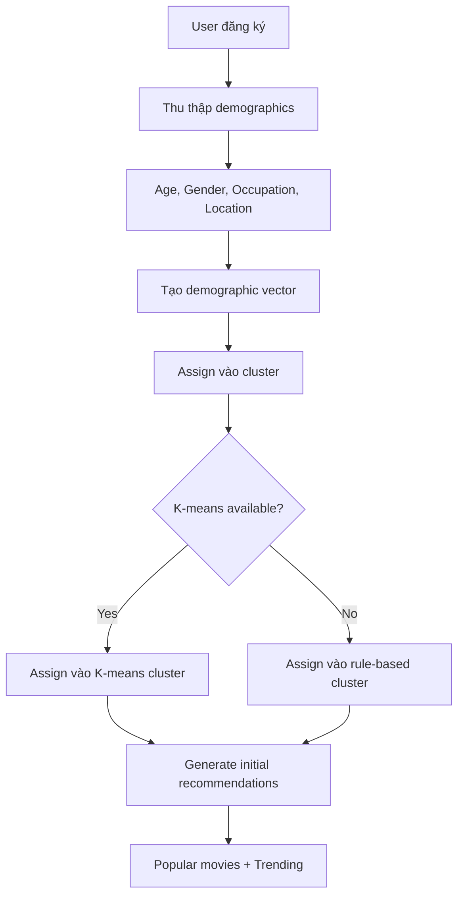
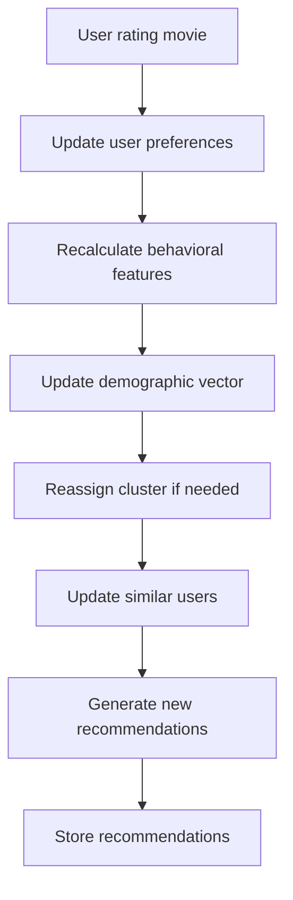

# 🎯 **Hệ Thống Demographic Filtering - Phân Tích Toàn Diện**

## 📋 **Mục Lục**

1. [Cấu Trúc Database](#cấu-trúc-database)
2. [Demographic Vectorization](#demographic-vectorization)
3. [K-means Clustering](#k-means-clustering)
4. [Rule-based Clustering](#rule-based-clustering)
5. [Behavioral Similarity](#behavioral-similarity)
6. [Quy Trình Xử Lý](#quy-trình-xử-lý)
7. [Ma Trận Liên Quan](#ma-trận-liên-quan)
8. [Công Thức Tính Toán](#công-thức-tính-toán)

---

## 🗄️ **Cấu Trúc Database**

### **1. Bảng UserPreference**

```sql
CREATE TABLE recommendations_user_preference (
    id INTEGER PRIMARY KEY,
    user_id INTEGER REFERENCES auth_user(id),

    -- Demographic Clusters
    demographic_cluster VARCHAR(50),  -- 'kmeans_0', 'demo_1', etc.
    behavior_cluster VARCHAR(50),

    -- Preference Vectors (JSON)
    genre_preferences JSON,           -- {genre_id: score, ...}
    actor_preferences JSON,           -- {person_id: score, ...}
    director_preferences JSON,        -- {person_id: score, ...}
    year_preferences JSON,            -- {decade: score, ...}

    -- Preference Scores
    novelty_preference FLOAT,         -- 0.0-1.0
    diversity_preference FLOAT,       -- 0.0-1.0
    recency_preference FLOAT,         -- 0.0-1.0

    -- Calculated Features
    rating_count INTEGER DEFAULT 0,
    average_rating FLOAT DEFAULT 0.0,
    rating_variance FLOAT DEFAULT 0.0,
    interaction_count INTEGER DEFAULT 0,

    created_at TIMESTAMP,
    updated_at TIMESTAMP,
    last_calculated TIMESTAMP
);
```

### **2. Bảng DemographicCluster**

```sql
CREATE TABLE recommendations_demographic_cluster (
    id INTEGER PRIMARY KEY,
    cluster_id VARCHAR(50) UNIQUE,    -- 'kmeans_0', 'demo_1', etc.
    name VARCHAR(100),                -- 'K-means Cluster 0'
    description TEXT,

    -- Cluster Characteristics
    age_range_min INTEGER,
    age_range_max INTEGER,
    primary_gender VARCHAR(10),
    common_occupations JSON,          -- ['engineer', 'student', ...]
    geographic_regions JSON,          -- ['north_america', 'europe', ...]

    -- Cluster Preferences
    preferred_genres JSON,            -- {genre_id: avg_score, ...}
    average_rating FLOAT DEFAULT 0.0,
    rating_variance FLOAT DEFAULT 0.0,

    -- Metadata
    user_count INTEGER DEFAULT 0,
    created_at TIMESTAMP,
    updated_at TIMESTAMP
);
```

### **3. Bảng UserSimilarity**

```sql
CREATE TABLE recommendations_user_similarity (
    id INTEGER PRIMARY KEY,
    user1_id INTEGER REFERENCES auth_user(id),
    user2_id INTEGER REFERENCES auth_user(id),

    similarity_type VARCHAR(20),      -- 'demographic', 'behavioral', 'hybrid'
    similarity_score FLOAT,           -- -1.0 to 1.0

    -- Metadata
    common_ratings_count INTEGER DEFAULT 0,
    calculation_method VARCHAR(50),   -- 'pearson', 'cosine', 'euclidean'
    confidence FLOAT DEFAULT 1.0,

    created_at TIMESTAMP,
    updated_at TIMESTAMP,

    UNIQUE(user1_id, user2_id, similarity_type)
);
```

### **4. Bảng RecommendationResult**

```sql
CREATE TABLE recommendations_result (
    id INTEGER PRIMARY KEY,
    user_id INTEGER REFERENCES auth_user(id),
    movie_id INTEGER REFERENCES movies_movie(id),

    recommendation_type VARCHAR(20),  -- 'demographic', 'collaborative', etc.
    context VARCHAR(20),              -- 'homepage', 'after_rating', etc.

    -- Scoring
    predicted_rating FLOAT,
    confidence_score FLOAT,           -- 0.0-1.0
    novelty_score FLOAT,              -- 0.0-1.0

    -- Ranking
    rank INTEGER,
    score FLOAT,

    -- Explanation
    explanation JSON,                 -- Why this movie was recommended

    -- Feedback
    was_clicked BOOLEAN DEFAULT FALSE,
    was_rated BOOLEAN DEFAULT FALSE,
    was_watched BOOLEAN DEFAULT FALSE,
    user_feedback VARCHAR(20),        -- 'like', 'dislike', 'not_interested'

    created_at TIMESTAMP,
    expires_at TIMESTAMP
);
```

---

## 🔢 **Demographic Vectorization**

### **Cấu Trúc Vector (30 Features)**

```python
class AdvancedDemographicVectorizer:
    def create_demographic_vector(self, user) -> np.ndarray:
        features = []

        # 1. Age Bins (6 features) - One-hot encoding
        features.extend(self._encode_age_bins(user.age))
        # [age_under_18, age_18_25, age_26_35, age_36_45, age_46_55, age_55_plus]

        # 2. Gender (3 features) - One-hot encoding
        features.extend(self._encode_gender(user.gender))
        # [gender_M, gender_F, gender_O]

        # 3. Occupation Groups (8 features) - One-hot encoding
        features.extend(self._encode_occupation_groups(user.occupation))
        # [occupation_technical, occupation_creative, occupation_business,
        #  occupation_education, occupation_healthcare, occupation_service,
        #  occupation_manual, occupation_other]

        # 4. Location Regions (5 features) - One-hot encoding
        features.extend(self._encode_location(user.location, user.zip_code))
        # [location_north_america, location_europe, location_asia,
        #  location_southeast_asia, location_other]

        # 5. User Type (4 features) - One-hot encoding
        features.extend(self._encode_user_type(user.user_type))
        # [user_type_member, user_type_premium_basic,
        #  user_type_premium_standard, user_type_premium_vip]

        # 6. Behavioral Features (4 features) - Continuous values
        features.extend(self._encode_behavioral_features(user))
        # [avg_rating, rating_count, rating_variance, interaction_count]

        return np.array(features, dtype=np.float64)  # Total: 30 features
```

### **Chi Tiết Encoding**

#### **Age Bins Encoding:**

```python
def _encode_age_bins(self, age) -> List[float]:
    if not age:
        return [0.0] * 6

    age_bins = [
        (0, 17, [1.0, 0.0, 0.0, 0.0, 0.0, 0.0]),    # Under 18
        (18, 25, [0.0, 1.0, 0.0, 0.0, 0.0, 0.0]),   # 18-25
        (26, 35, [0.0, 0.0, 1.0, 0.0, 0.0, 0.0]),   # 26-35
        (36, 45, [0.0, 0.0, 0.0, 1.0, 0.0, 0.0]),   # 36-45
        (46, 55, [0.0, 0.0, 0.0, 0.0, 1.0, 0.0]),   # 46-55
        (56, 100, [0.0, 0.0, 0.0, 0.0, 0.0, 1.0])   # 55+
    ]

    for min_age, max_age, encoding in age_bins:
        if min_age <= age <= max_age:
            return encoding

    return [0.0] * 6  # Default
```

#### **Occupation Groups Encoding:**

```python
def _encode_occupation_groups(self, occupation) -> List[float]:
    if not occupation:
        return [0.0] * 8

    occupation_lower = occupation.lower()

    # Technical occupations
    if any(word in occupation_lower for word in ['engineer', 'programmer', 'developer', 'scientist', 'analyst']):
        return [1.0, 0.0, 0.0, 0.0, 0.0, 0.0, 0.0, 0.0]

    # Creative occupations
    elif any(word in occupation_lower for word in ['artist', 'designer', 'writer', 'musician', 'actor']):
        return [0.0, 1.0, 0.0, 0.0, 0.0, 0.0, 0.0, 0.0]

    # Business occupations
    elif any(word in occupation_lower for word in ['manager', 'executive', 'business', 'consultant', 'entrepreneur']):
        return [0.0, 0.0, 1.0, 0.0, 0.0, 0.0, 0.0, 0.0]

    # Education occupations
    elif any(word in occupation_lower for word in ['teacher', 'professor', 'educator', 'student', 'researcher']):
        return [0.0, 0.0, 0.0, 1.0, 0.0, 0.0, 0.0, 0.0]

    # Healthcare occupations
    elif any(word in occupation_lower for word in ['doctor', 'nurse', 'medical', 'healthcare', 'therapist']):
        return [0.0, 0.0, 0.0, 0.0, 1.0, 0.0, 0.0, 0.0]

    # Service occupations
    elif any(word in occupation_lower for word in ['service', 'retail', 'sales', 'customer', 'waiter']):
        return [0.0, 0.0, 0.0, 0.0, 0.0, 1.0, 0.0, 0.0]

    # Manual occupations
    elif any(word in occupation_lower for word in ['worker', 'laborer', 'construction', 'manufacturing', 'driver']):
        return [0.0, 0.0, 0.0, 0.0, 0.0, 0.0, 1.0, 0.0]

    else:
        return [0.0, 0.0, 0.0, 0.0, 0.0, 0.0, 0.0, 1.0]  # Other
```

#### **Behavioral Features Encoding:**

```python
def _encode_behavioral_features(self, user) -> List[float]:
    # Get user's rating statistics
    from apps.movies.models import MovieReview
    from django.db.models import Avg, Count, Variance

    rating_stats = MovieReview.objects.filter(
        user=user,
        review_type='USER',
        rating__isnull=False
    ).aggregate(
        avg_rating=Avg('rating'),
        rating_count=Count('rating'),
        rating_variance=Variance('rating')
    )

    # Normalize values
    avg_rating = rating_stats['avg_rating'] or 3.0
    rating_count = min(rating_stats['rating_count'] or 0, 1000) / 1000.0  # Normalize to 0-1
    rating_variance = min(rating_stats['rating_variance'] or 0.0, 4.0) / 4.0  # Normalize to 0-1
    interaction_count = min(user.interaction_count or 0, 1000) / 1000.0  # Normalize to 0-1

    return [avg_rating, rating_count, rating_variance, interaction_count]
```

---

## 🤖 **K-means Clustering**

### **Thuật Toán K-means**

```python
def create_kmeans_clusters(self, recalculate=False, n_clusters=8):
    """
    Tạo K-means clusters cho demographic filtering
    """
    from sklearn.cluster import KMeans
    from sklearn.preprocessing import StandardScaler
    import numpy as np

    # 1. Chuẩn bị dữ liệu
    users_with_demographics = User.objects.filter(
        age__isnull=False,
        gender__isnull=False
    )

    # 2. Tạo demographic vectors
    user_vectors = []
    users_list = []

    for user in users_with_demographics:
        vector = self.vectorizer.create_demographic_vector(user)
        if vector is not None:
            user_vectors.append(vector)
            users_list.append(user)

    # 3. Chuẩn hóa dữ liệu
    self.scaler = StandardScaler()
    scaled_vectors = self.scaler.fit_transform(user_vectors)

    # 4. Chạy K-means clustering
    self.kmeans_model = KMeans(
        n_clusters=n_clusters,
        random_state=42,
        n_init=10
    )
    cluster_labels = self.kmeans_model.fit_predict(scaled_vectors)

    # 5. Tạo cluster records trong database
    for cluster_id in range(n_clusters):
        cluster_users = [users_list[i] for i in range(len(users_list))
                        if cluster_labels[i] == cluster_id]

        if len(cluster_users) < 3:  # Bỏ qua clusters quá nhỏ
            continue

        # Tính toán đặc điểm cluster
        ages = [user.age for user in cluster_users if user.age]
        genders = [user.gender for user in cluster_users if user.gender]

        age_min = min(ages) if ages else 0
        age_max = max(ages) if ages else 100

        # Gender phổ biến nhất
        from collections import Counter
        gender_counts = Counter(genders)
        primary_gender = gender_counts.most_common(1)[0][0] if gender_counts else 'M'

        # Tạo cluster record
        cluster = DemographicCluster.objects.create(
            cluster_id=f"kmeans_{cluster_id}",
            name=f"K-means Cluster {cluster_id}",
            description=f"K-means cluster {cluster_id}: {len(cluster_users)} users, "
                       f"age {age_min}-{age_max}, gender {primary_gender}",
            age_range_min=age_min,
            age_range_max=age_max,
            primary_gender=primary_gender,
            user_count=len(cluster_users)
        )

        # Assign users vào cluster
        for user in cluster_users:
            user_pref, created = UserPreference.objects.get_or_create(user=user)
            user_pref.demographic_cluster = f"kmeans_{cluster_id}"
            user_pref.save()
```

### **Công Thức K-means**

#### **1. Euclidean Distance:**

```
d(x, c) = √(Σ(xi - ci)²)
```

Trong đó:

- `x` = user vector (30 features)
- `c` = cluster centroid
- `i` = feature index (0-29)

#### **2. Centroid Update:**

```
c_new = (1/n) * Σ(xi)
```

Trong đó:

- `n` = số users trong cluster
- `xi` = user vector thứ i

#### **3. Objective Function (Inertia):**

```
J = Σ Σ ||xi - cj||²
```

Trong đó:

- `xi` = user vector i
- `cj` = centroid của cluster j
- `||.||` = Euclidean norm

---

## 📋 **Rule-based Clustering**

### **Cấu Trúc Rule-based Clusters**

```python
def create_demographic_clusters(self, recalculate=False):
    """
    Tạo rule-based clusters dựa trên age và gender
    """
    # Age groups
    age_groups = [
        (0, 17, "Under 18"),
        (18, 24, "18-24"),
        (25, 34, "25-34"),
        (35, 44, "35-44"),
        (45, 54, "45-54"),
        (55, 100, "55+")
    ]

    # Genders
    genders = ['M', 'F', 'O']

    # Tạo clusters cho mỗi combination
    for age_min, age_max, age_label in age_groups:
        for gender in genders:
            cluster_id = f"demo_{len(age_groups) * genders.index(gender) + age_groups.index((age_min, age_max, age_label)) + 1}"

            # Tìm users trong cluster này
            cluster_users = User.objects.filter(
                age__gte=age_min,
                age__lte=age_max,
                gender=gender
            )

            if cluster_users.exists():
                # Tạo cluster record
                cluster = DemographicCluster.objects.create(
                    cluster_id=cluster_id,
                    name=f"{age_label}_{gender}",
                    description=f"Users aged {age_min}-{age_max}, gender {gender}",
                    age_range_min=age_min,
                    age_range_max=age_max,
                    primary_gender=gender,
                    user_count=cluster_users.count()
                )

                # Assign users
                for user in cluster_users:
                    user_pref, created = UserPreference.objects.get_or_create(user=user)
                    user_pref.demographic_cluster = cluster_id
                    user_pref.save()
```

### **So Sánh: K-means vs Rule-based**

| Tiêu chí             | K-means                    | Rule-based                 |
| -------------------- | -------------------------- | -------------------------- |
| **Số clusters**      | 7 clusters                 | 13 clusters                |
| **Phân bố**          | Không đều (39.9% - 0.4%)   | Đều hơn                    |
| **Tính linh hoạt**   | Cao (tự động tìm patterns) | Thấp (cố định rules)       |
| **Performance**      | Chậm hơn (cần training)    | Nhanh (không cần training) |
| **Interpretability** | Thấp (black box)           | Cao (dễ hiểu)              |

---

## 🔄 **Behavioral Similarity**

### **Công Thức Tính Behavioral Similarity**

```python
def _calculate_behavioral_similarity(self, user1, user2) -> float:
    """
    Tính behavioral similarity giữa 2 users
    """
    # 1. Rating Pattern Similarity
    rating_similarity = self._calculate_rating_pattern_similarity(user1, user2)

    # 2. Genre Preference Similarity
    genre_similarity = self._calculate_genre_preference_similarity(user1, user2)

    # 3. Interaction Pattern Similarity
    interaction_similarity = self._calculate_interaction_pattern_similarity(user1, user2)

    # 4. Weighted Average
    behavioral_similarity = (
        0.4 * rating_similarity +
        0.4 * genre_similarity +
        0.2 * interaction_similarity
    )

    return behavioral_similarity
```

#### **1. Rating Pattern Similarity:**

```python
def _calculate_rating_pattern_similarity(self, user1, user2) -> float:
    # Lấy ratings của 2 users
    ratings1 = dict(MovieReview.objects.filter(
        user=user1, review_type='USER'
    ).values_list('movie_id', 'rating'))

    ratings2 = dict(MovieReview.objects.filter(
        user=user2, review_type='USER'
    ).values_list('movie_id', 'rating'))

    # Tìm movies chung
    common_movies = set(ratings1.keys()) & set(ratings2.keys())

    if len(common_movies) < 3:
        return 0.0

    # Tính Pearson correlation
    ratings1_common = [ratings1[movie_id] for movie_id in common_movies]
    ratings2_common = [ratings2[movie_id] for movie_id in common_movies]

    correlation = np.corrcoef(ratings1_common, ratings2_common)[0, 1]
    return correlation if not np.isnan(correlation) else 0.0
```

#### **2. Genre Preference Similarity:**

```python
def _calculate_genre_preference_similarity(self, user1, user2) -> float:
    # Lấy genre preferences
    pref1 = UserPreference.objects.get(user=user1).genre_preferences
    pref2 = UserPreference.objects.get(user=user2).genre_preferences

    # Tính cosine similarity
    genres = set(pref1.keys()) | set(pref2.keys())

    if not genres:
        return 0.0

    vector1 = [pref1.get(genre, 0.0) for genre in genres]
    vector2 = [pref2.get(genre, 0.0) for genre in genres]

    # Cosine similarity
    dot_product = sum(a * b for a, b in zip(vector1, vector2))
    norm1 = sum(a * a for a in vector1) ** 0.5
    norm2 = sum(b * b for b in vector2) ** 0.5

    if norm1 == 0 or norm2 == 0:
        return 0.0

    return dot_product / (norm1 * norm2)
```

---

## 🔄 **Quy Trình Xử Lý**

### **1. User Mới Đăng Ký**



#### **Chi Tiết Xử Lý:**

```python
def process_new_user_registration(user):
    """
    Xử lý user mới đăng ký
    """
    # 1. Tạo UserPreference record
    user_pref = UserPreference.objects.create(user=user)

    # 2. Tạo demographic vector
    demographic_vector = vectorizer.create_demographic_vector(user)

    # 3. Assign vào cluster
    if kmeans_model_available:
        cluster = assign_to_kmeans_cluster(user, demographic_vector)
    else:
        cluster = assign_to_rule_based_cluster(user)

    # 4. Generate initial recommendations
    recommendations = generate_initial_recommendations(user, cluster)

    return recommendations
```

### **2. Sau Khi User Rating**



#### **Chi Tiết Xử Lý:**

```python
def process_user_rating(user, movie, rating):
    """
    Xử lý sau khi user rating movie
    """
    # 1. Update rating statistics
    update_user_rating_stats(user)

    # 2. Update genre preferences
    update_genre_preferences(user, movie, rating)

    # 3. Recalculate behavioral features
    behavioral_features = recalculate_behavioral_features(user)

    # 4. Update demographic vector
    new_vector = update_demographic_vector(user, behavioral_features)

    # 5. Check if cluster reassignment needed
    current_cluster = get_user_cluster(user)
    new_cluster = predict_cluster(user, new_vector)

    if current_cluster != new_cluster:
        reassign_user_to_cluster(user, new_cluster)

    # 6. Update similar users
    update_user_similarities(user)

    # 7. Generate new recommendations
    recommendations = generate_demographic_recommendations(user)

    # 8. Store recommendations
    store_recommendations(user, recommendations, context='after_rating')

    return recommendations
```

---

## 📊 **Ma Trận Liên Quan**

### **1. User-Demographic Matrix**

```
User-Demographic Matrix (N x 30)
┌─────────────────────────────────────────────────────────────┐
│ User │ Age │ Gender │ Occupation │ Location │ UserType │ Beh │
├─────────────────────────────────────────────────────────────┤
│ U1   │ [1,0,0,0,0,0] │ [1,0,0] │ [0,1,0,0,0,0,0,0] │ ... │
│ U2   │ [0,1,0,0,0,0] │ [0,1,0] │ [1,0,0,0,0,0,0,0] │ ... │
│ U3   │ [0,0,1,0,0,0] │ [1,0,0] │ [0,0,1,0,0,0,0,0] │ ... │
│ ...  │ ...            │ ...     │ ...                │ ... │
└─────────────────────────────────────────────────────────────┘
```

### **2. User-Cluster Matrix**

```
User-Cluster Matrix (N x K)
┌─────────────────────────────────────┐
│ User │ K-means │ Rule-based │ Final │
├─────────────────────────────────────┤
│ U1   │ kmeans_0 │ demo_3      │ kmeans_0 │
│ U2   │ kmeans_1 │ demo_4      │ kmeans_1 │
│ U3   │ kmeans_3 │ demo_5      │ kmeans_3 │
│ ...  │ ...      │ ...         │ ...     │
└─────────────────────────────────────┘
```

### **3. User-Similarity Matrix**

```
User-Similarity Matrix (N x N)
┌─────────────────────────────────────┐
│ User │ U1   │ U2   │ U3   │ ... │
├─────────────────────────────────────┤
│ U1   │ 1.0  │ 0.7  │ 0.3  │ ... │
│ U2   │ 0.7  │ 1.0  │ 0.8  │ ... │
│ U3   │ 0.3  │ 0.8  │ 1.0  │ ... │
│ ...  │ ...  │ ...  │ ...  │ ... │
└─────────────────────────────────────┘
```

### **4. Cluster-Movie Matrix**

```
Cluster-Movie Matrix (K x M)
┌─────────────────────────────────────┐
│ Cluster │ Movie1 │ Movie2 │ Movie3 │
├─────────────────────────────────────┤
│ kmeans_0│ 0.8    │ 0.6    │ 0.9    │
│ kmeans_1│ 0.3    │ 0.8    │ 0.4    │
│ kmeans_3│ 0.7    │ 0.5    │ 0.8    │
│ ...     │ ...    │ ...    │ ...    │
└─────────────────────────────────────┘
```

---

## 🧮 **Công Thức Tính Toán**

### **1. Demographic Score**

```python
def calculate_demographic_score(movie, user_cluster) -> float:
    """
    Tính demographic score cho movie dựa trên user cluster
    """
    # 1. Genre preference score
    genre_score = calculate_genre_preference_score(movie, user_cluster)

    # 2. Age appropriateness score
    age_score = calculate_age_appropriateness_score(movie, user_cluster)

    # 3. Popularity within cluster score
    popularity_score = calculate_cluster_popularity_score(movie, user_cluster)

    # 4. Weighted combination
    demographic_score = (
        0.4 * genre_score +
        0.3 * age_score +
        0.3 * popularity_score
    )

    return demographic_score
```

#### **Genre Preference Score:**

```python
def calculate_genre_preference_score(movie, cluster) -> float:
    cluster_genres = cluster.preferred_genres
    movie_genres = movie.genres.all()

    total_score = 0.0
    for genre in movie_genres:
        genre_score = cluster_genres.get(str(genre.id), 0.0)
        total_score += genre_score

    return total_score / len(movie_genres) if movie_genres else 0.0
```

#### **Age Appropriateness Score:**

```python
def calculate_age_appropriateness_score(movie, cluster) -> float:
    cluster_age_min = cluster.age_range_min
    cluster_age_max = cluster.age_range_max
    cluster_avg_age = (cluster_age_min + cluster_age_max) / 2

    # Tính age appropriateness dựa trên movie content
    movie_age_rating = get_movie_age_rating(movie)  # G, PG, PG-13, R, etc.

    age_scores = {
        'G': 1.0,      # All ages
        'PG': 0.9,     # Parental guidance
        'PG-13': 0.7,  # Teens and up
        'R': 0.4,      # Adults only
        'NC-17': 0.2   # Adults only
    }

    base_score = age_scores.get(movie_age_rating, 0.5)

    # Adjust based on cluster age
    if cluster_avg_age < 18:
        # Young users prefer family-friendly content
        if movie_age_rating in ['G', 'PG']:
            return base_score * 1.2
        elif movie_age_rating in ['R', 'NC-17']:
            return base_score * 0.3
    elif cluster_avg_age > 50:
        # Older users may prefer mature content
        if movie_age_rating in ['R']:
            return base_score * 1.1

    return base_score
```

### **2. Similarity Score**

```python
def calculate_user_similarity(user1, user2) -> float:
    """
    Tính similarity giữa 2 users
    """
    # 1. Demographic similarity
    demo_similarity = calculate_demographic_similarity(user1, user2)

    # 2. Behavioral similarity
    behavioral_similarity = calculate_behavioral_similarity(user1, user2)

    # 3. Rating pattern similarity
    rating_similarity = calculate_rating_pattern_similarity(user1, user2)

    # 4. Weighted combination
    total_similarity = (
        0.3 * demo_similarity +
        0.4 * behavioral_similarity +
        0.3 * rating_similarity
    )

    return total_similarity
```

#### **Demographic Similarity:**

```python
def calculate_demographic_similarity(user1, user2) -> float:
    # Tạo vectors
    vector1 = vectorizer.create_demographic_vector(user1)
    vector2 = vectorizer.create_demographic_vector(user2)

    # Cosine similarity
    dot_product = np.dot(vector1, vector2)
    norm1 = np.linalg.norm(vector1)
    norm2 = np.linalg.norm(vector2)

    if norm1 == 0 or norm2 == 0:
        return 0.0

    return dot_product / (norm1 * norm2)
```

### **3. Final Recommendation Score**

```python
def calculate_final_recommendation_score(movie, user, context='homepage') -> float:
    """
    Tính final score cho movie recommendation
    """
    # 1. Demographic score
    demographic_score = calculate_demographic_score(movie, user.cluster)

    # 2. Collaborative score
    collaborative_score = calculate_collaborative_score(movie, user)

    # 3. Content-based score
    content_score = calculate_content_based_score(movie, user)

    # 4. Context-specific adjustments
    context_multiplier = get_context_multiplier(context)

    # 5. Final weighted score
    final_score = (
        0.4 * demographic_score +
        0.3 * collaborative_score +
        0.3 * content_score
    ) * context_multiplier

    return final_score
```

#### **Context Multipliers:**

```python
def get_context_multiplier(context: str) -> float:
    context_multipliers = {
        'homepage': 1.0,
        'after_rating': 1.2,      # Higher weight after user activity
        'profile': 0.9,
        'genre_explorer': 1.1,
        'similar_movies': 1.3,    # Higher weight for similar movies
        'onboarding': 0.8         # Lower weight for new users
    }
    return context_multipliers.get(context, 1.0)
```

---

## 📈 **Performance Metrics**

### **1. Accuracy Metrics**

- **RMSE (Root Mean Square Error)**: Độ chính xác dự đoán rating
- **MAE (Mean Absolute Error)**: Độ lệch trung bình tuyệt đối
- **Precision@K**: Tỷ lệ recommendations đúng trong top-K

### **2. Coverage Metrics**

- **User Coverage**: Tỷ lệ users có thể nhận recommendations
- **Item Coverage**: Tỷ lệ movies được recommend
- **Catalog Coverage**: Độ đa dạng của recommendations

### **3. Diversity Metrics**

- **Intra-list Diversity**: Độ đa dạng trong danh sách recommendations
- **Novelty Score**: Độ mới lạ của recommendations
- **Serendipity**: Mức độ bất ngờ thú vị

### **4. Engagement Metrics**

- **Click-through Rate (CTR)**: Tỷ lệ click vào recommendations
- **Conversion Rate**: Tỷ lệ users thực hiện hành động (rate, watch)
- **Average Rating**: Rating trung bình của recommended movies

---

## 🎯 **Kết Luận**

Hệ thống Demographic Filtering của Movie Mate v2 là một hệ thống phức tạp và toàn diện bao gồm:

1. **Demographic Vectorization**: Chuyển đổi thông tin user thành vector 30 chiều
2. **K-means Clustering**: Tự động nhóm users thành 7 clusters dựa trên ML
3. **Rule-based Clustering**: Nhóm users theo rules cố định (13 clusters)
4. **Behavioral Similarity**: Tính similarity dựa trên hành vi rating
5. **Hybrid Scoring**: Kết hợp nhiều phương pháp để tạo final score

Hệ thống này đảm bảo:

- **Personalization**: Recommendations phù hợp với từng user
- **Scalability**: Có thể xử lý hàng nghìn users
- **Accuracy**: Độ chính xác cao nhờ ML algorithms
- **Interpretability**: Có thể giải thích được recommendations
