# Admin Management System - Use Case Diagram

## Tổng quan

Nhóm chức năng quản trị hệ thống bao gồm các tính năng quản lý nội dung, người dùng, phân tích dữ liệu và cấu hình hệ thống dành cho admin.

## Actors

- **Admin** - Quản trị viên hệ thống
- **Moderator** - Người kiểm duyệt nội dung
- **Analytics System** - Hệ thống phân tích dữ liệu
- **External APIs** - TMDB, IMDB APIs

## Use Case Diagram

```mermaid
graph TB
    %% Actors
    AD[Admin]
    MO[Moderator]
    AS[Analytics System]
    EA[External APIs]

    %% Movie Management Use Cases
    AD --> UC1[Movie Management]
    AD --> UC2[Movie Enrichment]
    AD --> UC3[Production Metrics]
    AD --> UC4[Visibility Control]
    AD --> UC5[Scheduling Management]
    AD --> UC6[Quality Metrics]
    AD --> UC7[Bulk Movie Operations]
    AD --> UC8[Movie Import/Export]

    %% User Management Use Cases
    AD --> UC9[User Management]
    AD --> UC10[User Analytics]
    AD --> UC11[User Permissions]
    AD --> UC12[User Activity Logs]
    AD --> UC13[Ban/Suspend Users]
    AD --> UC14[User Demographics]

    %% Content Management Use Cases
    AD --> UC15[Content Analytics]
    AD --> UC16[Content Moderation]
    AD --> UC17[Content Quality Control]
    AD --> UC18[Content Scheduling]
    AD --> UC19[Content Performance]

    %% System Management Use Cases
    AD --> UC20[System Overview Dashboard]
    AD --> UC21[System Settings]
    AD --> UC22[System Monitoring]
    AD --> UC23[Performance Optimization]
    AD --> UC24[Backup & Recovery]
    AD --> UC25[System Logs]

    %% Analytics Use Cases
    AD --> UC26[Trending Analytics]
    AD --> UC27[User Interaction Analytics]
    AD --> UC28[Real-time Charts]
    AD --> UC29[Advanced Admin Filters]
    AD --> UC30[Auto Processing Status]
    AD --> UC31[Revenue Analytics]

    %% External Integration Use Cases
    EA --> UC32[Sync Movie Data]
    EA --> UC33[Update Movie Ratings]
    EA --> UC34[Import Movie Metadata]
    EA --> UC35[Sync Cast Information]

    %% Analytics System Use Cases
    AS --> UC36[Generate Analytics Reports]
    AS --> UC37[Calculate Performance Metrics]
    AS --> UC38[Track User Behavior]
    AS --> UC39[Monitor System Health]

    %% Include Relationships
    UC1 -.-> UC2
    UC1 -.-> UC3
    UC1 -.-> UC4
    UC1 -.-> UC5
    UC1 -.-> UC6
    UC9 -.-> UC10
    UC9 -.-> UC11
    UC9 -.-> UC12
    UC15 -.-> UC16
    UC15 -.-> UC17
    UC20 -.-> UC21
    UC20 -.-> UC22
    UC26 -.-> UC27
    UC26 -.-> UC28
    UC32 -.-> UC33
    UC32 -.-> UC34

    %% Extend Relationships
    UC1 -.-> UC7
    UC1 -.-> UC8
    UC9 -.-> UC13
    UC9 -.-> UC14
    UC15 -.-> UC18
    UC15 -.-> UC19
    UC20 -.-> UC23
    UC20 -.-> UC24
    UC20 -.-> UC25
    UC26 -.-> UC29
    UC26 -.-> UC30
    UC26 -.-> UC31

    %% Style
    classDef actor fill:#e1f5fe,stroke:#01579b,stroke-width:2px
    classDef useCase fill:#f3e5f5,stroke:#4a148c,stroke-width:2px
    classDef include fill:#fff3e0,stroke:#e65100,stroke-width:1px
    classDef extend fill:#e8f5e8,stroke:#1b5e20,stroke-width:1px

    class AD,MO,AS,EA actor
    class UC1,UC2,UC3,UC4,UC5,UC6,UC7,UC8,UC9,UC10,UC11,UC12,UC13,UC14,UC15,UC16,UC17,UC18,UC19,UC20,UC21,UC22,UC23,UC24,UC25,UC26,UC27,UC28,UC29,UC30,UC31,UC32,UC33,UC34,UC35,UC36,UC37,UC38,UC39 useCase
```



## Chi tiết các Use Case

### UC1: Movie Management

**Actor**: Admin
**Preconditions**: Admin đã đăng nhập
**Main Flow**:

1. Admin truy cập movie management dashboard
2. Admin xem danh sách tất cả phim
3. Admin có thể thêm/sửa/xóa phim
4. Admin có thể bulk actions
5. Admin có thể filter và search

**Alternative Flow**:

- Lỗi database → Hiển thị thông báo lỗi
- Quá nhiều phim → Phân trang

**Postconditions**: Phim được quản lý thành công

### UC2: Movie Enrichment

**Actor**: Admin
**Preconditions**: Admin đang quản lý phim
**Main Flow**:

1. Admin chọn phim cần enrichment
2. Admin chạy enrichment process
3. Hệ thống gọi external APIs
4. Cập nhật thông tin phim
5. Hiển thị kết quả enrichment

**Alternative Flow**:

- API lỗi → Hiển thị thông báo lỗi
- Không tìm thấy data → Báo cáo không có data

**Postconditions**: Thông tin phim được bổ sung

### UC3: Production Metrics

**Actor**: Admin
**Preconditions**: Admin đã đăng nhập
**Main Flow**:

1. Admin truy cập production metrics
2. Hệ thống hiển thị performance metrics
3. Admin có thể xem theo thời gian
4. Admin có thể export reports
5. Admin có thể set alerts

**Alternative Flow**:

- Không có data → Hiển thị thông báo
- Metrics thấp → Hiển thị cảnh báo

**Postconditions**: Admin thấy metrics sản xuất

### UC4: Visibility Control

**Actor**: Admin
**Preconditions**: Admin có quyền control
**Main Flow**:

1. Admin xem visibility settings
2. Admin có thể publish/unpublish content
3. Admin có thể set featured content
4. Admin có thể control access levels
5. Admin có thể schedule visibility

**Alternative Flow**:

- Content đang được xem → Cảnh báo trước khi ẩn
- Lỗi permission → Hiển thị thông báo

**Postconditions**: Visibility được kiểm soát

### UC5: Scheduling Management

**Actor**: Admin
**Preconditions**: Admin có quyền scheduling
**Main Flow**:

1. Admin tạo lịch trình cho content
2. Admin set publish/unpublish dates
3. Admin có thể recurring schedules
4. Hệ thống tự động thực hiện theo lịch
5. Admin có thể monitor schedule status

**Alternative Flow**:

- Conflict schedule → Hiển thị cảnh báo
- Schedule lỗi → Gửi notification

**Postconditions**: Content được lên lịch

### UC9: User Management

**Actor**: Admin
**Preconditions**: Admin có quyền quản lý user
**Main Flow**:

1. Admin xem danh sách users
2. Admin có thể view user details
3. Admin có thể suspend/ban users
4. Admin có thể change user permissions
5. Admin có thể reset user passwords

**Alternative Flow**:

- User đang online → Cảnh báo trước khi ban
- Permission conflict → Hiển thị lỗi

**Postconditions**: Users được quản lý

### UC10: User Analytics

**Actor**: Admin
**Preconditions**: Admin đã đăng nhập
**Main Flow**:

1. Admin truy cập user analytics
2. Hệ thống hiển thị user metrics
3. Admin có thể xem user behavior
4. Admin có thể track user growth
5. Admin có thể export user reports

**Alternative Flow**:

- Không có user data → Hiển thị thông báo
- Anomaly detected → Hiển thị alert

**Postconditions**: Admin thấy thống kê user

### UC13: Ban/Suspend Users

**Actor**: Admin
**Preconditions**: Admin đang quản lý user
**Main Flow**:

1. Admin chọn user cần ban/suspend
2. Admin chọn loại action (ban/suspend)
3. Admin set thời gian (permanent/temporary)
4. Admin có thể thêm lý do
5. Hệ thống thực hiện action

**Alternative Flow**:

- User là admin → Không cho phép ban
- User đang có active session → Force logout

**Postconditions**: User bị ban/suspend

### UC15: Content Analytics

**Actor**: Admin
**Preconditions**: Admin đã đăng nhập
**Main Flow**:

1. Admin truy cập content analytics
2. Hệ thống hiển thị content metrics
3. Admin có thể xem content performance
4. Admin có thể track content engagement
5. Admin có thể identify trending content

**Alternative Flow**:

- Không có content data → Hiển thị thông báo
- Content performance thấp → Hiển thị cảnh báo

**Postconditions**: Admin thấy thống kê nội dung

### UC20: System Overview Dashboard

**Actor**: Admin
**Preconditions**: Admin đã đăng nhập
**Main Flow**:

1. Admin truy cập system dashboard
2. Hệ thống hiển thị system metrics
3. Admin có thể xem real-time data
4. Admin có thể monitor system health
5. Admin có thể access quick actions

**Alternative Flow**:

- System lỗi → Hiển thị error page
- Metrics bất thường → Hiển thị alerts

**Postconditions**: Admin thấy trạng thái hệ thống

### UC21: System Settings

**Actor**: Admin
**Preconditions**: Admin có quyền cấu hình
**Main Flow**:

1. Admin truy cập system settings
2. Admin có thể cấu hình các tham số
3. Admin có thể set environment variables
4. Admin có thể configure integrations
5. Admin có thể save settings

**Alternative Flow**:

- Setting không hợp lệ → Hiển thị lỗi
- Setting ảnh hưởng system → Cảnh báo

**Postconditions**: System settings được cập nhật

### UC26: Trending Analytics

**Actor**: Admin
**Preconditions**: Admin đã đăng nhập
**Main Flow**:

1. Admin truy cập trending analytics
2. Hệ thống hiển thị trending data
3. Admin có thể xem trending movies
4. Admin có thể track trending topics
5. Admin có thể predict trends

**Alternative Flow**:

- Không có trending data → Hiển thị thông báo
- Trend bất thường → Hiển thị alert

**Postconditions**: Admin thấy trending analytics

### UC27: User Interaction Analytics

**Actor**: Admin
**Preconditions**: Admin đã đăng nhập
**Main Flow**:

1. Admin truy cập user interaction analytics
2. Hệ thống hiển thị interaction metrics
3. Admin có thể track user behavior
4. Admin có thể analyze user patterns
5. Admin có thể optimize user experience

**Alternative Flow**:

- Không có interaction data → Hiển thị thông báo
- Interaction thấp → Hiển thị cảnh báo

**Postconditions**: Admin thấy user interaction analytics

### UC32: Sync Movie Data

**Actor**: External APIs
**Preconditions**: Có kết nối với external APIs
**Main Flow**:

1. Hệ thống gọi TMDB/IMDB APIs
2. APIs trả về movie data
3. Hệ thống validate data
4. Hệ thống update database
5. Hệ thống log sync results

**Alternative Flow**:

- API lỗi → Retry mechanism
- Data không hợp lệ → Skip và log

**Postconditions**: Movie data được đồng bộ

### UC36: Generate Analytics Reports

**Actor**: Analytics System
**Preconditions**: Có data để phân tích
**Main Flow**:

1. Analytics system collect data
2. System process và analyze data
3. System generate reports
4. System format reports
5. System deliver reports

**Alternative Flow**:

- Không đủ data → Generate partial report
- Processing lỗi → Retry và notify

**Postconditions**: Analytics reports được tạo

## Database Models liên quan

```python
# Movie Admin Control
class MovieAdminControl(models.Model):
    movie = models.OneToOneField(Movie, on_delete=models.CASCADE)
    approval_status = models.CharField(max_length=20, choices=APPROVAL_STATUS_CHOICES)
    visibility_status = models.CharField(max_length=20, choices=VISIBILITY_STATUS_CHOICES)
    admin_featured = models.BooleanField(default=False)
    admin_priority = models.IntegerField(default=0)
    approved_by = models.ForeignKey(User, on_delete=models.SET_NULL, null=True)
    approved_at = models.DateTimeField(null=True, blank=True)
    created_at = models.DateTimeField(auto_now_add=True)
    updated_at = models.DateTimeField(auto_now=True)

# Movie Scheduling
class MovieScheduling(models.Model):
    movie = models.OneToOneField(Movie, on_delete=models.CASCADE)
    publish_date = models.DateTimeField(null=True, blank=True)
    unpublish_date = models.DateTimeField(null=True, blank=True)
    featured_from = models.DateTimeField(null=True, blank=True)
    featured_until = models.DateTimeField(null=True, blank=True)
    auto_publish = models.BooleanField(default=False)
    auto_unpublish = models.BooleanField(default=False)
    next_scheduled_action = models.CharField(max_length=50, null=True, blank=True)
    next_action_date = models.DateTimeField(null=True, blank=True)
    created_at = models.DateTimeField(auto_now_add=True)
    updated_at = models.DateTimeField(auto_now=True)

# Production Metrics
class MovieProductionMetrics(models.Model):
    movie = models.OneToOneField(Movie, on_delete=models.CASCADE)
    homepage_views = models.IntegerField(default=0)
    detail_page_views = models.IntegerField(default=0)
    trailer_plays = models.IntegerField(default=0)
    click_through_rate = models.DecimalField(max_digits=5, decimal_places=2, default=0)
    engagement_rate = models.DecimalField(max_digits=5, decimal_places=2, default=0)
    performance_score = models.DecimalField(max_digits=4, decimal_places=2, default=0)
    trending_score = models.DecimalField(max_digits=4, decimal_places=2, default=0)
    trending_category = models.CharField(max_length=20, choices=TRENDING_CATEGORIES)
    review_count = models.IntegerField(default=0)
    user_favorites_count = models.IntegerField(default=0)
    user_watchlist_count = models.IntegerField(default=0)
    last_interaction_date = models.DateTimeField(null=True, blank=True)
    created_at = models.DateTimeField(auto_now_add=True)
    updated_at = models.DateTimeField(auto_now=True)

# Quality Metrics
class MovieQualityMetrics(models.Model):
    movie = models.OneToOneField(Movie, on_delete=models.CASCADE)
    quality_score = models.DecimalField(max_digits=3, decimal_places=1, null=True, blank=True)
    content_completeness = models.DecimalField(max_digits=5, decimal_places=2, default=0)
    minimum_quality_met = models.BooleanField(default=True)
    basic_info_score = models.DecimalField(max_digits=3, decimal_places=1, default=0)
    visual_assets_score = models.DecimalField(max_digits=3, decimal_places=1, default=0)
    metadata_richness_score = models.DecimalField(max_digits=3, decimal_places=1, default=0)
    rating_validity_score = models.DecimalField(max_digits=3, decimal_places=1, default=0)
    quality_issues = models.JSONField(default=list, blank=True)
    quality_suggestions = models.JSONField(default=list, blank=True)
    last_quality_check = models.DateTimeField(null=True, blank=True)
    created_at = models.DateTimeField(auto_now_add=True)
    updated_at = models.DateTimeField(auto_now=True)

# User Activity Log
class UserActivityLog(models.Model):
    user = models.ForeignKey(User, on_delete=models.CASCADE)
    activity_type = models.CharField(max_length=50)
    activity_data = models.JSONField()
    ip_address = models.GenericIPAddressField()
    user_agent = models.TextField()
    created_at = models.DateTimeField(auto_now_add=True)

# System Log
class SystemLog(models.Model):
    log_level = models.CharField(max_length=20, choices=LOG_LEVELS)
    message = models.TextField()
    module = models.CharField(max_length=100)
    function = models.CharField(max_length=100)
    line_number = models.IntegerField()
    stack_trace = models.TextField(blank=True, null=True)
    created_at = models.DateTimeField(auto_now_add=True)
```

## API Endpoints

```
# Movie Management
GET  /api/admin/movies/
POST /api/admin/movies/
PUT  /api/admin/movies/{id}/
DELETE /api/admin/movies/{id}/
POST /api/admin/movies/bulk-actions/
POST /api/admin/movies/{id}/enrich/
GET  /api/admin/movies/{id}/metrics/

# User Management
GET  /api/admin/users/
PUT  /api/admin/users/{id}/
POST /api/admin/users/{id}/suspend/
POST /api/admin/users/{id}/ban/
GET  /api/admin/users/{id}/activity/
GET  /api/admin/users/analytics/

# Content Management
GET  /api/admin/content/analytics/
GET  /api/admin/content/moderation/
POST /api/admin/content/bulk-actions/
GET  /api/admin/content/performance/

# System Management
GET  /api/admin/system/overview/
GET  /api/admin/system/settings/
PUT  /api/admin/system/settings/
GET  /api/admin/system/logs/
GET  /api/admin/system/health/

# Analytics
GET  /api/admin/analytics/trending/
GET  /api/admin/analytics/user-interactions/
GET  /api/admin/analytics/revenue/
GET  /api/admin/analytics/reports/
POST /api/admin/analytics/export/
```

## Admin Dashboard Features

### Real-time Monitoring

- System health indicators
- User activity tracking
- Content performance metrics
- Error rate monitoring

### Advanced Analytics

- User behavior analysis
- Content engagement tracking
- Revenue analytics
- Predictive analytics

### Bulk Operations

- Mass content updates
- Batch user management
- Bulk data import/export
- Automated workflows

### Security & Compliance

- Access control management
- Audit trail tracking
- Data privacy controls
- Compliance reporting
