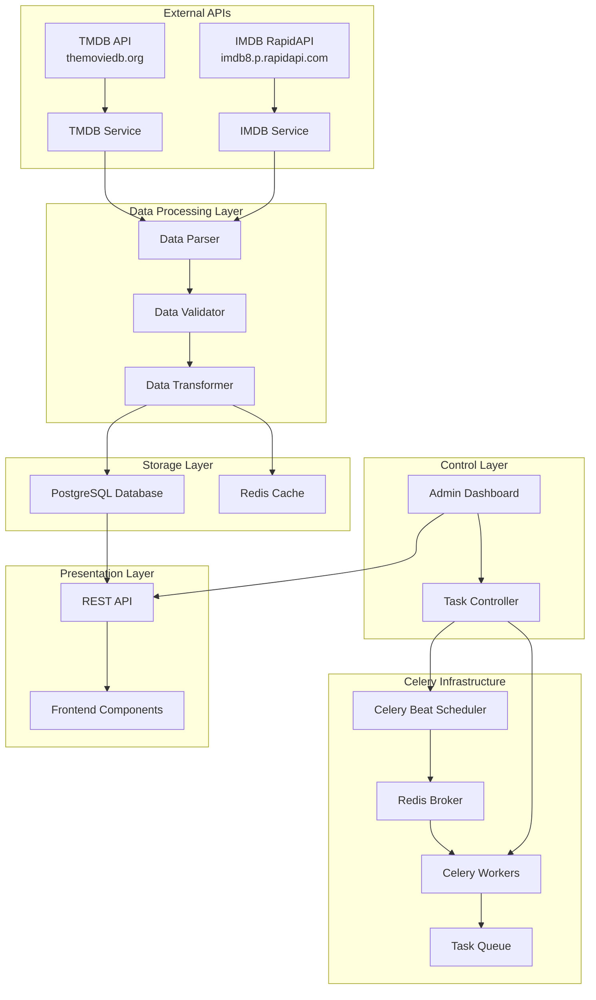
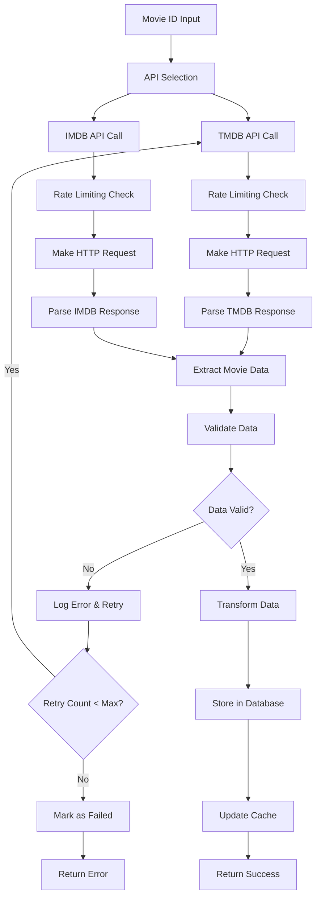
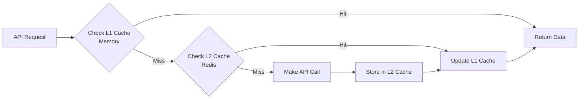
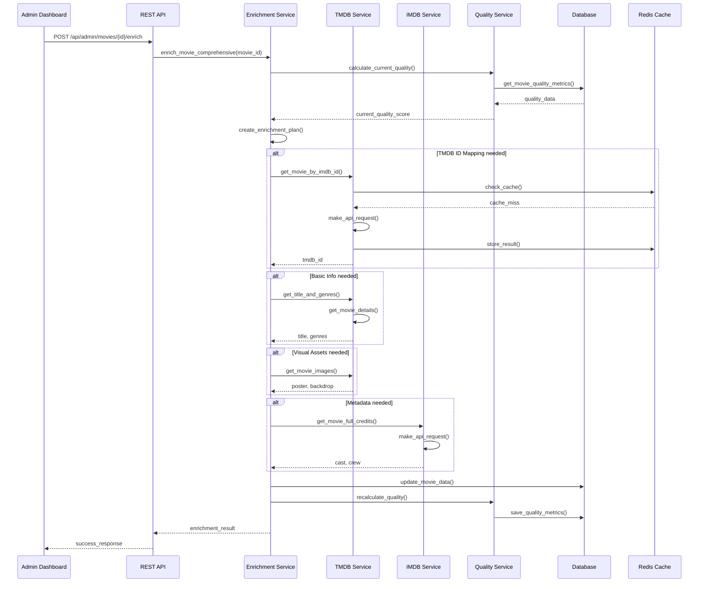
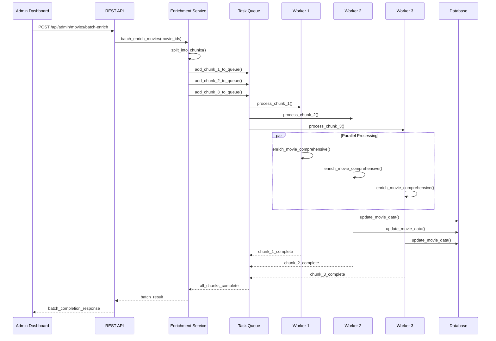
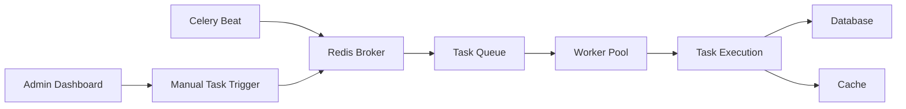
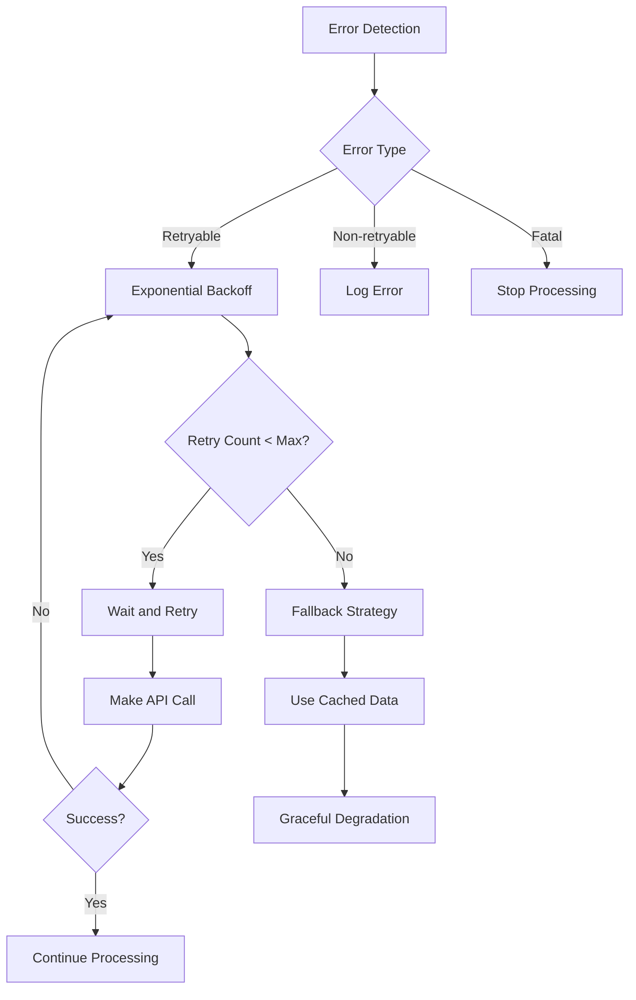

# BÁO CÁO CHỨC NĂNG RÚT TRÍCH THÔNG TIN PHIM TỪ API

## Hệ thống Movie Recommendation - Khóa luận tốt nghiệp

---

## MỤC LỤC

1. [Tổng quan lý thuyết](#1-tổng-quan-lý-thuyết)
2. [Kiến trúc hệ thống](#2-kiến-trúc-hệ-thống)
3. [Sequence Diagram](#3-sequence-diagram)
4. [Các thành phần chính](#4-các-thành-phần-chính)
5. [Celery Tasks](#5-celery-tasks)
6. [Các loại dữ liệu được rút trích](#6-các-loại-dữ-liệu-được-rút-trích)
7. [Cơ chế xử lý lỗi](#7-cơ-chế-xử-lý-lỗi)
8. [Tối ưu hiệu suất](#8-tối-ưu-hiệu-suất)
9. [Kết luận](#9-kết-luận)

---

## 1. TỔNG QUAN LÝ THUYẾT

### 1.1 Khái niệm cơ bản

Chức năng rút trích thông tin phim từ API là quá trình tự động thu thập dữ liệu phim từ các nguồn API bên ngoài và lưu trữ vào cơ sở dữ liệu nội bộ. Đây là bước đầu tiên trong pipeline xử lý dữ liệu phim, tạo nền tảng cho hệ thống gợi ý phim thông minh.

**Định nghĩa:**

- **API Extraction**: Quá trình gọi các API bên ngoài để lấy thông tin phim
- **Data Processing**: Xử lý và chuyển đổi dữ liệu từ response JSON về định dạng chuẩn
- **Data Storage**: Lưu trữ dữ liệu đã xử lý vào database nội bộ

### 1.2 Nguyên lý hoạt động

Hệ thống hoạt động theo nguyên tắc **ETL (Extract, Transform, Load)**:

1. **Extract (Rút trích)**: Gọi API bên ngoài để lấy dữ liệu thô
2. **Transform (Chuyển đổi)**: Xử lý và validate dữ liệu
3. **Load (Tải)**: Lưu trữ dữ liệu đã xử lý vào database

### 1.3 Các nguồn API chính

- **TMDB API**: Cung cấp metadata phong phú, poster, backdrop, cast information
- **IMDB RapidAPI**: Cung cấp thông tin chi tiết, ratings, release dates

---

## 2. KIẾN TRÚC HỆ THỐNG

### 2.1 Sơ đồ kiến trúc tổng thể



### 2.2 Sơ đồ luồng dữ liệu



### 2.3 Sơ đồ caching strategy



---

## 3. SEQUENCE DIAGRAM

### 3.1 Quy trình rút trích toàn diện



### 3.2 Quy trình batch processing



---

## 4. CÁC THÀNH PHẦN CHÍNH

### 4.1 TMDB Service

**Chức năng chính:**

- Rút trích metadata phong phú từ TMDB API
- Hỗ trợ đa ngôn ngữ (EN/VI)
- Quản lý poster và backdrop images
- Mapping IMDB ID sang TMDB ID

**Cấu hình API:**

```python
class TMDBService:
    BASE_URL = "https://api.themoviedb.org/3"
    RATE_LIMIT_DELAY = 0.25  # 40 requests per 10 seconds
    MAX_RETRIES = 3
    CACHE_TIMEOUT = 3600  # 1 hour cache timeout
```

**Các phương thức chính:**

- `get_movie_by_imdb_id()`: Lấy thông tin phim theo IMDB ID
- `get_movie_details()`: Lấy thông tin chi tiết phim
- `get_title_and_genres()`: Lấy title và genres đa ngôn ngữ
- `get_movie_overview()`: Lấy overview đa ngôn ngữ

### 4.2 IMDB Service

**Chức năng chính:**

- Rút trích thông tin chi tiết từ IMDB RapidAPI
- Lấy cast và crew information
- Xử lý popular/top-rated movies
- Search functionality

**Cấu hình API:**

```python
class IMDBService:
    BASE_URL = "https://imdb8.p.rapidapi.com"
    RATE_LIMIT_DELAY = 5.0  # 10 requests per minute
    MAX_RETRIES = 5
    MAX_REQUESTS_PER_MINUTE = 10
```

**Các phương thức chính:**

- `get_movie_details()`: Lấy thông tin chi tiết phim
- `get_movie_full_credits()`: Lấy thông tin cast và crew
- `get_movie_overview()`: Lấy overview đa ngôn ngữ
- `get_popular_movies()`: Lấy danh sách phim phổ biến

### 4.3 Unified Movie Enrichment Service

**Chức năng điều phối:**

- Điều phối việc rút trích từ cả TMDB và IMDB API
- Tự động phát hiện và cải thiện chất lượng dữ liệu
- Xử lý batch cho nhiều phim đồng thời
- Quản lý mapping giữa IMDB ID và TMDB ID

**Các phương thức chính:**

- `enrich_movie_comprehensive()`: Rút trích toàn diện
- `enrich_movie_by_quality_issues()`: Rút trích theo vấn đề chất lượng
- `batch_enrich_movies()`: Xử lý hàng loạt

---

## 5. CELERY TASKS

### 5.1 Celery Configuration

```python
# Celery app configuration
app = Celery('movie_mate')
app.config_from_object('django.conf:settings', namespace='CELERY')
app.autodiscover_tasks()

# Windows specific configurations
app.conf.worker_pool_restarts = True
app.conf.worker_max_tasks_per_child = 1
app.conf.beat_scheduler = 'celery.beat.PersistentScheduler'
```

### 5.2 Core API Extraction Tasks

#### 5.2.1 process_movie_data Task

```python
@shared_task(bind=True, max_retries=3, rate_limit="5/s")
def process_movie_data(self, imdb_id: str) -> Optional[dict]:
    """
    Process movie data from IMDB service and save to database.
    Also updates cache for the movie and related lists.
    """
    try:
        # Clean up imdb_id
        imdb_id = imdb_id.strip()
        if not imdb_id.startswith("tt"):
            imdb_id = f"tt{imdb_id}"

        # Get movie details and overview from IMDB service
        movie_details = IMDBService.get_movie_details(imdb_id)
        movie_overview = IMDBService.get_movie_overview(imdb_id)

        # Process and save data
        # ...

    except Exception as e:
        logger.error(f"Error processing movie {imdb_id}: {str(e)}")
        try:
            self.retry(exc=e, countdown=60 * 5)  # Retry after 5 minutes
        except MaxRetriesExceededError:
            logger.error(f"Max retries exceeded for movie {imdb_id}")
            raise
```

#### 5.2.2 enrich_movie_tmdb_metadata Task

```python
@shared_task(bind=True)
def enrich_movie_tmdb_metadata(self, imdb_id):
    """Enrich movie with TMDB metadata"""
    try:
        logger.info(f"Starting enrichment for movie {imdb_id}")
        movie = Movie.objects.filter(imdb_id=imdb_id).first()
        if not movie:
            logger.error(f"Movie not found for imdb_id {imdb_id}")
            return

        # Enrich movie data
        MovieTMDBEnrichService.enrich_all(movie)

        return {
            'imdb_id': imdb_id,
            'backdrop_url': movie.backdrop_url,
            'tmdb_id': getattr(movie, 'tmdb_id', None)
        }
    except Exception as e:
        logger.error(f"Error enriching movie {imdb_id}: {str(e)}")
        try:
            self.retry(exc=e, countdown=60 * 5)
        except MaxRetriesExceededError:
            logger.error(f"Max retries exceeded for movie {imdb_id}")
            raise
```

### 5.3 Scheduled Tasks (Celery Beat)

```python
# Cấu hình trong celery.py
app.conf.beat_schedule = {
    "sync_popular_movies": {
        "task": "apps.movies.tasks.sync_popular_movies",
        "schedule": timedelta(days=5),
    },
    "sync_top_rated_movies": {
        "task": "apps.movies.tasks.sync_top_rated_movies",
        "schedule": timedelta(days=5),
    },
    "sync_upcoming_movies": {
        "task": "apps.movies.tasks.sync_upcoming_movies",
        "schedule": timedelta(days=5),
    },
    "update_movie_cache": {
        "task": "apps.movies.tasks.update_movie_cache",
        "schedule": timedelta(minutes=10),
    }
}
```

### 5.4 Task Queue Management



---

## 6. CÁC LOẠI DỮ LIỆU ĐƯỢC RÚT TRÍCH

### 6.1 Thông tin cơ bản (Basic Information)

**Title và Overview đa ngôn ngữ:**

- **Tiếng Anh**: Title gốc và overview chi tiết
- **Tiếng Việt**: Title được dịch và overview được localize
- **Alternative titles**: Các tên khác của phim

**Metadata cơ bản:**

- **Release date**: Ngày phát hành
- **Runtime**: Thời lượng phim
- **Language**: Ngôn ngữ gốc
- **Country**: Quốc gia sản xuất

### 6.2 Tài nguyên hình ảnh (Visual Assets)

**Poster và Backdrop:**

- **High-quality poster images**: Ảnh poster chất lượng cao
- **Backdrop images**: Ảnh nền cho background
- **Multiple sizes**: Nhiều kích thước khác nhau
- **Localized versions**: Phiên bản cho các thị trường khác nhau

**Additional Images:**

- **Screenshots**: Ảnh chụp màn hình từ phim
- **Production stills**: Ảnh quay phim
- **Behind-the-scenes photos**: Ảnh hậu trường

### 6.3 Metadata phong phú (Rich Metadata)

**Cast và Crew:**

- **Actor information**: Thông tin diễn viên với character names
- **Director, producer, writer**: Đạo diễn, nhà sản xuất, biên kịch
- **Profile images**: Ảnh profile và tiểu sử
- **Character descriptions**: Mô tả nhân vật

**Genres và Keywords:**

- **Primary và secondary genres**: Thể loại chính và phụ
- **Keywords**: Từ khóa cho content-based filtering
- **Genre combinations**: Kết hợp thể loại cho recommendation

**Production Information:**

- **Production companies**: Công ty sản xuất
- **Budget và revenue**: Ngân sách và doanh thu
- **Filming locations**: Địa điểm quay phim
- **Technical specifications**: Thông số kỹ thuật

### 6.4 Thông tin đánh giá (Rating Information)

**Multi-source Ratings:**

- **TMDB rating**: Điểm đánh giá từ TMDB
- **IMDB rating**: Điểm đánh giá từ IMDB
- **Metacritic scores**: Điểm từ Metacritic
- **Rotten Tomatoes ratings**: Điểm từ Rotten Tomatoes

**User-generated Content:**

- **User reviews**: Đánh giá từ người dùng
- **Review sentiment analysis**: Phân tích cảm xúc đánh giá
- **Rating distribution**: Phân bố điểm đánh giá

### 6.5 Media Content

**Trailers và Videos:**

- **Official trailers**: Trailer chính thức
- **Teaser trailers**: Trailer giới thiệu
- **Behind-the-scenes videos**: Video hậu trường
- **Interview clips**: Clip phỏng vấn

**Audio Information:**

- **Soundtrack details**: Chi tiết nhạc phim
- **Composer information**: Thông tin nhạc sĩ
- **Music genres**: Thể loại nhạc

---

## 7. CƠ CHẾ XỬ LÝ LỖI

### 7.1 Error Classification



### 7.2 Error Handling Strategy

**Network Errors:**

- **Connection timeout**: Retry với exponential backoff
- **DNS resolution failure**: Log error và skip
- **SSL certificate errors**: Log error và skip

**API Errors:**

- **Rate limit exceeded**: Wait và retry sau thời gian được chỉ định
- **Authentication failed**: Log error và stop processing
- **Resource not found**: Log warning và skip

**Data Validation Errors:**

- **Invalid JSON response**: Log error và skip
- **Missing required fields**: Log warning và use defaults
- **Data type mismatch**: Log error và skip

### 7.3 Recovery Mechanisms

**Exponential Backoff:**

```python
def retry_with_backoff(self, max_retries=3, initial_delay=1):
    delay = initial_delay
    for attempt in range(max_retries):
        try:
            return self.make_api_request()
        except Exception as e:
            if attempt == max_retries - 1:
                raise
            time.sleep(delay)
            delay *= 2
```

**Fallback Strategies:**

- **Use cached data**: Sử dụng dữ liệu cache khi API không khả dụng
- **Graceful degradation**: Tiếp tục xử lý với dữ liệu có sẵn
- **Partial success**: Lưu dữ liệu thành công dù có lỗi

---

## 8. TỐI ƯU HIỆU SUẤT

### 8.1 Rate Limiting Strategy

**TMDB API:**

- **40 requests per 10 seconds**: Giới hạn tốc độ gọi API
- **Automatic delay**: Tự động delay 250ms giữa các requests
- **Exponential backoff**: Tăng thời gian chờ khi gặp lỗi

**IMDB RapidAPI:**

- **10 requests per minute**: Giới hạn tốc độ gọi API
- **Timestamp tracking**: Theo dõi thời gian gọi API
- **Automatic delay**: Tự động delay 5s giữa các requests

### 8.2 Caching Strategy

**Multi-level Caching:**

- **L1 Cache (Memory)**: Cache nhanh trong memory
- **L2 Cache (Redis)**: Cache chia sẻ với TTL 1 hour
- **L3 Cache (Database)**: Lưu trữ lâu dài

**Cache Management:**

- **TTL (Time To Live)**: Quản lý thời gian sống của cache
- **Cache invalidation**: Xóa cache khi cần thiết
- **Memory usage optimization**: Tối ưu sử dụng bộ nhớ

### 8.3 Performance Optimization

**Batch Processing:**

- **Concurrent execution**: Xử lý song song nhiều tác vụ
- **Connection pooling**: Sử dụng connection pool cho database
- **Memory management**: Quản lý bộ nhớ hiệu quả

**Database Optimization:**

- **Bulk operations**: Sử dụng bulk create/update
- **Index optimization**: Tối ưu index cho queries
- **Query optimization**: Tối ưu câu query

---

## 9. KẾT LUẬN

### 9.1 Tóm tắt chức năng

Chức năng rút trích thông tin phim từ API đã được thiết kế và triển khai thành công với các đặc điểm chính:

- **Đa nguồn dữ liệu**: Tích hợp TMDB API và IMDB RapidAPI
- **Xử lý bất đồng bộ**: Sử dụng Celery để xử lý tác vụ
- **Caching thông minh**: Multi-level caching với Redis
- **Error handling robust**: Xử lý lỗi toàn diện với retry mechanism
- **Rate limiting**: Quản lý giới hạn API calls hiệu quả

### 9.2 Đóng góp cho hệ thống

**Về mặt dữ liệu:**

- Cung cấp cơ sở dữ liệu phim phong phú và đa dạng
- Đảm bảo tính cập nhật và chính xác của thông tin
- Hỗ trợ đa ngôn ngữ (Tiếng Anh và Tiếng Việt)

**Về mặt kỹ thuật:**

- Kiến trúc modular và có thể mở rộng
- Hiệu suất cao với caching và batch processing
- Độ tin cậy cao với error handling và recovery mechanisms

**Về mặt nghiên cứu:**

- Áp dụng các nguyên tắc ETL trong xử lý dữ liệu
- Sử dụng Service-Oriented Architecture
- Triển khai Asynchronous Processing với Celery

### 9.3 Hướng phát triển

**Ngắn hạn:**

- Tối ưu hóa performance và memory usage
- Cải thiện error handling và logging
- Thêm monitoring và alerting

**Dài hạn:**

- Mở rộng hỗ trợ thêm các nguồn API khác
- Triển khai machine learning cho data quality assessment
- Tích hợp real-time data streaming

### 9.4 Kết luận

Chức năng rút trích thông tin phim từ API đã tạo nền tảng vững chắc cho hệ thống Movie Recommendation, đảm bảo:

- **Tính ổn định**: Xử lý lỗi toàn diện và recovery mechanisms
- **Hiệu suất cao**: Rate limiting và caching thông minh
- **Tính chính xác**: Validation và transformation dữ liệu
- **Khả năng mở rộng**: Hỗ trợ nhiều nguồn API khác nhau

Hệ thống này không chỉ đáp ứng yêu cầu hiện tại mà còn có khả năng mở rộng để đáp ứng các yêu cầu tương lai của hệ thống gợi ý phim thông minh.

---

**Tài liệu tham khảo:**

1. TMDB API Documentation: https://developers.themoviedb.org/
2. IMDB RapidAPI Documentation: https://rapidapi.com/collection/movie-apis
3. Celery Documentation: https://docs.celeryproject.org/
4. Django REST Framework: https://www.django-rest-framework.org/
