# Movie Recommendation System - Comprehensive Use Case Diagram

## Tổng quan hệ thống

Movie Recommendation System là một nền tảng toàn diện cung cấp dịch vụ đề xuất phim thông minh với các chức năng quản lý nội dung, phân tích dữ liệu, và trải nghiệm người dùng cá nhân hóa.

## Các Actor chính

### 1. **Anonymous User (Khách vãng lai)**

- Người dùng chưa đăng ký tài khoản
- Có quyền truy cập hạn chế

### 2. **Registered User (Người dùng đã đăng ký)**

- Người dùng có tài khoản cơ bản
- Có thể sử dụng các tính năng cá nhân hóa

### 3. **Premium User (Người dùng cao cấp)**

- Người dùng có gói subscription
- Có quyền truy cập tính năng nâng cao

### 4. **Moderator (Người kiểm duyệt)**

- Quản lý nội dung và kiểm duyệt
- Xử lý báo cáo và vi phạm

### 5. **Admin (Quản trị viên)**

- Quản lý toàn bộ hệ thống
- Cấu hình và giám sát

### 6. **External System (Hệ thống bên ngoài)**

- TMDB API, IMDB API
- PayPal Payment Gateway
- Email Service

## Use Case Diagram chi tiết

```mermaid
graph TB
    %% Actors
    AU[Anonymous User]
    RU[Registered User]
    PU[Premium User]
    MO[Moderator]
    AD[Admin]
    ES[External System]

    %% Anonymous User Use Cases
    AU --> UC1[Browse Movies]
    AU --> UC2[Search Movies]
    AU --> UC3[View Movie Details]
    AU --> UC4[View Movie Trailers]
    AU --> UC5[View Movie Reviews]
    AU --> UC6[Register Account]
    AU --> UC7[Login with Google]
    AU --> UC8[View Landing Page]
    AU --> UC9[View Pricing Plans]

    %% Registered User Use Cases
    RU --> UC10[Manage Profile]
    RU --> UC11[Add Movies to Favorites]
    RU --> UC12[Create Watchlist]
    RU --> UC13[Rate Movies]
    RU --> UC14[Write Reviews]
    RU --> UC15[Reply to Reviews]
    RU --> UC16[Vote on Reviews]
    RU --> UC17[Report Reviews]
    RU --> UC18[Search History]
    RU --> UC19[View Recommendations]
    RU --> UC20[Manage Genre Preferences]
    RU --> UC21[Change Password]
    RU --> UC22[Verify Email]
    RU --> UC23[Reset Password]
    RU --> UC24[Logout]

    %% Premium User Use Cases
    PU --> UC25[Access Premium Features]
    PU --> UC26[Advanced Search Filters]
    PU --> UC27[Priority Recommendations]
    PU --> UC28[Ad-Free Experience]
    PU --> UC29[Download Watchlist]
    PU --> UC30[Manage Subscription]
    PU --> UC31[View Billing History]

    %% Moderator Use Cases
    MO --> UC32[Review Moderation Queue]
    MO --> UC33[Approve/Reject Reviews]
    MO --> UC34[Handle User Reports]
    MO --> UC35[Manage Spoiler Detection]
    MO --> UC36[Bulk Actions on Content]
    MO --> UC37[View Moderation Analytics]
    MO --> UC38[Configure Moderation Rules]
    MO --> UC39[Review Auto-Marked Content]
    MO --> UC40[Manage User Accounts]
    MO --> UC41[View Learning Dashboard]

    %% Admin Use Cases
    AD --> UC42[System Overview Dashboard]
    AD --> UC43[Movie Management]
    AD --> UC44[User Management]
    AD --> UC45[Content Analytics]
    AD --> UC46[System Settings]
    AD --> UC47[Movie Enrichment]
    AD --> UC48[Production Metrics]
    AD --> UC49[Visibility Control]
    AD --> UC50[Scheduling Management]
    AD --> UC51[Trending Analytics]
    AD --> UC52[User Interaction Analytics]
    AD --> UC53[Auto Processing Status]
    AD --> UC54[Real-time Charts]
    AD --> UC55[Advanced Admin Filters]

    %% External System Use Cases
    ES --> UC56[Sync Movie Data]
    ES --> UC57[Process Payments]
    ES --> UC58[Send Email Notifications]
    ES --> UC59[Update Movie Ratings]
    ES --> UC60[Import Movie Metadata]

    %% Include Relationships
    UC1 -.-> UC3
    UC2 -.-> UC3
    UC3 -.-> UC4
    UC3 -.-> UC5
    UC10 -.-> UC21
    UC10 -.-> UC22
    UC13 -.-> UC14
    UC14 -.-> UC15
    UC14 -.-> UC16
    UC14 -.-> UC17
    UC32 -.-> UC33
    UC32 -.-> UC34
    UC42 -.-> UC43
    UC42 -.-> UC44
    UC42 -.-> UC45

    %% Extend Relationships
    UC25 -.-> UC26
    UC25 -.-> UC27
    UC25 -.-> UC28
    UC43 -.-> UC47
    UC43 -.-> UC48
    UC43 -.-> UC49
    UC43 -.-> UC50

    %% Style
    classDef actor fill:#e1f5fe,stroke:#01579b,stroke-width:2px
    classDef useCase fill:#f3e5f5,stroke:#4a148c,stroke-width:2px
    classDef include fill:#fff3e0,stroke:#e65100,stroke-width:1px
    classDef extend fill:#e8f5e8,stroke:#1b5e20,stroke-width:1px

    class AU,RU,PU,MO,AD,ES actor
    class UC1,UC2,UC3,UC4,UC5,UC6,UC7,UC8,UC9,UC10,UC11,UC12,UC13,UC14,UC15,UC16,UC17,UC18,UC19,UC20,UC21,UC22,UC23,UC24,UC25,UC26,UC27,UC28,UC29,UC30,UC31,UC32,UC33,UC34,UC35,UC36,UC37,UC38,UC39,UC40,UC41,UC42,UC43,UC44,UC45,UC46,UC47,UC48,UC49,UC50,UC51,UC52,UC53,UC54,UC55,UC56,UC57,UC58,UC59,UC60 useCase
```

## Chi tiết các Use Case

### 1. **Anonymous User Use Cases**

#### UC1: Browse Movies

- **Mô tả**: Duyệt danh sách phim theo danh mục
- **Actor**: Anonymous User
- **Preconditions**: Không cần đăng nhập
- **Main Flow**:
  1. User truy cập trang chủ
  2. Hệ thống hiển thị danh sách phim phổ biến
  3. User có thể lọc theo thể loại, năm, rating
  4. User xem danh sách phim với phân trang
- **Postconditions**: User có thể xem thông tin phim cơ bản

#### UC2: Search Movies

- **Mô tả**: Tìm kiếm phim theo từ khóa
- **Actor**: Anonymous User
- **Preconditions**: Không cần đăng nhập
- **Main Flow**:
  1. User nhập từ khóa tìm kiếm
  2. Hệ thống hiển thị kết quả tìm kiếm real-time
  3. User có thể lọc kết quả theo tiêu chí
- **Postconditions**: User thấy danh sách phim phù hợp

#### UC3: View Movie Details

- **Mô tả**: Xem chi tiết thông tin phim
- **Actor**: Anonymous User
- **Preconditions**: User đã chọn một phim
- **Main Flow**:
  1. User click vào phim
  2. Hệ thống hiển thị trang chi tiết phim
  3. Hiển thị thông tin: title, overview, cast, rating
- **Postconditions**: User thấy đầy đủ thông tin phim

#### UC4: View Movie Trailers

- **Mô tả**: Xem trailer phim
- **Actor**: Anonymous User
- **Preconditions**: User đang ở trang chi tiết phim
- **Main Flow**:
  1. User click vào nút trailer
  2. Hệ thống mở modal hiển thị trailer
  3. User có thể play/pause trailer
- **Postconditions**: User xem được trailer phim

#### UC5: View Movie Reviews

- **Mô tả**: Xem đánh giá và bình luận phim
- **Actor**: Anonymous User
- **Preconditions**: User đang ở trang chi tiết phim
- **Main Flow**:
  1. User click vào tab Reviews
  2. Hệ thống hiển thị danh sách reviews
  3. User có thể lọc theo rating, helpful votes
- **Postconditions**: User thấy các review của phim

#### UC6: Register Account

- **Mô tả**: Đăng ký tài khoản mới
- **Actor**: Anonymous User
- **Preconditions**: User chưa có tài khoản
- **Main Flow**:
  1. User điền form đăng ký
  2. Hệ thống validate thông tin
  3. Tạo tài khoản và gửi email xác thực
- **Postconditions**: Tài khoản được tạo, email xác thực được gửi

#### UC7: Login with Google

- **Mô tả**: Đăng nhập bằng Google OAuth
- **Actor**: Anonymous User
- **Preconditions**: User có tài khoản Google
- **Main Flow**:
  1. User click "Login with Google"
  2. Chuyển hướng đến Google OAuth
  3. User xác thực với Google
  4. Hệ thống tạo/đăng nhập tài khoản
- **Postconditions**: User đăng nhập thành công

### 2. **Registered User Use Cases**

#### UC10: Manage Profile

- **Mô tả**: Quản lý thông tin cá nhân
- **Actor**: Registered User
- **Preconditions**: User đã đăng nhập
- **Main Flow**:
  1. User truy cập trang Profile
  2. User có thể cập nhật thông tin cá nhân
  3. User có thể thay đổi avatar
- **Postconditions**: Thông tin profile được cập nhật

#### UC11: Add Movies to Favorites

- **Mô tả**: Thêm phim vào danh sách yêu thích
- **Actor**: Registered User
- **Preconditions**: User đã đăng nhập
- **Main Flow**:
  1. User click nút "Favorite" trên phim
  2. Hệ thống thêm phim vào favorites
  3. Hiển thị thông báo thành công
- **Postconditions**: Phim được thêm vào favorites

#### UC12: Create Watchlist

- **Mô tả**: Tạo danh sách phim muốn xem
- **Actor**: Registered User
- **Preconditions**: User đã đăng nhập
- **Main Flow**:
  1. User tạo watchlist mới
  2. User thêm phim vào watchlist
  3. User có thể quản lý trạng thái phim
- **Postconditions**: Watchlist được tạo và quản lý

#### UC13: Rate Movies

- **Mô tả**: Đánh giá phim bằng sao
- **Actor**: Registered User
- **Preconditions**: User đã đăng nhập
- **Main Flow**:
  1. User chọn số sao đánh giá
  2. Hệ thống lưu rating
  3. Cập nhật average rating của phim
- **Postconditions**: Rating được lưu và hiển thị

#### UC14: Write Reviews

- **Mô tả**: Viết review cho phim
- **Actor**: Registered User
- **Preconditions**: User đã đăng nhập
- **Main Flow**:
  1. User click "Write Review"
  2. User viết nội dung review
  3. User có thể đánh dấu spoiler
  4. Hệ thống lưu review
- **Postconditions**: Review được tạo và chờ duyệt

#### UC15: Reply to Reviews

- **Mô tả**: Trả lời review của người khác
- **Actor**: Registered User
- **Preconditions**: User đã đăng nhập
- **Main Flow**:
  1. User click "Reply" trên review
  2. User viết nội dung reply
  3. Hệ thống lưu reply
- **Postconditions**: Reply được tạo và hiển thị

#### UC16: Vote on Reviews

- **Mô tả**: Bình chọn review hữu ích
- **Actor**: Registered User
- **Preconditions**: User đã đăng nhập
- **Main Flow**:
  1. User click "Helpful" hoặc "Not Helpful"
  2. Hệ thống cập nhật vote count
  3. Hiển thị tỷ lệ helpful votes
- **Postconditions**: Vote được ghi nhận

#### UC17: Report Reviews

- **Mô tả**: Báo cáo review vi phạm
- **Actor**: Registered User
- **Preconditions**: User đã đăng nhập
- **Main Flow**:
  1. User click "Report" trên review
  2. User chọn lý do báo cáo
  3. User có thể thêm mô tả
  4. Hệ thống gửi báo cáo cho moderator
- **Postconditions**: Báo cáo được gửi

#### UC19: View Recommendations

- **Mô tả**: Xem phim được đề xuất
- **Actor**: Registered User
- **Preconditions**: User đã đăng nhập
- **Main Flow**:
  1. Hệ thống phân tích sở thích user
  2. Hiển thị danh sách phim đề xuất
  3. User có thể lọc theo thể loại
- **Postconditions**: User thấy phim phù hợp với sở thích

### 3. **Premium User Use Cases**

#### UC25: Access Premium Features

- **Mô tả**: Truy cập tính năng cao cấp
- **Actor**: Premium User
- **Preconditions**: User có subscription active
- **Main Flow**:
  1. Hệ thống kiểm tra subscription status
  2. Mở khóa các tính năng premium
  3. Hiển thị giao diện premium
- **Postconditions**: User có thể sử dụng tính năng premium

#### UC26: Advanced Search Filters

- **Mô tả**: Sử dụng bộ lọc tìm kiếm nâng cao
- **Actor**: Premium User
- **Preconditions**: User có subscription active
- **Main Flow**:
  1. User truy cập advanced search
  2. User có thể lọc theo nhiều tiêu chí
  3. Kết quả tìm kiếm chi tiết hơn
- **Postconditions**: User tìm thấy phim chính xác hơn

#### UC27: Priority Recommendations

- **Mô tả**: Nhận đề xuất phim ưu tiên
- **Actor**: Premium User
- **Preconditions**: User có subscription active
- **Main Flow**:
  1. Hệ thống sử dụng thuật toán nâng cao
  2. Đề xuất phim chất lượng cao hơn
  3. Cập nhật real-time
- **Postconditions**: User nhận đề xuất tốt hơn

#### UC30: Manage Subscription

- **Mô tả**: Quản lý gói subscription
- **Actor**: Premium User
- **Preconditions**: User có subscription
- **Main Flow**:
  1. User xem thông tin subscription
  2. User có thể upgrade/downgrade
  3. User có thể cancel subscription
- **Postconditions**: Subscription được quản lý

### 4. **Moderator Use Cases**

#### UC32: Review Moderation Queue

- **Mô tả**: Xem danh sách nội dung cần kiểm duyệt
- **Actor**: Moderator
- **Preconditions**: Moderator đã đăng nhập
- **Main Flow**:
  1. Moderator truy cập moderation queue
  2. Hệ thống hiển thị danh sách reviews cần duyệt
  3. Moderator có thể lọc theo tiêu chí
- **Postconditions**: Moderator thấy danh sách cần duyệt

#### UC33: Approve/Reject Reviews

- **Mô tả**: Phê duyệt hoặc từ chối review
- **Actor**: Moderator
- **Preconditions**: Moderator đang xem review
- **Main Flow**:
  1. Moderator đọc nội dung review
  2. Moderator quyết định approve/reject
  3. Moderator có thể thêm lý do
  4. Hệ thống cập nhật trạng thái
- **Postconditions**: Review được xử lý

#### UC34: Handle User Reports

- **Mô tả**: Xử lý báo cáo từ người dùng
- **Actor**: Moderator
- **Preconditions**: Có báo cáo mới
- **Main Flow**:
  1. Moderator xem danh sách báo cáo
  2. Moderator đánh giá nội dung bị báo cáo
  3. Moderator quyết định hành động
  4. Hệ thống thực hiện hành động
- **Postconditions**: Báo cáo được xử lý

#### UC35: Manage Spoiler Detection

- **Mô tả**: Quản lý hệ thống phát hiện spoiler
- **Actor**: Moderator
- **Preconditions**: Moderator có quyền quản lý
- **Main Flow**:
  1. Moderator xem cấu hình spoiler detection
  2. Moderator điều chỉnh threshold
  3. Moderator xem kết quả auto-detection
- **Postconditions**: Hệ thống spoiler detection được cập nhật

#### UC37: View Moderation Analytics

- **Mô tả**: Xem thống kê kiểm duyệt
- **Actor**: Moderator
- **Preconditions**: Moderator đã đăng nhập
- **Main Flow**:
  1. Moderator truy cập analytics dashboard
  2. Hệ thống hiển thị các metrics
  3. Moderator có thể xem theo thời gian
- **Postconditions**: Moderator thấy thống kê kiểm duyệt

### 5. **Admin Use Cases**

#### UC42: System Overview Dashboard

- **Mô tả**: Xem tổng quan hệ thống
- **Actor**: Admin
- **Preconditions**: Admin đã đăng nhập
- **Main Flow**:
  1. Admin truy cập dashboard
  2. Hệ thống hiển thị metrics tổng quan
  3. Admin có thể xem real-time data
- **Postconditions**: Admin thấy trạng thái hệ thống

#### UC43: Movie Management

- **Mô tả**: Quản lý thông tin phim
- **Actor**: Admin
- **Preconditions**: Admin có quyền quản lý
- **Main Flow**:
  1. Admin xem danh sách phim
  2. Admin có thể thêm/sửa/xóa phim
  3. Admin có thể bulk actions
- **Postconditions**: Thông tin phim được quản lý

#### UC44: User Management

- **Mô tả**: Quản lý người dùng
- **Actor**: Admin
- **Preconditions**: Admin có quyền quản lý
- **Main Flow**:
  1. Admin xem danh sách users
  2. Admin có thể suspend/ban users
  3. Admin có thể thay đổi user type
- **Postconditions**: Users được quản lý

#### UC45: Content Analytics

- **Mô tả**: Phân tích nội dung
- **Actor**: Admin
- **Preconditions**: Admin đã đăng nhập
- **Main Flow**:
  1. Admin truy cập content analytics
  2. Hệ thống hiển thị metrics nội dung
  3. Admin có thể export reports
- **Postconditions**: Admin thấy thống kê nội dung

#### UC47: Movie Enrichment

- **Mô tả**: Bổ sung thông tin phim
- **Actor**: Admin
- **Preconditions**: Admin có quyền enrichment
- **Main Flow**:
  1. Admin chọn phim cần enrichment
  2. Admin chạy enrichment process
  3. Hệ thống cập nhật thông tin phim
- **Postconditions**: Thông tin phim được bổ sung

#### UC48: Production Metrics

- **Mô tả**: Xem metrics sản xuất
- **Actor**: Admin
- **Preconditions**: Admin đã đăng nhập
- **Main Flow**:
  1. Admin truy cập production metrics
  2. Hệ thống hiển thị performance metrics
  3. Admin có thể phân tích trends
- **Postconditions**: Admin thấy metrics sản xuất

#### UC49: Visibility Control

- **Mô tả**: Kiểm soát hiển thị nội dung
- **Actor**: Admin
- **Preconditions**: Admin có quyền control
- **Main Flow**:
  1. Admin xem visibility settings
  2. Admin có thể publish/unpublish content
  3. Admin có thể set featured content
- **Postconditions**: Visibility được kiểm soát

#### UC50: Scheduling Management

- **Mô tả**: Quản lý lịch trình nội dung
- **Actor**: Admin
- **Preconditions**: Admin có quyền scheduling
- **Main Flow**:
  1. Admin tạo lịch trình cho content
  2. Admin set publish/unpublish dates
  3. Hệ thống tự động thực hiện theo lịch
- **Postconditions**: Content được lên lịch

### 6. **External System Use Cases**

#### UC56: Sync Movie Data

- **Mô tả**: Đồng bộ dữ liệu phim từ external APIs
- **Actor**: External System
- **Preconditions**: Có kết nối với external APIs
- **Main Flow**:
  1. Hệ thống gọi TMDB/IMDB APIs
  2. Cập nhật thông tin phim
  3. Sync ratings và metadata
- **Postconditions**: Dữ liệu phim được cập nhật

#### UC57: Process Payments

- **Mô tả**: Xử lý thanh toán subscription
- **Actor**: External System (PayPal)
- **Preconditions**: User đã chọn plan
- **Main Flow**:
  1. Hệ thống redirect đến PayPal
  2. User thực hiện thanh toán
  3. PayPal callback với kết quả
- **Postconditions**: Payment được xử lý

#### UC58: Send Email Notifications

- **Mô tả**: Gửi email thông báo
- **Actor**: External System (Email Service)
- **Preconditions**: Có email service
- **Main Flow**:
  1. Hệ thống tạo email content
  2. Gửi email qua service
  3. Track delivery status
- **Postconditions**: Email được gửi

## Relationships

### Include Relationships

- UC1 (Browse Movies) includes UC3 (View Movie Details)
- UC2 (Search Movies) includes UC3 (View Movie Details)
- UC3 (View Movie Details) includes UC4 (View Movie Trailers)
- UC3 (View Movie Details) includes UC5 (View Movie Reviews)
- UC10 (Manage Profile) includes UC21 (Change Password)
- UC10 (Manage Profile) includes UC22 (Verify Email)
- UC13 (Rate Movies) includes UC14 (Write Reviews)
- UC14 (Write Reviews) includes UC15 (Reply to Reviews)
- UC14 (Write Reviews) includes UC16 (Vote on Reviews)
- UC14 (Write Reviews) includes UC17 (Report Reviews)
- UC32 (Review Moderation Queue) includes UC33 (Approve/Reject Reviews)
- UC32 (Review Moderation Queue) includes UC34 (Handle User Reports)
- UC42 (System Overview Dashboard) includes UC43 (Movie Management)
- UC42 (System Overview Dashboard) includes UC44 (User Management)
- UC42 (System Overview Dashboard) includes UC45 (Content Analytics)

### Extend Relationships

- UC25 (Access Premium Features) extends UC26 (Advanced Search Filters)
- UC25 (Access Premium Features) extends UC27 (Priority Recommendations)
- UC25 (Access Premium Features) extends UC28 (Ad-Free Experience)
- UC43 (Movie Management) extends UC47 (Movie Enrichment)
- UC43 (Movie Management) extends UC48 (Production Metrics)
- UC43 (Movie Management) extends UC49 (Visibility Control)
- UC43 (Movie Management) extends UC50 (Scheduling Management)

## Kết luận

Use Case Diagram này thể hiện đầy đủ các chức năng của hệ thống Movie Recommendation System, từ các tính năng cơ bản cho người dùng ẩn danh đến các tính năng quản trị nâng cao. Hệ thống được thiết kế với kiến trúc phân tầng rõ ràng, đảm bảo tính bảo mật và khả năng mở rộng.
