# Movie Browsing - Use Case Diagram

## Tổng quan

Nhóm chức năng duyệt phim bao gồm các tính năng cơ bản cho phép người dùng khám phá và xem thông tin phim.

## Actors

- **Anonymous User** - Người dùng chưa đăng ký
- **Registered User** - Người dùng đã đăng ký

## Use Case Diagram

```mermaid
graph TB
    %% Actors
    AU[Anonymous User]
    RU[Registered User]

    %% Anonymous User Use Cases
    AU --> UC1[Browse Movies]
    AU --> UC2[View Movie Details]
    AU --> UC3[View Movie Trailers]
    AU --> UC4[View Movie Reviews]
    AU --> UC5[Filter by Genre]
    AU --> UC6[Filter by Year]
    AU --> UC7[Filter by Rating]
    AU --> UC8[View Popular Movies]
    AU --> UC9[View Top Rated Movies]
    AU --> UC10[View Upcoming Movies]
    AU --> UC11[Sort Movies]
    AU --> UC12[View Movie Cast]
    AU --> UC13[View Movie Images]

    %% Registered User Use Cases
    RU --> UC14[Add to Favorites]
    RU --> UC15[Add to Watchlist]
    RU --> UC16[Rate Movie]
    RU --> UC17[Share Movie]
    RU --> UC18[View Similar Movies]
    RU --> UC19[View Movie Recommendations]

    %% Include Relationships
    UC1 -.-> UC5
    UC1 -.-> UC6
    UC1 -.-> UC7
    UC1 -.-> UC11
    UC2 -.-> UC3
    UC2 -.-> UC4
    UC2 -.-> UC12
    UC2 -.-> UC13
    UC14 -.-> UC15
    UC18 -.-> UC19

    %% Style
    classDef actor fill:#e1f5fe,stroke:#01579b,stroke-width:2px
    classDef useCase fill:#f3e5f5,stroke:#4a148c,stroke-width:2px
    classDef include fill:#fff3e0,stroke:#e65100,stroke-width:1px

    class AU,RU actor
    class UC1,UC2,UC3,UC4,UC5,UC6,UC7,UC8,UC9,UC10,UC11,UC12,UC13,UC14,UC15,UC16,UC17,UC18,UC19 useCase
```



## Chi tiết các Use Case

### UC1: Browse Movies

**Actor**: Anonymous User
**Preconditions**: Không cần đăng nhập
**Main Flow**:

1. User truy cập trang chủ
2. Hệ thống hiển thị danh sách phim phổ biến
3. User có thể lọc theo thể loại, năm, rating
4. User xem danh sách phim với phân trang
5. User có thể sắp xếp theo tiêu chí

**Alternative Flow**:

- Không có phim nào → Hiển thị thông báo
- Lỗi database → Hiển thị trang lỗi

**Postconditions**: User có thể xem thông tin phim cơ bản

### UC2: View Movie Details

**Actor**: Anonymous User
**Preconditions**: User đã chọn một phim
**Main Flow**:

1. User click vào phim
2. Hệ thống hiển thị trang chi tiết phim
3. Hiển thị thông tin: title, overview, cast, rating
4. Hiển thị trailer và images
5. Hiển thị reviews và comments

**Alternative Flow**:

- Phim không tồn tại → Hiển thị 404
- Phim bị ẩn → Hiển thị thông báo không có quyền

**Postconditions**: User thấy đầy đủ thông tin phim

### UC3: View Movie Trailers

**Actor**: Anonymous User
**Preconditions**: User đang ở trang chi tiết phim
**Main Flow**:

1. User click vào nút trailer
2. Hệ thống mở modal hiển thị trailer
3. User có thể play/pause trailer
4. User có thể xem fullscreen
5. User có thể đóng modal

**Alternative Flow**:

- Không có trailer → Hiển thị thông báo
- Lỗi video → Hiển thị thông báo lỗi

**Postconditions**: User xem được trailer phim

### UC4: View Movie Reviews

**Actor**: Anonymous User
**Preconditions**: User đang ở trang chi tiết phim
**Main Flow**:

1. User click vào tab Reviews
2. Hệ thống hiển thị danh sách reviews
3. User có thể lọc theo rating, helpful votes
4. User có thể sắp xếp theo thời gian
5. Hiển thị phân trang cho reviews

**Alternative Flow**:

- Không có review nào → Hiển thị thông báo
- Review bị ẩn → Không hiển thị

**Postconditions**: User thấy các review của phim

### UC5: Filter by Genre

**Actor**: Anonymous User
**Preconditions**: User đang duyệt phim
**Main Flow**:

1. User chọn thể loại từ dropdown
2. Hệ thống lọc phim theo genre
3. Hiển thị danh sách phim đã lọc
4. Cập nhật URL với filter parameter
5. Hiển thị số lượng kết quả

**Alternative Flow**:

- Không có phim nào trong genre → Hiển thị thông báo
- Genre không tồn tại → Hiển thị lỗi

**Postconditions**: User thấy phim theo thể loại đã chọn

### UC6: Filter by Year

**Actor**: Anonymous User
**Preconditions**: User đang duyệt phim
**Main Flow**:

1. User chọn năm từ dropdown
2. Hệ thống lọc phim theo release year
3. Hiển thị danh sách phim đã lọc
4. Cập nhật URL với filter parameter
5. Hiển thị số lượng kết quả

**Alternative Flow**:

- Không có phim nào trong năm → Hiển thị thông báo
- Năm không hợp lệ → Hiển thị lỗi

**Postconditions**: User thấy phim theo năm đã chọn

### UC7: Filter by Rating

**Actor**: Anonymous User
**Preconditions**: User đang duyệt phim
**Main Flow**:

1. User chọn rating range (ví dụ: 7+ stars)
2. Hệ thống lọc phim theo rating
3. Hiển thị danh sách phim đã lọc
4. Cập nhật URL với filter parameter
5. Hiển thị số lượng kết quả

**Alternative Flow**:

- Không có phim nào đạt rating → Hiển thị thông báo
- Rating không hợp lệ → Hiển thị lỗi

**Postconditions**: User thấy phim theo rating đã chọn

### UC8: View Popular Movies

**Actor**: Anonymous User
**Preconditions**: Không cần đăng nhập
**Main Flow**:

1. User click vào tab "Popular"
2. Hệ thống hiển thị danh sách phim phổ biến
3. Phim được sắp xếp theo popularity score
4. Hiển thị phân trang
5. User có thể lọc và sắp xếp

**Alternative Flow**:

- Không có phim phổ biến → Hiển thị thông báo
- Lỗi load data → Hiển thị trang lỗi

**Postconditions**: User thấy danh sách phim phổ biến

### UC9: View Top Rated Movies

**Actor**: Anonymous User
**Preconditions**: Không cần đăng nhập
**Main Flow**:

1. User click vào tab "Top Rated"
2. Hệ thống hiển thị danh sách phim có rating cao
3. Phim được sắp xếp theo average rating
4. Hiển thị phân trang
5. User có thể lọc và sắp xếp

**Alternative Flow**:

- Không có phim có rating → Hiển thị thông báo
- Lỗi load data → Hiển thị trang lỗi

**Postconditions**: User thấy danh sách phim có rating cao

### UC10: View Upcoming Movies

**Actor**: Anonymous User
**Preconditions**: Không cần đăng nhập
**Main Flow**:

1. User click vào tab "Upcoming"
2. Hệ thống hiển thị danh sách phim sắp ra mắt
3. Phim được sắp xếp theo release date
4. Hiển thị phân trang
5. User có thể lọc và sắp xếp

**Alternative Flow**:

- Không có phim sắp ra mắt → Hiển thị thông báo
- Lỗi load data → Hiển thị trang lỗi

**Postconditions**: User thấy danh sách phim sắp ra mắt

### UC11: Sort Movies

**Actor**: Anonymous User
**Preconditions**: User đang duyệt phim
**Main Flow**:

1. User chọn tiêu chí sắp xếp từ dropdown
2. Các tiêu chí: title, release date, rating, popularity
3. Hệ thống sắp xếp danh sách phim
4. Cập nhật URL với sort parameter
5. Hiển thị danh sách đã sắp xếp

**Alternative Flow**:

- Sort parameter không hợp lệ → Sử dụng sort mặc định
- Lỗi sort → Hiển thị lỗi

**Postconditions**: User thấy danh sách phim đã sắp xếp

### UC12: View Movie Cast

**Actor**: Anonymous User
**Preconditions**: User đang ở trang chi tiết phim
**Main Flow**:

1. User click vào tab "Cast"
2. Hệ thống hiển thị danh sách cast
3. Hiển thị: actor name, character, profile image
4. Cast được sắp xếp theo order
5. User có thể click vào actor để xem chi tiết

**Alternative Flow**:

- Không có cast info → Hiển thị thông báo
- Cast info không đầy đủ → Hiển thị thông tin có sẵn

**Postconditions**: User thấy thông tin cast của phim

### UC13: View Movie Images

**Actor**: Anonymous User
**Preconditions**: User đang ở trang chi tiết phim
**Main Flow**:

1. User click vào tab "Images"
2. Hệ thống hiển thị gallery ảnh
3. Hiển thị: poster, backdrop, screenshots
4. User có thể click để xem ảnh full size
5. User có thể navigate qua các ảnh

**Alternative Flow**:

- Không có ảnh → Hiển thị thông báo
- Ảnh lỗi → Hiển thị placeholder

**Postconditions**: User thấy gallery ảnh của phim

### UC14: Add to Favorites

**Actor**: Registered User
**Preconditions**: User đã đăng nhập
**Main Flow**:

1. User click nút "Favorite" trên phim
2. Hệ thống thêm phim vào favorites
3. Cập nhật UI (nút chuyển thành "Favorited")
4. Hiển thị thông báo thành công
5. Cập nhật favorites count

**Alternative Flow**:

- Phim đã có trong favorites → Remove khỏi favorites
- Lỗi database → Hiển thị thông báo lỗi

**Postconditions**: Phim được thêm vào favorites

### UC15: Add to Watchlist

**Actor**: Registered User
**Preconditions**: User đã đăng nhập
**Main Flow**:

1. User click nút "Add to Watchlist"
2. Hệ thống thêm phim vào watchlist
3. Cập nhật UI (nút chuyển thành "Added")
4. Hiển thị thông báo thành công
5. Cập nhật watchlist count

**Alternative Flow**:

- Phim đã có trong watchlist → Remove khỏi watchlist
- Lỗi database → Hiển thị thông báo lỗi

**Postconditions**: Phim được thêm vào watchlist

### UC16: Rate Movie

**Actor**: Registered User
**Preconditions**: User đã đăng nhập
**Main Flow**:

1. User chọn số sao đánh giá (1-5)
2. Hệ thống lưu rating
3. Cập nhật average rating của phim
4. Hiển thị thông báo thành công
5. Cập nhật UI với rating mới

**Alternative Flow**:

- User đã rate trước đó → Cập nhật rating
- Lỗi lưu → Hiển thị thông báo lỗi

**Postconditions**: Rating được lưu và hiển thị

### UC17: Share Movie

**Actor**: Registered User
**Preconditions**: User đã đăng nhập
**Main Flow**:

1. User click nút "Share"
2. Hệ thống hiển thị share options
3. User có thể share qua: social media, email, copy link
4. Hệ thống tạo share link
5. User thực hiện share

**Alternative Flow**:

- Share service lỗi → Hiển thị thông báo lỗi
- User cancel → Đóng share dialog

**Postconditions**: Phim được share

### UC18: View Similar Movies

**Actor**: Registered User
**Preconditions**: User đã đăng nhập
**Main Flow**:

1. Hệ thống hiển thị danh sách phim tương tự
2. Dựa trên genre, cast, director
3. Hiển thị similarity score
4. User có thể click vào phim tương tự
5. User có thể refresh recommendations

**Alternative Flow**:

- Không có phim tương tự → Hiển thị thông báo
- Lỗi algorithm → Hiển thị phim phổ biến

**Postconditions**: User thấy phim tương tự

### UC19: View Movie Recommendations

**Actor**: Registered User
**Preconditions**: User đã đăng nhập
**Main Flow**:

1. Hệ thống phân tích sở thích user
2. Hiển thị danh sách phim đề xuất
3. User có thể lọc theo thể loại
4. User có thể refresh recommendations
5. User có thể feedback về recommendations

**Alternative Flow**:

- User mới → Hiển thị phim phổ biến
- Không đủ data → Hiển thị phim trending

**Postconditions**: User thấy phim được đề xuất

## Database Models liên quan

```python
# Movie Model
class Movie(models.Model):
    title = models.CharField(max_length=255)
    title_en = models.CharField(max_length=255)
    title_vi = models.CharField(max_length=255)
    overview_en = models.TextField()
    overview_vi = models.TextField()
    release_date = models.DateField()
    poster_url = models.CharField(max_length=255)
    backdrop_url = models.CharField(max_length=255)
    runtime = models.IntegerField()
    status = models.CharField(choices=STATUS_CHOICES)
    genres = models.ManyToManyField(Genre)
    cached_imdb_rating = models.DecimalField()
    cached_tmdb_rating = models.DecimalField()
    combined_rating_score = models.DecimalField()

# Movie Trailer
class MovieTrailer(models.Model):
    movie = models.ForeignKey(Movie, on_delete=models.CASCADE)
    title = models.CharField(max_length=255)
    youtube_key = models.CharField(max_length=50)
    type = models.CharField(choices=TYPE_CHOICES)

# Movie Cast
class MovieCast(models.Model):
    movie = models.ForeignKey(Movie, on_delete=models.CASCADE)
    name = models.CharField(max_length=255)
    role = models.CharField(max_length=50, choices=ROLE_CHOICES)
    main_character = models.CharField(max_length=255, null=True, blank=True)
    order = models.IntegerField(default=0)
    profile_path = models.CharField(max_length=255, null=True, blank=True)

# Movie Image
class MovieImage(models.Model):
    movie = models.ForeignKey(Movie, on_delete=models.CASCADE)
    image_url = models.CharField(max_length=255)
    type = models.CharField(max_length=20, choices=TYPE_CHOICES)
    width = models.IntegerField(blank=True, null=True)
    height = models.IntegerField(blank=True, null=True)

# User Favorite Movie
class UserFavoriteMovie(models.Model):
    user = models.ForeignKey(User, on_delete=models.CASCADE)
    movie = models.ForeignKey(Movie, on_delete=models.CASCADE)
    created_at = models.DateTimeField(auto_now_add=True)

# Watchlist Item
class WatchlistItem(models.Model):
    watchlist = models.ForeignKey(Watchlist, on_delete=models.CASCADE)
    movie = models.ForeignKey(Movie, on_delete=models.CASCADE)
    status = models.CharField(max_length=20, choices=STATUS_CHOICES)
```

## API Endpoints

```
GET  /api/movies/
GET  /api/movies/{id}/
GET  /api/movies/popular/
GET  /api/movies/top-rated/
GET  /api/movies/upcoming/
GET  /api/movies/{id}/trailers/
GET  /api/movies/{id}/reviews/
GET  /api/movies/{id}/cast/
GET  /api/movies/{id}/images/
POST /api/movies/{id}/favorite/
POST /api/movies/{id}/watchlist/
POST /api/movies/{id}/rate/
GET  /api/movies/{id}/similar/
GET  /api/movies/recommendations/
POST /api/movies/{id}/share/
```

## Browsing Features

### Basic Browsing

- Browse all movies
- Filter by genre, year, rating
- Sort by title, date, rating, popularity
- Pagination support

### Movie Categories

- Popular movies
- Top rated movies
- Upcoming movies
- New releases

### Movie Details

- Basic information (title, overview, release date)
- Cast and crew information
- Movie trailers
- Movie images (poster, backdrop, screenshots)
- User reviews and ratings

### User Actions (Registered Users)

- Add to favorites
- Add to watchlist
- Rate movies
- Share movies
- View similar movies
- Get personalized recommendations
