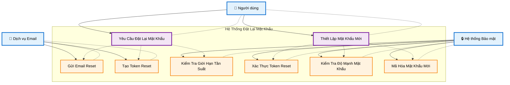

# Đặt Lại Mật Khẩu - Biểu Đồ Ca Sử Dụng

## Tổng quan

Chức năng đặt lại mật khẩu cho phép người dùng quên mật khẩu và thiết lập mật khẩu mới một cách an toàn.

## Tác nhân (Actors)

- **Người dùng** - Người sử dụng hệ thống
- **Dịch vụ Email** - Hệ thống gửi email
- **Hệ thống Bảo mật** - Hệ thống xử lý bảo mật

## Biểu Đồ Ca Sử Dụng



## Cấu Trúc Biểu Đồ Theo StarUML

### **1. System Boundary (Khung Hệ Thống)**

- Hình chữ nhật bao quanh tất cả use cases
- Tiêu đề: "Hệ Thống Đặt Lại Mật Khẩu"
- Viền đứt nét để phân biệt với các thành phần khác

### **2. Actors (Tác Nhân)**

- Đặt bên ngoài system boundary
- Sử dụng icon để dễ nhận biết:
  - 👤 Người dùng
  - 📧 Dịch vụ Email
  - 🔒 Hệ thống Bảo mật

### **3. Use Cases (Ca Sử Dụng)**

- **Primary Use Cases** (hình bầu dục màu tím): Các chức năng chính
  - Yêu Cầu Đặt Lại Mật Khẩu
  - Thiết Lập Mật Khẩu Mới
- **Supporting Use Cases** (hình bầu dục màu cam): Các chức năng hỗ trợ

### **4. Relationships (Mối Quan Hệ)**

- **Solid lines (─→)**: Association giữa Actor và Use Case
- **Dashed lines (- - →)**: Include relationship với label `<<include>>`

## Chi tiết các Ca Sử Dụng

### UC1: Yêu Cầu Đặt Lại Mật Khẩu

**Tác nhân**: Người dùng
**Điều kiện tiên quyết**: Người dùng đã quên mật khẩu
**Luồng chính**:

1. Người dùng nhấp "Quên mật khẩu"
2. Người dùng nhập địa chỉ email
3. Hệ thống kiểm tra email có tồn tại
4. Hệ thống gửi email đặt lại mật khẩu
5. Người dùng nhận thông báo thành công

**Điều kiện sau**: Yêu cầu đặt lại mật khẩu được gửi thành công

### UC2: Thiết Lập Mật Khẩu Mới

**Tác nhân**: Người dùng
**Điều kiện tiên quyết**: Người dùng đã nhận email reset và nhấp vào link
**Luồng chính**:

1. Người dùng nhấp link reset trong email
2. Hệ thống xác thực token reset
3. Người dùng nhập mật khẩu mới
4. Người dùng xác nhận mật khẩu
5. Hệ thống kiểm tra độ mạnh mật khẩu
6. Hệ thống mã hóa và lưu mật khẩu mới
7. Người dùng nhận thông báo thành công

**Điều kiện sau**: Mật khẩu được đặt lại thành công

### UC3: Xác Thực Token Reset

**Tác nhân**: Hệ thống Bảo mật
**Điều kiện tiên quyết**: Người dùng nhấp link reset
**Luồng chính**: Hệ thống kiểm tra token có hợp lệ và chưa hết hạn
**Điều kiện sau**: Token được xác thực

### UC4: Gửi Email Reset

**Tác nhân**: Dịch vụ Email
**Điều kiện tiên quyết**: Yêu cầu reset hợp lệ
**Luồng chính**: Hệ thống gửi email chứa link đặt lại mật khẩu
**Điều kiện sau**: Email reset được gửi

### UC5: Tạo Token Reset

**Tác nhân**: Dịch vụ Email
**Điều kiện tiên quyết**: Yêu cầu reset hợp lệ
**Luồng chính**: Hệ thống tạo token reset an toàn
**Điều kiện sau**: Token reset được tạo

### UC6: Kiểm Tra Độ Mạnh Mật Khẩu

**Tác nhân**: Hệ thống Bảo mật
**Điều kiện tiên quyết**: Người dùng gửi mật khẩu mới
**Luồng chính**: Hệ thống kiểm tra độ mạnh của mật khẩu mới
**Điều kiện sau**: Độ mạnh mật khẩu được kiểm tra

### UC7: Mã Hóa Mật Khẩu Mới

**Tác nhân**: Hệ thống Bảo mật
**Điều kiện tiên quyết**: Độ mạnh mật khẩu hợp lệ
**Luồng chính**: Hệ thống mã hóa mật khẩu mới trước khi lưu
**Điều kiện sau**: Mật khẩu được mã hóa và lưu an toàn

### UC8: Kiểm Tra Giới Hạn Tần Suất

**Tác nhân**: Hệ thống Bảo mật
**Điều kiện tiên quyết**: Người dùng yêu cầu đặt lại mật khẩu
**Luồng chính**: Hệ thống kiểm tra giới hạn tần suất yêu cầu
**Điều kiện sau**: Giới hạn tần suất được kiểm tra

## Mô Hình Cơ Sở Dữ Liệu Liên Quan

```python
# Token Đặt Lại Mật Khẩu
class PasswordResetToken(models.Model):
    user = models.ForeignKey(User, on_delete=models.CASCADE)
    token = models.CharField(max_length=100, unique=True)
    is_used = models.BooleanField(default=False)
    created_at = models.DateTimeField(auto_now_add=True)
    expires_at = models.DateTimeField()

# Nhật Ký Đặt Lại Mật Khẩu
class PasswordResetLog(models.Model):
    user = models.ForeignKey(User, on_delete=models.CASCADE)
    ip_address = models.GenericIPAddressField()
    success = models.BooleanField()
    created_at = models.DateTimeField(auto_now_add=True)
```

## Các Điểm Cuối API

```
POST /api/auth/forgot-password/
POST /api/auth/reset-password/
GET  /api/auth/reset-password/{token}/
POST /api/auth/reset-password/{token}/submit/
```

## Tính Năng Bảo Mật

### Yêu Cầu Mật Khẩu

- Tối thiểu 8 ký tự
- Ít nhất 1 chữ hoa, 1 chữ thường, 1 số, 1 ký tự đặc biệt
- Không nằm trong danh sách mật khẩu phổ biến
- Không giống với các mật khẩu trước đó

### Giới Hạn Tần Suất

- Tối đa 3 yêu cầu reset trong 24 giờ cho mỗi người dùng
- Thời gian chờ 15 phút giữa các yêu cầu

### Bảo Mật Token

- Hết hạn sau 24 giờ
- Chỉ sử dụng một lần
- Tạo và lưu trữ an toàn
