# Quản Lý Hồ Sơ Cá Nhân - Biểu Đồ Ca Sử Dụng

## Tổng quan

Chức năng quản lý hồ sơ cá nhân cho phép người dùng xem, cập nhật và quản lý thông tin cá nhân, avatar, và các cài đặt tài khoản trong hệ thống Movie Recommendation System.

## Tác nhân (Actors)

- **Người dùng** - Người sử dụng hệ thống đã đăng nhập
- **Hệ thống Lưu trữ** - Hệ thống lưu trữ file (avatar, images)
- **Hệ thống Bảo mật** - Hệ thống xử lý bảo mật và validation

## Biểu Đồ Ca Sử Dụng

```mermaid
graph TB
    %% Actors - đặt ở các vị trí phù hợp
    U[👤 Người dùng]
    FS[💾 Hệ thống Lưu trữ]
    SS[🔒 Hệ thống Bảo mật]

    %% System Boundary với layout tối ưu
    subgraph "Hệ Thống Quản Lý Hồ Sơ Cá Nhân"
        %% Primary Use Cases - đặt ở giữa
        UC1[Xem Hồ Sơ Cá Nhân]
        UC2[Cập Nhật Hồ Sơ]
        UC3[Quản Lý Avatar]
        UC4[Thay Đổi Mật Khẩu]

        %% Supporting Use Cases - đặt xung quanh
        UC5[Validate Dữ Liệu Hồ Sơ]
        UC6[Kiểm Tra Quyền Truy Cập]
        UC7[Upload Avatar Image]
        UC8[Resize Avatar Image]
        UC9[Validate Image Format]
        UC10[Kiểm Tra Độ Mạnh Mật Khẩu]
        UC11[Mã Hóa Mật Khẩu Mới]
        UC12[Xem Thống Kê Hồ Sơ]
        UC13[Xem Danh Sách Reviews]
        UC14[Xem Danh Sách Ratings]
        UC15[Xem Thể Loại Yêu Thích]
        UC16[Xem Danh Sách Phim Yêu Thích]
        UC17[Ghi Log Hoạt Động]
        UC18[Xử Lý Lỗi Upload]
        UC19[Xử Lý Lỗi Validation]
    end

    %% Actor to Use Case Relationships - sắp xếp logic
    U --> UC1
    U --> UC2
    U --> UC3
    U --> UC4

    FS --> UC7
    FS --> UC8
    FS --> UC9

    SS --> UC5
    SS --> UC6
    SS --> UC10
    SS --> UC11
    SS --> UC17

    %% Include Relationships - sắp xếp rõ ràng
    UC1 -.->|<<include>>| UC6
    UC1 -.->|<<include>>| UC12
    UC1 -.->|<<include>>| UC13
    UC1 -.->|<<include>>| UC14
    UC1 -.->|<<include>>| UC15
    UC1 -.->|<<include>>| UC16
    UC1 -.->|<<include>>| UC17

    UC2 -.->|<<include>>| UC5
    UC2 -.->|<<include>>| UC6
    UC2 -.->|<<include>>| UC17

    UC3 -.->|<<include>>| UC6
    UC3 -.->|<<include>>| UC7
    UC3 -.->|<<include>>| UC8
    UC3 -.->|<<include>>| UC9
    UC3 -.->|<<include>>| UC17

    UC4 -.->|<<include>>| UC6
    UC4 -.->|<<include>>| UC10
    UC4 -.->|<<include>>| UC11
    UC4 -.->|<<include>>| UC17

    UC5 -.->|<<include>>| UC19
    UC7 -.->|<<include>>| UC18
    UC7 -.->|<<include>>| UC9

    %% Layout positioning để tránh chồng lấp
    U -.- UC1
    U -.- UC2
    U -.- UC3
    U -.- UC4
    FS -.- UC7
    FS -.- UC8
    FS -.- UC9
    SS -.- UC5
    SS -.- UC6
    SS -.- UC10
    SS -.- UC11
    SS -.- UC17

    %% Style definitions với màu sắc phân biệt
    classDef actor fill:#e3f2fd,stroke:#1976d2,stroke-width:3px,color:#000
    classDef primaryUseCase fill:#f3e5f5,stroke:#7b1fa2,stroke-width:3px,color:#000
    classDef supportingUseCase fill:#fff3e0,stroke:#f57c00,stroke-width:2px,color:#000
    classDef systemBoundary fill:#f5f5f5,stroke:#424242,stroke-width:2px,stroke-dasharray: 5 5

    class U,FS,SS actor
    class UC1,UC2,UC3,UC4 primaryUseCase
    class UC5,UC6,UC7,UC8,UC9,UC10,UC11,UC12,UC13,UC14,UC15,UC16,UC17,UC18,UC19 supportingUseCase
```



## Cấu Trúc Biểu Đồ Theo StarUML

### **1. System Boundary (Khung Hệ Thống)**

- Hình chữ nhật bao quanh tất cả use cases
- Tiêu đề: "Hệ Thống Quản Lý Hồ Sơ Cá Nhân"
- Viền đứt nét để phân biệt với các thành phần khác

### **2. Actors (Tác Nhân)**

- Đặt bên ngoài system boundary
- Sử dụng icon để dễ nhận biết:
  - 👤 Người dùng
  - 💾 Hệ thống Lưu trữ
  - 🔒 Hệ thống Bảo mật

### **3. Use Cases (Ca Sử Dụng)**

- **Primary Use Cases** (hình bầu dục màu tím): Các chức năng chính
  - Xem Hồ Sơ Cá Nhân
  - Cập Nhật Hồ Sơ
  - Quản Lý Avatar
  - Thay Đổi Mật Khẩu
- **Supporting Use Cases** (hình bầu dục màu cam): Các chức năng hỗ trợ

### **4. Relationships (Mối Quan Hệ)**

- **Solid lines (─→)**: Association giữa Actor và Use Case
- **Dashed lines (- - →)**: Include relationship với label `<<include>>`

## Chi tiết các Ca Sử Dụng

### UC1: Xem Hồ Sơ Cá Nhân

**Tác nhân**: Người dùng
**Điều kiện tiên quyết**: Người dùng đã đăng nhập
**Luồng chính**:

1. Người dùng truy cập trang Profile
2. Hệ thống kiểm tra quyền truy cập
3. Hiển thị thông tin cá nhân (username, email, bio, age, gender, location)
4. Hiển thị avatar hiện tại
5. Hiển thị thống kê hồ sơ (số reviews, ratings, favorites)
6. Hiển thị danh sách reviews
7. Hiển thị danh sách ratings
8. Hiển thị thể loại yêu thích
9. Hiển thị danh sách phim yêu thích
10. Ghi log hoạt động

**Điều kiện sau**: Người dùng thấy thông tin hồ sơ đầy đủ

### UC2: Cập Nhật Hồ Sơ

**Tác nhân**: Người dùng
**Điều kiện tiên quyết**: Người dùng đã đăng nhập
**Luồng chính**:

1. Người dùng click "Edit Profile"
2. Hệ thống kiểm tra quyền truy cập
3. Người dùng cập nhật thông tin (bio, age, gender, location)
4. Hệ thống validate dữ liệu hồ sơ
5. Lưu thay đổi vào database
6. Ghi log hoạt động
7. Hiển thị thông báo thành công

**Điều kiện sau**: Thông tin hồ sơ được cập nhật

### UC3: Quản Lý Avatar

**Tác nhân**: Người dùng
**Điều kiện tiên quyết**: Người dùng đã đăng nhập
**Luồng chính**:

1. Người dùng click "Change Avatar"
2. Hệ thống kiểm tra quyền truy cập
3. Người dùng chọn file ảnh
4. Hệ thống validate image format
5. Upload avatar image lên storage
6. Resize avatar image theo kích thước chuẩn
7. Cập nhật avatar_url trong database
8. Ghi log hoạt động
9. Hiển thị avatar mới

**Điều kiện sau**: Avatar được cập nhật thành công

### UC4: Thay Đổi Mật Khẩu

**Tác nhân**: Người dùng
**Điều kiện tiên quyết**: Người dùng đã đăng nhập
**Luồng chính**:

1. Người dùng click "Change Password"
2. Hệ thống kiểm tra quyền truy cập
3. Người dùng nhập mật khẩu hiện tại
4. Người dùng nhập mật khẩu mới
5. Người dùng xác nhận mật khẩu mới
6. Hệ thống kiểm tra độ mạnh mật khẩu
7. Hệ thống mã hóa mật khẩu mới
8. Cập nhật mật khẩu trong database
9. Ghi log hoạt động
10. Hiển thị thông báo thành công

**Điều kiện sau**: Mật khẩu được thay đổi thành công

### UC5: Validate Dữ Liệu Hồ Sơ

**Tác nhân**: Hệ thống Bảo mật
**Điều kiện tiên quyết**: Người dùng đã nhập dữ liệu hồ sơ
**Luồng chính**:

1. Validate age (phải là số dương, hợp lý)
2. Validate gender (M/F/O)
3. Validate location (không quá dài)
4. Validate bio (không quá dài)
5. Trả về kết quả validation

**Điều kiện sau**: Dữ liệu hồ sơ được validate

### UC6: Kiểm Tra Quyền Truy Cập

**Tác nhân**: Hệ thống Bảo mật
**Điều kiện tiên quyết**: Người dùng thực hiện thao tác
**Luồng chính**:

1. Kiểm tra user đã đăng nhập
2. Kiểm tra user có quyền truy cập hồ sơ
3. Kiểm tra user chỉ có thể sửa hồ sơ của mình
4. Trả về kết quả kiểm tra

**Điều kiện sau**: Quyền truy cập được kiểm tra

### UC7: Upload Avatar Image

**Tác nhân**: Hệ thống Lưu trữ
**Điều kiện tiên quyết**: Người dùng đã chọn file ảnh
**Luồng chính**:

1. Hệ thống lưu trữ nhận file upload
2. Validate image format (jpg, png, gif)
3. Kiểm tra file size
4. Tạo tên file unique
5. Lưu file vào storage
6. Trả về file URL

**Điều kiện sau**: Avatar image được upload

### UC8: Resize Avatar Image

**Tác nhân**: Hệ thống Lưu trữ
**Điều kiện tiên quyết**: Avatar image đã được upload
**Luồng chính**:

1. Hệ thống lưu trữ nhận resize request
2. Load original image
3. Resize theo kích thước chuẩn (200x200px)
4. Giữ nguyên aspect ratio
5. Tối ưu chất lượng ảnh
6. Lưu ảnh đã resize

**Điều kiện sau**: Avatar image được resize

### UC9: Validate Image Format

**Tác nhân**: Hệ thống Lưu trữ
**Điều kiện tiên quyết**: Người dùng đã chọn file ảnh
**Luồng chính**:

1. Kiểm tra file extension
2. Validate file header
3. Kiểm tra image dimensions
4. Validate color depth
5. Trả về kết quả validation

**Điều kiện sau**: Image format được validate

### UC10: Kiểm Tra Độ Mạnh Mật Khẩu

**Tác nhân**: Hệ thống Bảo mật
**Điều kiện tiên quyết**: Người dùng đã nhập mật khẩu mới
**Luồng chính**:

1. Kiểm tra độ dài tối thiểu (8 ký tự)
2. Kiểm tra có chữ hoa, chữ thường, số, ký tự đặc biệt
3. Kiểm tra không nằm trong danh sách mật khẩu phổ biến
4. Kiểm tra không giống mật khẩu cũ
5. Trả về kết quả kiểm tra

**Điều kiện sau**: Độ mạnh mật khẩu được kiểm tra

### UC11: Mã Hóa Mật Khẩu Mới

**Tác nhân**: Hệ thống Bảo mật
**Điều kiện tiên quyết**: Mật khẩu mới hợp lệ
**Luồng chính**:

1. Hệ thống mã hóa mật khẩu mới với bcrypt
2. Lưu hash vào database
3. Xóa mật khẩu plain text khỏi memory

**Điều kiện sau**: Mật khẩu được mã hóa và lưu an toàn

### UC12: Xem Thống Kê Hồ Sơ

**Tác nhân**: Người dùng
**Điều kiện tiên quyết**: Người dùng đã đăng nhập
**Luồng chính**:

1. Hệ thống hiển thị thống kê hồ sơ
2. Hiển thị số reviews đã viết
3. Hiển thị số ratings đã đánh giá
4. Hiển thị số phim yêu thích
5. Hiển thị ngày tham gia
6. Hiển thị lần đăng nhập cuối

**Điều kiện sau**: Người dùng thấy thống kê hồ sơ

### UC13: Xem Danh Sách Reviews

**Tác nhân**: Người dùng
**Điều kiện tiên quyết**: Người dùng đã đăng nhập
**Luồng chính**:

1. Hệ thống lấy danh sách reviews của user
2. Hiển thị reviews với thông tin phim
3. Hiển thị rating và comment
4. Hiển thị ngày viết review
5. Phân trang nếu có nhiều reviews

**Điều kiện sau**: Người dùng thấy danh sách reviews

### UC14: Xem Danh Sách Ratings

**Tác nhân**: Người dùng
**Điều kiện tiên quyết**: Người dùng đã đăng nhập
**Luồng chính**:

1. Hệ thống lấy danh sách ratings của user
2. Hiển thị ratings với thông tin phim
3. Hiển thị điểm đánh giá
4. Hiển thị ngày đánh giá
5. Phân trang nếu có nhiều ratings

**Điều kiện sau**: Người dùng thấy danh sách ratings

### UC15: Xem Thể Loại Yêu Thích

**Tác nhân**: Người dùng
**Điều kiện tiên quyết**: Người dùng đã đăng nhập
**Luồng chính**:

1. Hệ thống lấy danh sách thể loại yêu thích
2. Hiển thị tên thể loại
3. Hiển thị số phim trong thể loại
4. Hiển thị mức độ yêu thích

**Điều kiện sau**: Người dùng thấy thể loại yêu thích

### UC16: Xem Danh Sách Phim Yêu Thích

**Tác nhân**: Người dùng
**Điều kiện tiên quyết**: Người dùng đã đăng nhập
**Luồng chính**:

1. Hệ thống lấy danh sách phim yêu thích
2. Hiển thị thông tin phim (tên, poster, rating)
3. Hiển thị ngày thêm vào yêu thích
4. Phân trang nếu có nhiều phim

**Điều kiện sau**: Người dùng thấy danh sách phim yêu thích

### UC17: Ghi Log Hoạt Động

**Tác nhân**: Hệ thống Bảo mật
**Điều kiện tiên quyết**: Có hoạt động cần ghi log
**Luồng chính**:

1. Ghi thông tin hoạt động (action, user_id, timestamp)
2. Ghi IP address
3. Ghi user agent
4. Lưu vào database

**Điều kiện sau**: Hoạt động được ghi log

### UC18: Xử Lý Lỗi Upload

**Tác nhân**: Hệ thống Lưu trữ
**Điều kiện tiên quyết**: Có lỗi xảy ra khi upload
**Luồng chính**:

1. Phát hiện lỗi upload
2. Xóa file tạm nếu có
3. Trả về thông báo lỗi cụ thể
4. Ghi log lỗi

**Điều kiện sau**: Lỗi upload được xử lý

### UC19: Xử Lý Lỗi Validation

**Tác nhân**: Hệ thống Bảo mật
**Điều kiện tiên quyết**: Có lỗi validation
**Luồng chính**:

1. Phát hiện lỗi validation
2. Tạo thông báo lỗi cụ thể
3. Trả về lỗi cho user
4. Ghi log lỗi

**Điều kiện sau**: Lỗi validation được xử lý

## Mô Hình Cơ Sở Dữ Liệu Liên Quan

```python
# User Model
class User(AbstractUser):
    email = models.EmailField(unique=True)
    avatar_url = models.URLField(max_length=500, blank=True, null=True)
    bio = models.TextField(blank=True, null=True)
    age = models.IntegerField(blank=True, null=True)
    gender = models.CharField(max_length=10, choices=[('M', 'Male'), ('F', 'Female'), ('O', 'Other')], blank=True, null=True)
    location = models.CharField(max_length=255, blank=True, null=True)
    age_group = models.CharField(max_length=20, blank=True, null=True)
    occupation = models.CharField(max_length=50, blank=True, null=True)
    zip_code = models.CharField(max_length=10, blank=True, null=True)
    is_email_verified = models.BooleanField(default=False)
    is_google_account = models.BooleanField(default=False)
    user_type = models.CharField(max_length=20, choices=USER_TYPE_CHOICES, default='member')
    created_at = models.DateTimeField(auto_now_add=True)
    updated_at = models.DateTimeField(auto_now=True)

# User Activity Log
class UserActivityLog(models.Model):
    user = models.ForeignKey(User, on_delete=models.CASCADE)
    activity_type = models.CharField(max_length=50)
    activity_data = models.JSONField()
    ip_address = models.GenericIPAddressField()
    user_agent = models.TextField()
    created_at = models.DateTimeField(auto_now_add=True)

# User Favorite Genre
class UserFavoriteGenre(models.Model):
    user = models.ForeignKey(User, on_delete=models.CASCADE)
    genre = models.ForeignKey(Genre, on_delete=models.CASCADE)
    created_at = models.DateTimeField(auto_now_add=True)

# User Favorite Movie
class UserFavoriteMovie(models.Model):
    user = models.ForeignKey(User, on_delete=models.CASCADE)
    movie = models.ForeignKey(Movie, on_delete=models.CASCADE)
    created_at = models.DateTimeField(auto_now_add=True)
```

## Các Điểm Cuối API

```
GET  /api/auth/profile/{userId}/
PUT  /api/auth/profile/{userId}/
POST /api/auth/profile/{userId}/avatar/
GET  /api/auth/profile/{userId}/stats/
GET  /api/auth/profile/{userId}/reviews/
GET  /api/auth/profile/{userId}/ratings/
GET  /api/auth/profile/{userId}/favorite-genres/
GET  /api/auth/profile/{userId}/favorite-movies/
```

## Tính Năng Bảo Mật

### Quyền Truy Cập

- Chỉ user có thể xem và sửa hồ sơ của mình
- Kiểm tra authentication trước mọi thao tác
- Validate user_id trong URL

### Avatar Management

- Chỉ chấp nhận file ảnh (jpg, png, gif)
- Giới hạn kích thước file
- Resize ảnh theo chuẩn
- Validate image format

### Password Security

- Sử dụng Django password validation
- Mã hóa với bcrypt
- Kiểm tra độ mạnh mật khẩu
- Không cho phép trùng với mật khẩu cũ

### Data Validation

- Validate age (số dương, hợp lý)
- Validate gender (M/F/O)
- Validate location (độ dài hợp lý)
- Validate bio (độ dài hợp lý)

### Activity Logging

- Ghi log mọi hoạt động quan trọng
- Lưu IP address và user agent
- Tracking thời gian thực hiện
