# Đăng Ký & Đăng Nhập - Biểu Đồ Ca Sử Dụng

## Tổng quan
Chức năng đăng ký và đăng nhập cho phép người dùng tạo tài khoản mới và truy cập vào hệ thống Movie Recommendation System.

## Tác nhân (Actors)
- **Người dùng** - Người sử dụng hệ thống
- **Dịch vụ Email** - Hệ thống gửi email xác thực
- **Google OAuth** - Hệ thống xác thực Google
- **Hệ thống Bảo mật** - Hệ thống xử lý bảo mật

## Biểu Đồ Ca Sử Dụng

```mermaid
graph TB
    %% Actors - đặt ở các vị trí phù hợp
    U[👤 Người dùng]
    ES[📧 Dịch vụ Email]
    GO[🔐 Google OAuth]
    SS[🔒 Hệ thống Bảo mật]

    %% System Boundary với layout tối ưu
    subgraph "Hệ Thống Đăng Ký & Đăng Nhập"
        %% Primary Use Cases - đặt ở giữa
        UC1[Đăng Ký Tài Khoản]
        UC2[Đăng Nhập Email]
        UC3[Đăng Nhập Google]

        %% Supporting Use Cases - đặt xung quanh
        UC4[Gửi Email Xác Thực]
        UC5[Tạo Token Xác Thực]
        UC6[Xác Thực Email]
        UC7[Validate Dữ Liệu Đăng Ký]
        UC8[Kiểm Tra Email Trùng Lặp]
        UC9[Kiểm Tra Username Trùng Lặp]
        UC10[Validate Credentials]
        UC11[Kiểm Tra Trạng Thái Tài Khoản]
        UC12[Tạo JWT Token]
        UC13[Xác Thực Google Token]
        UC14[Lấy Thông Tin Google Profile]
        UC15[Kiểm Tra Độ Mạnh Mật Khẩu]
        UC16[Mã Hóa Mật Khẩu]
        UC17[Gửi Email Chào Mừng]
    end

    %% Actor to Use Case Relationships - sắp xếp logic
    U --> UC1
    U --> UC2
    U --> UC3

    ES --> UC4
    ES --> UC17

    GO --> UC13
    GO --> UC14

    SS --> UC7
    SS --> UC10
    SS --> UC11
    SS --> UC12
    SS --> UC15
    SS --> UC16

    %% Include Relationships - sắp xếp rõ ràng
    UC1 -.->|<<include>>| UC4
    UC1 -.->|<<include>>| UC5
    UC1 -.->|<<include>>| UC7
    UC1 -.->|<<include>>| UC8
    UC1 -.->|<<include>>| UC9
    UC1 -.->|<<include>>| UC15
    UC1 -.->|<<include>>| UC16
    UC1 -.->|<<include>>| UC17

    UC2 -.->|<<include>>| UC10
    UC2 -.->|<<include>>| UC11
    UC2 -.->|<<include>>| UC12

    UC3 -.->|<<include>>| UC13
    UC3 -.->|<<include>>| UC14
    UC3 -.->|<<include>>| UC12

    UC7 -.->|<<include>>| UC15
    UC7 -.->|<<include>>| UC8
    UC7 -.->|<<include>>| UC9

    %% Layout positioning để tránh chồng lấp
    U -.- UC1
    U -.- UC2
    U -.- UC3
    ES -.- UC4
    ES -.- UC17
    GO -.- UC13
    GO -.- UC14
    SS -.- UC7
    SS -.- UC10
    SS -.- UC11
    SS -.- UC12
    SS -.- UC15
    SS -.- UC16

    %% Style definitions với màu sắc phân biệt
    classDef actor fill:#e3f2fd,stroke:#1976d2,stroke-width:3px,color:#000
    classDef primaryUseCase fill:#f3e5f5,stroke:#7b1fa2,stroke-width:3px,color:#000
    classDef supportingUseCase fill:#fff3e0,stroke:#f57c00,stroke-width:2px,color:#000
    classDef systemBoundary fill:#f5f5f5,stroke:#424242,stroke-width:2px,stroke-dasharray: 5 5

    class U,ES,GO,SS actor
    class UC1,UC2,UC3 primaryUseCase
    class UC4,UC5,UC6,UC7,UC8,UC9,UC10,UC11,UC12,UC13,UC14,UC15,UC16,UC17 supportingUseCase
```



## Cấu Trúc Biểu Đồ Theo StarUML

### **1. System Boundary (Khung Hệ Thống)**
- Hình chữ nhật bao quanh tất cả use cases
- Tiêu đề: "Hệ Thống Đăng Ký & Đăng Nhập"
- Viền đứt nét để phân biệt với các thành phần khác

### **2. Actors (Tác Nhân)**
- Đặt bên ngoài system boundary
- Sử dụng icon để dễ nhận biết:
  - 👤 Người dùng
  - 📧 Dịch vụ Email
  - 🔐 Google OAuth
  - 🔒 Hệ thống Bảo mật

### **3. Use Cases (Ca Sử Dụng)**
- **Primary Use Cases** (hình bầu dục màu tím): Các chức năng chính
  - Đăng Ký Tài Khoản
  - Đăng Nhập Email
  - Đăng Nhập Google
- **Supporting Use Cases** (hình bầu dục màu cam): Các chức năng hỗ trợ

### **4. Relationships (Mối Quan Hệ)**
- **Solid lines (─→)**: Association giữa Actor và Use Case
- **Dashed lines (- - →)**: Include relationship với label `<<include>>`

## Chi tiết các Ca Sử Dụng

### UC1: Đăng Ký Tài Khoản
**Tác nhân**: Người dùng
**Điều kiện tiên quyết**: Người dùng chưa có tài khoản
**Luồng chính**:
1. Người dùng điền form đăng ký (email, username, password, confirm password)
2. Hệ thống validate dữ liệu đăng ký
3. Kiểm tra email và username trùng lặp
4. Kiểm tra độ mạnh mật khẩu
5. Mã hóa mật khẩu
6. Tạo tài khoản với trạng thái chưa xác thực
7. Tạo token xác thực email
8. Gửi email xác thực
9. Gửi email chào mừng
10. Hiển thị thông báo thành công

**Điều kiện sau**: Tài khoản được tạo, email xác thực được gửi

### UC2: Đăng Nhập Email
**Tác nhân**: Người dùng
**Điều kiện tiên quyết**: Người dùng đã có tài khoản
**Luồng chính**:
1. Người dùng nhập email và password
2. Hệ thống validate credentials
3. Kiểm tra trạng thái tài khoản (email đã xác thực chưa)
4. Tạo JWT token
5. Trả về thông tin user và token
6. Chuyển hướng đến trang chủ

**Điều kiện sau**: Người dùng đăng nhập thành công

### UC3: Đăng Nhập Google
**Tác nhân**: Người dùng
**Điều kiện tiên quyết**: Người dùng có tài khoản Google
**Luồng chính**:
1. Người dùng click "Login with Google"
2. Chuyển hướng đến Google OAuth
3. Người dùng xác thực với Google
4. Hệ thống xác thực Google token
5. Lấy thông tin Google profile
6. Tạo hoặc cập nhật tài khoản
7. Tạo JWT token
8. Trả về thông tin user và token

**Điều kiện sau**: Người dùng đăng nhập thành công

### UC4: Gửi Email Xác Thực
**Tác nhân**: Dịch vụ Email
**Điều kiện tiên quyết**: Tài khoản mới được tạo
**Luồng chính**: Hệ thống gửi email chứa link xác thực
**Điều kiện sau**: Email xác thực được gửi

### UC5: Tạo Token Xác Thực
**Tác nhân**: Hệ thống Bảo mật
**Điều kiện tiên quyết**: Tài khoản mới được tạo
**Luồng chính**: Hệ thống tạo token xác thực an toàn
**Điều kiện sau**: Token xác thực được tạo

### UC6: Xác Thực Email
**Tác nhân**: Người dùng
**Điều kiện tiên quyết**: Người dùng đã nhận email xác thực
**Luồng chính**:
1. Người dùng click link trong email
2. Hệ thống validate token
3. Cập nhật trạng thái email_verified
4. Hiển thị thông báo thành công

**Điều kiện sau**: Email được xác thực

### UC7: Validate Dữ Liệu Đăng Ký
**Tác nhân**: Hệ thống Bảo mật
**Điều kiện tiên quyết**: Người dùng đã điền form đăng ký
**Luồng chính**:
1. Validate email format
2. Validate username format
3. Validate password strength
4. Check password confirmation match
5. Kiểm tra email trùng lặp
6. Kiểm tra username trùng lặp

**Điều kiện sau**: Dữ liệu được validate

### UC8: Kiểm Tra Email Trùng Lặp
**Tác nhân**: Hệ thống Bảo mật
**Điều kiện tiên quyết**: Người dùng đã nhập email
**Luồng chính**: Hệ thống kiểm tra email trong database
**Điều kiện sau**: Kết quả kiểm tra được trả về

### UC9: Kiểm Tra Username Trùng Lặp
**Tác nhân**: Hệ thống Bảo mật
**Điều kiện tiên quyết**: Người dùng đã nhập username
**Luồng chính**: Hệ thống kiểm tra username trong database
**Điều kiện sau**: Kết quả kiểm tra được trả về

### UC10: Validate Credentials
**Tác nhân**: Hệ thống Bảo mật
**Điều kiện tiên quyết**: Người dùng đã nhập credentials
**Luồng chính**:
1. Validate email format
2. Check user exists
3. Verify password hash
4. Check account status

**Điều kiện sau**: Credentials được validate

### UC11: Kiểm Tra Trạng Thái Tài Khoản
**Tác nhân**: Hệ thống Bảo mật
**Điều kiện tiên quyết**: Credentials hợp lệ
**Luồng chính**:
1. Kiểm tra email đã xác thực chưa
2. Kiểm tra tài khoản có bị khóa không
3. Kiểm tra tài khoản có active không

**Điều kiện sau**: Trạng thái tài khoản được kiểm tra

### UC12: Tạo JWT Token
**Tác nhân**: Hệ thống Bảo mật
**Điều kiện tiên quyết**: Đăng nhập thành công
**Luồng chính**: Hệ thống tạo JWT access token và refresh token
**Điều kiện sau**: JWT token được tạo

### UC13: Xác Thực Google Token
**Tác nhân**: Google OAuth
**Điều kiện tiên quyết**: Người dùng đã xác thực với Google
**Luồng chính**: Hệ thống gọi Google API để validate token
**Điều kiện sau**: Google token được xác thực

### UC14: Lấy Thông Tin Google Profile
**Tác nhân**: Google OAuth
**Điều kiện tiên quyết**: Google token hợp lệ
**Luồng chính**: Hệ thống lấy thông tin user từ Google API
**Điều kiện sau**: Thông tin Google profile được lấy

### UC15: Kiểm Tra Độ Mạnh Mật Khẩu
**Tác nhân**: Hệ thống Bảo mật
**Điều kiện tiên quyết**: Người dùng đã nhập password
**Luồng chính**: Hệ thống kiểm tra độ mạnh của password
**Điều kiện sau**: Độ mạnh password được kiểm tra

### UC16: Mã Hóa Mật Khẩu
**Tác nhân**: Hệ thống Bảo mật
**Điều kiện tiên quyết**: Password strength hợp lệ
**Luồng chính**: Hệ thống mã hóa password trước khi lưu
**Điều kiện sau**: Password được mã hóa và lưu an toàn

### UC17: Gửi Email Chào Mừng
**Tác nhân**: Dịch vụ Email
**Điều kiện tiên quyết**: Tài khoản mới được tạo
**Luồng chính**: Hệ thống gửi email chào mừng
**Điều kiện sau**: Email chào mừng được gửi

## Mô Hình Cơ Sở Dữ Liệu Liên Quan

```python
# User Model
class User(AbstractUser):
    email = models.EmailField(unique=True)
    avatar_url = models.URLField(max_length=500, blank=True, null=True)
    bio = models.TextField(blank=True, null=True)
    age = models.IntegerField(blank=True, null=True)
    gender = models.CharField(max_length=10, choices=[('M', 'Male'), ('F', 'Female'), ('O', 'Other')], blank=True, null=True)
    location = models.CharField(max_length=255, blank=True, null=True)
    is_email_verified = models.BooleanField(default=False)
    is_google_account = models.BooleanField(default=False)
    user_type = models.CharField(max_length=20, choices=USER_TYPE_CHOICES, default='member')
    created_at = models.DateTimeField(auto_now_add=True)
    updated_at = models.DateTimeField(auto_now=True)

# Email Verification Token
class EmailVerificationToken(models.Model):
    user = models.ForeignKey(User, on_delete=models.CASCADE)
    token = models.CharField(max_length=100, unique=True)
    created_at = models.DateTimeField(auto_now_add=True)
    expires_at = models.DateTimeField()

# Password Reset Token
class PasswordResetToken(models.Model):
    user = models.ForeignKey(User, on_delete=models.CASCADE)
    token = models.CharField(max_length=100, unique=True)
    is_used = models.BooleanField(default=False)
    created_at = models.DateTimeField(auto_now_add=True)
    expires_at = models.DateTimeField()
```

## Các Điểm Cuối API

```
POST /api/auth/register/
POST /api/auth/login/
POST /api/auth/google/
POST /api/auth/verify-email/
POST /api/auth/forgot-password/
POST /api/auth/reset-password/
POST /api/auth/token/refresh/
```

## Tính Năng Bảo Mật

### Yêu Cầu Mật Khẩu
- Tối thiểu 8 ký tự
- Sử dụng Django password validation
- Mã hóa với bcrypt

### JWT Token
- Access token: 60 phút
- Refresh token: 1 ngày
- Algorithm: HS256

### Email Verification
- Bắt buộc xác thực email trước khi đăng nhập
- Token hết hạn sau 24 giờ
- Gửi email chào mừng

### Google OAuth
- Sử dụng Google OAuth2
- Tự động tạo tài khoản nếu chưa có
- Tự động xác thực email cho Google account
