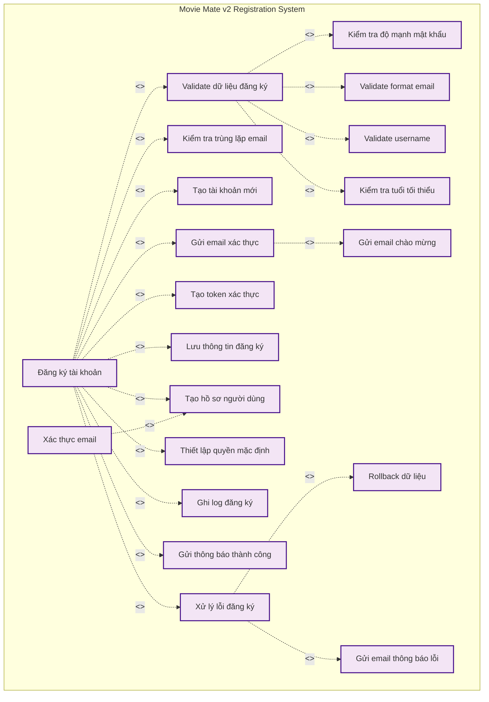

# 📝 Use Case Diagram - Chức năng Đăng ký

## 📋 Tổng quan

Use Case Diagram này tập trung vào chức năng đăng ký tài khoản trong hệ thống Movie Mate v2, bao gồm tất cả các use case liên quan đến quá trình đăng ký từ đầu đến cuối.

## 🔄 Use Case Diagram



## 📝 Chi tiết các Use Case

### **1. Đăng ký tài khoản (UC1)**

- **Mô tả**: Quá trình đăng ký tài khoản mới hoàn chỉnh
- **Include**: UC4, UC5, UC6, UC3, UC8, UC9, UC14, UC15, UC16, UC17
- **Extend**: UC18 (khi có lỗi)

### **2. Xác thực email (UC2)**

- **Mô tả**: Xác thực email sau khi đăng ký
- **Include**: UC14 (cập nhật trạng thái xác thực)

### **3. Gửi email xác thực (UC3)**

- **Mô tả**: Gửi email xác thực đến người dùng
- **Include**: UC7 (gửi email chào mừng)

### **4. Validate dữ liệu đăng ký (UC4)**

- **Mô tả**: Kiểm tra tính hợp lệ của dữ liệu đăng ký
- **Include**: UC10, UC11, UC12, UC13

### **5. Kiểm tra trùng lặp email (UC5)**

- **Mô tả**: Kiểm tra email đã tồn tại trong hệ thống

### **6. Tạo tài khoản mới (UC6)**

- **Mô tả**: Tạo bản ghi user mới trong database

### **7. Gửi email chào mừng (UC7)**

- **Mô tả**: Gửi email chào mừng người dùng mới

### **8. Tạo token xác thực (UC8)**

- **Mô tả**: Tạo token để xác thực email

### **9. Lưu thông tin đăng ký (UC9)**

- **Mô tả**: Lưu thông tin đăng ký vào database

### **10. Kiểm tra độ mạnh mật khẩu (UC10)**

- **Mô tả**: Validate độ mạnh của mật khẩu

### **11. Validate format email (UC11)**

- **Mô tả**: Kiểm tra format email hợp lệ

### **12. Validate username (UC12)**

- **Mô tả**: Kiểm tra username hợp lệ

### **13. Kiểm tra tuổi tối thiểu (UC13)**

- **Mô tả**: Kiểm tra tuổi tối thiểu để đăng ký

### **14. Tạo hồ sơ người dùng (UC14)**

- **Mô tả**: Tạo hồ sơ người dùng với thông tin cơ bản

### **15. Thiết lập quyền mặc định (UC15)**

- **Mô tả**: Gán quyền mặc định cho người dùng mới

### **16. Ghi log đăng ký (UC16)**

- **Mô tả**: Ghi log hoạt động đăng ký

### **17. Gửi thông báo thành công (UC17)**

- **Mô tả**: Hiển thị thông báo đăng ký thành công

### **18. Xử lý lỗi đăng ký (UC18)**

- **Mô tả**: Xử lý các lỗi trong quá trình đăng ký
- **Extend**: UC19, UC20

### **19. Rollback dữ liệu (UC19)**

- **Mô tả**: Hoàn tác dữ liệu khi có lỗi

### **20. Gửi email thông báo lỗi (UC20)**

- **Mô tả**: Gửi email thông báo lỗi đăng ký

## 🔗 Mối quan hệ

### **Include Relationships (<<include>>)**

- **Đăng ký tài khoản** `<<include>>` **Validate dữ liệu đăng ký**
- **Đăng ký tài khoản** `<<include>>` **Kiểm tra trùng lặp email**
- **Đăng ký tài khoản** `<<include>>` **Tạo tài khoản mới**
- **Đăng ký tài khoản** `<<include>>` **Gửi email xác thực**
- **Đăng ký tài khoản** `<<include>>` **Tạo token xác thực**
- **Đăng ký tài khoản** `<<include>>` **Lưu thông tin đăng ký**
- **Đăng ký tài khoản** `<<include>>` **Tạo hồ sơ người dùng**
- **Đăng ký tài khoản** `<<include>>` **Thiết lập quyền mặc định**
- **Đăng ký tài khoản** `<<include>>` **Ghi log đăng ký**
- **Đăng ký tài khoản** `<<include>>` **Gửi thông báo thành công**

- **Validate dữ liệu đăng ký** `<<include>>` **Kiểm tra độ mạnh mật khẩu**
- **Validate dữ liệu đăng ký** `<<include>>` **Validate format email**
- **Validate dữ liệu đăng ký** `<<include>>` **Validate username**
- **Validate dữ liệu đăng ký** `<<include>>` **Kiểm tra tuổi tối thiểu**

- **Gửi email xác thực** `<<include>>` **Gửi email chào mừng**
- **Xác thực email** `<<include>>` **Tạo hồ sơ người dùng**

### **Extend Relationships (<<extend>>)**

- **Đăng ký tài khoản** `<<extend>>` **Xử lý lỗi đăng ký**
- **Xử lý lỗi đăng ký** `<<extend>>` **Rollback dữ liệu**
- **Xử lý lỗi đăng ký** `<<extend>>` **Gửi email thông báo lỗi**

## 🛡️ Validation Rules

### **Email Validation:**

- Format email hợp lệ
- Không trùng lặp trong hệ thống
- Domain email hợp lệ

### **Username Validation:**

- 3-20 ký tự
- Chỉ chứa chữ cái, số, dấu gạch dưới
- Không trùng lặp

### **Password Validation:**

- Tối thiểu 6 ký tự
- Bao gồm chữ hoa, chữ thường, số
- Không chứa thông tin cá nhân

### **Age Validation:**

- Tuổi tối thiểu 13
- Tuổi hợp lệ (không âm, không quá lớn)

## 📊 Database Operations

### **User Creation:**

```python
# Tạo user mới
user = User.objects.create_user(
    username=validated_data['username'],
    email=validated_data['email'],
    password=validated_data['password'],
    first_name=validated_data.get('first_name', ''),
    last_name=validated_data.get('last_name', ''),
    is_email_verified=False,
    user_type='member'
)
```

### **Email Verification Token:**

```python
# Tạo token xác thực
token = EmailVerificationToken.objects.create(
    user=user,
    token=get_random_string(64),
    expires_at=timezone.now() + timedelta(hours=24)
)
```

### **User Profile Creation:**

```python
# Tạo hồ sơ người dùng
UserProfile.objects.create(
    user=user,
    bio='',
    age=None,
    gender=None,
    location=''
)
```

## 🔄 Error Handling

### **Common Errors:**

- Email đã tồn tại
- Username đã tồn tại
- Password quá yếu
- Email không hợp lệ
- Tuổi không hợp lệ
- Lỗi gửi email
- Lỗi database

### **Error Response:**

```json
{
  "error": "validation_error",
  "message": {
    "email": ["Email đã tồn tại"],
    "username": ["Username đã tồn tại"],
    "password": ["Mật khẩu quá yếu"]
  }
}
```

## 🎯 Kết luận

Use Case Diagram này mô tả chi tiết toàn bộ quá trình đăng ký trong hệ thống Movie Mate v2, bao gồm:

- **20 Use Cases** chính và phụ
- **Include relationships** cho các chức năng bắt buộc
- **Extend relationships** cho xử lý lỗi
- **Validation rules** chi tiết
- **Database operations** cụ thể
- **Error handling** toàn diện

Diagram này giúp hiểu rõ các thành phần và mối quan hệ trong chức năng đăng ký mà không cần phân loại theo actor.
