# Review & Comment System - Use Case Diagram

## Tổng quan

Nhóm chức năng review và bình luận bao gồm các tính năng cho phép người dùng đánh giá, viết review, bình luận và tương tác với nội dung phim.

## Actors

- **Anonymous User** - Người dùng chưa đăng ký
- **Registered User** - Người dùng đã đăng ký
- **Moderator** - Người kiểm duyệt nội dung
- **Spoiler Detection System** - Hệ thống phát hiện spoiler tự động

## Use Case Diagram

```mermaid
graph TB
    %% Actors
    AU[Anonymous User]
    RU[Registered User]
    MO[Moderator]
    SDS[Spoiler Detection System]

    %% Anonymous User Use Cases
    AU --> UC1[View Movie Reviews]
    AU --> UC2[View Review Details]
    AU --> UC3[Filter Reviews by Rating]
    AU --> UC4[Sort Reviews by Date]
    AU --> UC5[View Review Statistics]

    %% Registered User Use Cases
    RU --> UC6[Write Movie Review]
    RU --> UC7[Rate Movie]
    RU --> UC8[Reply to Review]
    RU --> UC9[Vote on Review]
    RU --> UC10[Report Review]
    RU --> UC11[Edit Own Review]
    RU --> UC12[Delete Own Review]
    RU --> UC13[Mark Review as Spoiler]
    RU --> UC14[View Own Reviews]
    RU --> UC15[View Review History]
    RU --> UC16[Share Review]
    RU --> UC17[Add Review to Favorites]

    %% Moderator Use Cases
    MO --> UC18[Review Moderation Queue]
    MO --> UC19[Approve Review]
    MO --> UC20[Reject Review]
    MO --> UC21[Handle User Reports]
    MO --> UC22[Bulk Actions on Reviews]
    MO --> UC23[Configure Moderation Rules]
    MO --> UC24[View Moderation Analytics]
    MO --> UC25[Review Auto-Marked Content]
    MO --> UC26[Manage Spoiler Detection]
    MO --> UC27[Ban User from Reviewing]

    %% Spoiler Detection System Use Cases
    SDS --> UC28[Auto-Detect Spoilers]
    SDS --> UC29[Mark Review as Spoiler]
    SDS --> UC30[Suggest Spoiler Warning]
    SDS --> UC31[Learn from Moderator Feedback]
    SDS --> UC32[Update Detection Algorithm]

    %% Include Relationships
    UC1 -.-> UC2
    UC1 -.-> UC3
    UC1 -.-> UC4
    UC6 -.-> UC7
    UC6 -.-> UC13
    UC8 -.-> UC9
    UC18 -.-> UC19
    UC18 -.-> UC20
    UC18 -.-> UC21
    UC28 -.-> UC29
    UC28 -.-> UC30

    %% Extend Relationships
    UC6 -.-> UC28
    UC8 -.-> UC28
    UC19 -.-> UC31
    UC20 -.-> UC31

    %% Style
    classDef actor fill:#e1f5fe,stroke:#01579b,stroke-width:2px
    classDef useCase fill:#f3e5f5,stroke:#4a148c,stroke-width:2px
    classDef include fill:#fff3e0,stroke:#e65100,stroke-width:1px
    classDef extend fill:#e8f5e8,stroke:#1b5e20,stroke-width:1px

    class AU,RU,MO,SDS actor
    class UC1,UC2,UC3,UC4,UC5,UC6,UC7,UC8,UC9,UC10,UC11,UC12,UC13,UC14,UC15,UC16,UC17,UC18,UC19,UC20,UC21,UC22,UC23,UC24,UC25,UC26,UC27,UC28,UC29,UC30,UC31,UC32 useCase
```



## Chi tiết các Use Case

### UC1: View Movie Reviews

**Actor**: Anonymous User
**Preconditions**: User đang ở trang chi tiết phim
**Main Flow**:

1. User click vào tab Reviews
2. Hệ thống hiển thị danh sách reviews
3. User có thể lọc theo rating, helpful votes
4. User có thể sắp xếp theo thời gian
5. Hiển thị phân trang cho reviews

**Alternative Flow**:

- Không có review nào → Hiển thị thông báo
- Review bị ẩn → Không hiển thị

**Postconditions**: User thấy các review của phim

### UC6: Write Movie Review

**Actor**: Registered User
**Preconditions**: User đã đăng nhập
**Main Flow**:

1. User click "Write Review"
2. User nhập title và content
3. User có thể đánh giá bằng sao
4. User có thể đánh dấu spoiler
5. Hệ thống kiểm tra nội dung
6. Lưu review và chờ duyệt

**Alternative Flow**:

- Nội dung quá ngắn → Hiển thị yêu cầu
- Phát hiện spoiler → Tự động đánh dấu
- Nội dung vi phạm → Từ chối lưu

**Postconditions**: Review được tạo và chờ duyệt

### UC7: Rate Movie

**Actor**: Registered User
**Preconditions**: User đã đăng nhập
**Main Flow**:

1. User chọn số sao đánh giá (1-5)
2. Hệ thống lưu rating
3. Cập nhật average rating của phim
4. Hiển thị thông báo thành công

**Alternative Flow**:

- User đã rate trước đó → Cập nhật rating
- Lỗi lưu → Hiển thị thông báo lỗi

**Postconditions**: Rating được lưu và hiển thị

### UC8: Reply to Review

**Actor**: Registered User
**Preconditions**: User đã đăng nhập
**Main Flow**:

1. User click "Reply" trên review
2. User nhập nội dung reply
3. User có thể mention user khác
4. Hệ thống kiểm tra nội dung
5. Lưu reply và hiển thị

**Alternative Flow**:

- Nội dung quá ngắn → Hiển thị yêu cầu
- Reply quá nhiều → Hiển thị cảnh báo
- Nội dung vi phạm → Từ chối lưu

**Postconditions**: Reply được tạo và hiển thị

### UC9: Vote on Review

**Actor**: Registered User
**Preconditions**: User đã đăng nhập
**Main Flow**:

1. User click "Helpful" hoặc "Not Helpful"
2. Hệ thống cập nhật vote count
3. Hiển thị tỷ lệ helpful votes
4. Cập nhật review ranking

**Alternative Flow**:

- User đã vote → Thay đổi vote
- Lỗi vote → Hiển thị thông báo

**Postconditions**: Vote được ghi nhận

### UC10: Report Review

**Actor**: Registered User
**Preconditions**: User đã đăng nhập
**Main Flow**:

1. User click "Report" trên review
2. User chọn lý do báo cáo
3. User có thể thêm mô tả
4. Hệ thống gửi báo cáo cho moderator
5. Hiển thị thông báo thành công

**Alternative Flow**:

- User đã report → Hiển thị thông báo
- Lý do không hợp lệ → Yêu cầu chọn lại

**Postconditions**: Báo cáo được gửi

### UC11: Edit Own Review

**Actor**: Registered User
**Preconditions**: User đã đăng nhập và có review
**Main Flow**:

1. User click "Edit" trên review của mình
2. User chỉnh sửa nội dung
3. Hệ thống kiểm tra nội dung mới
4. Cập nhật review
5. Hiển thị thông báo thành công

**Alternative Flow**:

- Review đã được reply → Không cho phép edit
- Nội dung vi phạm → Từ chối cập nhật

**Postconditions**: Review được cập nhật

### UC13: Mark Review as Spoiler

**Actor**: Registered User
**Preconditions**: User đã đăng nhập
**Main Flow**:

1. User click checkbox "Contains Spoiler"
2. Hệ thống đánh dấu review
3. Hiển thị cảnh báo spoiler
4. Ẩn nội dung chi tiết

**Alternative Flow**:

- Hệ thống tự động phát hiện → Tự động đánh dấu
- User bỏ đánh dấu → Hiển thị toàn bộ nội dung

**Postconditions**: Review được đánh dấu spoiler

### UC18: Review Moderation Queue

**Actor**: Moderator
**Preconditions**: Moderator đã đăng nhập
**Main Flow**:

1. Moderator truy cập moderation queue
2. Hệ thống hiển thị danh sách reviews cần duyệt
3. Moderator có thể lọc theo tiêu chí
4. Moderator có thể bulk actions
5. Moderator xử lý từng review

**Alternative Flow**:

- Không có review nào → Hiển thị thông báo
- Lỗi hệ thống → Hiển thị trang lỗi

**Postconditions**: Moderator thấy danh sách cần duyệt

### UC19: Approve Review

**Actor**: Moderator
**Preconditions**: Moderator đang xem review
**Main Flow**:

1. Moderator đọc nội dung review
2. Moderator click "Approve"
3. Hệ thống cập nhật trạng thái review
4. Review được hiển thị công khai
5. Gửi thông báo cho user

**Alternative Flow**:

- Review có vấn đề nhỏ → Yêu cầu chỉnh sửa
- Review vi phạm nhẹ → Cảnh báo user

**Postconditions**: Review được phê duyệt

### UC20: Reject Review

**Actor**: Moderator
**Preconditions**: Moderator đang xem review
**Main Flow**:

1. Moderator đọc nội dung review
2. Moderator click "Reject"
3. Moderator chọn lý do từ chối
4. Moderator có thể thêm ghi chú
5. Hệ thống cập nhật trạng thái
6. Gửi thông báo cho user

**Alternative Flow**:

- Review có thể sửa → Yêu cầu chỉnh sửa
- User vi phạm nhiều lần → Cảnh báo nghiêm khắc

**Postconditions**: Review bị từ chối

### UC21: Handle User Reports

**Actor**: Moderator
**Preconditions**: Có báo cáo mới
**Main Flow**:

1. Moderator xem danh sách báo cáo
2. Moderator đánh giá nội dung bị báo cáo
3. Moderator quyết định hành động
4. Moderator có thể cảnh báo user
5. Hệ thống thực hiện hành động

**Alternative Flow**:

- Báo cáo sai → Bỏ qua báo cáo
- Nhiều báo cáo cùng lúc → Ưu tiên xử lý

**Postconditions**: Báo cáo được xử lý

### UC28: Auto-Detect Spoilers

**Actor**: Spoiler Detection System
**Preconditions**: Có review mới được tạo
**Main Flow**:

1. Hệ thống phân tích nội dung review
2. Kiểm tra từ khóa spoiler
3. Tính toán confidence score
4. So sánh với threshold
5. Quyết định hành động

**Alternative Flow**:

- Confidence thấp → Gửi cho moderator review
- Confidence cao → Tự động đánh dấu spoiler

**Postconditions**: Review được xử lý tự động

### UC31: Learn from Moderator Feedback

**Actor**: Spoiler Detection System
**Preconditions**: Moderator đã xử lý review
**Main Flow**:

1. Hệ thống nhận feedback từ moderator
2. Cập nhật training data
3. Điều chỉnh algorithm parameters
4. Cập nhật confidence thresholds
5. Cải thiện accuracy

**Alternative Flow**:

- Feedback không rõ ràng → Bỏ qua
- Quá nhiều feedback → Batch processing

**Postconditions**: Algorithm được cải thiện

## Database Models liên quan

```python
# Movie Review
class MovieReview(models.Model):
    movie = models.ForeignKey(Movie, on_delete=models.CASCADE)
    user = models.ForeignKey(User, on_delete=models.CASCADE)
    title = models.CharField(max_length=255, blank=True)
    content = models.TextField()
    rating = models.DecimalField(max_digits=3, decimal_places=1)

    # Reply system
    parent_review = models.ForeignKey('self', on_delete=models.CASCADE, null=True, blank=True)
    reply_to_user = models.ForeignKey(User, on_delete=models.SET_NULL, null=True, blank=True)

    # Spoiler detection
    is_spoiler = models.BooleanField(default=False)
    spoiler_confidence = models.FloatField(null=True, blank=True)
    spoiler_detected_patterns = models.JSONField(null=True, blank=True)

    # Moderation
    is_approved = models.BooleanField(null=True, blank=True)
    moderated_by = models.ForeignKey(User, on_delete=models.SET_NULL, null=True, blank=True)
    moderated_at = models.DateTimeField(null=True, blank=True)
    moderation_reason = models.TextField(blank=True, null=True)

    # Voting system
    helpful_votes = models.IntegerField(default=0)
    total_votes = models.IntegerField(default=0)

    # Metadata
    review_type = models.CharField(max_length=20, choices=REVIEW_TYPES, default='USER')
    language = models.CharField(max_length=10, default='en')
    is_public = models.BooleanField(default=True)

    created_at = models.DateTimeField(auto_now_add=True)
    updated_at = models.DateTimeField(auto_now=True)

# Review Vote
class ReviewVote(models.Model):
    review = models.ForeignKey(MovieReview, on_delete=models.CASCADE)
    user = models.ForeignKey(User, on_delete=models.CASCADE)
    vote_type = models.CharField(max_length=20, choices=VOTE_TYPES)
    created_at = models.DateTimeField(auto_now_add=True)

# Review Report
class ReviewReport(models.Model):
    review = models.ForeignKey(MovieReview, on_delete=models.CASCADE)
    reported_by = models.ForeignKey(User, on_delete=models.CASCADE)
    reason = models.CharField(max_length=32, choices=REPORT_REASONS)
    description = models.TextField(blank=True, null=True)
    created_at = models.DateTimeField(auto_now_add=True)

# Moderation Config
class ModerationConfig(models.Model):
    auto_mark_threshold = models.FloatField(default=0.8)
    flag_for_review_threshold = models.FloatField(default=0.6)
    suggest_warning_threshold = models.FloatField(default=0.4)
    learning_enabled = models.BooleanField(default=True)
    auto_moderate_enabled = models.BooleanField(default=True)
    created_at = models.DateTimeField(auto_now_add=True)

# Moderation Feedback
class ModerationFeedback(models.Model):
    review = models.ForeignKey(MovieReview, on_delete=models.CASCADE)
    moderator = models.ForeignKey(User, on_delete=models.CASCADE)
    original_confidence = models.FloatField()
    feedback_type = models.CharField(max_length=32, choices=FEEDBACK_TYPES)
    moderator_decision = models.CharField(max_length=32, choices=MODERATOR_DECISIONS)
    is_spoiler_correct = models.BooleanField()
    notes = models.TextField(blank=True, null=True)
    created_at = models.DateTimeField(auto_now_add=True)
```

## API Endpoints

```
GET  /api/movies/{id}/reviews/
POST /api/movies/{id}/reviews/
GET  /api/reviews/{id}/
PUT  /api/reviews/{id}/
DELETE /api/reviews/{id}/
POST /api/reviews/{id}/reply/
POST /api/reviews/{id}/vote/
POST /api/reviews/{id}/report/
GET  /api/reviews/my-reviews/
GET  /api/moderation/queue/
POST /api/moderation/reviews/{id}/approve/
POST /api/moderation/reviews/{id}/reject/
GET  /api/moderation/analytics/
POST /api/moderation/feedback/
```

## Spoiler Detection Algorithm

### Text Analysis

- Keyword matching
- Pattern recognition
- Context analysis
- Machine learning models

### Confidence Scoring

- 0.0-1.0 scale
- Multiple factors consideration
- Threshold-based decisions
- Learning from feedback

### Actions Based on Confidence

- High (0.8+): Auto-mark as spoiler
- Medium (0.6-0.8): Flag for review
- Low (0.4-0.6): Suggest warning
- Very Low (<0.4): No action

## Moderation Workflow

### Automatic Processing

1. Review submitted
2. Spoiler detection runs
3. Content filtering applied
4. Auto-approval or flagging

### Manual Review

1. Moderator reviews flagged content
2. Decision made (approve/reject/request changes)
3. Feedback provided to system
4. Learning algorithm updated

### Quality Control

- Regular accuracy audits
- Moderator performance tracking
- Algorithm improvement cycles
- User feedback integration
