# Subscription & Payment System - Use Case Diagram

## Tổng quan

Nhóm chức năng subscription và thanh toán bao gồm các tính năng quản lý gói dịch vụ, xử lý thanh toán và quản lý tài khoản premium.

## Actors

- **Registered User** - Người dùng đã đăng ký
- **Premium User** - Người dùng có subscription
- **PayPal Gateway** - Hệ thống thanh toán PayPal
- **Email Service** - Hệ thống gửi email thông báo

## Use Case Diagram

```mermaid
graph TB
    %% Actors
    RU[Registered User]
    PU[Premium User]
    PG[PayPal Gateway]
    ES[Email Service]

    %% Registered User Use Cases
    RU --> UC1[View Pricing Plans]
    RU --> UC2[Compare Plans]
    RU --> UC3[Select Plan]
    RU --> UC4[Start Subscription]
    RU --> UC5[View Plan Benefits]
    RU --> UC6[Cancel Subscription]
    RU --> UC7[Upgrade Plan]
    RU --> UC8[Downgrade Plan]

    %% Premium User Use Cases
    PU --> UC9[Access Premium Features]
    PU --> UC10[Manage Subscription]
    PU --> UC11[View Billing History]
    PU --> UC12[Update Payment Method]
    PU --> UC13[Download Invoice]
    PU --> UC14[Request Refund]
    PU --> UC15[Pause Subscription]
    PU --> UC16[Resume Subscription]

    %% PayPal Gateway Use Cases
    PG --> UC17[Process Payment]
    PG --> UC18[Validate Payment]
    PG --> UC19[Handle Payment Failure]
    PG --> UC20[Process Refund]
    PG --> UC21[Generate Payment Token]
    PG --> UC22[Verify Payment Status]

    %% Email Service Use Cases
    ES --> UC23[Send Payment Confirmation]
    ES --> UC24[Send Subscription Reminder]
    ES --> UC25[Send Payment Failure Notice]
    ES --> UC26[Send Refund Confirmation]
    ES --> UC27[Send Plan Expiry Warning]

    %% Include Relationships
    UC3 -.-> UC4
    UC4 -.-> UC17
    UC4 -.-> UC23
    UC6 -.-> UC25
    UC7 -.-> UC17
    UC7 -.-> UC23
    UC8 -.-> UC17
    UC8 -.-> UC23
    UC10 -.-> UC11
    UC10 -.-> UC12
    UC10 -.-> UC13
    UC17 -.-> UC18
    UC17 -.-> UC19
    UC14 -.-> UC20
    UC14 -.-> UC26

    %% Extend Relationships
    UC4 -.-> UC9
    UC7 -.-> UC9
    UC6 -.-> UC27
    UC15 -.-> UC24
    UC16 -.-> UC23

    %% Style
    classDef actor fill:#e1f5fe,stroke:#01579b,stroke-width:2px
    classDef useCase fill:#f3e5f5,stroke:#4a148c,stroke-width:2px
    classDef include fill:#fff3e0,stroke:#e65100,stroke-width:1px
    classDef extend fill:#e8f5e8,stroke:#1b5e20,stroke-width:1px

    class RU,PU,PG,ES actor
    class UC1,UC2,UC3,UC4,UC5,UC6,UC7,UC8,UC9,UC10,UC11,UC12,UC13,UC14,UC15,UC16,UC17,UC18,UC19,UC20,UC21,UC22,UC23,UC24,UC25,UC26,UC27 useCase
```



## Chi tiết các Use Case

### UC1: View Pricing Plans

**Actor**: Registered User
**Preconditions**: User đã đăng nhập
**Main Flow**:

1. User truy cập trang pricing
2. Hệ thống hiển thị các gói dịch vụ
3. User có thể xem chi tiết từng plan
4. User có thể so sánh các plan
5. User có thể xem features của mỗi plan

**Alternative Flow**:

- Không có plan nào → Hiển thị thông báo
- Plan đang maintenance → Hiển thị thông báo

**Postconditions**: User thấy thông tin các gói dịch vụ

### UC2: Compare Plans

**Actor**: Registered User
**Preconditions**: User đang xem pricing plans
**Main Flow**:

1. User chọn các plan để so sánh
2. Hệ thống hiển thị bảng so sánh
3. User có thể xem features side-by-side
4. User có thể xem price differences
5. User có thể highlight differences

**Alternative Flow**:

- Chọn quá nhiều plan → Giới hạn số lượng
- Plan không tồn tại → Hiển thị lỗi

**Postconditions**: User thấy so sánh chi tiết các plan

### UC3: Select Plan

**Actor**: Registered User
**Preconditions**: User đã xem pricing plans
**Main Flow**:

1. User chọn plan phù hợp
2. User xem chi tiết plan
3. User xem terms và conditions
4. User xác nhận lựa chọn
5. Chuyển đến checkout

**Alternative Flow**:

- Plan không available → Hiển thị thông báo
- User đã có plan → Hiển thị upgrade options

**Postconditions**: User đã chọn plan và sẵn sàng thanh toán

### UC4: Start Subscription

**Actor**: Registered User
**Preconditions**: User đã chọn plan
**Main Flow**:

1. User điền thông tin thanh toán
2. User xác nhận subscription
3. Hệ thống gọi PayPal API
4. PayPal xử lý thanh toán
5. Hệ thống cập nhật user status
6. Gửi email xác nhận

**Alternative Flow**:

- Thanh toán thất bại → Hiển thị lỗi
- Thông tin không hợp lệ → Yêu cầu sửa
- PayPal lỗi → Retry mechanism

**Postconditions**: User có subscription active

### UC6: Cancel Subscription

**Actor**: Registered User
**Preconditions**: User có subscription active
**Main Flow**:

1. User truy cập subscription management
2. User click "Cancel Subscription"
3. Hệ thống hiển thị confirmation
4. User xác nhận cancellation
5. Hệ thống cập nhật subscription status
6. Gửi email xác nhận cancellation

**Alternative Flow**:

- Subscription đã hết hạn → Không cần cancel
- User có pending payment → Xử lý payment trước

**Postconditions**: Subscription bị hủy

### UC7: Upgrade Plan

**Actor**: Registered User
**Preconditions**: User có subscription active
**Main Flow**:

1. User chọn plan cao hơn
2. User xem price difference
3. User xác nhận upgrade
4. Hệ thống tính toán prorated amount
5. Hệ thống xử lý thanh toán
6. Cập nhật subscription

**Alternative Flow**:

- Không đủ tiền → Hiển thị lỗi
- Plan không available → Hiển thị thông báo

**Postconditions**: User được upgrade lên plan cao hơn

### UC8: Downgrade Plan

**Actor**: Registered User
**Preconditions**: User có subscription active
**Main Flow**:

1. User chọn plan thấp hơn
2. User xem changes
3. User xác nhận downgrade
4. Hệ thống lên lịch downgrade
5. Gửi email xác nhận

**Alternative Flow**:

- Plan hiện tại quá thấp → Không cho phép downgrade
- User có pending features → Cảnh báo mất access

**Postconditions**: Subscription được downgrade

### UC9: Access Premium Features

**Actor**: Premium User
**Preconditions**: User có subscription active
**Main Flow**:

1. Hệ thống kiểm tra subscription status
2. Mở khóa các tính năng premium
3. Hiển thị giao diện premium
4. User có thể sử dụng premium features
5. Track usage metrics

**Alternative Flow**:

- Subscription hết hạn → Chuyển về basic features
- Feature maintenance → Hiển thị thông báo

**Postconditions**: User có thể sử dụng tính năng premium

### UC10: Manage Subscription

**Actor**: Premium User
**Preconditions**: User có subscription active
**Main Flow**:

1. User truy cập subscription dashboard
2. User xem thông tin subscription
3. User có thể update payment method
4. User có thể view billing history
5. User có thể download invoices

**Alternative Flow**:

- Subscription expired → Hiển thị renewal options
- Payment method expired → Yêu cầu update

**Postconditions**: User quản lý được subscription

### UC11: View Billing History

**Actor**: Premium User
**Preconditions**: User có subscription
**Main Flow**:

1. User truy cập billing history
2. Hệ thống hiển thị danh sách transactions
3. User có thể filter theo thời gian
4. User có thể download invoices
5. User có thể view transaction details

**Alternative Flow**:

- Không có transactions → Hiển thị thông báo
- Transaction lỗi → Hiển thị status

**Postconditions**: User thấy lịch sử thanh toán

### UC12: Update Payment Method

**Actor**: Premium User
**Preconditions**: User có subscription active
**Main Flow**:

1. User truy cập payment settings
2. User chọn update payment method
3. User nhập thông tin payment mới
4. Hệ thống validate payment method
5. Cập nhật payment method
6. Gửi email xác nhận

**Alternative Flow**:

- Payment method không hợp lệ → Hiển thị lỗi
- Payment method đã tồn tại → Hiển thị thông báo

**Postconditions**: Payment method được cập nhật

### UC14: Request Refund

**Actor**: Premium User
**Preconditions**: User có transaction gần đây
**Main Flow**:

1. User chọn transaction cần refund
2. User chọn lý do refund
3. User submit refund request
4. Hệ thống review request
5. Hệ thống process refund
6. Gửi email xác nhận refund

**Alternative Flow**:

- Transaction quá cũ → Không cho phép refund
- Refund policy → Hiển thị terms

**Postconditions**: Refund được xử lý

### UC17: Process Payment

**Actor**: PayPal Gateway
**Preconditions**: Có payment request
**Main Flow**:

1. PayPal nhận payment request
2. PayPal validate payment details
3. PayPal process payment
4. PayPal trả về result
5. Hệ thống cập nhật status

**Alternative Flow**:

- Payment thất bại → Trả về error
- Insufficient funds → Trả về insufficient funds error

**Postconditions**: Payment được xử lý

### UC18: Validate Payment

**Actor**: PayPal Gateway
**Preconditions**: Có payment request
**Main Flow**:

1. PayPal kiểm tra payment details
2. PayPal validate amount
3. PayPal validate currency
4. PayPal validate payment method
5. PayPal trả về validation result

**Alternative Flow**:

- Invalid payment method → Trả về error
- Amount không hợp lệ → Trả về error

**Postconditions**: Payment được validate

### UC20: Process Refund

**Actor**: PayPal Gateway
**Preconditions**: Có refund request
**Main Flow**:

1. PayPal nhận refund request
2. PayPal validate refund amount
3. PayPal process refund
4. PayPal trả về refund result
5. Hệ thống cập nhật refund status

**Alternative Flow**:

- Refund amount quá lớn → Trả về error
- Original transaction không tồn tại → Trả về error

**Postconditions**: Refund được xử lý

### UC23: Send Payment Confirmation

**Actor**: Email Service
**Preconditions**: Payment thành công
**Main Flow**:

1. Hệ thống tạo payment confirmation email
2. Email service gửi email
3. Email chứa payment details
4. Email chứa subscription info
5. Track email delivery

**Alternative Flow**:

- Email service lỗi → Retry mechanism
- Email bounce → Log và notify admin

**Postconditions**: Email xác nhận được gửi

### UC24: Send Subscription Reminder

**Actor**: Email Service
**Preconditions**: Subscription sắp hết hạn
**Main Flow**:

1. Hệ thống detect subscription expiry
2. Hệ thống tạo reminder email
3. Email service gửi email
4. Email chứa renewal link
5. Track email delivery

**Alternative Flow**:

- User đã renew → Không gửi reminder
- Email bounce → Log và notify admin

**Postconditions**: Email reminder được gửi

## Database Models liên quan

```python
# Payment Transaction
class PaymentTransaction(models.Model):
    user = models.ForeignKey(User, on_delete=models.CASCADE)
    plan = models.CharField(max_length=20, choices=PLANS_CHOICES)
    amount = models.DecimalField(max_digits=8, decimal_places=2)
    paypal_order_id = models.CharField(max_length=128, unique=True)
    status = models.CharField(max_length=32)
    raw_data = models.JSONField()
    start_date = models.DateTimeField()
    end_date = models.DateTimeField()
    created_at = models.DateTimeField(auto_now_add=True)
    updated_at = models.DateTimeField(auto_now=True)

# Subscription Plan
class SubscriptionPlan(models.Model):
    name = models.CharField(max_length=100)
    plan_type = models.CharField(max_length=20, choices=PLAN_TYPES)
    price = models.DecimalField(max_digits=8, decimal_places=2)
    duration_days = models.IntegerField()
    features = models.JSONField()
    is_active = models.BooleanField(default=True)
    created_at = models.DateTimeField(auto_now_add=True)
    updated_at = models.DateTimeField(auto_now=True)

# User Subscription
class UserSubscription(models.Model):
    user = models.ForeignKey(User, on_delete=models.CASCADE)
    plan = models.ForeignKey(SubscriptionPlan, on_delete=models.CASCADE)
    status = models.CharField(max_length=20, choices=SUBSCRIPTION_STATUS)
    start_date = models.DateTimeField()
    end_date = models.DateTimeField()
    auto_renew = models.BooleanField(default=True)
    payment_method = models.CharField(max_length=50)
    created_at = models.DateTimeField(auto_now_add=True)
    updated_at = models.DateTimeField(auto_now=True)

# Refund Request
class RefundRequest(models.Model):
    user = models.ForeignKey(User, on_delete=models.CASCADE)
    transaction = models.ForeignKey(PaymentTransaction, on_delete=models.CASCADE)
    reason = models.TextField()
    amount = models.DecimalField(max_digits=8, decimal_places=2)
    status = models.CharField(max_length=20, choices=REFUND_STATUS)
    processed_at = models.DateTimeField(null=True, blank=True)
    created_at = models.DateTimeField(auto_now_add=True)
    updated_at = models.DateTimeField(auto_now=True)

# Payment Method
class PaymentMethod(models.Model):
    user = models.ForeignKey(User, on_delete=models.CASCADE)
    method_type = models.CharField(max_length=20, choices=PAYMENT_METHODS)
    token = models.CharField(max_length=255)
    is_default = models.BooleanField(default=False)
    is_active = models.BooleanField(default=True)
    created_at = models.DateTimeField(auto_now_add=True)
    updated_at = models.DateTimeField(auto_now=True)
```

## API Endpoints

```
# Subscription Management
GET  /api/subscriptions/plans/
GET  /api/subscriptions/plans/{id}/
POST /api/subscriptions/subscribe/
GET  /api/subscriptions/my-subscription/
PUT  /api/subscriptions/upgrade/
PUT  /api/subscriptions/downgrade/
POST /api/subscriptions/cancel/
POST /api/subscriptions/pause/
POST /api/subscriptions/resume/

# Payment Management
POST /api/payments/process/
GET  /api/payments/history/
GET  /api/payments/invoice/{id}/
POST /api/payments/refund/
PUT  /api/payments/method/
GET  /api/payments/methods/

# Billing
GET  /api/billing/invoices/
GET  /api/billing/invoices/{id}/download/
GET  /api/billing/usage/
GET  /api/billing/limits/
```

## Subscription Plans

### Basic Plan

- Price: $4.99/month
- Features:
  - Ad-free experience
  - Basic search filters
  - Standard recommendations
  - Watchlist management

### Standard Plan

- Price: $9.99/month
- Features:
  - All Basic features
  - Advanced search filters
  - Priority recommendations
  - Download watchlist
  - Extended movie info

### VIP Plan

- Price: $19.99/month
- Features:
  - All Standard features
  - Exclusive movie lists
  - Early access to features
  - Priority customer support
  - Custom recommendations

## Payment Processing

### PayPal Integration

- Secure payment processing
- Automatic subscription renewal
- Refund handling
- Payment method management

### Security Features

- PCI DSS compliance
- Encrypted payment data
- Fraud detection
- Secure token storage

### Error Handling

- Payment failure recovery
- Retry mechanisms
- User notification
- Admin alerts
