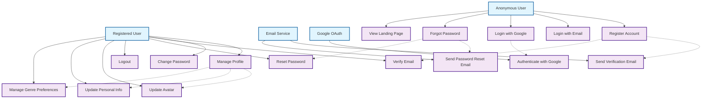

# User Authentication & Profile Management - Use Case Diagram

## Tổng quan

Nhóm chức năng xác thực người dùng bao gồm đăng ký, đăng nhập, quản lý profile và các tính năng bảo mật liên quan.

## Actors

- **Anonymous User** - Người dùng chưa đăng ký
- **Registered User** - Người dùng đã đăng ký
- **Email Service** - Hệ thống gửi email
- **Google OAuth** - Hệ thống xác thực Google

## Use Case Diagram



## Chi tiết các Use Case

### UC1: Register Account

**Actor**: Anonymous User
**Preconditions**: User chưa có tài khoản
**Main Flow**:

1. User điền form đăng ký (email, password, username)
2. Hệ thống validate thông tin
3. Tạo tài khoản với trạng thái chưa xác thực
4. Gửi email xác thực
5. Chuyển hướng đến trang xác thực email

**Alternative Flow**:

- Email đã tồn tại → Hiển thị lỗi
- Password không đủ mạnh → Hiển thị yêu cầu

**Postconditions**: Tài khoản được tạo, email xác thực được gửi

### UC2: Login with Email

**Actor**: Anonymous User
**Preconditions**: User đã có tài khoản
**Main Flow**:

1. User nhập email và password
2. Hệ thống xác thực thông tin
3. Tạo session cho user
4. Chuyển hướng đến trang chủ

**Alternative Flow**:

- Thông tin sai → Hiển thị lỗi
- Tài khoản bị khóa → Hiển thị thông báo

**Postconditions**: User đăng nhập thành công

### UC3: Login with Google

**Actor**: Anonymous User
**Preconditions**: User có tài khoản Google
**Main Flow**:

1. User click "Login with Google"
2. Chuyển hướng đến Google OAuth
3. User xác thực với Google
4. Hệ thống nhận thông tin từ Google
5. Tạo hoặc cập nhật tài khoản
6. Tạo session và chuyển hướng

**Postconditions**: User đăng nhập thành công

### UC4: Forgot Password

**Actor**: Anonymous User
**Preconditions**: User đã có tài khoản
**Main Flow**:

1. User nhập email
2. Hệ thống kiểm tra email tồn tại
3. Tạo password reset token
4. Gửi email reset password
5. Hiển thị thông báo thành công

**Postconditions**: Email reset password được gửi

### UC6: Manage Profile

**Actor**: Registered User
**Preconditions**: User đã đăng nhập
**Main Flow**:

1. User truy cập trang Profile
2. User có thể cập nhật thông tin cá nhân
3. User có thể thay đổi avatar
4. User có thể quản lý genre preferences
5. Lưu thay đổi

**Postconditions**: Thông tin profile được cập nhật

### UC7: Change Password

**Actor**: Registered User
**Preconditions**: User đã đăng nhập
**Main Flow**:

1. User nhập password hiện tại
2. User nhập password mới
3. User xác nhận password mới
4. Hệ thống validate và cập nhật
5. Hiển thị thông báo thành công

**Postconditions**: Password được thay đổi

### UC8: Verify Email

**Actor**: Registered User
**Preconditions**: User đã đăng ký nhưng chưa xác thực email
**Main Flow**:

1. User click link trong email xác thực
2. Hệ thống validate token
3. Cập nhật trạng thái email_verified
4. Hiển thị thông báo thành công

**Postconditions**: Email được xác thực

### UC9: Reset Password

**Actor**: Registered User
**Preconditions**: User đã request reset password
**Main Flow**:

1. User click link trong email reset
2. User nhập password mới
3. User xác nhận password mới
4. Hệ thống cập nhật password
5. Invalidate reset token

**Postconditions**: Password được reset

## Database Models liên quan

```python
# User Model
class User(AbstractUser):
    email = models.EmailField(unique=True)
    avatar_url = models.URLField()
    bio = models.TextField()
    age = models.IntegerField()
    gender = models.CharField()
    location = models.CharField()
    is_email_verified = models.BooleanField(default=False)
    is_google_account = models.BooleanField(default=False)
    user_type = models.CharField(choices=USER_TYPE_CHOICES)

# Email Verification Token
class EmailVerificationToken(models.Model):
    user = models.ForeignKey(User)
    token = models.CharField(unique=True)
    expires_at = models.DateTimeField()

# Password Reset Token
class PasswordResetToken(models.Model):
    user = models.ForeignKey(User)
    token = models.CharField(unique=True)
    expires_at = models.DateTimeField()

# User Favorite Genre
class UserFavoriteGenre(models.Model):
    user = models.ForeignKey(User)
    genre = models.ForeignKey(Genre)
```

## API Endpoints

```
POST /api/auth/register/
POST /api/auth/login/
POST /api/auth/google-login/
POST /api/auth/forgot-password/
POST /api/auth/reset-password/
POST /api/auth/verify-email/
GET  /api/auth/profile/
PUT  /api/auth/profile/
PUT  /api/auth/change-password/
POST /api/auth/logout/
```

## Security Considerations

1. **Password Security**:

   - Mã hóa password với bcrypt
   - Validate password strength
   - Rate limiting cho login attempts

2. **Token Security**:

   - JWT tokens với expiration
   - Secure token storage
   - Token rotation

3. **Email Security**:

   - Email verification required
   - Secure email templates
   - Rate limiting cho email sending

4. **OAuth Security**:
   - Secure OAuth flow
   - Validate OAuth tokens
   - Handle OAuth errors gracefully
