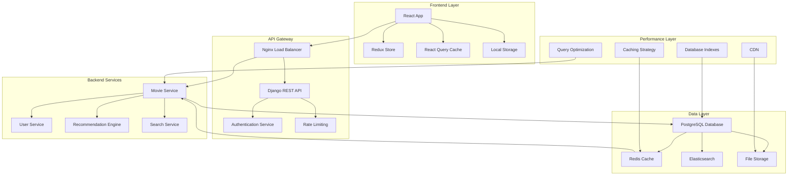
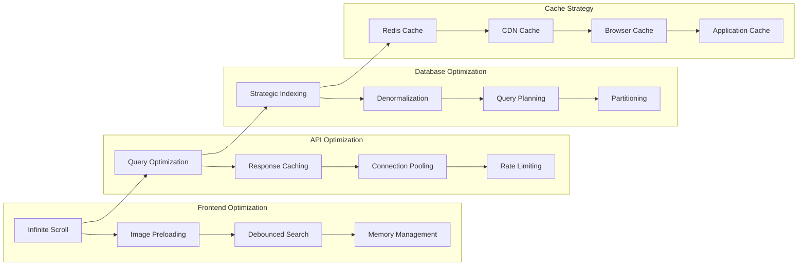
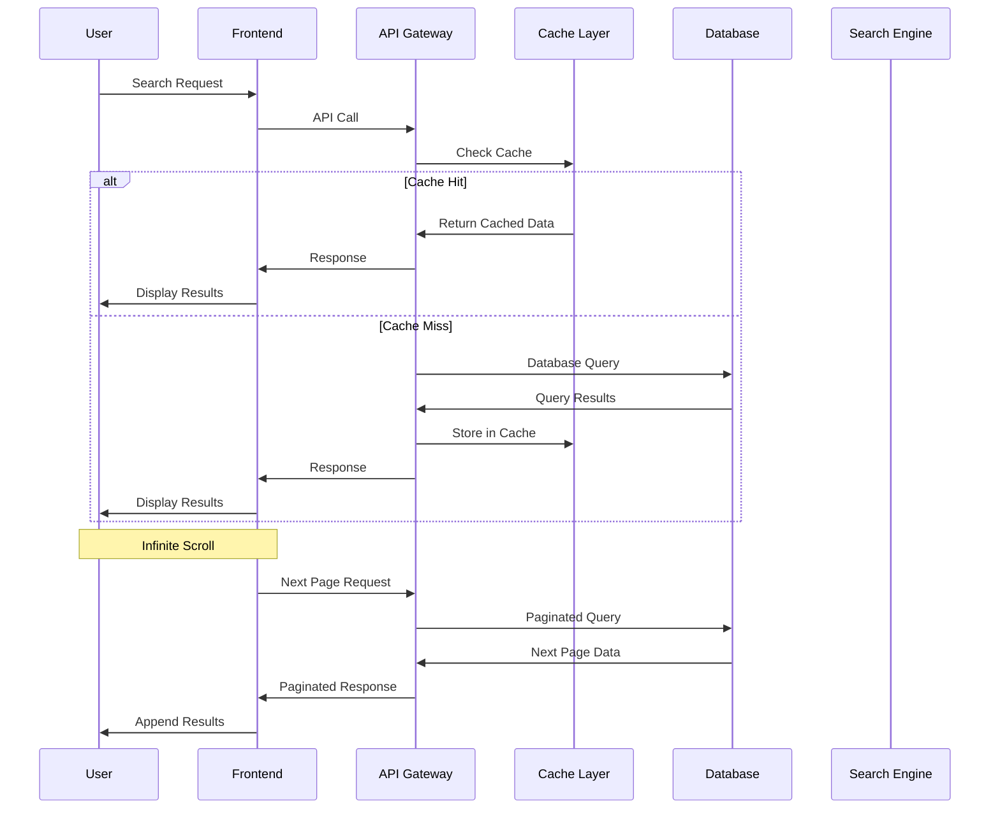
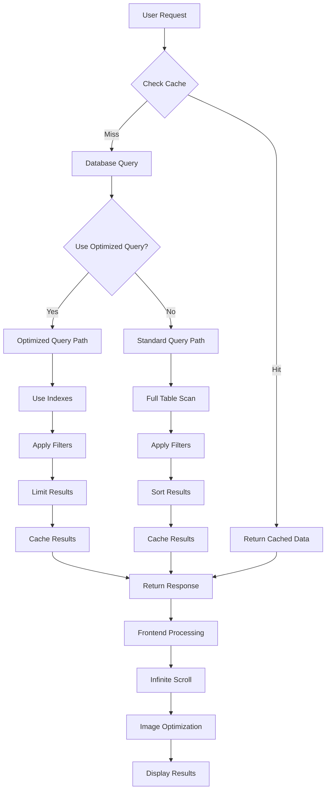
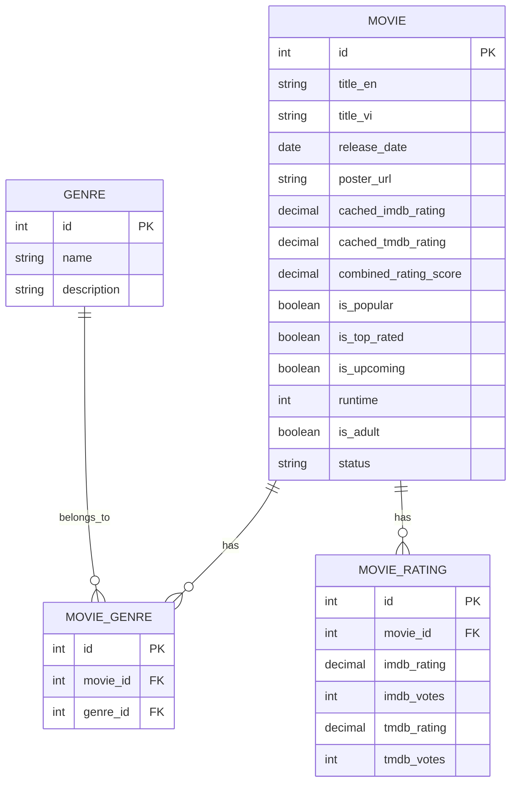
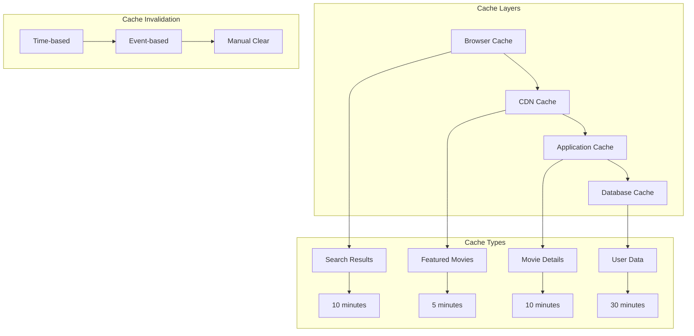
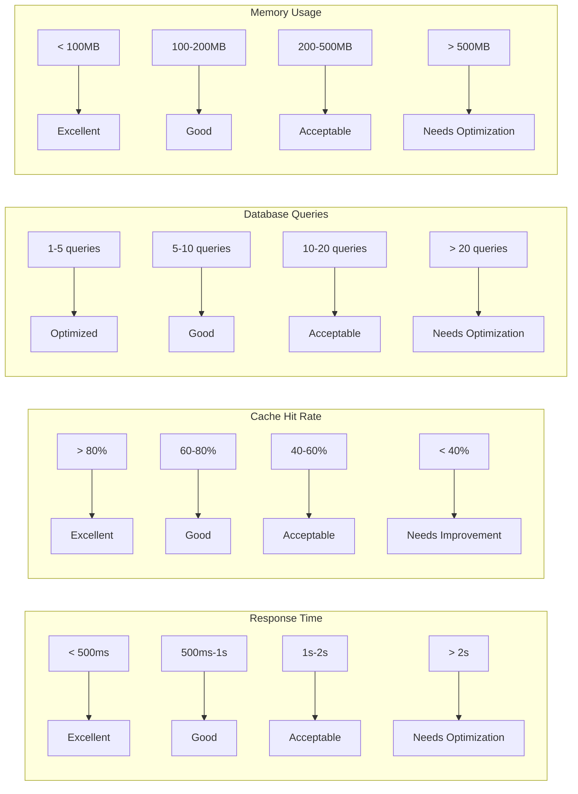

# Kiến Trúc Hệ Thống Movie Recommendation

## 1. Kiến Trúc Tổng Thể

## 2. Kiến Trúc Performance Optimization

## 3. Data Flow Diagram

## 4. Performance Optimization Flow

## 5. Database Schema Optimization

## 6. Cache Strategy Diagram

## 7. Performance Metrics Dashboard

