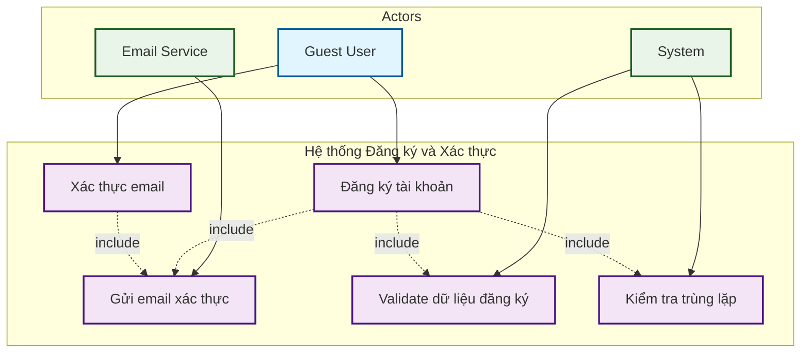
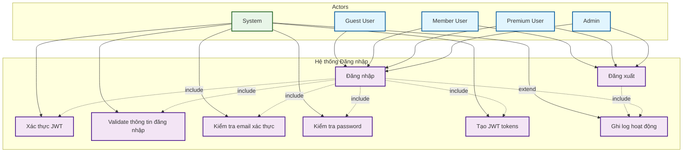
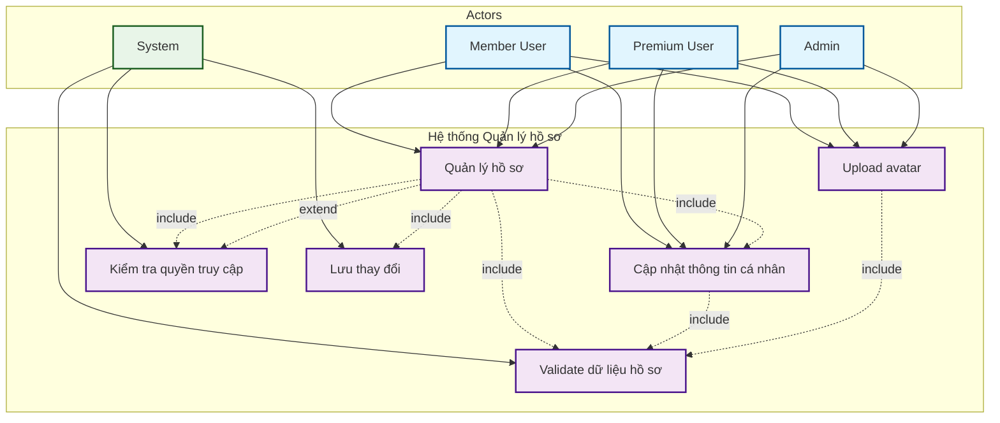
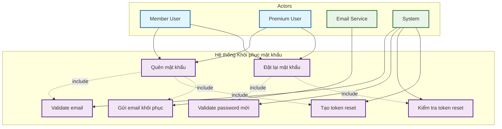
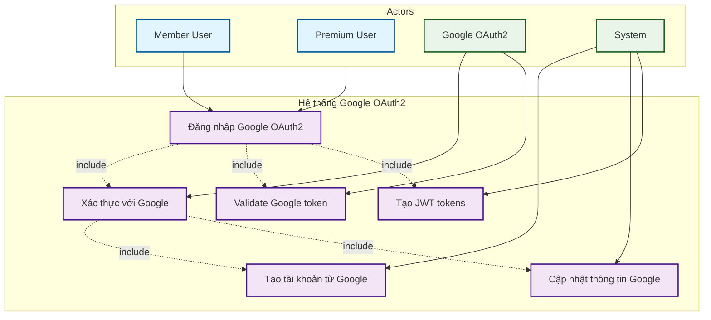
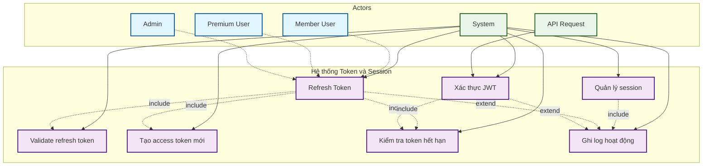

# Biểu đồ Ca sử dụng Tổng quan - Hệ thống Movie Recommendation System

## Lý thuyết về Biểu đồ Ca sử dụng (Use Case Diagram)

### 1. Khái niệm và Định nghĩa

**Biểu đồ ca sử dụng (Use Case Diagram)** là một trong những biểu đồ quan trọng nhất trong UML (Unified Modeling Language), được sử dụng để mô tả các chức năng của hệ thống từ góc nhìn của người dùng. Biểu đồ này giúp xác định rõ ràng các yêu cầu chức năng và cách thức tương tác giữa các tác nhân (actors) với hệ thống.

**Định nghĩa chính thức:**

- **Use Case (Ca sử dụng)**: Là một mô tả về một tập hợp các hành động mà hệ thống thực hiện để tạo ra một kết quả có giá trị cho một tác nhân cụ thể
- **Actor (Tác nhân)**: Là một thực thể bên ngoài hệ thống (có thể là người, hệ thống khác, hoặc thiết bị) tương tác với hệ thống
- **System Boundary (Ranh giới hệ thống)**: Là đường viền xác định phạm vi của hệ thống đang được phân tích

### 2. Các thành phần cơ bản

#### 2.1. Actor (Tác nhân)

- **Biểu diễn**: Hình người que hoặc hình tròn/chữ nhật
- **Vị trí**: Thường đặt ở hai bên của khung hệ thống
- **Phân loại**:
  - **Primary Actor**: Tác nhân chính thực hiện ca sử dụng
  - **Secondary Actor**: Tác nhân phụ hỗ trợ hoặc cung cấp dịch vụ
  - **Human Actor**: Người sử dụng hệ thống
  - **System Actor**: Hệ thống khác hoặc quy trình tự động

#### 2.2. Use Case (Ca sử dụng)

- **Biểu diễn**: Hình bầu dục
- **Vị trí**: Bên trong khung hệ thống
- **Đặc điểm**:
  - Mỗi ca sử dụng đại diện cho một chức năng cụ thể
  - Tên ca sử dụng thường là động từ + danh từ
  - Mô tả "cái gì" hệ thống làm, không phải "làm thế nào"

#### 2.3. System Boundary (Ranh giới hệ thống)

- **Biểu diễn**: Hình chữ nhật lớn bao quanh các ca sử dụng
- **Ý nghĩa**: Xác định phạm vi của hệ thống đang được phân tích
- **Tên hệ thống**: Thường được đặt ở phía trên của khung

### 3. Các mối quan hệ trong Use Case Diagram

#### 3.1. Association (Liên kết)

- **Ký hiệu**: Đường thẳng nối actor với use case
- **Ý nghĩa**: Actor tương tác với use case
- **Đặc điểm**: Có thể có nhiều actor liên kết với một use case

#### 3.2. Include Relationship (Quan hệ bao gồm)

- **Ký hiệu**: Mũi tên nét đứt với nhãn `«include»`
- **Ý nghĩa**: Use case này luôn bao gồm chức năng của use case khác
- **Ví dụ**: "Đăng ký" `«include»` "Đăng nhập"

#### 3.3. Extend Relationship (Quan hệ mở rộng)

- **Ký hiệu**: Mũi tên nét đứt với nhãn `«extend»`
- **Ý nghĩa**: Use case này có thể mở rộng chức năng của use case khác trong điều kiện nhất định
- **Đặc điểm**: Quan hệ tùy chọn, không bắt buộc

#### 3.4. Generalization (Tổng quát hóa)

- **Ký hiệu**: Mũi tên rỗng
- **Ý nghĩa**: Actor hoặc use case con kế thừa từ actor hoặc use case cha
- **Ví dụ**: Premium User kế thừa từ Member User

### 4. Nguyên tắc thiết kế Use Case Diagram

#### 4.1. Nguyên tắc về Actor

- **Tập trung vào vai trò**: Actor đại diện cho vai trò, không phải người cụ thể
- **Phân cấp rõ ràng**: Xác định rõ mối quan hệ kế thừa giữa các actor
- **Bao phủ đầy đủ**: Tất cả các vai trò tương tác với hệ thống phải được xác định

#### 4.2. Nguyên tắc về Use Case

- **Tính độc lập**: Mỗi use case phải có giá trị riêng biệt
- **Tính hoàn chỉnh**: Use case phải mô tả đầy đủ một chức năng
- **Tính rõ ràng**: Tên use case phải dễ hiểu và mô tả chính xác chức năng

#### 4.3. Nguyên tắc về mối quan hệ

- **Tránh phức tạp**: Không nên có quá nhiều mối quan hệ trong một diagram
- **Tính nhất quán**: Sử dụng nhất quán các ký hiệu và quy ước
- **Tính logic**: Các mối quan hệ phải có ý nghĩa logic rõ ràng

### 5. Lợi ích của Use Case Diagram

#### 5.1. Đối với phát triển phần mềm

- **Xác định yêu cầu**: Giúp xác định rõ ràng các yêu cầu chức năng
- **Giao tiếp**: Tạo ngôn ngữ chung giữa các bên liên quan
- **Phạm vi dự án**: Xác định rõ phạm vi và ranh giới của hệ thống

#### 5.2. Đối với thiết kế hệ thống

- **Kiến trúc**: Hỗ trợ thiết kế kiến trúc hệ thống
- **Phân tích**: Giúp phân tích các luồng xử lý
- **Kiểm thử**: Cung cấp cơ sở cho việc thiết kế test case

#### 5.3. Đối với quản lý dự án

- **Lập kế hoạch**: Hỗ trợ lập kế hoạch phát triển
- **Ước lượng**: Giúp ước lượng thời gian và nguồn lực
- **Theo dõi**: Cung cấp cơ sở để theo dõi tiến độ

### 6. Quy trình xây dựng Use Case Diagram

#### 6.1. Bước 1: Xác định Actor

- Phân tích các vai trò tương tác với hệ thống
- Xác định mối quan hệ kế thừa giữa các actor
- Phân loại actor theo mức độ quan trọng

#### 6.2. Bước 2: Xác định Use Case

- Liệt kê các chức năng chính của hệ thống
- Nhóm các chức năng liên quan
- Xác định các use case con và use case mở rộng

#### 6.3. Bước 3: Thiết lập mối quan hệ

- Xác định các mối quan hệ giữa actor và use case
- Thiết lập các mối quan hệ include/extend
- Xác định các mối quan hệ kế thừa

#### 6.4. Bước 4: Tinh chỉnh và hoàn thiện

- Kiểm tra tính đầy đủ và chính xác
- Tối ưu hóa layout và bố cục
- Thêm các ghi chú và mô tả cần thiết

### 7. Ứng dụng trong hệ thống Movie Recommendation

Trong hệ thống Movie Recommendation System, Use Case Diagram được sử dụng để:

#### 7.1. Phân tích yêu cầu người dùng

- Xác định các loại người dùng khác nhau (Guest, Member, Premium, Moderator, Admin)
- Mô tả các chức năng mà từng loại người dùng có thể thực hiện
- Xác định các quy trình tự động của hệ thống

#### 7.2. Thiết kế kiến trúc hệ thống

- Hỗ trợ thiết kế các module chức năng
- Xác định các interface và API cần thiết
- Thiết kế cơ sở dữ liệu và luồng dữ liệu

#### 7.3. Lập kế hoạch phát triển

- Ước lượng thời gian phát triển cho từng chức năng
- Xác định thứ tự ưu tiên phát triển
- Lập kế hoạch kiểm thử và triển khai

---

# Sơ đồ Use Case - Movie Recommendation System

## Tổng quan hệ thống

Hệ thống Movie Recommendation System là một nền tảng toàn diện cho việc quản lý, khuyến nghị và tương tác với phim, bao gồm các chức năng từ cơ bản đến nâng cao cho nhiều loại người dùng khác nhau.

## Các Actor chính

### 1. **Guest User (Khách vãng lai)**

- Người dùng chưa đăng ký/đăng nhập
- Có quyền truy cập hạn chế

### 2. **Member User (Thành viên cơ bản)**

- Người dùng đã đăng ký tài khoản miễn phí
- Có thể sử dụng các tính năng cơ bản

### 3. **Premium User (Thành viên cao cấp)**

- **Premium Basic**: Gói cơ bản trả phí
- **Premium Standard**: Gói tiêu chuẩn trả phí
- **Premium VIP**: Gói VIP trả phí
- Có quyền truy cập các tính năng nâng cao

### 4. **Moderator (Người kiểm duyệt)**

- Chịu trách nhiệm kiểm duyệt nội dung
- Quản lý báo cáo và phản hồi

### 5. **Admin (Quản trị viên)**

- Quản lý toàn bộ hệ thống
- Có quyền cao nhất

### 6. **System (Hệ thống)**

- Các quy trình tự động
- Thuật toán khuyến nghị

## Sơ đồ Use Case chi tiết

```mermaid
graph TB
    %% Actors - Arranged horizontally at the top
    subgraph Actors
        GU[Guest User]
        MU[Member User]
        PU[Premium User]
        MO[Moderator]
        AD[Admin]
        SY[System]
    end

    %% Guest User Use Cases - Left side
    subgraph GuestUseCases ["Guest User Use Cases"]
        UC1[Đăng ký tài khoản]
        UC2[Đăng nhập]
        UC3[Xem danh sách phim]
        UC4[Tìm kiếm phim]
        UC5[Xem chi tiết phim]
        UC6[Xem trailer]
        UC7[Xem đánh giá công khai]
        UC8[Xem thông tin diễn viên]
        UC9[Xem phim phổ biến]
        UC10[Xem phim đánh giá cao]
    end

    %% Member User Use Cases - Center left
    subgraph MemberUseCases ["Member User Use Cases"]
        UC11[Quản lý hồ sơ cá nhân]
        UC12[Đánh giá phim]
        UC13[Viết review]
        UC14[Thêm phim vào danh sách yêu thích]
        UC15[Quản lý watchlist]
        UC16[Thêm thể loại yêu thích]
        UC17[Xem gợi ý phim cá nhân]
        UC18[Bình luận phim]
        UC19[Like/Unlike bình luận]
        UC20[Báo cáo review]
        UC21[Xem lịch sử tìm kiếm]
        UC22[Quản lý avatar]
        UC23[Xác thực email]
        UC24[Đặt lại mật khẩu]
        UC25[Xem thống kê cá nhân]
    end

    %% Premium User Use Cases - Center right
    subgraph PremiumUseCases ["Premium User Use Cases"]
        UC26[Nâng cấp gói premium]
        UC27[Xem phim sắp ra mắt]
        UC28[Xem gợi ý nâng cao]
        UC29[Xem thống kê chi tiết]
        UC30[Truy cập tính năng VIP]
    end

    %% Moderator Use Cases - Right side
    subgraph ModeratorUseCases ["Moderator Use Cases"]
        UC31[Xem dashboard kiểm duyệt]
        UC32[Kiểm duyệt review]
        UC33[Xử lý báo cáo]
        UC34[Phân tích spoiler]
        UC35[Đưa ra phản hồi kiểm duyệt]
        UC36[Xem thống kê kiểm duyệt]
        UC37[Quản lý hàng đợi kiểm duyệt]
        UC38[Thiết lập cấu hình kiểm duyệt]
        UC39[Xem phân tích hiệu suất]
        UC40[Quản lý review tự động đánh dấu]
    end

    %% Admin Use Cases - Bottom left
    subgraph AdminUseCases ["Admin Use Cases"]
        UC41[Xem dashboard quản trị]
        UC42[Quản lý người dùng]
        UC43[Quản lý phim]
        UC44[Quản lý thể loại]
        UC45[Quản lý diễn viên]
        UC46[Quản lý gói subscription]
        UC47[Xem thống kê hệ thống]
        UC48[Quản lý cấu hình hệ thống]
        UC49[Enrich dữ liệu phim]
        UC50[Quản lý chất lượng phim]
        UC51[Lên lịch xuất bản phim]
        UC52[Quản lý chiến dịch marketing]
        UC53[Xem metrics hiệu suất]
        UC54[Quản lý backup dữ liệu]
        UC55[Quản lý logs hệ thống]
    end

    %% System Use Cases - Bottom right
    subgraph SystemUseCases ["System Use Cases"]
        UC56[Tính toán gợi ý phim]
        UC57[Phát hiện spoiler tự động]
        UC58[Cập nhật rating cache]
        UC59[Tính toán metrics hiệu suất]
        UC60[Đồng bộ dữ liệu từ API bên ngoài]
        UC61[Gửi email thông báo]
        UC62[Backup dữ liệu tự động]
        UC63[Làm sạch cache]
        UC64[Tính toán trending score]
        UC65[Đánh giá chất lượng phim]
    end

    %% Actor connections to their use cases
    GU --> GuestUseCases
    MU --> MemberUseCases
    PU --> PremiumUseCases
    MO --> ModeratorUseCases
    AD --> AdminUseCases
    SY --> SystemUseCases

    %% Inheritance relationships - Cleaner layout
    MU -.->|extends| GU
    PU -.->|extends| MU
    MO -.->|extends| MU
    AD -.->|extends| MO

    %% Key relationships - Highlighted with different colors
    UC13 -.->|includes| UC56
    UC32 -.->|includes| UC57
    UC43 -.->|includes| UC60
    UC47 -.->|includes| UC59

    %% Extend relationships
    UC26 -.->|extends| UC11
    UC31 -.->|extends| UC25
    UC41 -.->|extends| UC31

    %% System triggers - Important relationships
    UC13 -.->|triggers| UC57
    UC13 -.->|triggers| UC58
    UC43 -.->|triggers| UC65
    UC43 -.->|triggers| UC64

    %% Styling
    classDef actorStyle fill:#e1f5fe,stroke:#01579b,stroke-width:2px
    classDef guestStyle fill:#f3e5f5,stroke:#4a148c,stroke-width:2px
    classDef memberStyle fill:#e8f5e8,stroke:#1b5e20,stroke-width:2px
    classDef premiumStyle fill:#fff3e0,stroke:#e65100,stroke-width:2px
    classDef moderatorStyle fill:#fce4ec,stroke:#880e4f,stroke-width:2px
    classDef adminStyle fill:#f1f8e9,stroke:#33691e,stroke-width:2px
    classDef systemStyle fill:#fafafa,stroke:#424242,stroke-width:2px

    class GU,MU,PU,MO,AD,SY actorStyle
    class UC1,UC2,UC3,UC4,UC5,UC6,UC7,UC8,UC9,UC10 guestStyle
    class UC11,UC12,UC13,UC14,UC15,UC16,UC17,UC18,UC19,UC20,UC21,UC22,UC23,UC24,UC25 memberStyle
    class UC26,UC27,UC28,UC29,UC30 premiumStyle
    class UC31,UC32,UC33,UC34,UC35,UC36,UC37,UC38,UC39,UC40 moderatorStyle
    class UC41,UC42,UC43,UC44,UC45,UC46,UC47,UC48,UC49,UC50,UC51,UC52,UC53,UC54,UC55 adminStyle
    class UC56,UC57,UC58,UC59,UC60,UC61,UC62,UC63,UC64,UC65 systemStyle
```

## Bảng mô tả Use Case theo Actor

| **STT** | **Tên Tác Nhân** | **Mô Tả**                                                  |
| ------- | ---------------- | ---------------------------------------------------------- |
| 1       | Guest User       | Người dùng chưa đăng ký, có quyền truy cập hạn chế         |
| 2       | Member User      | Người dùng đã đăng ký, có thể sử dụng các tính năng cơ bản |
| 3       | Premium User     | Người dùng trả phí, có quyền truy cập tính năng nâng cao   |
| 4       | Moderator        | Người kiểm duyệt nội dung, quản lý báo cáo                 |
| 5       | Admin            | Quản trị viên, có quyền quản lý toàn bộ hệ thống           |
| 6       | System           | Hệ thống tự động, thực hiện các quy trình backend          |

## Bảng tóm tắt Use Case theo Actor

| **Actor**        | **Số lượng Use Case** | **Mô tả vai trò**                                          |
| ---------------- | --------------------- | ---------------------------------------------------------- |
| **Guest User**   | 10                    | Người dùng chưa đăng ký, có quyền truy cập hạn chế         |
| **Member User**  | 15                    | Người dùng đã đăng ký, có thể sử dụng các tính năng cơ bản |
| **Premium User** | 5                     | Người dùng trả phí, có quyền truy cập tính năng nâng cao   |
| **Moderator**    | 10                    | Người kiểm duyệt nội dung, quản lý báo cáo                 |
| **Admin**        | 15                    | Quản trị viên, có quyền quản lý toàn bộ hệ thống           |
| **System**       | 10                    | Hệ thống tự động, thực hiện các quy trình backend          |

## Mô tả tổng quan từng Actor

### **1. Guest User (Người dùng vãng lai)**

**Mô tả chi tiết:**

- Là người dùng ứng dụng có quyền truy cập tới những chức năng cơ bản như khám phá phim theo hạng mục, tìm kiếm, xem chi tiết phim, xem trailer, xem đánh giá công khai, xem thông tin diễn viên, xem danh sách phim phổ biến và đánh giá cao
- Người dùng vãng lai có thể đăng ký tài khoản của ứng dụng để trở thành Member User
- Không cần xác thực để truy cập các tính năng cơ bản
- Dữ liệu tương tác được lưu trữ tạm thời trong session

**Chức năng cụ thể:**

- Khám phá phim theo thể loại, năm, đánh giá
- Tìm kiếm phim theo tên, diễn viên, đạo diễn
- Xem chi tiết phim với thông tin đầy đủ
- Xem trailer và hình ảnh phim
- Xem đánh giá và bình luận công khai
- Xem thông tin diễn viên và đoàn làm phim
- Xem danh sách phim phổ biến, đánh giá cao
- Đăng ký tài khoản mới
- Đăng nhập vào hệ thống

---

### **2. Member User (Người dùng đăng nhập)**

**Mô tả chi tiết:**

- Kế thừa các chức năng của người dùng vãng lai, bổ sung thêm những chức năng nâng cao như đánh giá phim, viết review, lưu trữ phim vào danh sách yêu thích, quản lý watchlist, nhận gợi ý cá nhân hóa, tương tác xã hội
- Dữ liệu người dùng được lưu trữ trong PostgreSQL và được cập nhật theo thời gian thực
- Có hồ sơ cá nhân với avatar, thông tin liên hệ, sở thích
- Nhận gợi ý phim dựa trên lịch sử tương tác và sở thích

**Chức năng cụ thể:**

- Tất cả chức năng của Guest User
- Quản lý hồ sơ cá nhân (avatar, bio, thông tin liên hệ)
- Đánh giá phim từ 0-5 sao
- Viết review chi tiết về phim
- Thêm/xóa phim vào danh sách yêu thích
- Tạo và quản lý watchlist với trạng thái (đã xem, đang xem, muốn xem)
- Thêm/xóa thể loại phim yêu thích
- Nhận gợi ý phim cá nhân hóa
- Bình luận phim và tương tác với bình luận khác
- Like/Unlike bình luận
- Báo cáo nội dung vi phạm
- Xem lịch sử tìm kiếm và hoạt động
- Xác thực email và đặt lại mật khẩu
- Xem thống kê hoạt động cá nhân

---

### **3. Premium User (Người dùng cao cấp)**

**Mô tả chi tiết:**

- Kế thừa tất cả chức năng của Member User, bổ sung thêm những tính năng độc quyền như gợi ý nâng cao, nội dung sớm, thống kê chi tiết, trải nghiệm ưu tiên
- Dữ liệu premium được lưu trữ trong PostgreSQL với các gói subscription khác nhau (Basic, Standard, VIP)
- Được ưu tiên trong hệ thống với tốc độ tải nhanh hơn và không quảng cáo
- Nhận hỗ trợ khách hàng ưu tiên

**Chức năng cụ thể:**

- Tất cả chức năng của Member User
- Nâng cấp gói premium với thanh toán qua PayPal
- Xem danh sách phim sắp ra mắt
- Nhận gợi ý phim với thuật toán nâng cao
- Xem thống kê chi tiết về hoạt động và sở thích
- Truy cập tính năng VIP độc quyền
- Tốc độ tải nhanh hơn và không quảng cáo
- Hỗ trợ khách hàng ưu tiên

---

### **4. Moderator (Người kiểm duyệt)**

**Mô tả chi tiết:**

- Là người dùng có quyền đặc biệt để kiểm duyệt nội dung, xử lý báo cáo, phân tích spoiler và quản lý chất lượng nội dung trên hệ thống
- Được đào tạo về chính sách nội dung và quy tắc cộng đồng
- Làm việc theo ca với hệ thống phân công và ưu tiên
- Dữ liệu kiểm duyệt được lưu trữ trong PostgreSQL với lịch sử đầy đủ

**Chức năng cụ thể:**

- Tất cả chức năng của Member User
- Xem dashboard kiểm duyệt với tổng quan công việc
- Kiểm duyệt review và bình luận (duyệt/từ chối)
- Xử lý báo cáo vi phạm từ người dùng
- Phân tích và đánh dấu nội dung có spoiler
- Đưa ra phản hồi kiểm duyệt cho người dùng
- Xem thống kê kiểm duyệt và hiệu suất
- Quản lý hàng đợi kiểm duyệt với ưu tiên
- Thiết lập cấu hình kiểm duyệt tự động
- Xem phân tích hiệu suất kiểm duyệt
- Quản lý review được đánh dấu tự động

---

### **5. Admin (Quản trị hệ thống)**

**Mô tả chi tiết:**

- Nắm những chức năng quản trị như quản lý người dùng, quản lý thông tin lưu trữ, xử lý lỗi khi xảy ra, quản lý nội dung, cấu hình hệ thống, phân tích tổng quan
- Có quyền cao nhất trong hệ thống với toàn quyền truy cập và quản lý
- Thường là nhân viên kỹ thuật hoặc quản lý của hệ thống
- Dữ liệu quản trị được lưu trữ trong PostgreSQL với logs chi tiết

**Chức năng cụ thể:**

- Tất cả chức năng của Moderator
- Xem dashboard quản trị với tổng quan hệ thống
- Quản lý người dùng (xem, chỉnh sửa, xóa, cấm)
- Quản lý phim (thêm, chỉnh sửa, xóa, xuất bản)
- Quản lý thể loại và diễn viên
- Quản lý gói subscription và thanh toán
- Xem thống kê tổng quan hệ thống
- Quản lý cấu hình hệ thống
- Enrich dữ liệu phim từ API bên ngoài (TMDB, IMDB)
- Quản lý chất lượng dữ liệu phim
- Lên lịch xuất bản phim
- Quản lý chiến dịch marketing
- Xem metrics hiệu suất hệ thống
- Quản lý backup dữ liệu
- Quản lý logs hệ thống

---

### **6. System (Hệ thống tự động)**

**Mô tả chi tiết:**

- Là các quy trình tự động hoạt động 24/7 để duy trì hệ thống, tính toán gợi ý, phát hiện nội dung vi phạm, tối ưu hiệu suất và đồng bộ dữ liệu
- Sử dụng thuật toán AI và machine learning để xử lý dữ liệu lớn
- Hoạt động độc lập không cần can thiệp con người
- Dữ liệu hệ thống được lưu trữ trong PostgreSQL, Redis cache và Elasticsearch

**Chức năng cụ thể:**

- Tính toán gợi ý phim cho người dùng dựa trên thuật toán khuyến nghị
- Phát hiện spoiler tự động trong review và bình luận
- Cập nhật rating cache để tăng hiệu suất truy vấn
- Tính toán metrics hiệu suất của phim và người dùng
- Đồng bộ dữ liệu từ API bên ngoài (TMDB, IMDB)
- Gửi email thông báo tự động
- Backup dữ liệu tự động theo lịch trình
- Làm sạch cache và dữ liệu cũ
- Tính toán trending score cho phim
- Đánh giá chất lượng dữ liệu phim tự động

## Chi tiết các Use Case

### **Guest User Use Cases**

1. **Đăng ký tài khoản**

   - Mô tả: Khách có thể tạo tài khoản mới
   - Precondition: Chưa có tài khoản
   - Postcondition: Tài khoản được tạo, email xác thực được gửi

2. **Đăng nhập**

   - Mô tả: Khách đăng nhập vào hệ thống
   - Precondition: Có tài khoản hợp lệ
   - Postcondition: Phiên đăng nhập được tạo

3. **Xem danh sách phim**

   - Mô tả: Xem danh sách phim với phân trang và lọc
   - Precondition: Không
   - Postcondition: Hiển thị danh sách phim

4. **Tìm kiếm phim**

   - Mô tả: Tìm kiếm phim theo tên, thể loại, diễn viên
   - Precondition: Không
   - Postcondition: Hiển thị kết quả tìm kiếm

5. **Xem chi tiết phim**
   - Mô tả: Xem thông tin chi tiết của một phim
   - Precondition: Phim tồn tại
   - Postcondition: Hiển thị thông tin phim

### **Member User Use Cases**

6. **Quản lý hồ sơ cá nhân**

   - Mô tả: Cập nhật thông tin cá nhân, avatar, bio
   - Precondition: Đã đăng nhập
   - Postcondition: Thông tin được cập nhật

7. **Đánh giá phim**

   - Mô tả: Đánh giá phim từ 0-5 sao
   - Precondition: Đã đăng nhập, phim tồn tại
   - Postcondition: Đánh giá được lưu

8. **Viết review**

   - Mô tả: Viết đánh giá chi tiết về phim
   - Precondition: Đã đăng nhập, phim tồn tại
   - Postcondition: Review được tạo, có thể được kiểm duyệt

9. **Thêm phim vào danh sách yêu thích**

   - Mô tả: Thêm/xóa phim khỏi danh sách yêu thích
   - Precondition: Đã đăng nhập, phim tồn tại
   - Postcondition: Danh sách yêu thích được cập nhật

10. **Quản lý watchlist**
    - Mô tả: Tạo, quản lý danh sách phim muốn xem
    - Precondition: Đã đăng nhập
    - Postcondition: Watchlist được cập nhật

### **Premium User Use Cases**

11. **Nâng cấp gói premium**

    - Mô tả: Mua gói premium để truy cập tính năng nâng cao
    - Precondition: Đã đăng nhập, có phương thức thanh toán
    - Postcondition: Tài khoản được nâng cấp

12. **Xem phim sắp ra mắt**

    - Mô tả: Xem danh sách phim sắp ra mắt
    - Precondition: Có gói premium
    - Postcondition: Hiển thị danh sách phim sắp ra mắt

13. **Xem gợi ý nâng cao**
    - Mô tả: Xem gợi ý phim dựa trên thuật toán nâng cao
    - Precondition: Có gói premium
    - Postcondition: Hiển thị gợi ý nâng cao

### **Moderator Use Cases**

14. **Xem dashboard kiểm duyệt**

    - Mô tả: Xem tổng quan về công việc kiểm duyệt
    - Precondition: Có quyền moderator
    - Postcondition: Hiển thị dashboard

15. **Kiểm duyệt review**

    - Mô tả: Duyệt/từ chối review từ người dùng
    - Precondition: Có quyền moderator, có review cần duyệt
    - Postcondition: Review được xử lý

16. **Xử lý báo cáo**

    - Mô tả: Xử lý báo cáo về review vi phạm
    - Precondition: Có quyền moderator, có báo cáo
    - Postcondition: Báo cáo được xử lý

17. **Phân tích spoiler**
    - Mô tả: Phân tích và đánh dấu review có spoiler
    - Precondition: Có quyền moderator
    - Postcondition: Review được đánh dấu spoiler

### **Admin Use Cases**

18. **Xem dashboard quản trị**

    - Mô tả: Xem tổng quan hệ thống
    - Precondition: Có quyền admin
    - Postcondition: Hiển thị dashboard admin

19. **Quản lý người dùng**

    - Mô tả: Xem, chỉnh sửa, xóa người dùng
    - Precondition: Có quyền admin
    - Postcondition: Thông tin người dùng được cập nhật

20. **Quản lý phim**

    - Mô tả: Thêm, chỉnh sửa, xóa phim
    - Precondition: Có quyền admin
    - Postcondition: Dữ liệu phim được cập nhật

21. **Enrich dữ liệu phim**

    - Mô tả: Bổ sung thông tin phim từ API bên ngoài
    - Precondition: Có quyền admin, phim tồn tại
    - Postcondition: Dữ liệu phim được bổ sung

22. **Quản lý chất lượng phim**
    - Mô tả: Đánh giá và cải thiện chất lượng dữ liệu phim
    - Precondition: Có quyền admin
    - Postcondition: Chất lượng dữ liệu được cải thiện

### **System Use Cases**

23. **Tính toán gợi ý phim**

    - Mô tả: Chạy thuật toán khuyến nghị
    - Precondition: Có dữ liệu người dùng và phim
    - Postcondition: Gợi ý được cập nhật

24. **Phát hiện spoiler tự động**

    - Mô tả: Tự động phát hiện spoiler trong review
    - Precondition: Có review mới
    - Postcondition: Review được đánh dấu spoiler

25. **Cập nhật rating cache**

    - Mô tả: Cập nhật cache rating để tăng hiệu suất
    - Precondition: Có rating mới
    - Postcondition: Cache được cập nhật

26. **Tính toán metrics hiệu suất**

    - Mô tả: Tính toán các chỉ số hiệu suất của phim
    - Precondition: Có dữ liệu tương tác
    - Postcondition: Metrics được cập nhật

27. **Đồng bộ dữ liệu từ API bên ngoài**
    - Mô tả: Đồng bộ dữ liệu từ TMDB, IMDB
    - Precondition: Có kết nối internet
    - Postcondition: Dữ liệu được đồng bộ

## Luồng xử lý chính

### **Luồng đăng ký và xác thực**

1. Guest User đăng ký tài khoản
2. System gửi email xác thực
3. User xác thực email
4. User trở thành Member User

### **Luồng đánh giá và review**

1. Member User xem phim
2. User đánh giá phim
3. User viết review
4. System phát hiện spoiler tự động
5. Review được gửi đến hàng đợi kiểm duyệt
6. Moderator kiểm duyệt review
7. Review được xuất bản hoặc từ chối

### **Luồng khuyến nghị phim**

1. User tương tác với phim
2. System thu thập dữ liệu tương tác
3. System tính toán gợi ý
4. User nhận gợi ý phim cá nhân

### **Luồng quản lý nội dung**

1. Admin thêm phim mới
2. System enrich dữ liệu từ API bên ngoài
3. Admin kiểm tra và chỉnh sửa
4. Phim được xuất bản
5. System tính toán metrics hiệu suất

## Quyền truy cập

### **Guest User**

- Xem phim công khai
- Tìm kiếm cơ bản
- Đăng ký/đăng nhập

### **Member User**

- Tất cả quyền của Guest
- Đánh giá và review
- Quản lý hồ sơ cá nhân
- Tạo watchlist
- Bình luận

### **Premium User**

- Tất cả quyền của Member
- Truy cập tính năng nâng cao
- Gợi ý cá nhân nâng cao
- Thống kê chi tiết

### **Moderator**

- Tất cả quyền của Member
- Kiểm duyệt nội dung
- Xử lý báo cáo
- Quản lý spoiler

### **Admin**

- Tất cả quyền của Moderator
- Quản lý toàn bộ hệ thống
- Quản lý người dùng
- Cấu hình hệ thống
- Enrich dữ liệu

## Kết luận

Sơ đồ use case này thể hiện một hệ thống phức tạp với nhiều loại người dùng và chức năng đa dạng. Hệ thống được thiết kế để hỗ trợ từ người dùng cơ bản đến quản trị viên cao cấp, với các tính năng tự động hóa và thuật toán thông minh để cải thiện trải nghiệm người dùng.

---

## Biểu đồ Use Case Chi tiết - Từng chức năng Authentication

### 1. Use Case Diagram: Đăng ký và Xác thực Email

### 2. Use Case Diagram: Đăng nhập và Đăng xuất

### 3. Use Case Diagram: Quản lý hồ sơ

### 4. Use Case Diagram: Khôi phục mật khẩu

### 5. Use Case Diagram: Đăng nhập Google OAuth2

### 6. Use Case Diagram: Quản lý Token và Session

### Bảng tóm tắt Use Case Diagrams

| STT | Use Case Diagram          | Use Cases chính | Actors | Mối quan hệ chính     |
| --- | ------------------------- | --------------- | ------ | --------------------- |
| 1   | Đăng ký và Xác thực Email | 5               | 3      | Include relationships |
| 2   | Đăng nhập và Đăng xuất    | 8               | 5      | Include + Extend      |
| 3   | Quản lý hồ sơ             | 6               | 4      | Include + Extend      |
| 4   | Khôi phục mật khẩu        | 7               | 4      | Include relationships |
| 5   | Google OAuth2             | 6               | 4      | Include relationships |
| 6   | Token và Session          | 7               | 5      | Include + Extend      |

### Mô tả chi tiết các Use Case

#### **1. Đăng ký và Xác thực Email**

- **Use Cases**: Đăng ký tài khoản, Xác thực email, Gửi email xác thực, Validate dữ liệu, Kiểm tra trùng lặp
- **Actors**: Guest User, Email Service, System
- **Mối quan hệ**: Đăng ký include tất cả các use case khác

#### **2. Đăng nhập và Đăng xuất**

- **Use Cases**: Đăng nhập, Đăng xuất, Xác thực JWT, Validate thông tin, Kiểm tra email, Kiểm tra password, Tạo JWT, Ghi log
- **Actors**: Guest/Member/Premium/Admin User, System
- **Mối quan hệ**: Đăng nhập include validation và tạo token, extend ghi log

#### **3. Quản lý hồ sơ**

- **Use Cases**: Quản lý hồ sơ, Cập nhật thông tin, Upload avatar, Validate dữ liệu, Kiểm tra quyền, Lưu thay đổi
- **Actors**: Member/Premium/Admin User, System
- **Mối quan hệ**: Quản lý hồ sơ include các chức năng con, extend kiểm tra quyền

#### **4. Khôi phục mật khẩu**

- **Use Cases**: Quên mật khẩu, Đặt lại mật khẩu, Gửi email, Validate email, Validate password, Kiểm tra token, Tạo token
- **Actors**: Member/Premium User, Email Service, System
- **Mối quan hệ**: Quên mật khẩu include gửi email, Đặt lại include validate

#### **5. Google OAuth2**

- **Use Cases**: Đăng nhập Google, Xác thực Google, Tạo tài khoản, Cập nhật thông tin, Validate token, Tạo JWT
- **Actors**: Member/Premium User, Google OAuth2, System
- **Mối quan hệ**: Đăng nhập Google include tất cả các bước xác thực

#### **6. Token và Session**

- **Use Cases**: Refresh Token, Xác thực JWT, Quản lý session, Validate token, Tạo token mới, Kiểm tra hết hạn, Ghi log
- **Actors**: System, API Request, Users (indirect)
- **Mối quan hệ**: Refresh include validate và tạo token, extend ghi log

### Đặc điểm của Use Case Diagrams

#### **Include Relationships (`«include»`):**

- **Bắt buộc**: Use case này luôn bao gồm use case khác
- **Ví dụ**: Đăng nhập `«include»` Xác thực JWT

#### **Extend Relationships (`«extend»`):**

- **Tùy chọn**: Use case này có thể mở rộng use case khác
- **Ví dụ**: Đăng nhập `«extend»` Ghi log hoạt động

#### **Generalization:**

- **Kế thừa**: Actor con kế thừa từ actor cha
- **Ví dụ**: Premium User kế thừa từ Member User

### Lợi ích của việc chia nhỏ Use Case Diagrams

1. **Dễ hiểu**: Mỗi diagram tập trung vào một chức năng cụ thể
2. **Dễ bảo trì**: Có thể cập nhật từng phần riêng biệt
3. **Tái sử dụng**: Các use case có thể được sử dụng trong nhiều diagram
4. **Phân tích chi tiết**: Hiểu rõ mối quan hệ giữa các use case
5. **Thiết kế hệ thống**: Hỗ trợ việc thiết kế kiến trúc và API
