# 3.1.1.14. Chức năng quản lý kiểm duyệt (Moderator)

## Mô tả chức năng

Hệ thống quản lý kiểm duyệt dành cho Moderator cung cấp khả năng kiểm soát nội dung toàn diện với các công cụ chuyên dụng. Moderator có thể xử lý nội dung bị báo cáo, phát hiện spoiler bằng AI, quản lý queue kiểm duyệt với Kanban board, và thực hiện bulk moderation operations. Hệ thống hỗ trợ học từ phản hồi để cải thiện AI, cung cấp thống kê hiệu suất, và quản lý người dùng có vấn đề.

## Use Case Diagram

```mermaid
graph TD
    %% Actors
    Moderator[👨‍💼 Moderator]
    RegisteredUser[👤 Registered User]
    AISystem[🤖 AI Spoiler Detection]
    BackgroundSystem[⚙️ Background System]
    AnalyticsEngine[📊 Analytics Engine]

    subgraph "3.1.1.14 - QUẢN LÝ KIỂM DUYỆT (MODERATOR)"
        %% Content Moderation
        UC_ModeratorDashboard["Dashboard Moderator<br/>- Overview statistics<br/>- Queue status<br/>- Performance metrics<br/>- Recent activities"]
        UC_ModerationQueue["Quản lý Queue kiểm duyệt<br/>- Pending reviews<br/>- Priority sorting<br/>- Status tracking<br/>- Workflow management"]
        UC_KanbanBoard["Kanban Board<br/>- Visual workflow<br/>- Drag-drop actions<br/>- Status columns<br/>- Progress tracking"]

        %% Review Management
        UC_ReviewModeration["Kiểm duyệt đánh giá<br/>- Content review<br/>- Quality assessment<br/>- Policy compliance<br/>- Decision making"]
        UC_ApproveReview["Duyệt đánh giá<br/>- Content approval<br/>- Quality validation<br/>- Policy compliance<br/>- Public visibility"]
        UC_RejectReview["Từ chối đánh giá<br/>- Policy violation<br/>- Quality issues<br/>- Rejection reasons<br/>- User notification"]
        UC_EditReview["Chỉnh sửa đánh giá<br/>- Content editing<br/>- Quality improvement<br/>- Policy compliance<br/>- User notification"]

        %% Spoiler Detection
        UC_SpoilerDetection["Phát hiện Spoiler<br/>- AI analysis<br/>- Pattern recognition<br/>- Confidence scoring<br/>- Auto-flagging"]
        UC_AutoMarkedReviews["Đánh giá tự động gắn cờ<br/>- AI-flagged content<br/>- High confidence flags<br/>- Manual review needed<br/>- Status tracking"]
        UC_SpoilerAnalysis["Phân tích Spoiler<br/>- Content analysis<br/>- Context evaluation<br/>- Severity assessment<br/>- Decision support"]
        UC_SpoilerStatistics["Thống kê Spoiler<br/>- Detection rates<br/>- Accuracy metrics<br/>- Trend analysis<br/>- Performance tracking"]

        %% Bulk Operations
        UC_BulkModeration["Kiểm duyệt hàng loạt<br/>- Mass approval<br/>- Batch rejection<br/>- Bulk editing<br/>- Efficiency tools"]
        UC_BulkApprove["Duyệt hàng loạt<br/>- Multi-select approval<br/>- Batch processing<br/>- Status update<br/>- Notification sending"]
        UC_BulkReject["Từ chối hàng loạt<br/>- Multi-select rejection<br/>- Batch processing<br/>- Reason assignment<br/>- User notification"]
        UC_BulkEdit["Chỉnh sửa hàng loạt<br/>- Mass editing<br/>- Template application<br/>- Quality improvement<br/>- Consistency check"]

        %% User Management
        UC_ReportedContent["Nội dung bị báo cáo<br/>- Report management<br/>- Priority assessment<br/>- Investigation tools<br/>- Resolution tracking"]
        UC_FlaggedUsers["Người dùng bị gắn cờ<br/>- User monitoring<br/>- Behavior analysis<br/>- Warning system<br/>- Action tracking"]
        UC_ModerateUser["Kiểm duyệt người dùng<br/>- User review<br/>- Behavior assessment<br/>- Action decision<br/>- Consequence management"]
        UC_UserWarnings["Cảnh báo người dùng<br/>- Warning issuance<br/>- Escalation system<br/>- Consequence tracking<br/>- Appeal process"]

        %% Feedback & Learning
        UC_SubmitFeedback["Gửi phản hồi<br/>- AI feedback<br/>- Decision feedback<br/>- Quality assessment<br/>- Improvement suggestions"]
        UC_LearnFromFeedback["Học từ phản hồi<br/>- Model training<br/>- Accuracy improvement<br/>- Pattern learning<br/>- Performance optimization"]
        UC_ModerationFeedback["Phản hồi kiểm duyệt<br/>- Decision feedback<br/>- Quality assessment<br/>- Process improvement<br/>- Training data"]

        %% Analytics & Statistics
        UC_ModerationStats["Thống kê kiểm duyệt<br/>- Performance metrics<br/>- Decision statistics<br/>- Quality metrics<br/>- Trend analysis"]
        UC_ModerationAnalytics["Phân tích kiểm duyệt<br/>- Workflow analysis<br/>- Efficiency metrics<br/>- Quality trends<br/>- Performance optimization"]
        UC_QueueAnalytics["Phân tích Queue<br/>- Queue performance<br/>- Processing times<br/>- Bottleneck identification<br/>- Optimization suggestions"]

        %% Configuration & Settings
        UC_ModerationConfig["Cấu hình kiểm duyệt<br/>- Policy settings<br/>- Threshold configuration<br/>- Workflow rules<br/>- Automation settings"]
        UC_ConfigureThresholds["Cấu hình ngưỡng<br/>- AI thresholds<br/>- Confidence levels<br/>- Auto-action rules<br/>- Manual review triggers"]
        UC_ConfigurePolicies["Cấu hình chính sách<br/>- Content policies<br/>- Violation rules<br/>- Action guidelines<br/>- Escalation procedures"]

        %% Communication & Notifications
        UC_SystemNotifications["Thông báo hệ thống<br/>- Queue alerts<br/>- Priority notifications<br/>- System updates<br/>- Performance alerts"]
        UC_UserCommunication["Giao tiếp người dùng<br/>- Decision notifications<br/>- Warning messages<br/>- Appeal responses<br/>- Policy explanations"]
        UC_TeamCommunication["Giao tiếp nhóm<br/>- Team coordination<br/>- Decision sharing<br/>- Policy updates<br/>- Best practices"]
    end

    %% Moderator connections
    Moderator --> UC_ModeratorDashboard
    Moderator --> UC_ModerationQueue
    Moderator --> UC_KanbanBoard
    Moderator --> UC_ReviewModeration
    Moderator --> UC_ApproveReview
    Moderator --> UC_RejectReview
    Moderator --> UC_EditReview
    Moderator --> UC_SpoilerDetection
    Moderator --> UC_AutoMarkedReviews
    Moderator --> UC_SpoilerAnalysis
    Moderator --> UC_SpoilerStatistics
    Moderator --> UC_BulkModeration
    Moderator --> UC_BulkApprove
    Moderator --> UC_BulkReject
    Moderator --> UC_BulkEdit
    Moderator --> UC_ReportedContent
    Moderator --> UC_FlaggedUsers
    Moderator --> UC_ModerateUser
    Moderator --> UC_UserWarnings
    Moderator --> UC_SubmitFeedback
    Moderator --> UC_LearnFromFeedback
    Moderator --> UC_ModerationFeedback
    Moderator --> UC_ModerationStats
    Moderator --> UC_ModerationAnalytics
    Moderator --> UC_QueueAnalytics
    Moderator --> UC_ModerationConfig
    Moderator --> UC_ConfigureThresholds
    Moderator --> UC_ConfigurePolicies
    Moderator --> UC_SystemNotifications
    Moderator --> UC_UserCommunication
    Moderator --> UC_TeamCommunication

    %% User connections
    RegisteredUser --> UC_ReportedContent
    RegisteredUser --> UC_FlaggedUsers

    %% System connections
    AISystem --> UC_SpoilerDetection
    AISystem --> UC_AutoMarkedReviews
    AISystem --> UC_LearnFromFeedback
    BackgroundSystem --> UC_ModerationStats
    BackgroundSystem --> UC_QueueAnalytics
    AnalyticsEngine --> UC_ModerationAnalytics

    %% Include relationships
    UC_ModeratorDashboard -.->|include| UC_ModerationQueue
    UC_ModerationQueue -.->|include| UC_KanbanBoard
    UC_ReviewModeration -.->|include| UC_ApproveReview
    UC_ReviewModeration -.->|include| UC_RejectReview
    UC_ReviewModeration -.->|include| UC_EditReview
    UC_SpoilerDetection -.->|include| UC_AutoMarkedReviews
    UC_AutoMarkedReviews -.->|include| UC_SpoilerAnalysis
    UC_BulkModeration -.->|include| UC_BulkApprove
    UC_BulkModeration -.->|include| UC_BulkReject
    UC_BulkModeration -.->|include| UC_BulkEdit
    UC_FlaggedUsers -.->|include| UC_ModerateUser
    UC_ModerateUser -.->|include| UC_UserWarnings
    UC_SubmitFeedback -.->|include| UC_LearnFromFeedback
    UC_ModerationStats -.->|include| UC_ModerationAnalytics
    UC_ModerationConfig -.->|include| UC_ConfigureThresholds
    UC_ModerationConfig -.->|include| UC_ConfigurePolicies
```

## Chi tiết các chức năng

### 1. **Dashboard và Queue Management**

- **Dashboard Moderator**: Tổng quan thống kê, trạng thái queue, metrics hiệu suất, hoạt động gần đây
- **Quản lý Queue kiểm duyệt**: Đánh giá chờ xử lý, sắp xếp ưu tiên, theo dõi trạng thái, quản lý workflow
- **Kanban Board**: Workflow trực quan, drag-drop actions, cột trạng thái, theo dõi tiến độ

### 2. **Kiểm duyệt đánh giá**

- **Kiểm duyệt đánh giá**: Xem xét nội dung, đánh giá chất lượng, tuân thủ chính sách, ra quyết định
- **Duyệt đánh giá**: Phê duyệt nội dung, xác thực chất lượng, tuân thủ chính sách, hiển thị công khai
- **Từ chối đánh giá**: Vi phạm chính sách, vấn đề chất lượng, lý do từ chối, thông báo người dùng
- **Chỉnh sửa đánh giá**: Sửa nội dung, cải thiện chất lượng, tuân thủ chính sách, thông báo người dùng

### 3. **Phát hiện Spoiler**

- **Phát hiện Spoiler**: Phân tích AI, nhận diện mẫu, điểm tin cậy, tự động gắn cờ
- **Đánh giá tự động gắn cờ**: Nội dung AI gắn cờ, cờ tin cậy cao, cần xem xét thủ công, theo dõi trạng thái
- **Phân tích Spoiler**: Phân tích nội dung, đánh giá ngữ cảnh, đánh giá mức độ nghiêm trọng, hỗ trợ quyết định
- **Thống kê Spoiler**: Tỷ lệ phát hiện, metrics độ chính xác, phân tích xu hướng, theo dõi hiệu suất

### 4. **Thao tác hàng loạt**

- **Kiểm duyệt hàng loạt**: Duyệt hàng loạt, từ chối hàng loạt, chỉnh sửa hàng loạt, công cụ hiệu quả
- **Duyệt hàng loạt**: Duyệt multi-select, xử lý hàng loạt, cập nhật trạng thái, gửi thông báo
- **Từ chối hàng loạt**: Từ chối multi-select, xử lý hàng loạt, gán lý do, thông báo người dùng
- **Chỉnh sửa hàng loạt**: Chỉnh sửa hàng loạt, áp dụng template, cải thiện chất lượng, kiểm tra tính nhất quán

### 5. **Quản lý người dùng**

- **Nội dung bị báo cáo**: Quản lý báo cáo, đánh giá ưu tiên, công cụ điều tra, theo dõi giải quyết
- **Người dùng bị gắn cờ**: Giám sát người dùng, phân tích hành vi, hệ thống cảnh báo, theo dõi hành động
- **Kiểm duyệt người dùng**: Xem xét người dùng, đánh giá hành vi, quyết định hành động, quản lý hậu quả
- **Cảnh báo người dùng**: Phát hành cảnh báo, hệ thống leo thang, theo dõi hậu quả, quy trình kháng cáo

### 6. **Phản hồi và học hỏi**

- **Gửi phản hồi**: Phản hồi AI, phản hồi quyết định, đánh giá chất lượng, gợi ý cải thiện
- **Học từ phản hồi**: Huấn luyện model, cải thiện độ chính xác, học mẫu, tối ưu hóa hiệu suất
- **Phản hồi kiểm duyệt**: Phản hồi quyết định, đánh giá chất lượng, cải thiện quy trình, dữ liệu huấn luyện

### 7. **Phân tích và thống kê**

- **Thống kê kiểm duyệt**: Metrics hiệu suất, thống kê quyết định, metrics chất lượng, phân tích xu hướng
- **Phân tích kiểm duyệt**: Phân tích workflow, metrics hiệu quả, xu hướng chất lượng, tối ưu hóa hiệu suất
- **Phân tích Queue**: Hiệu suất queue, thời gian xử lý, xác định bottleneck, gợi ý tối ưu hóa

### 8. **Cấu hình và cài đặt**

- **Cấu hình kiểm duyệt**: Cài đặt chính sách, cấu hình ngưỡng, quy tắc workflow, cài đặt tự động
- **Cấu hình ngưỡng**: Ngưỡng AI, mức độ tin cậy, quy tắc tự động, trigger xem xét thủ công
- **Cấu hình chính sách**: Chính sách nội dung, quy tắc vi phạm, hướng dẫn hành động, quy trình leo thang

### 9. **Giao tiếp và thông báo**

- **Thông báo hệ thống**: Cảnh báo queue, thông báo ưu tiên, cập nhật hệ thống, cảnh báo hiệu suất
- **Giao tiếp người dùng**: Thông báo quyết định, tin nhắn cảnh báo, phản hồi kháng cáo, giải thích chính sách
- **Giao tiếp nhóm**: Phối hợp nhóm, chia sẻ quyết định, cập nhật chính sách, best practices

## Workflow kiểm duyệt

### **Quy trình kiểm duyệt cơ bản:**

1. **Content Submission** → **AI Pre-screening** → **Queue Assignment** → **Manual Review** → **Decision** → **Action** → **Notification**

### **Quy trình phát hiện Spoiler:**

1. **Content Analysis** → **AI Detection** → **Confidence Scoring** → **Auto-flagging** → **Manual Review** → **Decision** → **Learning**

### **Quy trình xử lý người dùng:**

1. **User Report** → **Behavior Analysis** → **Warning Issuance** → **Escalation** → **Action** → **Monitoring**

## Tích hợp hệ thống

### **AI Integration**

- **Spoiler Detection**: Phân tích nội dung tự động
- **Content Classification**: Phân loại nội dung
- **Risk Assessment**: Đánh giá rủi ro
- **Learning System**: Học từ phản hồi

### **Analytics Integration**

- **Performance Tracking**: Theo dõi hiệu suất
- **Quality Metrics**: Metrics chất lượng
- **Trend Analysis**: Phân tích xu hướng
- **Efficiency Optimization**: Tối ưu hóa hiệu quả

## Lợi ích của hệ thống

### **Hiệu quả kiểm duyệt**

- **AI Assistance**: Hỗ trợ AI giảm tải công việc
- **Bulk Operations**: Xử lý hàng loạt hiệu quả
- **Workflow Automation**: Tự động hóa quy trình
- **Quality Control**: Kiểm soát chất lượng

### **Quản lý toàn diện**

- **User Management**: Quản lý người dùng có vấn đề
- **Policy Enforcement**: Thực thi chính sách
- **Communication**: Giao tiếp hiệu quả
- **Learning**: Cải thiện liên tục

### **Báo cáo và phân tích**

- **Performance Analytics**: Phân tích hiệu suất
- **Quality Metrics**: Metrics chất lượng
- **Trend Analysis**: Phân tích xu hướng
- **Optimization**: Tối ưu hóa quy trình
