# Chức năng Xem Chi Tiết Phim - Use Case Analysis

## 1. Mô tả tổng quan

Chức năng xem chi tiết phim cho phép người dùng truy cập và xem thông tin chi tiết về một bộ phim cụ thể, bao gồm thông tin cơ bản, đánh giá, bình luận, trailer, cast, và các tính năng tương tác khác.

## 2. Actors

- **Guest User**: Người dùng chưa đăng nhập
- **Registered User**: Người dùng đã đăng ký tài khoản
- **Premium User**: Người dùng có gói dịch vụ trả phí
- **System**: Hệ thống tự động

## 3. Use Case Diagram

```mermaid
graph TB
    subgraph "Movie Detail System"
        MD[View Movie Details]
        TR[Watch Trailer]
        RV[View Reviews]
        WR[Write Review]
        RT[Rate Movie]
        AD[Add to Watchlist]
        AF[Add to Favorites]
        SH[Share Movie]
        CR[View Cast & Crew]
        RG[View Related Movies]
        ST[View Statistics]
        SP[Report Spoiler]
        CM[View Comments]
        AC[Add Comment]
        BK[Bookmark Scene]
        NT[Get Notifications]
    end

    subgraph "Actors"
        GU[Guest User]
        RU[Registered User]
        PU[Premium User]
        SY[System]
    end

    %% Guest User can do
    GU --> MD
    GU --> TR
    GU --> RV
    GU --> CR
    GU --> RG
    GU --> ST
    GU --> CM

    %% Registered User can do everything Guest can plus
    RU --> MD
    RU --> TR
    RU --> RV
    RU --> WR
    RU --> RT
    RU --> AD
    RU --> AF
    RU --> SH
    RU --> CR
    RU --> RG
    RU --> ST
    RU --> SP
    RU --> CM
    RU --> AC
    RU --> NT

    %% Premium User can do everything Registered can plus
    PU --> MD
    PU --> TR
    PU --> RV
    PU --> WR
    PU --> RT
    PU --> AD
    PU --> AF
    PU --> SH
    PU --> CR
    PU --> RG
    PU --> ST
    PU --> SP
    PU --> CM
    PU --> AC
    PU --> BK
    PU --> NT

    %% System actions
    SY --> ST
    SY --> RG
    SY --> NT

    style GU fill:#ff9999
    style RU fill:#99ccff
    style PU fill:#99ff99
    style SY fill:#ffff99
```

## 4. Chi tiết các Use Cases

### 4.1. View Movie Details (Xem chi tiết phim)

**Actor**: Guest User, Registered User, Premium User

**Description**: Người dùng xem thông tin chi tiết về một bộ phim

**Preconditions**:

- Phim tồn tại trong hệ thống
- Phim đã được approve và visible

**Main Flow**:

1. User truy cập trang chi tiết phim
2. System hiển thị thông tin cơ bản của phim
3. System load các thông tin bổ sung (cast, reviews, statistics)
4. User có thể tương tác với các tính năng khác

**Postconditions**:

- Thông tin phim được hiển thị đầy đủ
- User interaction được ghi lại

**Alternative Flows**:

- Nếu phim không tồn tại: Hiển thị 404 error
- Nếu phim chưa được approve: Hiển thị thông báo "Coming Soon"

### 4.2. Watch Trailer (Xem trailer)

**Actor**: Guest User, Registered User, Premium User

**Description**: Người dùng xem trailer của phim

**Preconditions**:

- Phim có trailer
- User có kết nối internet

**Main Flow**:

1. User click vào nút "Watch Trailer"
2. System mở modal hoặc chuyển hướng đến trang trailer
3. Trailer được phát
4. User có thể pause, play, skip

**Postconditions**:

- Trailer được phát thành công
- View count được tăng

### 4.3. View Reviews (Xem đánh giá)

**Actor**: Guest User, Registered User, Premium User

**Description**: Người dùng xem các đánh giá và bình luận về phim

**Preconditions**:

- Phim có reviews
- Reviews đã được moderate

**Main Flow**:

1. User scroll xuống phần reviews
2. System hiển thị danh sách reviews
3. User có thể filter theo rating, date, helpful
4. User có thể xem chi tiết từng review

**Postconditions**:

- Reviews được hiển thị
- User có thể tương tác với reviews

### 4.4. Write Review (Viết đánh giá)

**Actor**: Registered User, Premium User

**Description**: Người dùng viết đánh giá cho phim

**Preconditions**:

- User đã đăng nhập
- User chưa viết review cho phim này

**Main Flow**:

1. User click "Write Review"
2. System hiển thị form viết review
3. User nhập rating (1-5 sao)
4. User nhập nội dung review
5. User submit review
6. System kiểm tra và lưu review

**Postconditions**:

- Review được tạo
- User không thể viết review khác cho phim này

**Alternative Flows**:

- Nếu user đã viết review: Hiển thị thông báo và cho phép edit
- Nếu review có spoiler: Hệ thống tự động detect và đánh dấu

### 4.5. Rate Movie (Đánh giá phim)

**Actor**: Registered User, Premium User

**Description**: Người dùng đánh giá phim bằng số sao

**Preconditions**:

- User đã đăng nhập

**Main Flow**:

1. User click vào số sao (1-5)
2. System lưu rating
3. System cập nhật average rating của phim

**Postconditions**:

- Rating được lưu
- Average rating được cập nhật

### 4.6. Add to Watchlist (Thêm vào danh sách xem)

**Actor**: Registered User, Premium User

**Description**: Người dùng thêm phim vào danh sách xem sau

**Preconditions**:

- User đã đăng nhập
- Phim chưa có trong watchlist

**Main Flow**:

1. User click "Add to Watchlist"
2. System thêm phim vào watchlist
3. System hiển thị thông báo thành công

**Postconditions**:

- Phim được thêm vào watchlist
- User có thể xem trong profile

### 4.7. Add to Favorites (Thêm vào yêu thích)

**Actor**: Registered User, Premium User

**Description**: Người dùng thêm phim vào danh sách yêu thích

**Preconditions**:

- User đã đăng nhập
- Phim chưa có trong favorites

**Main Flow**:

1. User click "Add to Favorites"
2. System thêm phim vào favorites
3. System hiển thị thông báo thành công

**Postconditions**:

- Phim được thêm vào favorites
- User có thể xem trong profile

### 4.8. Share Movie (Chia sẻ phim)

**Actor**: Registered User, Premium User

**Description**: Người dùng chia sẻ phim lên mạng xã hội

**Preconditions**:

- User đã đăng nhập

**Main Flow**:

1. User click "Share"
2. System hiển thị các options chia sẻ
3. User chọn platform (Facebook, Twitter, etc.)
4. System tạo link chia sẻ
5. User chia sẻ thành công

**Postconditions**:

- Phim được chia sẻ
- Share count được tăng

### 4.9. View Cast & Crew (Xem diễn viên và đoàn làm phim)

**Actor**: Guest User, Registered User, Premium User

**Description**: Người dùng xem thông tin về cast và crew của phim

**Preconditions**:

- Phim có thông tin cast/crew

**Main Flow**:

1. User click "Cast & Crew"
2. System hiển thị danh sách cast
3. User có thể click vào từng person để xem chi tiết
4. System hiển thị thông tin chi tiết

**Postconditions**:

- Thông tin cast/crew được hiển thị

### 4.10. View Related Movies (Xem phim liên quan)

**Actor**: Guest User, Registered User, Premium User

**Description**: Người dùng xem các phim liên quan

**Preconditions**:

- Có phim liên quan trong hệ thống

**Main Flow**:

1. System tự động hiển thị related movies
2. User có thể click vào phim liên quan
3. System chuyển hướng đến trang phim đó

**Postconditions**:

- Related movies được hiển thị
- User có thể navigate giữa các phim

### 4.11. View Statistics (Xem thống kê)

**Actor**: Guest User, Registered User, Premium User

**Description**: Người dùng xem các thống kê về phim

**Preconditions**:

- Phim có dữ liệu thống kê

**Main Flow**:

1. System hiển thị các metrics:
   - Total views
   - Average rating
   - Number of reviews
   - Popularity score
2. User có thể xem chi tiết từng metric

**Postconditions**:

- Statistics được hiển thị

### 4.12. Report Spoiler (Báo cáo spoiler)

**Actor**: Registered User, Premium User

**Description**: Người dùng báo cáo review có spoiler

**Preconditions**:

- User đã đăng nhập
- Review tồn tại

**Main Flow**:

1. User click "Report Spoiler" trên review
2. System ghi nhận report
3. System gửi cho moderators review
4. Moderator xem xét và xử lý

**Postconditions**:

- Report được gửi
- Review được đánh dấu để moderate

### 4.13. View Comments (Xem bình luận)

**Actor**: Guest User, Registered User, Premium User

**Description**: Người dùng xem các bình luận về phim

**Preconditions**:

- Phim có comments
- Comments đã được moderate

**Main Flow**:

1. User scroll xuống phần comments
2. System hiển thị danh sách comments
3. User có thể xem replies
4. User có thể sort comments

**Postconditions**:

- Comments được hiển thị

### 4.14. Add Comment (Thêm bình luận)

**Actor**: Registered User, Premium User

**Description**: Người dùng thêm bình luận cho phim

**Preconditions**:

- User đã đăng nhập

**Main Flow**:

1. User nhập comment
2. User submit comment
3. System kiểm tra và lưu comment
4. Comment được hiển thị

**Postconditions**:

- Comment được tạo
- Comment được hiển thị cho users khác

### 4.15. Bookmark Scene (Đánh dấu cảnh phim) - Premium Only

**Actor**: Premium User

**Description**: Người dùng premium đánh dấu các cảnh yêu thích

**Preconditions**:

- User có gói premium
- Phim có video content

**Main Flow**:

1. User xem video content
2. User click "Bookmark Scene" tại thời điểm cụ thể
3. System lưu timestamp và note
4. User có thể xem lại bookmarks

**Postconditions**:

- Scene được bookmark
- User có thể access bookmark sau

### 4.16. Get Notifications (Nhận thông báo)

**Actor**: Registered User, Premium User

**Description**: Người dùng nhận thông báo về phim

**Preconditions**:

- User đã đăng nhập
- User đã enable notifications

**Main Flow**:

1. System gửi notifications về:
   - New reviews
   - Rating updates
   - Related movies
   - Cast updates
2. User nhận notifications
3. User có thể click để xem chi tiết

**Postconditions**:

- Notifications được gửi
- User được thông báo về updates

## 5. Business Rules

### 5.1. Access Control

- Guest users chỉ có thể xem thông tin cơ bản
- Registered users có thể tương tác đầy đủ
- Premium users có thêm tính năng bookmark scenes

### 5.2. Content Moderation

- Tất cả reviews và comments phải được moderate
- Spoiler detection tự động
- Users có thể report inappropriate content

### 5.3. Performance

- Lazy loading cho images và videos
- Caching cho static content
- Pagination cho reviews và comments

### 5.4. Data Integrity

- Users chỉ có thể rate/review một lần per movie
- Reviews không thể bị xóa, chỉ có thể edit
- Statistics được update real-time

## 6. Technical Requirements

### 6.1. Frontend

- Responsive design cho mobile/desktop
- Lazy loading và infinite scroll
- Real-time updates cho ratings
- Video player với bookmark functionality

### 6.2. Backend

- RESTful API endpoints
- Caching layer (Redis)
- Background tasks cho notifications
- Image/video optimization

### 6.3. Database

- Optimized queries cho movie details
- Indexes cho search và filtering
- Efficient storage cho user interactions

## 7. Success Metrics

### 7.1. User Engagement

- Time spent on movie detail page
- Interaction rate (rate, review, share)
- Return visits to same movie

### 7.2. Content Quality

- Review quality score
- Spoiler detection accuracy
- User satisfaction ratings

### 7.3. Performance

- Page load time < 3 seconds
- API response time < 500ms
- 99.9% uptime

## 8. Error Handling

### 8.1. Common Errors

- 404: Movie not found
- 403: Access denied (premium features)
- 429: Rate limiting
- 500: Server errors

### 8.2. User Experience

- Friendly error messages
- Retry mechanisms
- Fallback content
- Loading states

## 9. Security Considerations

### 9.1. Input Validation

- XSS prevention
- SQL injection protection
- File upload security

### 9.2. Access Control

- Authentication required for interactions
- Authorization for premium features
- Rate limiting for API calls

### 9.3. Data Protection

- User data encryption
- GDPR compliance
- Privacy controls
