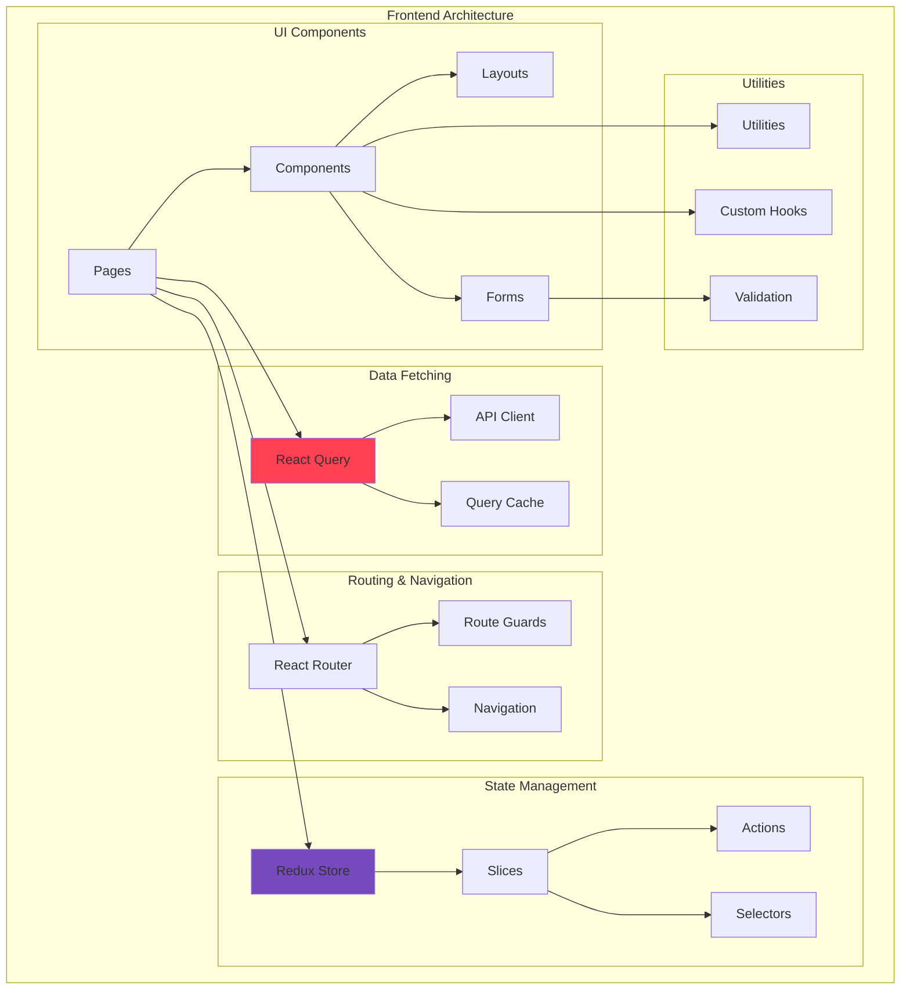
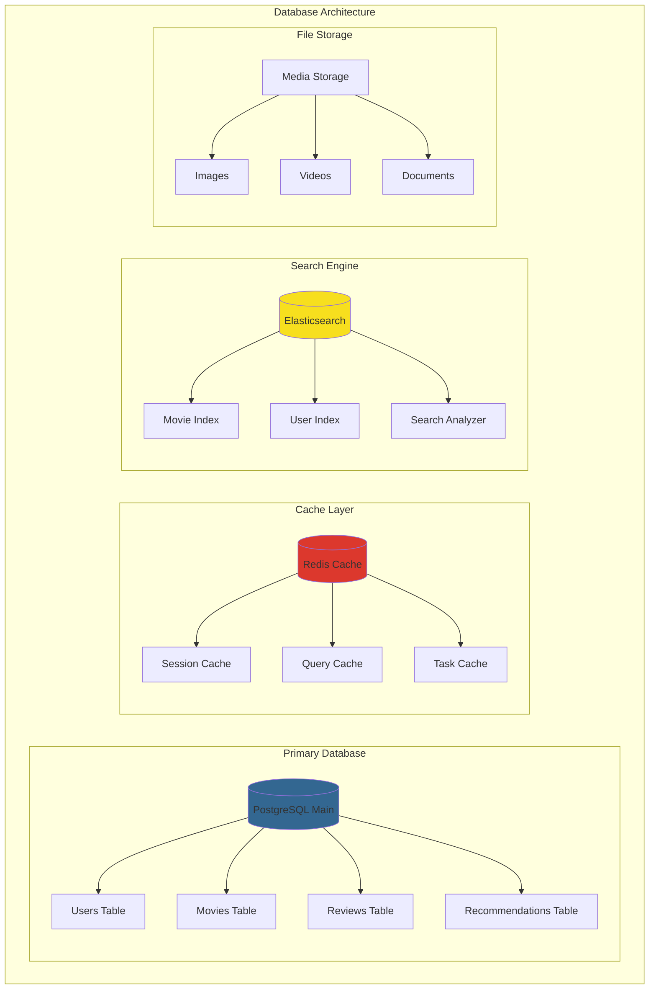
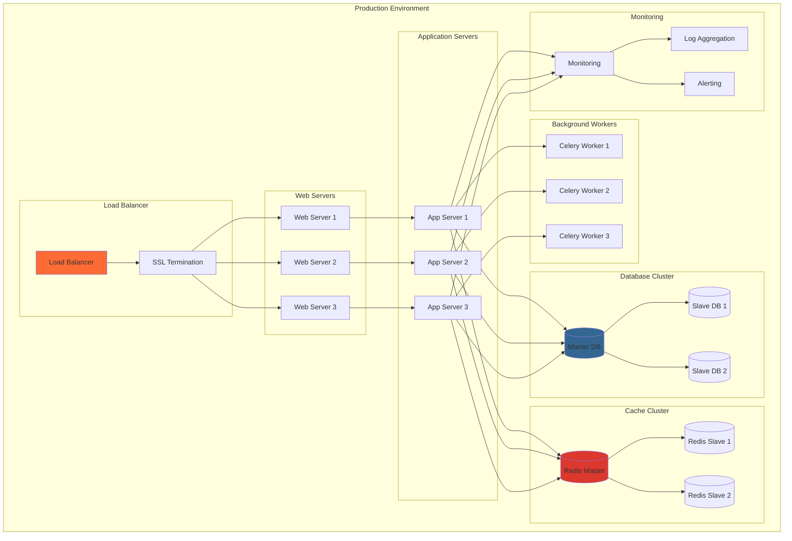
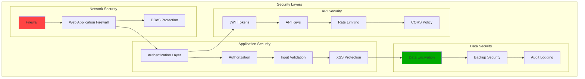

# Kiến Trúc Hệ Thống Movie Recommendation Website

## 1. Tổng Quan Kiến Trúc

```mermaid
graph TB
    subgraph "Client Layer"
        WEB[Web Browser]
        MOB[Mobile Browser]
        TAB[Tablet Browser]
    end

    subgraph "Frontend Layer"
        REACT[React.js Frontend]
        REDUX[Redux Store]
        RQ[React Query]
        UI[UI Components]
    end

    subgraph "API Gateway & Load Balancer"
        NGINX[Nginx Load Balancer]
        CDN[CDN/Static Assets]
    end

    subgraph "Backend Services"
        DJANGO[Django REST API]
        CELERY[Celery Workers]
        WSGI[WSGI Server]
    end

    subgraph "Data Layer"
        POSTGRES[(PostgreSQL)]
        REDIS[(Redis Cache)]
        ELASTIC[(Elasticsearch)]
    end

    subgraph "External Services"
        TMDB[TMDB API]
        PAYPAL[PayPal API]
        GOOGLE[Google OAuth]
        EMAIL[Email Service]
    end

    subgraph "Monitoring & Analytics"
        LOGS[Logging System]
        METRICS[Monitoring]
        ANALYTICS[Analytics]
    end

    %% Client to Frontend
    WEB --> REACT
    MOB --> REACT
    TAB --> REACT

    %% Frontend Internal
    REACT --> REDUX
    REACT --> RQ
    REACT --> UI

    %% Frontend to API Gateway
    REACT --> NGINX
    NGINX --> CDN

    %% API Gateway to Backend
    NGINX --> DJANGO
    DJANGO --> WSGI

    %% Backend to Data Layer
    DJANGO --> POSTGRES
    DJANGO --> REDIS
    DJANGO --> ELASTIC

    %% Backend to External Services
    DJANGO --> TMDB
    DJANGO --> PAYPAL
    DJANGO --> GOOGLE
    DJANGO --> EMAIL

    %% Background Processing
    DJANGO --> CELERY
    CELERY --> POSTGRES
    CELERY --> REDIS

    %% Monitoring
    DJANGO --> LOGS
    DJANGO --> METRICS
    DJANGO --> ANALYTICS

    style REACT fill:#61dafb
    style DJANGO fill:#092e20
    style POSTGRES fill:#336791
    style REDIS fill:#dc382d
    style ELASTIC fill:#f7df1e
```



## 2. Kiến Trúc Chi Tiết Theo Layer

### 2.1. Presentation Layer (Frontend)



### 2.2. Application Layer (Backend)

```mermaid
graph TB
    subgraph "Django Backend Architecture"
        subgraph "API Layer"
            URLS[URLs/Routing]
            VIEWS[Views/ViewSets]
            SERIALIZERS[Serializers]
            PERMISSIONS[Permissions]
        end

        subgraph "Business Logic"
            SERVICES[Services]
            TASKS[Celery Tasks]
            UTILS[Utilities]
        end

        subgraph "Data Access"
            MODELS[Models]
            MANAGERS[Managers]
            QUERYSETS[QuerySets]
        end

        subgraph "Authentication & Security"
            AUTH[Authentication]
            MIDDLEWARE[Middleware]
            VALIDATION[Validation]
        end

        subgraph "External Integrations"
            TMDB_INT[TMDB Integration]
            PAYPAL_INT[PayPal Integration]
            OAUTH[OAuth Providers]
        end
    end

    URLS --> VIEWS
    VIEWS --> SERIALIZERS
    VIEWS --> PERMISSIONS

    VIEWS --> SERVICES
    SERVICES --> TASKS
    SERVICES --> UTILS

    VIEWS --> MODELS
    MODELS --> MANAGERS
    MANAGERS --> QUERYSETS

    VIEWS --> AUTH
    AUTH --> MIDDLEWARE
    MIDDLEWARE --> VALIDATION

    SERVICES --> TMDB_INT
    SERVICES --> PAYPAL_INT
    SERVICES --> OAUTH

    style VIEWS fill:#092e20
    style SERVICES fill:#ff6b35
```



### 2.3. Data Layer Architecture



## 3. Microservices Architecture (Nếu áp dụng)

```mermaid
graph TB
    subgraph "Microservices Architecture"
        subgraph "API Gateway"
            GATEWAY[API Gateway]
            ROUTING[Routing]
            AUTH_GATEWAY[Authentication]
            RATE_LIMIT[Rate Limiting]
        end

        subgraph "Core Services"
            USER_SERVICE[User Service]
            MOVIE_SERVICE[Movie Service]
            RECOMMENDATION_SERVICE[Recommendation Service]
            PAYMENT_SERVICE[Payment Service]
        end

        subgraph "Supporting Services"
            NOTIFICATION_SERVICE[Notification Service]
            ANALYTICS_SERVICE[Analytics Service]
            SEARCH_SERVICE[Search Service]
            MODERATION_SERVICE[Moderation Service]
        end

        subgraph "Data Stores"
            USER_DB[(User DB)]
            MOVIE_DB[(Movie DB)]
            REC_DB[(Recommendation DB)]
            PAYMENT_DB[(Payment DB)]
        end
    end

    GATEWAY --> ROUTING
    GATEWAY --> AUTH_GATEWAY
    GATEWAY --> RATE_LIMIT

    ROUTING --> USER_SERVICE
    ROUTING --> MOVIE_SERVICE
    ROUTING --> RECOMMENDATION_SERVICE
    ROUTING --> PAYMENT_SERVICE

    USER_SERVICE --> USER_DB
    MOVIE_SERVICE --> MOVIE_DB
    RECOMMENDATION_SERVICE --> REC_DB
    PAYMENT_SERVICE --> PAYMENT_DB

    USER_SERVICE --> NOTIFICATION_SERVICE
    MOVIE_SERVICE --> SEARCH_SERVICE
    MOVIE_SERVICE --> MODERATION_SERVICE
    USER_SERVICE --> ANALYTICS_SERVICE

    style GATEWAY fill:#ff6b35
    style USER_SERVICE fill:#61dafb
    style MOVIE_SERVICE fill:#092e20
```



## 4. Deployment Architecture



## 5. Security Architecture



## 6. Technology Stack

### 6.1. Frontend Stack

```
React.js 18.x
├── Redux Toolkit (State Management)
├── React Query (Data Fetching)
├── React Router (Routing)
├── TypeScript (Type Safety)
├── Tailwind CSS (Styling)
├── Axios (HTTP Client)
└── React Hook Form (Form Management)
```

### 6.2. Backend Stack

```
Django 4.x
├── Django REST Framework (API)
├── Celery (Background Tasks)
├── Redis (Caching & Message Broker)
├── PostgreSQL (Primary Database)
├── Elasticsearch (Search Engine)
├── JWT (Authentication)
└── Django CORS Headers (CORS)
```

### 6.3. DevOps Stack

```
Docker & Docker Compose
├── Nginx (Reverse Proxy)
├── Gunicorn (WSGI Server)
├── PostgreSQL (Database)
├── Redis (Cache)
├── Elasticsearch (Search)
└── Celery Workers (Background Tasks)
```

### 6.4. External Services

```
Third-party APIs
├── TMDB API (Movie Data)
├── PayPal API (Payments)
├── Google OAuth (Authentication)
├── Email Service (SMTP/SendGrid)
└── CDN (Static Assets)
```

## 7. Performance & Scalability

### 7.1. Caching Strategy

- **Redis Cache**: Session data, query results, API responses
- **CDN**: Static assets, images, videos
- **Database Query Cache**: Frequently accessed data
- **Application Cache**: Computed results, recommendations

### 7.2. Database Optimization

- **Indexing**: Primary keys, foreign keys, search fields
- **Connection Pooling**: Efficient database connections
- **Read Replicas**: Load balancing for read operations
- **Partitioning**: Large tables by date or region

### 7.3. Load Balancing

- **Horizontal Scaling**: Multiple application servers
- **Database Sharding**: Distribute data across multiple databases
- **Microservices**: Separate services for different functionalities
- **Auto-scaling**: Cloud-based scaling based on demand

## 8. Monitoring & Observability

### 8.1. Application Monitoring

- **Performance Metrics**: Response times, throughput, error rates
- **User Experience**: Page load times, user interactions
- **Business Metrics**: User registrations, movie views, recommendations

### 8.2. Infrastructure Monitoring

- **Server Metrics**: CPU, memory, disk usage
- **Database Metrics**: Query performance, connection pools
- **Network Metrics**: Bandwidth, latency, packet loss

### 8.3. Logging & Tracing

- **Structured Logging**: JSON format logs
- **Distributed Tracing**: Request flow across services
- **Error Tracking**: Exception monitoring and alerting

## 9. Disaster Recovery & Backup

### 9.1. Backup Strategy

- **Database Backups**: Daily automated backups
- **File Backups**: Media files, configuration files
- **Code Backups**: Version control with Git

### 9.2. Recovery Procedures

- **RTO (Recovery Time Objective)**: 4 hours
- **RPO (Recovery Point Objective)**: 1 hour
- **Failover Procedures**: Automated failover to backup systems

## 10. Development Workflow

### 10.1. Version Control

```
Git Flow
├── main (Production)
├── develop (Development)
├── feature/* (Feature branches)
├── release/* (Release branches)
└── hotfix/* (Hotfix branches)
```

### 10.2. CI/CD Pipeline

```
Development → Testing → Staging → Production
├── Code Review
├── Automated Testing
├── Security Scanning
├── Performance Testing
└── Deployment
```

### 10.3. Environment Management

- **Development**: Local development environment
- **Testing**: Automated testing environment
- **Staging**: Pre-production environment
- **Production**: Live production environment
