# Kiến Trúc Chi Tiết Dự Án Movie Recommendation System

## 1. Tổng Quan Kiến Trúc Hệ Thống

```mermaid
graph TB
    subgraph "Client Layer"
        WEB[Web Browser]
        MOB[Mobile Browser]
        TAB[Tablet Browser]
    end

    subgraph "Frontend Layer (React.js)"
        REACT[React.js 18.2.0]
        REDUX[Redux Toolkit]
        RQ[React Query v5]
        ROUTER[React Router v6]
        TAILWIND[Tailwind CSS]
        MUI[Material-UI v7]
        FRAMER[Framer Motion]
    end

    subgraph "API Gateway & Load Balancer"
        NGINX[Nginx]
        CDN[CDN/Static Assets]
        CORS[CORS Headers]
    end

    subgraph "Backend Services (Django)"
        DJANGO[Django 4.x + DRF]
        CELERY[Celery Workers]
        WSGI[Gunicorn WSGI]
        WHITENOISE[WhiteNoise Static]
    end

    subgraph "Data Layer"
        POSTGRES[(PostgreSQL)]
        REDIS[(Redis Cloud)]
        ELASTIC[(Elasticsearch Cloud)]
    end

    subgraph "External Services"
        TMDB[TMDB API]
        IMDB[IMDB RapidAPI]
        PAYPAL[PayPal API]
        GOOGLE[Google OAuth]
        EMAIL[SMTP Email]
    end

    subgraph "Monitoring & Analytics"
        LOGS[Structured Logging]
        METRICS[Performance Metrics]
        ANALYTICS[User Analytics]
    end

    %% Client to Frontend
    WEB --> REACT
    MOB --> REACT
    TAB --> REACT

    %% Frontend Internal
    REACT --> REDUX
    REACT --> RQ
    REACT --> ROUTER
    REACT --> TAILWIND
    REACT --> MUI
    REACT --> FRAMER

    %% Frontend to API Gateway
    REACT --> NGINX
    NGINX --> CDN
    NGINX --> CORS

    %% API Gateway to Backend
    NGINX --> DJANGO
    DJANGO --> WSGI
    DJANGO --> WHITENOISE

    %% Backend to Data Layer
    DJANGO --> POSTGRES
    DJANGO --> REDIS
    DJANGO --> ELASTIC

    %% Backend to External Services
    DJANGO --> TMDB
    DJANGO --> IMDB
    DJANGO --> PAYPAL
    DJANGO --> GOOGLE
    DJANGO --> EMAIL

    %% Background Processing
    DJANGO --> CELERY
    CELERY --> POSTGRES
    CELERY --> REDIS

    %% Monitoring
    DJANGO --> LOGS
    DJANGO --> METRICS
    DJANGO --> ANALYTICS

    style REACT fill:#61dafb
    style DJANGO fill:#092e20
    style POSTGRES fill:#336791
    style REDIS fill:#dc382d
    style ELASTIC fill:#f7df1e
```

## 2. Kiến Trúc Backend Chi Tiết

### 2.1. Django Application Structure

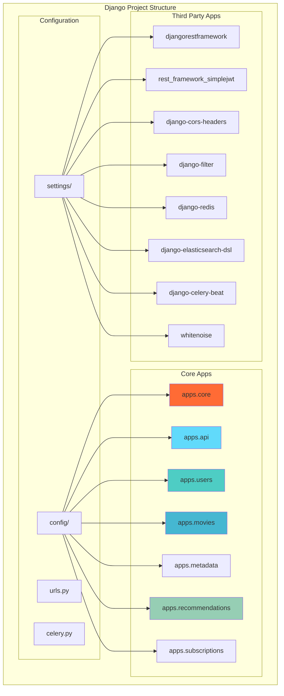

### 2.2. Database Schema Architecture

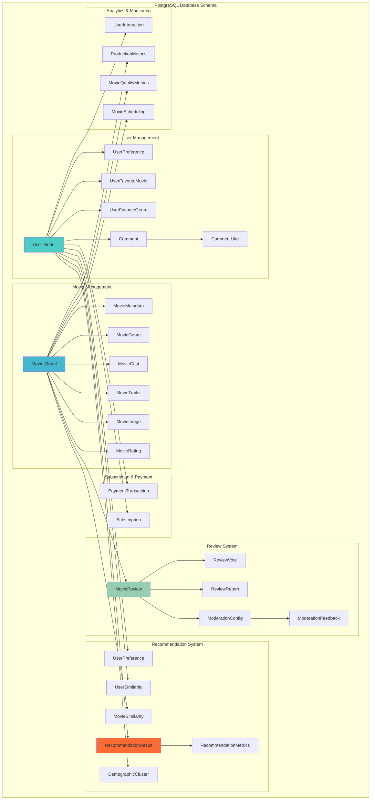

### 2.3. API Architecture

```mermaid
graph TB
    subgraph "REST API Structure"
        subgraph "Authentication Endpoints"
            AUTH_REGISTER[POST /api/auth/register/]
            AUTH_LOGIN[POST /api/auth/login/]
            AUTH_REFRESH[POST /api/auth/refresh/]
            AUTH_LOGOUT[POST /api/auth/logout/]
            AUTH_GOOGLE[POST /api/auth/google/]
        end

        subgraph "User Management"
            USER_PROFILE[GET/PATCH /api/auth/profile/]
            USER_AVATAR[POST /api/auth/avatar/]
            USER_STATS[GET /api/auth/usage-stats/]
            USER_WATCHLIST[GET /api/auth/watchlist/]
            USER_FAVORITES[GET /api/auth/favorites/]
        end

        subgraph "Movie Discovery"
            MOVIE_FEATURED[GET /api/movies/featured/]
            MOVIE_TRENDING[GET /api/movies/trending/]
            MOVIE_TOP_RATED[GET /api/movies/top-rated/]
            MOVIE_UPCOMING[GET /api/movies/upcoming/]
            MOVIE_SEARCH[GET /api/movies/search/]
            MOVIE_DETAIL[GET /api/movies/{slug}/]
        end

        subgraph "Review System"
            REVIEW_CREATE[POST /api/movies/{id}/reviews/]
            REVIEW_LIST[GET /api/movies/{id}/reviews/]
            REVIEW_DETAIL[GET /api/movies/{id}/reviews/{id}/]
            SPOILER_DETECT[POST /api/movies/spoiler-detect/]
        end

        subgraph "Recommendation System"
            REC_PERSONALIZED[GET /api/recommendations/personalized/]
            REC_COLLABORATIVE[GET /api/recommendations/collaborative/]
            REC_DEMOGRAPHIC[GET /api/recommendations/demographic/]
            REC_HYBRID[GET /api/recommendations/hybrid/]
            REC_FEEDBACK[POST /api/recommendations/feedback/]
        end

        subgraph "Admin & Moderation"
            ADMIN_DASHBOARD[GET /api/admin/dashboard/]
            MODERATION_QUEUE[GET /api/moderator/queue/]
            MODERATION_STATS[GET /api/moderator/stats/]
            MODERATION_ACTION[POST /api/moderator/moderate/]
        end
    end

    AUTH_REGISTER --> USER_PROFILE
    AUTH_LOGIN --> USER_PROFILE
    USER_PROFILE --> MOVIE_DETAIL
    MOVIE_DETAIL --> REVIEW_CREATE
    MOVIE_DETAIL --> REC_PERSONALIZED

    style AUTH_REGISTER fill:#4ecdc4
    style MOVIE_DETAIL fill:#45b7d1
    style REC_PERSONALIZED fill:#ff6b35
```

## 3. Frontend Architecture Chi Tiết

### 3.1. React Application Structure

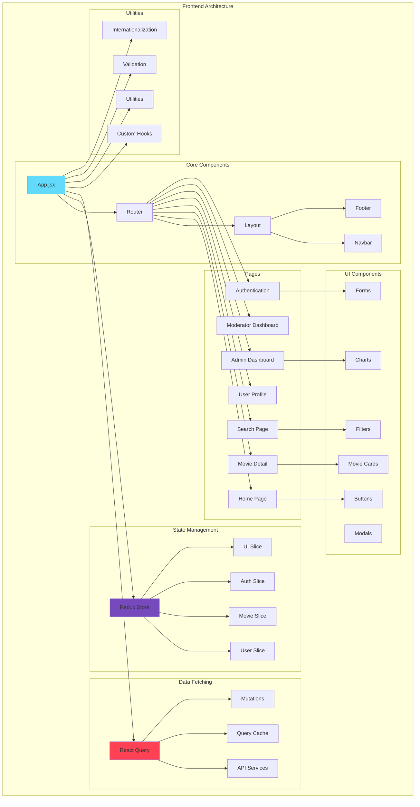

### 3.2. Frontend Technology Stack

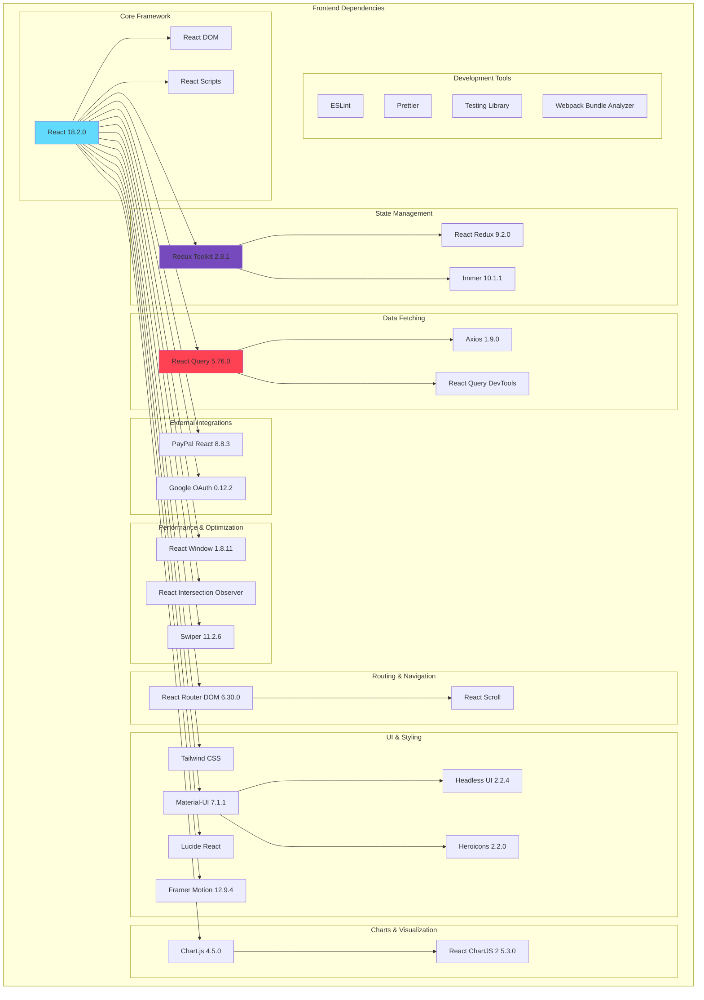

## 4. Data Flow Architecture

### 4.1. User Authentication Flow

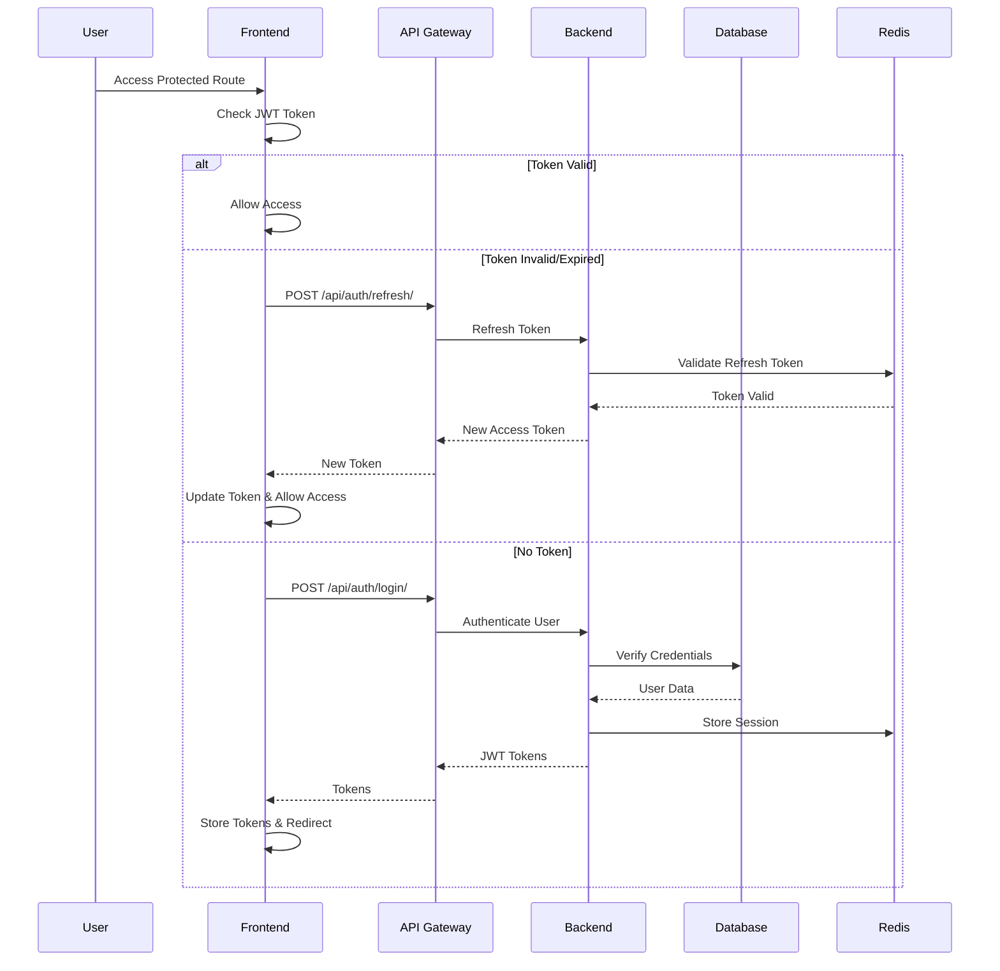

### 4.2. Movie Recommendation Flow

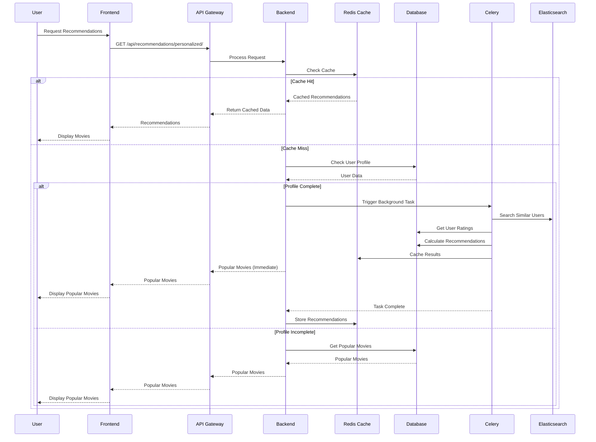

### 4.3. Movie Search Flow

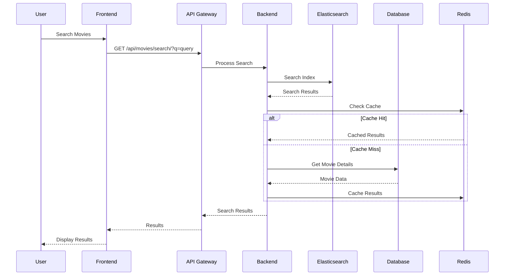

## 5. Deployment Architecture

### 5.1. Production Environment (Render.com)

```mermaid
graph TB
    subgraph "Production Deployment (Render.com)"
        subgraph "Load Balancer"
            RENDER_LB[Render Load Balancer]
            SSL[SSL Termination]
        end

        subgraph "Web Service"
            DJANGO_APP[Django Web Service]
            GUNICORN[Gunicorn WSGI]
            WHITENOISE[WhiteNoise Static]
        end

        subgraph "Background Workers"
            CELERY_WORKER[Celery Worker]
            CELERY_BEAT[Celery Beat Scheduler]
        end

        subgraph "Database Services"
            POSTGRES_DB[(PostgreSQL Database)]
            REDIS_CACHE[(Redis Cloud)]
            ELASTIC_SEARCH[(Elasticsearch Cloud)]
        end

        subgraph "External Services"
            FRONTEND[Vercel Frontend]
            CDN[CDN Assets]
        end
    end

    RENDER_LB --> SSL
    SSL --> DJANGO_APP
    DJANGO_APP --> GUNICORN
    DJANGO_APP --> WHITENOISE

    DJANGO_APP --> CELERY_WORKER
    DJANGO_APP --> CELERY_BEAT

    DJANGO_APP --> POSTGRES_DB
    DJANGO_APP --> REDIS_CACHE
    DJANGO_APP --> ELASTIC_SEARCH

    FRONTEND --> RENDER_LB
    DJANGO_APP --> CDN

    style DJANGO_APP fill:#092e20
    style POSTGRES_DB fill:#336791
    style REDIS_CACHE fill:#dc382d
    style ELASTIC_SEARCH fill:#f7df1e
```

### 5.2. Development Environment

```mermaid
graph TB
    subgraph "Development Environment"
        subgraph "Local Development"
            DJANGO_DEV[Django Dev Server]
            REACT_DEV[React Dev Server]
            POSTGRES_LOCAL[(Local PostgreSQL)]
            REDIS_LOCAL[(Local Redis)]
            ELASTIC_LOCAL[(Local Elasticsearch)]
        end

        subgraph "Development Tools"
            CELERY_DEV[Celery Worker Dev]
            CELERY_BEAT_DEV[Celery Beat Dev]
            FLOWER[Flower Monitoring]
        end

        subgraph "External APIs"
            TMDB_API[TMDB API]
            IMDB_API[IMDB RapidAPI]
            PAYPAL_SANDBOX[PayPal Sandbox]
            GOOGLE_DEV[Google OAuth Dev]
        end
    end

    DJANGO_DEV --> POSTGRES_LOCAL
    DJANGO_DEV --> REDIS_LOCAL
    DJANGO_DEV --> ELASTIC_LOCAL

    DJANGO_DEV --> CELERY_DEV
    DJANGO_DEV --> CELERY_BEAT_DEV
    CELERY_DEV --> FLOWER

    DJANGO_DEV --> TMDB_API
    DJANGO_DEV --> IMDB_API
    DJANGO_DEV --> PAYPAL_SANDBOX
    DJANGO_DEV --> GOOGLE_DEV

    REACT_DEV --> DJANGO_DEV

    style DJANGO_DEV fill:#092e20
    style REACT_DEV fill:#61dafb
```

## 6. Security Architecture

### 6.1. Authentication & Authorization

```mermaid
graph TB
    subgraph "Security Layers"
        subgraph "Frontend Security"
            JWT_STORAGE[JWT Storage]
            TOKEN_REFRESH[Token Refresh]
            ROUTE_GUARDS[Route Guards]
        end

        subgraph "API Security"
            CORS_POLICY[CORS Policy]
            RATE_LIMITING[Rate Limiting]
            JWT_AUTH[JWT Authentication]
            PERMISSION_CLASSES[Permission Classes]
        end

        subgraph "Data Security"
            PASSWORD_HASHING[Password Hashing]
            DATA_ENCRYPTION[Data Encryption]
            SQL_INJECTION[SQL Injection Prevention]
            XSS_PROTECTION[XSS Protection]
        end

        subgraph "Infrastructure Security"
            HTTPS[HTTPS/SSL]
            FIREWALL[Firewall Rules]
            ENV_VARS[Environment Variables]
            SECRET_MANAGEMENT[Secret Management]
        end
    end

    JWT_STORAGE --> TOKEN_REFRESH
    TOKEN_REFRESH --> ROUTE_GUARDS

    ROUTE_GUARDS --> CORS_POLICY
    CORS_POLICY --> RATE_LIMITING
    RATE_LIMITING --> JWT_AUTH
    JWT_AUTH --> PERMISSION_CLASSES

    PERMISSION_CLASSES --> PASSWORD_HASHING
    PASSWORD_HASHING --> DATA_ENCRYPTION
    DATA_ENCRYPTION --> SQL_INJECTION
    SQL_INJECTION --> XSS_PROTECTION

    XSS_PROTECTION --> HTTPS
    HTTPS --> FIREWALL
    FIREWALL --> ENV_VARS
    ENV_VARS --> SECRET_MANAGEMENT

    style JWT_AUTH fill:#ff4444
    style HTTPS fill:#00aa00
```

## 7. Performance & Scalability

### 7.1. Caching Strategy

```mermaid
graph TB
    subgraph "Multi-Level Caching"
        subgraph "Frontend Cache"
            BROWSER_CACHE[Browser Cache]
            REACT_QUERY_CACHE[React Query Cache]
            REDUX_CACHE[Redux Store Cache]
        end

        subgraph "API Cache"
            REDIS_API_CACHE[Redis API Cache]
            REDIS_SESSION[Redis Session Cache]
            REDIS_TASK[Redis Task Cache]
        end

        subgraph "Database Cache"
            DB_QUERY_CACHE[Database Query Cache]
            DB_CONNECTION_POOL[Connection Pooling]
        end

        subgraph "CDN Cache"
            STATIC_CACHE[Static Assets Cache]
            IMAGE_CACHE[Image Cache]
            VIDEO_CACHE[Video Cache]
        end
    end

    BROWSER_CACHE --> REACT_QUERY_CACHE
    REACT_QUERY_CACHE --> REDUX_CACHE

    REDUX_CACHE --> REDIS_API_CACHE
    REDIS_API_CACHE --> REDIS_SESSION
    REDIS_SESSION --> REDIS_TASK

    REDIS_TASK --> DB_QUERY_CACHE
    DB_QUERY_CACHE --> DB_CONNECTION_POOL

    DB_CONNECTION_POOL --> STATIC_CACHE
    STATIC_CACHE --> IMAGE_CACHE
    IMAGE_CACHE --> VIDEO_CACHE

    style REDIS_API_CACHE fill:#dc382d
    style STATIC_CACHE fill:#ff6b35
```

### 7.2. Background Processing

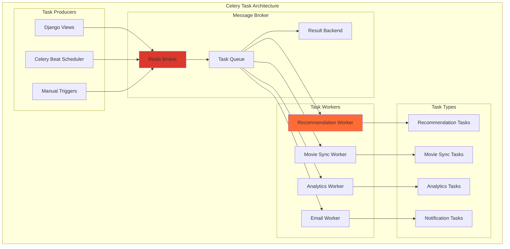

## 8. Monitoring & Observability

### 8.1. Logging & Monitoring

```mermaid
graph TB
    subgraph "Monitoring Stack"
        subgraph "Application Logging"
            DJANGO_LOGS[Django Logs]
            CELERY_LOGS[Celery Logs]
            API_LOGS[API Logs]
        end

        subgraph "Performance Monitoring"
            RESPONSE_TIME[Response Time]
            ERROR_RATE[Error Rate]
            THROUGHPUT[Throughput]
            MEMORY_USAGE[Memory Usage]
        end

        subgraph "Business Metrics"
            USER_REGISTRATIONS[User Registrations]
            MOVIE_VIEWS[Movie Views]
            RECOMMENDATION_CLICKS[Recommendation Clicks]
            CONVERSION_RATE[Conversion Rate]
        end

        subgraph "Infrastructure Monitoring"
            DATABASE_METRICS[Database Metrics]
            REDIS_METRICS[Redis Metrics]
            ELASTICSEARCH_METRICS[Elasticsearch Metrics]
            EXTERNAL_API_METRICS[External API Metrics]
        end
    end

    DJANGO_LOGS --> RESPONSE_TIME
    CELERY_LOGS --> ERROR_RATE
    API_LOGS --> THROUGHPUT

    RESPONSE_TIME --> USER_REGISTRATIONS
    ERROR_RATE --> MOVIE_VIEWS
    THROUGHPUT --> RECOMMENDATION_CLICKS

    USER_REGISTRATIONS --> DATABASE_METRICS
    MOVIE_VIEWS --> REDIS_METRICS
    RECOMMENDATION_CLICKS --> ELASTICSEARCH_METRICS

    DATABASE_METRICS --> EXTERNAL_API_METRICS
    REDIS_METRICS --> EXTERNAL_API_METRICS
    ELASTICSEARCH_METRICS --> EXTERNAL_API_METRICS

    style DJANGO_LOGS fill:#092e20
    style DATABASE_METRICS fill:#336791
```

## 9. Technology Stack Summary

### 9.1. Backend Stack

```
Django 4.x
├── Django REST Framework (API)
├── Django CORS Headers (CORS)
├── Django Filter (Filtering)
├── Django Redis (Caching)
├── Django Elasticsearch DSL (Search)
├── Django Celery Beat (Scheduling)
├── WhiteNoise (Static Files)
├── PostgreSQL (Database)
├── Redis Cloud (Cache & Message Broker)
├── Elasticsearch Cloud (Search)
├── Celery (Background Tasks)
├── Gunicorn (WSGI Server)
└── JWT Authentication
```

### 9.2. Frontend Stack

```
React 18.2.0
├── Redux Toolkit (State Management)
├── React Query v5 (Data Fetching)
├── React Router v6 (Routing)
├── Tailwind CSS (Styling)
├── Material-UI v7 (UI Components)
├── Framer Motion (Animations)
├── Chart.js (Charts)
├── Axios (HTTP Client)
├── PayPal React (Payments)
├── Google OAuth (Authentication)
├── React Window (Virtualization)
├── Swiper (Carousel)
└── TypeScript (Type Safety)
```

### 9.3. DevOps & Deployment

```
Render.com (Hosting)
├── PostgreSQL Database
├── Redis Cloud
├── Elasticsearch Cloud
├── Automatic SSL
├── CDN Integration
└── Environment Variables

Vercel (Frontend)
├── Automatic Deployments
├── Edge Functions
├── CDN Distribution
└── Performance Monitoring
```

## 10. Key Features & Capabilities

### 10.1. Core Features

- ✅ **Advanced Movie Recommendations** (Collaborative, Demographic, Hybrid)
- ✅ **Real-time Search** (Elasticsearch)
- ✅ **User Authentication** (JWT + Google OAuth)
- ✅ **Movie Reviews & Ratings** (with Spoiler Detection)
- ✅ **Subscription Management** (PayPal Integration)
- ✅ **Admin & Moderator Dashboards**
- ✅ **Real-time Analytics**
- ✅ **Background Task Processing**
- ✅ **Multi-language Support**
- ✅ **Responsive Design**

### 10.2. Performance Features

- ✅ **Multi-level Caching** (Redis + Browser + CDN)
- ✅ **Database Optimization** (Indexing + Connection Pooling)
- ✅ **Background Processing** (Celery Workers)
- ✅ **Static File Optimization** (WhiteNoise + CDN)
- ✅ **API Response Caching**
- ✅ **Lazy Loading & Virtualization**
- ✅ **Image Optimization**

### 10.3. Security Features

- ✅ **JWT Authentication**
- ✅ **CORS Protection**
- ✅ **Rate Limiting**
- ✅ **Input Validation**
- ✅ **SQL Injection Prevention**
- ✅ **XSS Protection**
- ✅ **HTTPS/SSL**
- ✅ **Environment Variable Management**

This architecture provides a robust, scalable, and maintainable foundation for the Movie Recommendation System with modern best practices and technologies.
